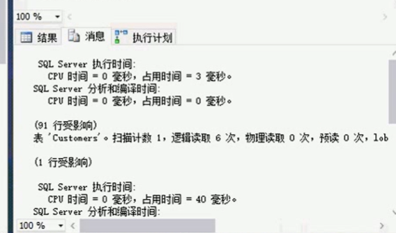
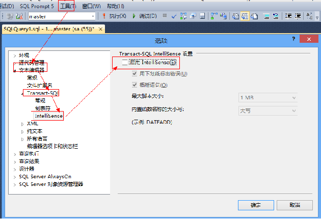

**.NET开发技巧记录**

[toc]

> 参考自 [.NET开发技巧之工具篇](https://edu.csdn.net/course/detail/4025)

# Visual Studio 

## IDE的相关配置

1. 显示行号

工具——选项——文本编辑器——所有语言，右侧显示栏，勾选“行号”

> **`ctrl + g` 快速跳转到某一行。**

2. 设置屏幕保护色

工具——选项——环境——字体和颜色——项背景——自定义，设置“R：204，G：232，B：204”

【也可以将系统的默认颜色设置为护眼色。这样，VS使用默认的系统背景色，以及其他编辑器或软件，也都可以使用保护色。】

3. VS设置的重置、设置的导入导出

菜单栏中的"工具"->"导入导出设置"中，有“重置所有设置”选项（会提示保存现有配置）。

4. 修改 VS 中默认的类或接口模板

通过修改类或接口模板，添加版权、公司、作者等相关信息：

```C#
/****************************************************************************
 * Copyright (c) $year$$registeredorganization$ All Rights Reserved.
 * CLR版本： $clrversion$
 *机器名称：$machinename$
 *公司名称：$registeredorganization$
 *命名空间：$rootnamespace$
 *文件名：  $safeitemname$
 *版本号：  V1.0.0.0
 *唯一标识：$guid10$
 *当前的用户域：$userdomain$
 *创建人：  $username$
 *电子邮箱：abc@xyz.com
 *创建时间：$time$
 
 *描述：
 *
 *=====================================================================
 *修改标记
 *修改时间：$time$
 *修改人： $username$
 *版本号： V1.0.0.0
 *描述：
 *
 *****************************************************************************/
```

VS2022 找到路径 `C:\Program Files\Microsoft Visual Studio\2022\Community\Common7\IDE\ItemTemplates\CSharp\Code\2052`（之前的版本的模板路径为`C:\Program Files (x86)\Microsoft Visual Studio 12.0\Common7\IDE\ItemTemplates\CSharp\Code\2052`，其中的 12.0 代表VS2013，不同版的版本号不同）。主要查找`ItemTemplates`。

在 Class 、Interface 、WebClass 三个目录下，找到 `Class.cs` 文件，在文件的开头，添加上面的标识信息模板。这样在创建类或接口时，就可以自动添加上这些信息。

> 也可以在类名前`class $safeitemrootname$`添加public、internal等相关修饰符(通常不需要)。

## VS快捷键

- F2：编辑选定的（项目、文件、表等，修改名称时用）

- F4：打开属性面板。

- F5：调试

- Ctrl+F5：直接执行不调试

- F9：设置、切换断点

- F10 ：逐过程

- F11 ：逐语句

- F12 ：转到定义

- Alt+F12 ：查看定义

- Ctrl+F：查找

- Ctrl+A：全选界面代码

- Ctrl+K + Ctrl+K ：设置书签

- Ctrl+K + Ctrl+N：跳转到下一个书签

- Ctrl+K + Ctrl+F：格式化选中代码

- Ctrl+K + Ctrl+S：外侧代码，如添加#region 等

- Ctrl+R + Ctrl+E：封装字段

- Ctrl+R + Ctrl+M：提取方法

- Ctrl+R + Ctrl+I：提取接口

- Shift+Alt+F10，然后按 Enter 键：添加命名空间引用【**通常使用 Alt+Enter**】

- Shift+Home：选中当前行

- Shift+方向键：向各个方向选中


# SQL Server相关

SQL Server安装后，主要需要介绍的几个服务：

## 服务

### SQL Server

SQL Server(MSSQLSERVER)数据库引擎服，是SQL Server的核心，必须要启动，提供数据的存储、事务处理和访问控制等。

`()`为实例名。

### SQL Server Browser

用于管理SQL Server多实例的连接。通过将连接到SQL Server端口(1433)通信，按照不同的实例名，转交给正确的数据库引擎处理。

通常，如果只有一个实例，(且配置使用静态端口)，则不需要启动 SQL Server Browser。

SQL Server Browser以 Windows 服务的形式运行，侦听对 Microsoft SQL Server 资源的传入请求，并提供计算机上安装的 SQL Server 实例的相关信息。

SQL Server Browser可用于执行下列操作： 

- 浏览可用服务器列表 
- 连接到正确的服务器实例 
- 连接到专用管理员连接 (DAC) 端点

> SQL Server 2000 以前的版本中，一台服务器上只能有一个 SQL Server 安装，即只能安装一个默认的实例。此时，SQL Server 始终只侦听 TCP 1433 端口或命名管道`\sql\query`。
> 
> 从 SQL Server 2000 开始，引入了“实例”的概念，在一台服务器上可以有多个SQL Server 安装。而 TCP 1433 或命名管道 `\sql\query` 只能被一个连接使用，一般分配给默认实例。为了解决端口冲突，SQL Server 2000 引入了SSRP 协议（SQL Server Resolution Protocol，即SQL Server解析协议），使用UDP 1434 端口进行侦听，该侦听器用已安装的实例的名称以及实例使用的端口或命名管道来响应客户端请求。
> 
> 从 SQL Server 2005 开始，使用 SQL Server Browser 代替SSRP。如果服务器上没有运行该服务，则不能向客户端提供端口号或管道，而且SSMS（或SQL Server 2000的企业管理器、查询分析器）中的枚举服务不能正常工作。 
> 
> SQL Server默认实例是默认为1433端口的，​客户端程序默认也是连接到此端口的。但是如果默认端口被更改，或者要连接到命名实例，但是又不知道它们的端口号，又或者说端口号在SQL Server每次重启后是动态分配的，那怎么办呢？
> 
> 在端口静态的情况下，可以在客户端连接中指定PORT。但是，若端口动态分配，那么便要借助SQL Server Browser服务了。
> 
> SQL Server Browser启动后将侦听 UDP 1434 端口​，接收客户端请求后，SQL Server Browser将读取注册表，识别计算机上的所有 SQL Server 实例​，用请求实例的 TCP/IP 端口或命名管道做出响应。说白了，就是实例与端口的转换（类似DNS将域名转化为IP）。以后，客户端应用程序中的网络库将使用所需实例的端口或命名管道向服务器发送请求来完成连接。

> 如果指定了端口，就不需要SQL Server Browser服务。
> 
> **如果同时指定了端口和实例名，则会忽略实例名称，直接连接到指定的端口所对应的实例。**

### SQL Server VSS Writer

影拷贝服务（VolumeShadowCopyService，VSS）是Microsoft在WindowsServer2003中开始引入的服务，它能让用户在没有IT专业人员协助的情况下，更轻松地恢复丢失的文件。不过，一般我们通过常规的数据库备份、日志备份来保证数据的安全，也就是说VSS然并卵。

### SQL Server Agent

SQL Server 代理 (MSSQLSERVER)，某个实例的代理服务。通常用于执行自动运行的、定时的作业，或者一些维护计划，比如定时备份数据库等操作。如果用不到这些功能，则不需要开启。

## 操作技巧

### 查询SQL语句执行时长（统计执行时间）

#### 手动统计时长

通过记录执行前后的时间，计算两者的差值：

```sql
declare @d datetime
set @d=getdate()
/*你的SQL脚本开始*/

/*你的SQL脚本结束*/
select [语句执行花费时间(毫秒)]=datediff(ms,@d,getdate())
```

> 通常这是最简单粗暴的一种统计方式，结果会不准确，应该总是偏大。

#### SQL语句 开启 STATISTICS 

STATISTICS 可以用来查看执行SQL时的系统情况，选项有PROFILE，IO ，TIME。介绍如下：

- SET STATISTICS PROFILE ON：显示语句的profile信息。STATISTICS PROFILE 用于 ad hoc queries、views 和 stored procedures。PROFILE开启时，每此查询执行返回的结果集之后，还会跟随有表示查询执行的profile信息的结果集。 【profile 内存信息】

- SET STATISTICS IO ON：报告与语句内引用的每个表的扫描数、逻辑读取数（在内存、高速缓存中访问的页数）和物理读取数（访问磁盘的次数）有关的信息。 

- SET STATISTICS TIME ON：显示解析、编译和执行查询所需的时间（以毫秒为单位）。


如果只是统计执行时间，仅仅设置`SET STATISTICS TIME ON`即可。

```sql
-- SET STATISTICS PROFILE ON 
-- SET STATISTICS IO ON 
SET STATISTICS TIME ON 
GO
/*--你的SQL脚本开始*/

/*你的SQL脚本结束*/
GO 
-- SET STATISTICS PROFILE OFF 
-- SET STATISTICS IO OFF 
SET STATISTICS TIME OFF
```

#### SSMS中为每个查询开启时长统计

SSMS中，通过 

- 菜单栏：工具》选项》查询执行》SQL Server》高级，勾选开启`SET STATISTICS TIME`、`SET STATISTICS IO`等
- 菜单栏：查询》查询选项》执行》高级，勾选开启`SET STATISTICS TIME`、`SET STATISTICS IO`等

可以查看每次执行的时长。

比如执行结果的消息中：

  

#### 执行计划

“实际的执行计划”和“预估的执行计划”。

通过执行计划可以查看更详细的执行信息。【执行计划的结果显示中，是 从右向左 解读的，注意箭头方向】


## SSMS工具的设置

行号、背景色等基本和VS相同。

# SQL Prompt 

SQL Prompt 可以直接集成在VS、SSMS中使用。

## 安装破解

## 禁用原生的 T-SQL 提示

启用SQL Prompt后，可能会出现和原生的SQL代码的智能提示的“双重提示”的情况。

禁用原生的 T-SQL 提示：

“工具”->“选项”->在选项窗口中找到“文本编辑器”->“Transact-SQL”->“IntelliSense”->取消右侧“启用IntelliSense(E)”前面的勾，重新开启MS SQL Manage Studio即可。

  