**10种可以在网站上使用的CSS背景模式【译】**

[toc]

> 翻译自 [10 CSS Background Patterns You Can Use on Your Website](https://www.makeuseof.com/css-background-patterns-examples/)

正在为网站背景寻找灵感？参考这些可以在各种情况下使用的 CSS 模式。

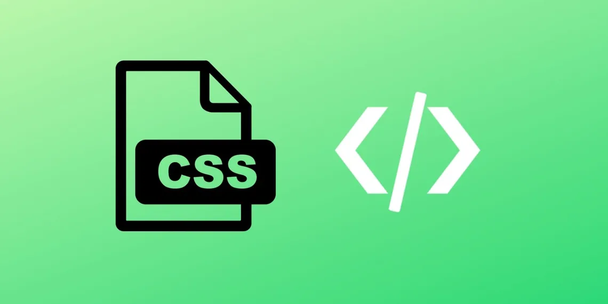

背景图案（`背景模式`）可以从根本上改变网站的外观。使用CSS可以轻松创建优雅的背景图案，这将使你的网站设计更上一层楼。

以下是可以在项目中直接使用的 10 种背景模式的列表。

> The code in these examples is available in a [GitHub repository](https://github.com/Yuvrajchandra/CSS-Background-Patterns) and is free for you to use under the [MIT license](https://choosealicense.com/licenses/mit/).

# 1. 黑色六边形 - The Black Hexagon

这种黑色六边形图案提供了一个非常整洁的六边形网格背景。在这种背景下，标题清晰可见。如果你正在设计任何技术或体系结构网站，则可以使用此模式。

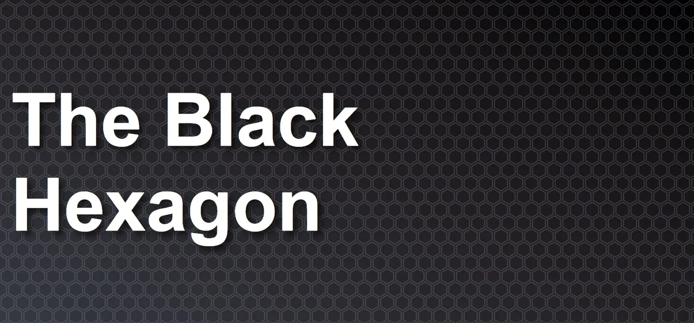

- HTML代码

```html
<h1>The Black Hexagon</h1>
```

- CSS代码

```css
body {
    font-family: 'Share Tech', sans-serif;
    font-size: 68px;
    color: white;
   display: flex;
    jsutify-content: center;
   align-items: center;
   margin: 0;
    width: 100vw;
    height: 100vh;
    text-shadow: 8px 8px 10px #0000008c;
    background-color: #343a40;
    background-image: url("data:image/svg+xml,%3Csvg xmlns='http://www.w3.org/2000/svg' width='28' height='49' viewBox='0 0 28 49'%3E%3Cg fill-rule='evenodd'%3E%3Cg id='hexagons' fill='%239C92AC' fill-opacity='0.25' fill-rule='nonzero'%3E%3Cpath d='M13.99 9.25l13 7.5v15l-13 7.5L1 31.75v-15l12.99-7.5zM3 17.9v12.7l10.99 6.34 11-6.35V17.9l-11-6.34L3 17.9zM0 15l12.98-7.5V0h-2v6.35L0 12.69v2.3zm0 18.5L12.98 41v8h-2v-6.85L0 35.81v-2.3zM15 0v7.5L27.99 15H28v-2.31h-.01L17 6.35V0h-2zm0 49v-8l12.99-7.5H28v2.31h-.01L17 42.15V49h-2z'/%3E%3C/g%3E%3C/g%3E%3C/svg%3E"), linear-gradient(to right top, #343a40, #2b2c31, #211f22, #151314, #000000);
}
 
h1 {
    margin: 20px;
}
```


# 2. 蓝带/蓝条 - The Blue Strips

蓝色条带背景图案使用线性渐变，即 CSS 属性 `linear-gradient` 在背景上创建渐变条带。

你可以更改背景颜色和渐变颜色以满足你的要求。

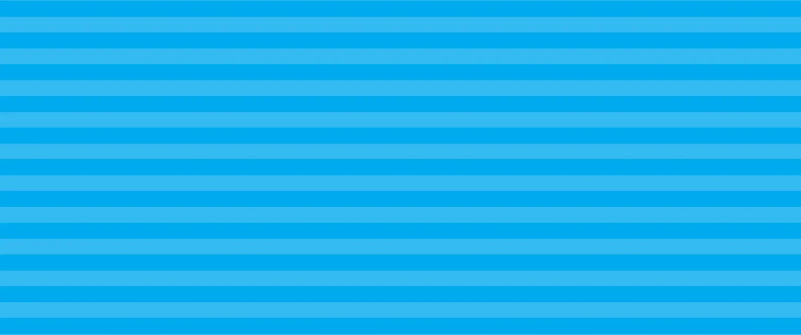

- HTML代码

```html
<div class="patterns pt1"></div>
```

- CSS代码

```css
body {
    margin: 0px;
}
 
.patterns {
    width: 100vw;
    height: 100vw;
}
 
.pt1 {
    background-size: 50px 50px;
    background-color: #0ae;
    background-image: -webkit-linear-gradient(rgba(255, 255, 255, .2) 50%, transparent 50%, transparent);
    background-image: -moz-linear-gradient(rgba(255, 255, 255, .2) 50%, transparent 50%, transparent);
    background-image: -ms-linear-gradient(rgba(255, 255, 255, .2) 50%, transparent 50%, transparent);
    background-image: -o-linear-gradient(rgba(255, 255, 255, .2) 50%, transparent 50%, transparent);
    background-image: linear-gradient(rgba(255, 255, 255, .2) 50%, transparent 50%, transparent);
}
```

# 3. (国际象棋)棋盘、背白棋盘 - The Chess Board

你可以使用 CSS 轻松创建棋盘背景的设计模式。尝试调整颜色以改变设计样式。

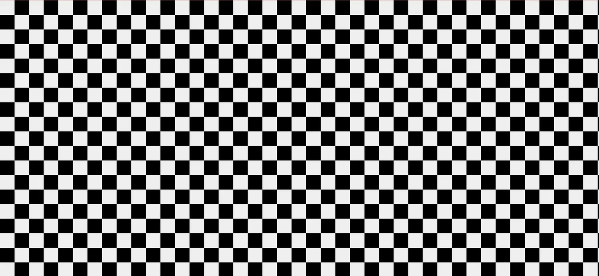

- HTML代码

```html
<div class="patterns pt1"></div>
```

- CSS代码

```css
body {
    margin: 0px;
}
 
.patterns {
    width: 100vw;
    height: 100vw;
}
 
.pt1 {
    background-color: #eee;
    background-size: 60px 60px;
    background-position: 0 0, 30px 30px;
    background-image: -webkit-linear-gradient(45deg, black 25%, transparent 25%, transparent 75%, black 75%, black), -webkit-linear-gradient(45deg, black 25%, transparent 25%, transparent 75%, black 75%, black);
    background-image: -moz-linear-gradient(45deg, black 25%, transparent 25%, transparent 75%, black 75%, black), -moz-linear-gradient(45deg, black 25%, transparent 25%, transparent 75%, black 75%, black);
    background-image: -ms-linear-gradient(45deg, black 25%, transparent 25%, transparent 75%, black 75%, black), -ms-linear-gradient(45deg, black 25%, transparent 25%, transparent 75%, black 75%, black);
    background-image: -o-linear-gradient(45deg, black 25%, transparent 25%, transparent 75%, black 75%, black), -o-linear-gradient(45deg, black 25%, transparent 25%, transparent 75%, black 75%, black);
    background-image: linear-gradient(45deg, black 25%, transparent 25%, transparent 75%, black 75%, black), linear-gradient(45deg, black 25%, transparent 25%, transparent 75%, black 75%, black);
}
```

# 4. 寂静的海 - The Silent Sea

可以使用如下简单的水平线模式向任何 HTML 元素添加静态背景。

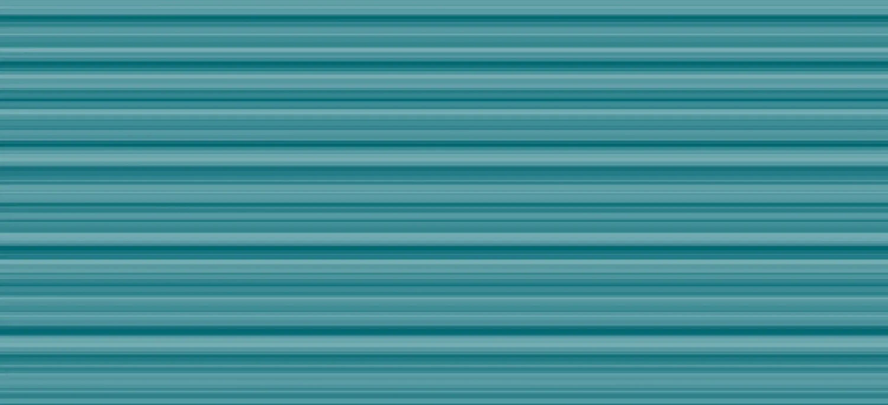


- HTML代码

```html
<div class="patterns pt1"></div>
```

- CSS代码

```css
body {
    margin: 0px;
}
 
.patterns {
    width: 100vw;
    height: 100vw;
}
 
.pt1 {
    background-color: #026873;
    background-size: 13px 13px, 29px 29px, 37px 37px, 53px 53px;
    background-image: -webkit-linear-gradient(0, rgba(255, 255, 255, .07) 50%, transparent 50%), -webkit-linear-gradient(0, rgba(255, 255, 255, .13) 50%, transparent 50%), -webkit-linear-gradient(0, transparent 50%, rgba(255, 255, 255, .17) 50%), -webkit-linear-gradient(0, transparent 50%, rgba(255, 255, 255, .19) 50%);
    background-image: -moz-linear-gradient(0, rgba(255, 255, 255, .07) 50%, transparent 50%), -moz-linear-gradient(0, rgba(255, 255, 255, .13) 50%, transparent 50%), -moz-linear-gradient(0, transparent 50%, rgba(255, 255, 255, .17) 50%), -moz-linear-gradient(0, transparent 50%, rgba(255, 255, 255, .19) 50%);
    background-image: -ms-linear-gradient(0, rgba(255, 255, 255, .07) 50%, transparent 50%), -ms-linear-gradient(0, rgba(255, 255, 255, .13) 50%, transparent 50%), -ms-linear-gradient(0, transparent 50%, rgba(255, 255, 255, .17) 50%), -ms-linear-gradient(0, transparent 50%, rgba(255, 255, 255, .19) 50%);
    background-image: -o-linear-gradient(0, rgba(255, 255, 255, .07) 50%, transparent 50%), -o-linear-gradient(0, rgba(255, 255, 255, .13) 50%, transparent 50%), -o-linear-gradient(0, transparent 50%, rgba(255, 255, 255, .17) 50%), -o-linear-gradient(0, transparent 50%, rgba(255, 255, 255, .19) 50%);
    background-image: linear-gradient(0, rgba(255, 255, 255, .07) 50%, transparent 50%), linear-gradient(0, rgba(255, 255, 255, .13) 50%, transparent 50%), linear-gradient(0, transparent 50%, rgba(255, 255, 255, .17) 50%), linear-gradient(0, transparent 50%, rgba(255, 255, 255, .19) 50%);
}
```

# 5. 现代砖[砖块线条] - The Modern Brick

你可以使用 CSS 属性 `linear-gradient` 创建纯 CSS 现代砖模式（`linear-gradient`）。

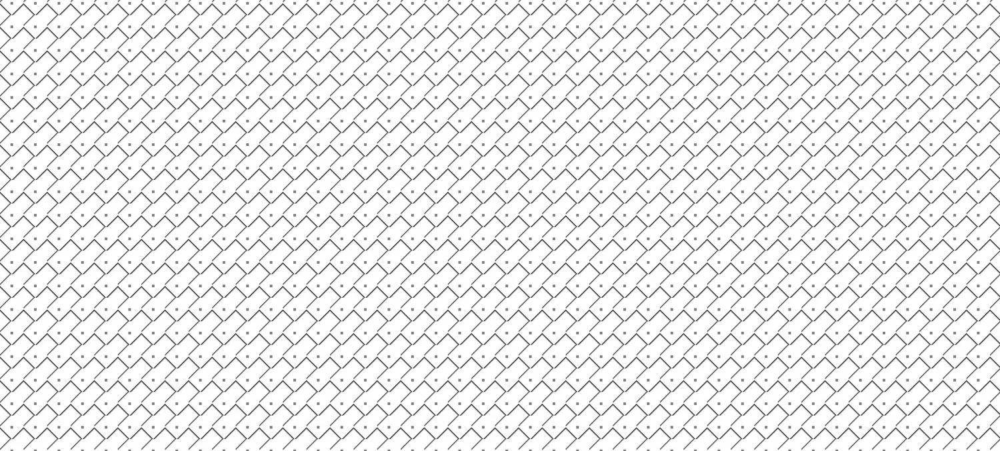

- CSS代码

```css
body {
    background-image: linear-gradient(45deg, transparent 20%, black 25%, transparent 25%),
                      linear-gradient(-45deg, transparent 20%, black 25%, transparent 25%),
                      linear-gradient(-45deg, transparent 75%, black 80%, transparent 0),
                      radial-gradient(gray 2px, transparent 0);
    background-size: 30px 30px, 30px 30px;
}
```

# 6. Web3样式背景 - Web3 Style Background

可以使用背景图像创建 Web3 风格的背景并为其添加模糊效果（`blur effect`）。此示例使用来自 Unsplash 的星系图像。你可以发挥创造力，使用星系、海洋、纪念碑或其他任何的图像。

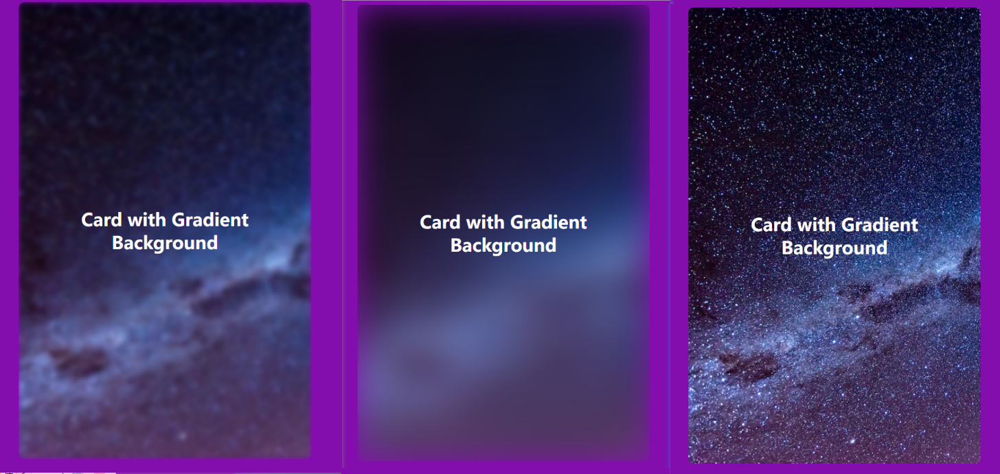

- HTML代码

```html
<div class="card bg-blur">
    <h1>Card with Gradient Background</h1>
</div>
```

- CSS代码

```css
:root {
    --bg-image: url('https://images.unsplash.com/photo-1538370965046-79c0d6907d47?ixlib=rb-1.2.1&ixid=MnwxMjA3fDB8MHxwaG90by1wYWdlfHx8fGVufDB8fHx8&auto=format&fit=crop&w=1169&q=80');
}
 
body {
    background-color: #1D1E22;
    font-family: sans-serif;
    display: flex;
}
 
.card {
    margin: auto;
    padding: 1rem;
    height: 300px;
   width: 300px;
    text-align: center;
   color: white;
    display: flex;
   align-items: center;
    justify-content: center;
   position: relative;
    background-color: gray;
   border-radius: 10px;
}
 
.bg-blur {
   overflow: hidden;
    background-color: transparent;
}
 
.bg-blur::before {
   content: '';
    background-image: var(--bg-image);
   background-size: cover;
    height: 100%;
   width: 100%;
    position: absolute;
   filter: blur(30px);
    z-index: -1;
}
```

# 7. 渐变背景动画 - Gradient Background Animation

渐变背景动画广泛使用于现代web网站。保持趋势并在背景上使用渐变动画。还可以根据需要自定义渐变颜色。

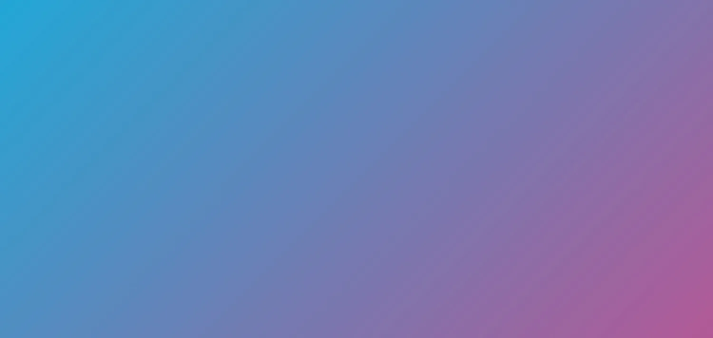

- HTML代码

```html
<div class="d-flex flex-column justify-content-center w-100 h-100"></div>
```

- CSS代码

```css
body {
    background: linear-gradient(-45deg, #ee7752, #e73c7e, #23a6d5, #23d5ab);
    background-size: 400% 400%;
    animation: gradient 15s ease infinite;
    height: 100vh;
}

@keyframes gradient {
    0% {
        background-position: 0% 50%;
    }
 
    50% {
        background-position: 100% 50%;
    }
 
    100% {
        background-position: 0% 50%;
    }
}
```

# 8. 弯曲的波浪 - Curvy Waves

使用 CSS 属性 radial-gradient 可以创建简单的弯曲的波浪。

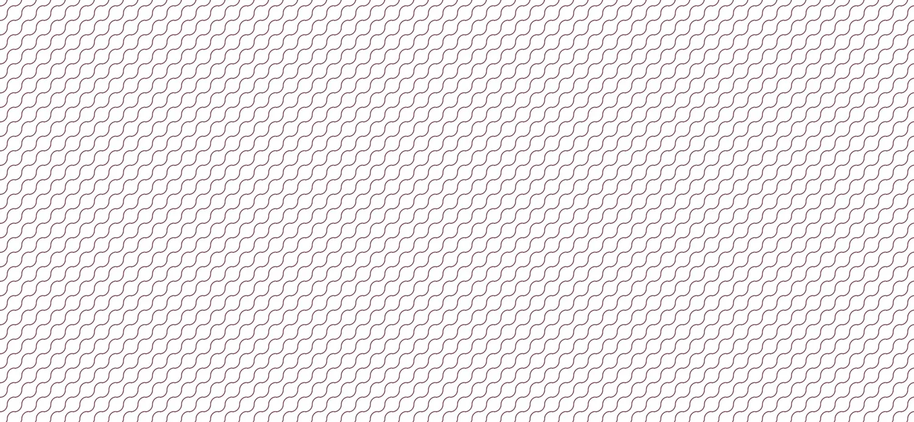

- HTML代码

```html
<div class="patterns pt1"></div>
```

- CSS代码

```css
body {
    margin: 0px;
}
 
.patterns {
    width: 100vw;
    height: 100vw;
}
 
.pt1 {
    background: -moz-radial-gradient(0% 2%, circle, rgba(96, 16, 48, 0) 9px, #661133 10px, rgba(96, 16, 48, 0) 11px), -moz-radial-gradient(100% 100%, rgba(96, 16, 48, 0) 9px, #661133 10px, rgba(96, 16, 48, 0) 11px), none;
    background: -webkit-radial-gradient(0% 2%, circle, rgba(96, 16, 48, 0) 9px, #661133 10px, rgba(96, 16, 48, 0) 11px), -webkit-radial-gradient(100% 100%, rgba(96, 16, 48, 0) 9px, #661133 10px, rgba(96, 16, 48, 0) 11px), none;
    background: -ms-radial-gradient(0% 2%, circle, rgba(96, 16, 48, 0) 9px, #661133 10px, rgba(96, 16, 48, 0) 11px), -ms-radial-gradient(100% 100%, rgba(96, 16, 48, 0) 9px, #661133 10px, rgba(96, 16, 48, 0) 11px), none;
    background: -o-radial-gradient(0% 2%, circle, rgba(96, 16, 48, 0) 9px, #661133 10px, rgba(96, 16, 48, 0) 11px), -o-radial-gradient(100% 100%, rgba(96, 16, 48, 0) 9px, #661133 10px, rgba(96, 16, 48, 0) 11px), none;
    background: radial-gradient(0% 2%, circle, rgba(96, 16, 48, 0) 9px, #661133 10px, rgba(96, 16, 48, 0) 11px), radial-gradient(100% 100%, rgba(96, 16, 48, 0) 9px, #661133 10px, rgba(96, 16, 48, 0) 11px), none;
    background-size: 20px 20px;
}
```

# 9. 桌布 - Table Cloth

需要为 HTML div 提供标准背景模式吗？试试这个桌布图案。

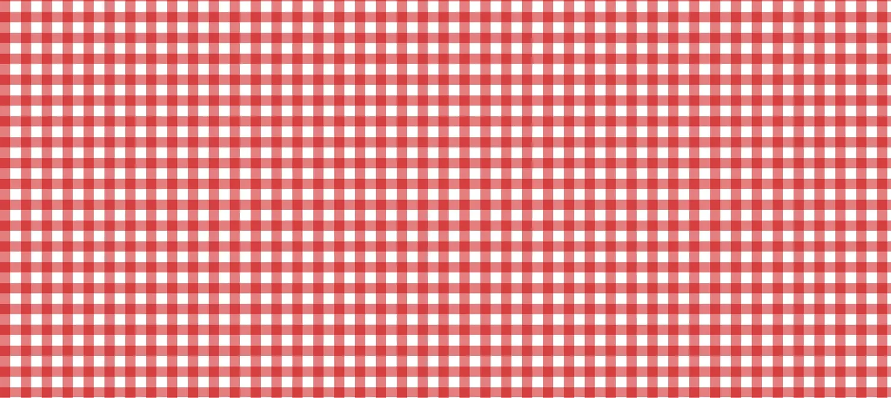

- CSS代码

```css
body {
    background: white;
    background-image: linear-gradient(90deg, rgba(200,0,0,.5) 50%, transparent 0),
                      linear-gradient(rgba(200,0,0,.5) 50%, transparent 0);
    background-size: 30px 30px;
}
```


# 10. 滑动对角线 - Sliding Diagonals

在此效果中，对角线颜色相互滑动和重叠。混合颜色的流畅动画可以为你的网站增添吸引力。

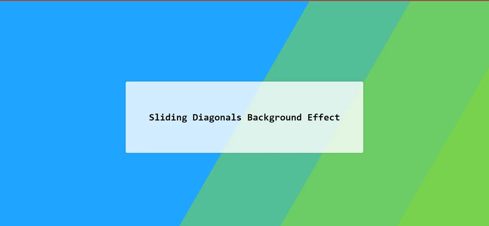

- HTML代码

```html
<div class="bg"></div>
<div class="bg bg2"></div>
<div class="bg bg3"></div>
<div class="content">
    <h1>Sliding Diagonals Background Effect</h1>
</div>
```

- CSS代码

```css
html {
    height:100%;
}
 
body {
    margin:0;
}
 
.bg {
    animation:slide 3s ease-in-out infinite alternate;
    background-image: linear-gradient(-60deg, #6c3 50%, #09f 50%);
    bottom:0;
    left:-50%;
    opacity:.5;
    position:fixed;
    right:-50%;
    top:0;
    z-index:-1;
}
 
.bg2 {
    animation-direction:alternate-reverse;
    animation-duration:4s;
}
 
.bg3 {
    animation-duration:5s;
}
 
.content {
    background-color:rgba(255,255,255,.8);
    border-radius:.25em;
    box-shadow:0 0 .25em rgba(0,0,0,.25);
    box-sizing:border-box;
    left:50%;
    padding:10vmin;
    position:fixed;
    text-align:center;
    top:50%;
    transform:translate(-50%, -50%);
}
 
h1 {
    font-family:monospace;
}
 
@keyframes slide {
    0% {
        transform:translateX(-25%);
    }
 
    100% {
        transform:translateX(25%);
    }
}
```

# 使用 CSS 美化网站

使用这些CSS背景模式来美化网站的设计。还可以使用一些很酷的 CSS 提示和技巧来提高 CSS 工作效率，它们可以帮助你只需几行代码即可在 CSS 中创建流畅的设计。
