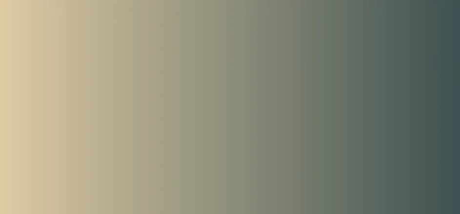
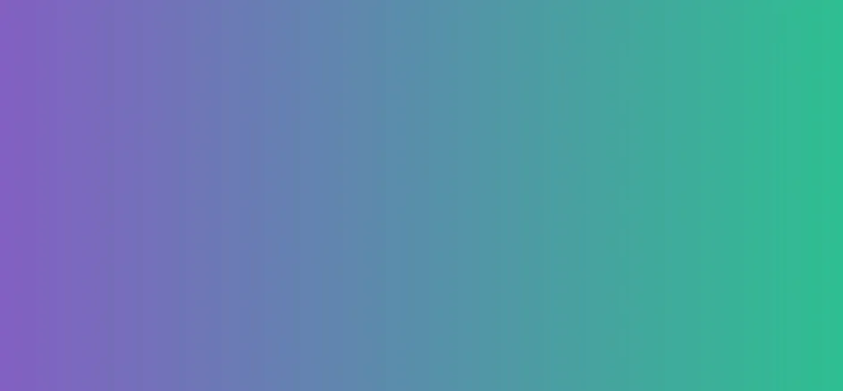
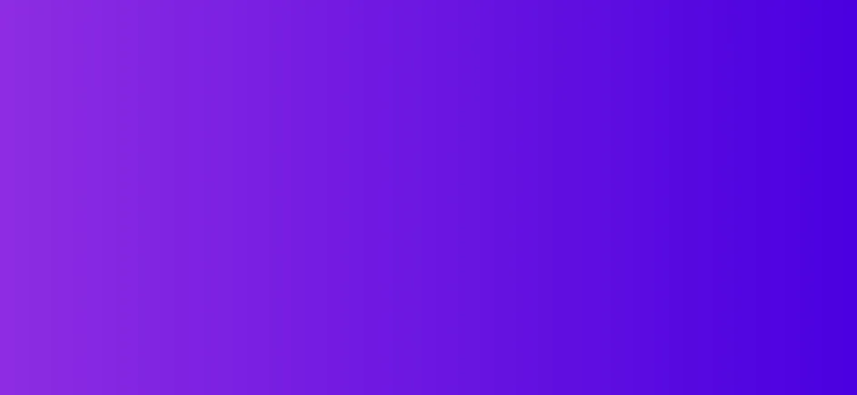
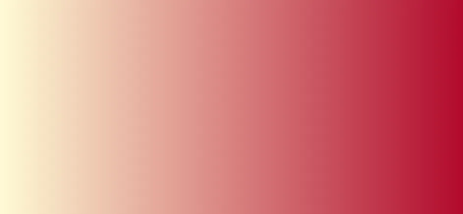
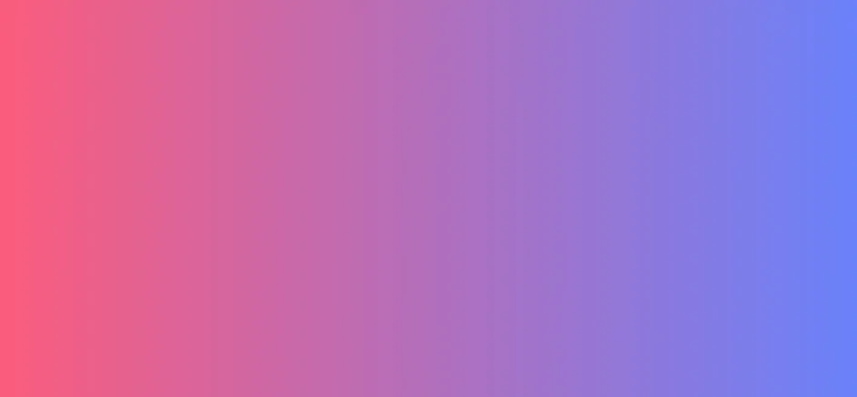
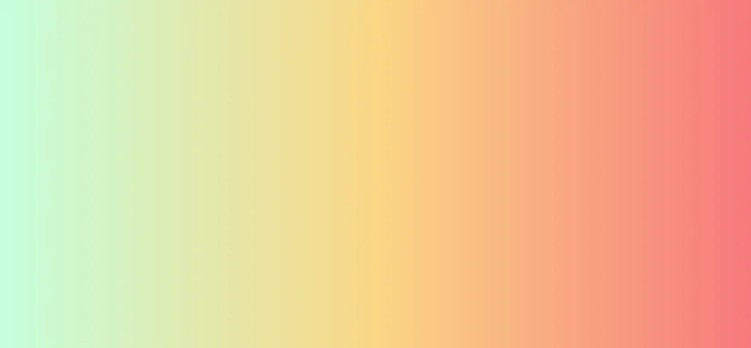
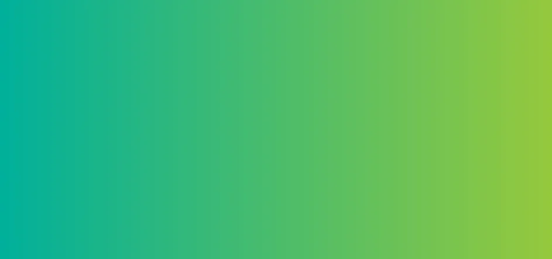
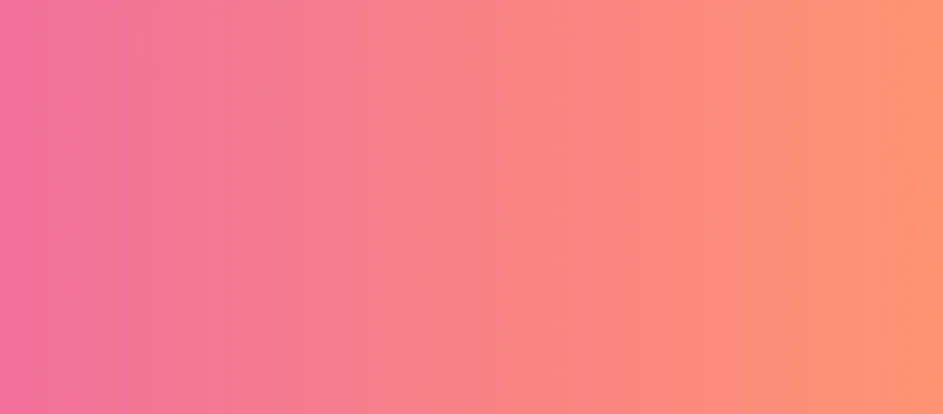
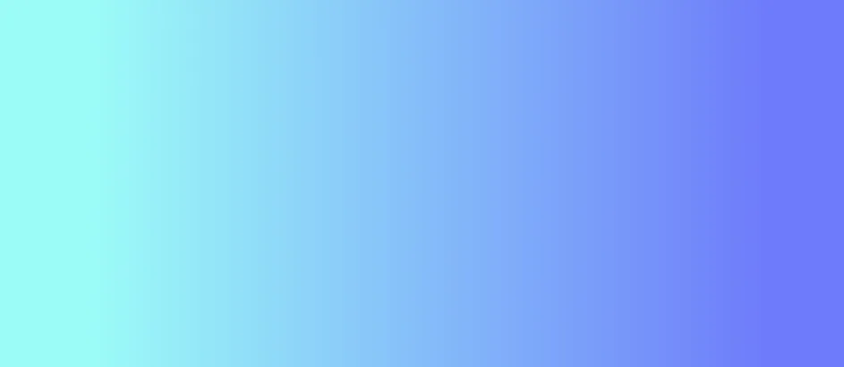

**30个时尚的CSS背景渐变示例【译】(好看的渐变背景色)**

[toc]

> 原文 [30 Stylish CSS Background Gradient Examples](https://www.makeuseof.com/css-background-gradients/#background-gradients-using-css)

> **原文只提供了19个。**


实色已经有很多年了，渐变也已经到来，但是，你如何在CSS中创建它们呢？

对于设计师或开发人员来说，了解最新的网页设计趋势和标准非常重要。目前，背景渐变已经广泛用于现代网站中。

可以使用下面这些背景渐变示例作为下一个 CSS 设计的灵感。

# 使用CSS背景渐变

## 渐变类型

CSS 渐变使用两种或多种指定的颜色显示平滑过渡。与使用渐变的实际图像文件相比，CSS 渐变提供了更好的控制和性能。

你可以[使用 Adobe Illustrator 等工具创建渐变](https://www.makeuseof.com/how-to-create-color-gradient-illustrator/)，使用 CSS 属性`background-image`将[渐变声明为背景](https://www.makeuseof.com/css-background-gradient/)。

有三种类型的渐变：

- 线性（使用 `linear-gradient()` 函数创建）
- 径向（使用 `radial-gradient()` 函数创建）
- 圆锥（使用 `conic-gradient()` 函数创建）

同时，还可以使用 `repeating-linear-gradient()`、`repeating-radial-gradient()`、`repeating-conic-gradient()` 函数创建重复渐变。

MDN文档中这些函数的定义如下：

- `linear-gradient()`：`linear-gradient()` CSS 函数创建一个图像，该图像由沿直线的两种或多种颜色之间的渐进过渡组成。其结果是`<gradient>`数据类型的对象，这是一种特殊的 `<image>`.

- `radial-gradient()`：`radial-gradient()` CSS 函数创建一个图像，该图像由从原点辐射的两种或多种颜色之间的渐进过渡组成。它的形状可以是圆形或椭圆形。该函数的结果是`<gradient>`数据类型的对象，这是一种特殊的 <image>.

- `conic-gradient()`：`conic-gradient()` CSS 函数创建一个由渐变组成的图像，该渐变的颜色过渡围绕中心点旋转（而不是从中心辐射）。圆锥渐变示例包括饼图和色轮(`pie charts and color wheels`)。`conic-gradient()` 函数的结果是`<gradient>`数据类型的对象，这是一种特殊的 <image>.

- `repeating-linear-gradient()`：`repeating-linear-gradient()` CSS 函数创建一个由重复线性渐变组成的图像。它类似于`gradient/linear-gradient()`并采用相同的参数，但它在所有方向上无限重复颜色的停止，以覆盖其整个容器。该函数的结果是`<gradient>`数据类型的对象，这是一种特殊的 `<image>`.

- `repeating-radial-gradient()`：`repeating-radial-gradient()` CSS 函数创建一个由从原点辐射的重复渐变组成的图像。它类似于`gradient/radial-gradient()`并采用相同的参数，但它在所有方向上无限重复颜色的停止，以覆盖其整个容器，类似于·`gradient/repeating-linear-gradient()`。该函数的结果是`<gradient>`数据类型的对象，这是一种特殊的 `<image>`.

- `repeating-conic-gradient()`：`repeating-conic-gradient()` CSS 函数创建一个由重复渐变（而不是单个渐变）组成的图像，其颜色过渡围绕中心点旋转（而不是从中心辐射）。

> The code used in this article is MIT Licensed.

## 官方语法

每个渐变类型的官方语法如下。

- **Official Syntax of Linear Gradients**

```
linear-gradient(
 [ <angle> | to <side-or-corner> ]? ,
 <color-stop-list>
)
<side-or-corner> = [to left | to right] || [to top | to bottom]
```

- **Official Syntax of Radial Gradients**

```
radial-gradient(
 [ <ending-shape> || <size> ]? [ at <position> ]? ,
 <color-stop-list>
);
```

- **Official Syntax of Conic Gradients**

```
conic-gradient(
 [ from <angle> ]? [ at <position> ]?,
 <angular-color-stop-list>
)
```

# 惊喜的渐变示例

这里有一些很棒的背景渐变示例，可以将你的网站UI提高到一个新的水平。

## 1. Dusty Grass


使用下面的CSS创建该渐变：

```css
background-image: linear-gradient(120deg, #d4fc79 0%, #96e6a1 100%);
```

## 2. Sand to Blue



使用下面的CSS创建该渐变：

```css
background-image: linear-gradient(to right, #DECBA4, #3E5151);
```

## 3. Kye Meh



使用下面的CSS创建该渐变背景：

```css
background-image: linear-gradient(to right, #8360c3, #2ebf91);
```

## 4. Amin



```css
background-image: linear-gradient(to right, #8e2de2, #4a00e0);
```

## 5. Relaxing Red



With just a single line of CSS code, you can add a beautiful, eye-catching background gradient to your website:

```css
background-image: linear-gradient(to right, #fffbd5, #b20a2c);
```

## 6. Sublime Light



```css
background-image: linear-gradient(to right, #fc5c7d, #6a82fb);
```

## 7. Megatron



使用下面的CSS创建该三色渐变：

```css
background-image: linear-gradient(to right, #c6ffdd, #fbd786, #f7797d);
```

## 8. Blue Raspberry


```css
background-image: linear-gradient(to right, #00b4db, #0083b0);
```

## 9. Premium Dark


```css
background-image: linear-gradient(to right, #434343 0%, black 100%);
```

## 10. Crystalline


```css
background-image: linear-gradient(-20deg, #00cdac 0%, #8ddad5 100%);
```

## 11. Lawrencium


```css
background-image: linear-gradient(to right, #0f0c29, #302b63, #24243e);
```

## 12. Ohhappiness



Add a touch of style to your site with this easy-to-use CSS gradient background:

```css
background-image: linear-gradient(to right, #00b09b, #96c93d);
```

## 13. The Strain


```css
background-image: linear-gradient(to right, #870000, #190a05);
```

## 14. Yellow Mango


```css
background-image: radial-gradient(circle farthest-side, #fceabb, #f8b500);
```

## 15. Juicy Grass


```css
background-image: radial-gradient( circle 759px at -6.7% 50%, rgba(80,131,73,1) 0%, rgba(140,209,131,1) 26.2%, rgba(178,231,170,1) 50.6%, rgba(144,213,135,1) 74.1%, rgba(75,118,69,1) 100.3% );
```

## 16. Pink Fish



```css
background-image: linear-gradient(to right, rgb(242, 112, 156), rgb(255, 148, 114));
```

## 17. Sea Lord



```css
background-image: linear-gradient( 109.6deg, rgba(156,252,248,1) 11.2%, rgba(110,123,251,1) 91.1% );
```

## 18. Cherry Blossom


```css
background-image: linear-gradient(25deg,#d64c7f,#ee4758 50%);
```

## 19. Fresh Air


```css
background-image: linear-gradient( 95.2deg, rgba(173,252,234,1) 26.8%, rgba(192,229,246,1) 64% );
```

