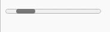

**4个可以在你的网站中使用的CSS进度条**

[toc]

> 原文 [4 CSS Progress Bars You Can Use on Your Website](https://www.makeuseof.com/css-progress-bar-examples/)
> 
> 有修改调整

HTML 的 progress 元素功能很好，但样式设置很棘手。如果你正在寻找更好看的进度条，请尝试这些 CSS 替代方案。


CSS 在设置网站样式方面起着重要作用。使用 CSS 可以轻松创建可重用的元素，如背景图案、卡片、按钮、导航栏等。这些即用型元素可帮助你快速高效地创建动态 Web 应用程序。

> `ready-to-use` 即用型

可以使用进度条显示指标、显示下载文件所需的时间或提供有关后台进程的实时反馈。

下面的四个进度条示例可以直接在项目中使用，也可以根据自己的喜好对其进行调整。

> The code in these examples is available in a [GitHub repository](https://github.com/Yuvrajchandra/CSS-Progress-Bar) and is free for you to use under the [MIT license](https://choosealicense.com/licenses/mit/).

# 默认的 progress 元素进度条

最原始的 `<progress></progress>` 元素的效果如下：



# 1. 离散进度条 - Discrete Progress Bar

这个现代的离散进度条使用 CSS 关键帧动画为网站的某个部分添加渐进效果。

该示例使用无限动画属性，因此离散条会永久重复运动。可以在后台发生某些事情时显示此进度条，它最终有助于改善网站的用户体验。

## HTML 代码

```html
<div class="progress-discrete">
    <div class="track">
        <div class="bar"></div>
        <div class="bar"></div>
        <div class="bar"></div>
        <div class="bar"></div>
        <div class="bar"></div>
        <div class="bar"></div>
        <div class="bar"></div>
        <div class="bar"></div>
        <div class="bar"></div>
        <div class="bar"></div>
    </div>
</div>
```

## 交替的效果


```css
body {
    background-color: #2e2e2e;
    box-sizing: border-box;
}

/* progress-discrete alternate 开始 */
.progress-discrete {
    width: 100px;
    padding-left: 2px;
    padding-right: 2px;
    height: 21px;
    border-radius: 5px;
    border: solid 3px #4e4e4e;
    background-color: #1e1e1e;
    position: absolute;
    /* top: calc(50% - 13px); */
    left: calc(50% - 53px);
}

.progress-discrete>.track {
    position: relative;
    width: 100%;
    height: 21px;
    overflow: hidden;
    -webkit-animation: prgBar 5s linear 0s infinite alternate;
    animation: prgBar 5s linear 0s infinite alternate;
}

.progress-discrete>.track>.bar {
    position: relative;
    height: 15px;
    width: 6px;
    background-color: #00ffff;
    border-radius:2px;
    box-shadow: 0px 0px 5px #00ffff;
    margin-left: 2px;
    margin-right: 2px;
    margin-bottom: 100px;
    top: 3px;
    float: left;
    clear: top;
}

@-webkit-keyframes prgBar {
    0% { width: 0% }
    9.99% { width: 0% }
    10% { width: 10% }
    95% { width: 100% }
}

@keyframes prgBar {
    0% { width: 0% }
    9.99% { width: 0% }
    10% { width: 10% }
    95% { width: 100% }
}
/* progress-discrete alternate 结束 */
```

## 修正 - 重复循环的效果

> 小问题：最后一个小亮点是慢慢消失的，之前的都不是，原因是什么？如何解决？【还是仅仅是视觉的“错误”？】

```css
        /* progress-discrete recycle 开始 */
        .progress-discrete {
            position: relative;
            width: 100px;
            padding-left: 2px;
            padding-right: 2px;
            height: 21px;
            border-radius: 5px;
            border: solid 3px #4e4e4e;
            background-color: #1e1e1e;
            position: absolute;
            /* top: calc(50% - 13px); */
            left: calc(50% - 53px);
        }

        .progress-discrete>.track {
            position: absolute;
            left: 2px;
            right: 2px;
            width: 100%;
            height: 21px;
            overflow: hidden;
            /* -webkit-animation: prgBar 5s linear 0s infinite alternate; */
            animation: prgBar 10s linear 0s infinite;
        }

        .progress-discrete>.track>.bar {
            position: relative;
            height: 15px;
            width: 6px;
            background-color: #00ffff;
            border-radius:2px;
            box-shadow: 0px 0px 5px #00ffff;
            margin-left: 2px;
            margin-right: 2px;
            margin-bottom: 100px;
            top: 3px;
            float: left;
            clear: top;
            animation: prgBarbar 10s linear 0s infinite;
        }

        /* @-webkit-keyframes prgBar {
            0% { width: 0% }
            9.99% { width: 0% }
            10% { width: 10% }
            95% { width: 100% }
        } */

        /* 使用 transfrom translateX 也可以实现 */
        /* 此处使用 width 和 绝对定位 及 float
            最后一个平滑消失...
        */
        @keyframes prgBar {
            0% { width: 0%;left: 2px; }
            9.99% { width: 0%;left: 2px; }
            10% { width: 10% ;left: 2px;}
            50% { width: 100%;left: 2px; }
            50.99999% { left: unset;right: 2px; }
            95% { width: 0%; left: unset;right: 2px;}
            100% { width: 0%; left: unset;right: 2px;}
        }
        @keyframes prgBarbar {
            0% { float: left; }
            50% { float: left; }
            50.99999% { float: right; }
            100% { float: right;}
        }
        /* progress-discrete recycle 结束 */
```