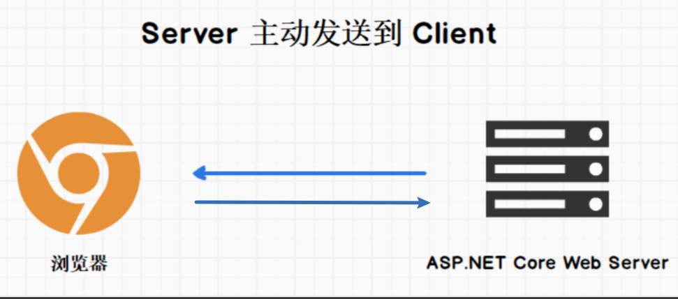

**ASP.NET Core 6 使用SignalR实现实时应用入门与学习**

[toc]

> 新建 .NET 6 的 ASP.NET Core Web API 项目 `SignalRBasic` ，用于代码测试和实现。

# `ASP.NET Core SignalR` 简介

## 什么是 SignalR？

ASP.NET Core SignalR 是一种开放源代码库，可简化应用程序实现或集成实时 web 功能。

> 实时 web 功能指的是即时获取web数据，服务端可以立即将内容推送到客户端。

适用场景如下：

- 需要从服务器进行高频率更新的应用。比如 游戏、社交网络、投票、拍卖、地图和 GPS 应用。
- 仪表板和监视应用。比如 公司仪表板、即时销售更新或旅行警报。
- 协作应用。比如 白板应用和团队会议软件。
- 需要通知的应用。比如 社交网络、电子邮件、聊天、游戏、旅行警报，和其他需要及时获取消息的应用场景。

SignalR提供了一个用于创建服务器到客户端的远程过程调用(RPC)的API，来自服务器端 .NET Core 代码的RPC会调用客户端的函数。

> API for creating server-to-client remote procedure calls (RPC)

Here are some features of SignalR for ASP.NET Core:

- Handles connection management automatically.
- Sends messages to all connected clients simultaneously. For example, a chat room.
- Sends messages to specific clients or groups of clients.
- Scales to handle increasing traffic.
- [SignalR Hub Protocol](https://github.com/dotnet/aspnetcore/blob/main/src/SignalR/docs/specs/HubProtocol.md)

## 传输

SignalR 支持以下的实时通信技术（按顺序优雅回退，自动选择最佳的传输方法）：

- [WebSockets](https://learn.microsoft.com/en-us/aspnet/core/fundamentals/websockets)
- Server-Sent Events 【SSE】
- Long Polling 【长轮询】

## Hubs

SignalR 使用 Hubs(集线器) 在客户端和服务器之间进行通信。

Hub是一种允许客户端和服务器相互调用方法的高级管道。SignalR 自动处理跨计算机边界的调度，使客户端能够在服务器上调用方法，反之亦然。可以传递强类型参数给启用了模型绑定的方法。

SignalR 提供了两种内置的Hub协议：基于 JSON 的文本协议和基于 [MessagePack](https://msgpack.org/) 的二进制协议。与 JSON 相比，MessagePack 通常会创建较小的消息。

> 较早的浏览器必须支持 [XHR level 2](https://caniuse.com/#feat=xhr2) 才能提供 MessagePack 协议支持。

Hub通过发送包含客户端方法的名称和参数的消息来调用客户端代码。作为方法参数发送的对象将使用配置的协议进行反序列化。客户端尝试将名称与客户端代码中的方法匹配。当匹配时，会调用该方法并向其传递反序列化的参数数据。

ASP.NET Core SignalR 支持的客户端有：

- [JavaScript client](https://learn.microsoft.com/en-us/aspnet/core/signalr/javascript-client?view=aspnetcore-6.0)
- [.NET client](https://learn.microsoft.com/en-us/aspnet/core/signalr/dotnet-client?view=aspnetcore-6.0)
- [Java client](https://learn.microsoft.com/en-us/aspnet/core/signalr/java-client?view=aspnetcore-6.0)

> 如果不支持ES6，see [Getting Started with ES6 – Transpiling ES6 to ES5 with Traceur and Babel](https://weblogs.asp.net/dwahlin/getting-started-with-es6-%E2%80%93-transpiling-es6-to-es5).

> Flutter下有非官方支持的 signalr_flutter、signalr_netcore 等各种客户端包。

# 主流的Web端实时通信的技术和原理

SignalR用到的实时通信技术，基本都是主流的Web端即时通信技术，几乎可以做到所有浏览器或Web端环境的支持，并提供支持其它类型的客户端。

传统的Web应用工作流程是这样的：浏览器发送HTTP请求到ASP.NET Core Web服务器, Web服务器处理请求并返回响应, 浏览器客户端接收返回的数据。


但这种工作方式却无法满足实时web的需求。

实时Web需要服务器能够主动发送消息给客户端(浏览器)，以及客户端主动发送消息给服务器（实现全双工通信(`duplex`)）：



数据发生变化，Web服务器主动发送给客户端，或，通知客户端。

> duplex transmission,duplex traffic:    双工传输
> duplex, full duplex:    全双工
> auto duplex:    自动双工

## Polling

### Polling

Polling是实现实时Web的一种笨方法, 它就是通过**定期的向服务器发送请求**, 来查看服务器的数据是否有变化.

如果服务器数据没有变化, 那么就返回204 No Content; 如果有变化就把最新的数据发送给客户端:


> Polling 轮询 被称为 短轮询、定期轮询。


### Polling 代码测试实现

下面是Polling的一个实现, 非常简单:

1. Web API项目中，新增一个控制器 DemoTestController 代码如下

```C#
    [Route("api/[controller]")]
    [ApiController]
    public class DemoTestController : ControllerBase
    {
        #region Polling

        /// <summary>
        ///  Polling 用于轮询测试
        /// </summary>
        /// <param name="count"></param>
        /// <returns></returns>
        [HttpGet("[action]")]
        public IActionResult PollingTest_GetCount(int id)
        {
            var count = GetLastedCount();
            if (count > 10)
            {
                return Ok(new { id, count, finished = true });
            }
            
            if (count > 8)
            {
                return NotFound();
            }
            
            if (count > 3)
            {
                return Ok(new { id, count });
            }
            return NotFound();
        }
        #endregion

        private static int _count;
        public int GetLastedCount()
        {
            _count++;
            return _count;
        }
    }
```

`PollingTest_GetCount`方法会调用 `GetLastedCount()`，获取全局自动的 _count 变量。

Action `PollingTest_GetCount` 获取的 count，会在 `count<=3` 和 `8<count<=10` 时返回 No Content；`3<count<=8` 时返回对象；`count>10`返回中增加finished标志。

2. PollingTest.html 前端页面实现polling（定时轮询/短轮询），请求`PollingTest_GetCount`接口。

> html、js位于同一文件

```html
    <button id="btnStart" type="button">开始Polling</button>
    <span id="result" style="color:red;font-weight:bolder;"></span>
    <br>
    <br>
    <br><br>
    <button id="btnReset" type="button">重置</button>
    <script>
        window.onload=()=>{
            const resultDiv = document.getElementById("result");
            let intervalId = -1;

            function poll(id) {
                fetch('/api/DemoTest/PollingTest_GetCount/'+id)
                    .then(function (response) {
                        if (response.status === 200) {
                            return response.json().then(j => {
                                let txt=`id(${j.id})-count(${j.count})`
                                resultDiv.innerHTML = txt;
                                if (j.finished) {
                                    clearInterval(intervalId);
                                    resultDiv.innerHTML = txt + ",已结束";
                                }
                            })
                        }
                    });
            }

            document.getElementById('btnStart').addEventListener('click', () => {
                intervalId = setInterval(() => {
                    poll(parseInt(1 + 20 * Math.random()))
                }, 1000)
            });

            // 重置
            document.getElementById('btnReset').addEventListener('click', () => {
                fetch('/api/DemoTest/ResetCount', {
                    method: 'PUT', // *GET, POST, PUT, DELETE, etc.
                    })
                    .then(res=>{
                        console.log(res);
                        // return res.json();
                        return res.text();
                    })
                    .then(obj=>console.log(`重置结束 ${obj}.`));
            });
        }
</script>
```

功能很简单：点击按定后，定时每秒发送一次请求，获取数据，并对数据进行处理和显示！


当请求到 `count>10` 的时候结束。

这就是Polling - 定时轮询，因为频繁建立连接与发送请求，相对，比较浪费资源，同时增加服务器负担。

> **SignalR没有采用Polling这种技术**


## Long Polling

### Long Polling

Long Polling和Polling有类似的地方, 客户端都是发送请求到服务器. 但是不同之处是: 

**如果服务器没有新数据要发给客户端的话, 那么服务器会继续保持连接, 直到有新的数据产生, 服务器才把新的数据返回给客户端。**

**如果请求发出后一段时间内没有响应, 那么请求就会超时. 这时, 客户端会再次发出请求。**


相比 Polling 做了优化。


### 关于超时时间

#### Kestrel 服务器的默认超时时间，设置超时时间

#### ASP.NET Core 部署到 IIS 的超时时间设置

#### Visual Studio IIS Express调试时的超时时间设置

#### fetch 请求的超时时间及设置

> 默认情况下，`fetch()` 请求的超时时间，在Chrome中为300秒，而在Firefox中为90秒。
>
> 300秒、甚至90秒都远远超过了用户对完成一个简单网络请求的期望。

`fetch()` API本身不允许以编程方式取消一个请求，通过也没有设置超时时间的参数。

> 终止`fetch()`请求的实现，本质是通过一个 终止控制器(`AbortController`)，将其`signal`属性(`AbortSignal`对象) 传递给 fetch 方法，fetch会监听`signal`的状态，一旦状态改变且请求未结束，就会终止 fetch 方法的请求。


`fetchWithTimeout()` 是 `fetch()` 的改进版，可创建具有可配置超时的请求。

```js
async function fetchWithTimeout(resource, options = {}) {
  const { timeout = 10000 } = options;
  
  const controller = new AbortController();
  const id = setTimeout(() => controller.abort(), timeout);
  const response = await fetch(resource, {
    ...options,
    signal: controller.signal  
  });
  clearTimeout(id);
  return response;
}
```

- `const { timeout = 10000 } = options` 从 options 对象中提取以毫秒为单位的超时参数（默认为10秒）。

- `const controller = new AbortController()` 创建一个[中止控制器](https://developer.mozilla.org/en-US/docs/Web/API/AbortController)实例。这个控制器用于停止 fetch 的请求。

注意，每一个请求都必须创建一个新的中止控制器。换句话说，控制器是不可重复使用的。

- `const id = setTimeout(() => controller.abort(), timeout)` 启动一个计时功能。在 `timeout` 时间之后，如果计时函数没有被清除，执行 `controller.abort()` 中止（或取消）获取请求。 

- `await fetch(resource, { ...option, signal: controller.signal })` 执行获取请求。

注意分配给 signal 属性的特殊 `controller.signal` 值：它将`fetch()` 与中止控制器连接起来。

- 最后`clearTimeout(id)`，如果请求完成的速度比 `timeout` 的时间快，则清除终止的计时功能。

`fetchWithTimeout`超时终止请求的实际示例：

```js
async function loadGames() {
  try {
    const response = await fetchWithTimeout('/games', {
      timeout: 6000
    });
    const games = await response.json();
    return games;
  } catch (error) {
    // Timeouts if the request takes longer than 6 seconds
    console.log(error.name === 'AbortError');
  }
}
```

#### XMLHttpRequest 对象指定超时时间 (ajax) 

`XMLHttpRequest`对象有指定超时时间的API，可以直接指定超时时间和超时处理。

> 显式调用 `XMLHttpRequest.abort()` 可以终止请求；`abort`终止请求事件。

```js
// 具有超时的ajax请求
function ajaxSend(url,options) {
  const {
            method='GET' // GET、POST、PUT、DELETE
            success=res=>console.log(res),
            error=res=>console.error(res),
            timeout=10000, // 超时时间
            timeoutFunc=e=>console.error("Timeout!!"),
            async=true, // 是否异步执行操作，默认true
            user=null,  // 可选的用户名用于认证用途；默认为 null
            password=null, // 可选的密码用于认证用途；默认为 null
        } = options;

  // 创建对象
  let xhr = new XMLHttpRequest()
  // 初始化请求
  xhr.open(method, url, async,user,password)
  xhr.timeout = timeout // 超时时间，单位是毫秒
  xhr.onreadystatechange = function() {
    if (xhr.readyState == 4) {
      if (xhr.status == 200) {
        //如果返回成功
      }

      const res = {
        response:xhr.response,
        status:xhr.status,
        responseType:xhr.responseType
      }
      if(xhr.status>=400) error(res);
      else success(res);
    }
  }
  xhr.ontimeout = timeoutFunc;
  // 发送请求
  xhr.send()
}
```

XMLHttpRequest (ajax) 实现的长轮询：

```js
// 不管成功、超时还是失败都会发下一次请求
// 其他状态码，比如服务器错误、400错误，可以考虑取消请求
function send(){
    ajaxSend('/clock',{
        success=res=>{
            console.log(`请求成功：${res}`)
            send();
        },
        error=res=>send(),
        timeout=10000, // 超时时间
        timeoutFunc=e=>{
            console.error("Timeout!!");
            send();
        }
    })
}


send()
```

### Long Polling 代码测试实现

在 DemoTestController 控制器中，新增一个名称为`LongPollingTest` 的 Action：

```C#
#region Long Polling
/// <summary>
/// 长轮询测试
/// </summary>
/// <param name="id"></param>
/// <returns></returns>
[HttpGet("[action]/{id}")]
public IActionResult LongPollingTest_GetCount(int id)
{
   // 模式等待数据
   Thread.Sleep(1000 * new Random().Next(1,5) / 2);

   int count = GetLastedCount();
   if (count > 5)
   {
       return Ok(new { id, count, finished = true });
   }
   else
   {
       return Ok(new { id, count, finished = false });
   }
}
#endregion
```

`LongPollingTest_GetCount` 用于模拟长轮询的接口地址。通过模拟一定时间的等待，在符合要求的数据出现之前，保持连接开放，当有新数据后，才会返回给客户端。

`LongPollingTest.html`前端页面内js的实现：

```js
const resultDiv = document.getElementById("result");

async function longPolling(id) {
    try {
        const response = await fetchWithTimeout('/api/DemoTest/LongPollingTest_GetCount/' + id, {
            timeout: 1500  // 测试用，超时时间
        });
        if (response.status === 200) {
            const result = await response.json();
            let txt = `id(${result.id})-count(${result.count})`
            if (result.finished) {
                resultDiv.innerHTML = txt + ",已结束";
            }
            else{                        
                resultDiv.innerHTML = txt;
            }
        }
        else{
            // 其他状态码，比如服务器错误、400错误，可以考虑取消请求
            console.log(response.status + '发生了异常，请确认问题');
        }
    } catch (error) {
        // Timeouts if the request takes longer than 6 seconds
        console.log(error.name === 'AbortError');
    }

    // 成功或失败，继续下一次请求
    // 其他状态码，比如服务器错误、400错误，可以考虑取消请求
    longPolling((parseInt(1 + 20 * Math.random())));
}


document.getElementById('btnStart').addEventListener('click', () => {
    longPolling((parseInt(1 + 20 * Math.random())));
});
```

请求测试结果如下，报错的为超时取消的请求，可以看到错误提示`the user aborted a request`，其他超时时间内正常请求返回。


由于设置了无论是否结束、失败，都会继续请求，因此，会一直发送。【实际中需要根据情况停止并进行问题提示】

> 需要注意: 服务器的超时时长和浏览器的超时时长可能不一样，需要双方均进行设置。

## Server Sent Events (SSE)

### SSE（服务器派发事件）

**使用SSE，Web服务器可以在任何时间把数据发送到浏览器**, 可以称之为 **推送**。而**浏览器则会监听进来的信息, 这些信息就像流数据一样, 这个连接也会一直保持开放, 直到服务器主动关闭它。**

被推送进来的信息可以在这个页面上作为 `Events [0] + data` 的形式来处理。

浏览器会使用一个叫做 **EventSource** 的对象用来处理传过来的信息.


SSE交互过程：


> **SSE实现的是服务端单向推送。**

EventSource要比Polling和Long Polling好很多.

主要优点: 使用简单(HTTP), 自动重连, 虽然不支持老浏览器但是很容易polyfill（比如 [event-source-polyfill](https://link.segmentfault.com/?enc=aPMFSDlh1saJEelyAUqjYA%3D%3D.usreW9ndYwL6hHwUZzNWxea34JpBsNCiwqle9rvYx4%2Fe%2F9QlpT77xzL8%2Fzup2EE0R7qfHCiQEaa2Ju7WPO5D2g%3D%3D)）。

缺点是: 很多浏览器都有最大并发连接数的限制(通常默认6个), 只能发送文本信息, 单向通信.

### SSE 与其他交互方式的区别（相比WS轻量级）


- SSE 与 WS 的区别。

| 方式 | 协议 | 交互通道 | 内容编码 | 重连 | 事件类型 | 总结 |
| :-- | :-- | :-- | :-- | :-- | :-- | :-- |
| SSE | HTTP | 服务端单向推送 | 默认文本 | 默认支持断线重连 | 支持自定义消息类型 | 轻量级 |
| WebSocket | WS（基于 TCP 传输层的应用层协议，[RFC6455](https://link.segmentfault.com/?enc=NmyhwGN7KjnZFE1HFEIH3g%3D%3D.Tr8t7fVMVn7ws76ON5UmRiDAQfrAPU1zJyV%2BNALrdTbjEBq4WpR8rQ85nTxPF%2B3V) `[1]` 对于它的定义标准） | 双向推送 | 默认二进制 | 手动实现 | NO | 扩展性、功能性强大 |

> TCP/IP 五层模型：
> 
> 

### SSE 代码测试实现

- 控制器中代码

新建Action方法 `SSETest_GetCount`，代码内通过`Response`写入返回的信息，在全部数据推送完成后，通过`Response.Body.Close()`主动关闭。

```C#
#region Server Sent Events (SSE)
/// <summary>
/// SSE 测试
/// </summary>
/// <param name="id"></param>
[HttpGet("[action]/{id}")]
public async void SSETest_GetCount(int id)
{
    var jsonOptions = new JsonSerializerOptions(JsonSerializerDefaults.Web)
    {
        //PropertyNamingPolicy = JsonNamingPolicy.CamelCase,
        Encoder = JavaScriptEncoder.UnsafeRelaxedJsonEscaping
    };

    Response.ContentType = "text/event-stream";
    int count;
    do
    {
        Thread.Sleep(1000 * new Random().Next(1, 10) / 2);

        count = GetLastedCount();
        if (count % 3 == 0)
        {
            //注意SSE返回数据的只能是字符串, 而且以data:开头, 后边要跟着换行符号, 否则EventSource会失败.
            await HttpContext.Response.WriteAsync($"data:{JsonSerializer.Serialize(new { id, count, finished = count>15 }, jsonOptions)}\n\n");
            await HttpContext.Response.Body.FlushAsync();
        }

    } while (count <= 21);

    // 直接返回，或 Body.Close()关闭，都会引发 js 中 EventSource 的 error 事件。
    // 需要在error事件方法内判断错误原因，如果是连接关闭，则关闭EventSource。否则，客户端默认会一直重新连接
    //return Content($"data:{JsonSerializer.Serialize(new { id, count, finished = count > 15 }, jsonOptions)}\n\n");

    // 直接关闭，js 的 EventSource 会 onerror，而不是关闭SSE
    Response.Body.Close();
}

#endregion
```

> 注意：SSE返回数据的只能是字符串, 而且以data:开头, 后边要跟着换行符号, 否则EventSource会失败。
> 
> 此外，还可以指定 event-事件名称、id-当前推送id、retry-超时重试时间

- 前端SSE代码

通过 EventSource的 message 事件接受服务器推送过来的消息。

```js
const resultDiv = document.getElementById("result");

const  SSEListen = id => {
    const eventSource = new EventSource('/api/DemoTest/SSETest_GetCount/' + id);
    eventSource.addEventListener("open", function (e) {
        console.log("EventSource started", e);
    }, false);
    eventSource.onmessage = (event) => {
        // const resultDiv = document.getElementById("result");
        console.log(event.data);
        const result=JSON.parse(event.data);
        let txt = `id(${result.id})-count(${result.count})`
        if (result.finished) {
            resultDiv.innerHTML = txt + ",已结束";
        }
        else {
            resultDiv.innerHTML = txt;
        }
    };
    eventSource.onerror = function (e) {
        console.log("EventSource failed", e);
        if (e.eventPhase == EventSource.CLOSED) {                        
            console.log("Connection closed", e);
            eventSource.close();
        }
    }
    eventSource.onclose = function (e) {
        console.log("EventSource closed", e);
    }

    // js主动关闭
    // eventSource.close();
};


document.getElementById('btnStart').addEventListener('click', () => {
    SSEListen((parseInt(1 + 20 * Math.random())));
});
```

测试 SSE连接处理：


## WebSocket - ws

### WebSocket

Web Socket是不同于HTTP的一种全新的协议，它将TCP的Socket（套接字）应用在了webpage上. 它使得浏览器和服务器之间的交互式通信变得可能。使用WebSocket，通过一直保持活动状态的连接通道，消息可以从服务器发往客户端, 也可以从客户端发往服务器, 并且没有HTTP那样的延迟. 信息流没有完成的时候, TCP Socket通常会保持打开的状态.

**由于是建立在HTTP基础上的协议，因此连接的发起方仍是客户端，而一旦确立WebSocket通信连接，不论服务器还是客户端，任意一方都可直接向对方发送报文。**

现代浏览器中, SignalR大部分情况下都会使用Web Socket, 这也是最有效的传输方式. 

> 全双工通信: 客户端和服务器可以同时往对方发送消息。双向通信，实时性更强.
> 
> 无连接限制：Web Socket不受SSE的浏览器连接数限制(6个), 大部分浏览器对Web Socket连接数的限制是50个.
> 
> 消息类型: 可以是文本和二进制(JSON、XML、HTML或图片等), Web Socket也支持流媒体(音频和视频).
> 
> 减少通信量：只要建立起WebSocket连接，就可以一直保持连接状态【TCP长连接】。和HTTP相比，不但每次连接时的总开销减少，而且由于WebSocket的首部信息很小，通信量也相应减少了

> HTTP的局限性：
> 
> - HTTP是半双工协议，即，在同一时刻数据只能单向流动，客户端向服务器发送请求(单向的)，然后服务器响应请求(单向的)。
> 
> - 服务器不能主动推送数据给浏览器。导致一些高级功能难以实现，诸如聊天室场景等。


**WebSocket的引入，在海量并发和客户端与服务器交互负载流量大的情况下，极大的节省了网络带宽资源的消耗，有明显的性能优势，且客户端发送和接受消息是在同一个持久连接上发起，实时性优势明显。**

其实正常的HTTP请求也使用了TCP Socket. Web Socket标准使用了握手机制把用于HTTP的Socket升级为使用WS协议的 WebSocket socket.

### 生命周期

Web Socket的生命周期是这样的:


所有的一切都发生在TCP Socket里面：

1. 首先一个常规的HTTP请求会要求服务器更新Socket并协商, 这个叫做 **HTTP握手**. 
2. 然后消息就可以在Socket里来回传送, 
3. 直到这个Socket被主动关闭. 在主动关闭的时候, 关闭的原因也会被通信.

### HTTP 握手

每一个Web Socket开始的时候都是一个简单的HTTP Socket.

客户端首先发送一个GET请求到服务器, 来请求升级Socket. 

如果服务器同意的话, 这个Socket从这时开始就变成了Web Socket.

 

- Get请求升级的示例如下:


第一行表明这就是一个HTTP GET请求.

Upgrade 这个Header表示请求升级socket到Web Socket.

Sec-WebSocket-Key, 也很重要, 它用于防止缓存问题, 具体请查看[官方文档](https://tools.ietf.org/html/rfc6455).
 

- 服务器理解并同意请求以后, 它的响应如下:


返回101状态码, 表示切换协议.

如果返回的不是101, 那么浏览器就会知道服务器没有处理WebSocket的能力.

此外，Header里面还有Upgrade: websocket.

Sec-WebSocket-Accept是配合着Sec-WebSocket-Key来运作的, 具体请查阅[官方文档](https://tools.ietf.org/html/rfc6455).

### 消息类型

Web Socket的消息类型可以是文本, 二进制. 也包括控制类的消息: Ping/Pong, 和关闭.

每个消息由一个或多个Frame(数据帧)组成:


所有的Frame都是二进制的. 所以文本会首先转化成二进制.

- Frame 有若干个Header bits.

- 有的可以表示这个Frame是否是消息的最后一个Frame;

- 有的可以表示消息的类型.

- 有的可以表示消息是否被掩蔽了. 客户端到服务器的消息被掩蔽了, 为了防止缓存投毒(使用恶意数据替换缓存).

- 有的可以设置payload的长度, payload会占据frame剩下的地方.


实际上用的时候, 你基本不会观察到frame, 它是在后台处理的, 你能看到的就是完整的消息.

但是在浏览器调试的时候, 你看到的是frame挨个传递进来而不是整个消息.

### WebSocket 代码实现和测试

- `ASP.NET Core` 启用WebSocket中间件

ASP.NET Core 已经内置了WebSocket, 但是需要配置和使用这个中间件：

```C#

            //app.UseWebSockets(new WebSocketOptions()
            //{
            //    // 默认2分钟
            //    KeepAliveInterval=TimeSpan.FromSeconds(120),                
            //    //ReceiveBufferSize=4*1024 // 默认4kb,已过时
            //});
            app.UseWebSockets();
```

- Action 方法中处理连接的WebSocket请求

添加如下的Action。

首先判断请求是否是WebSocket请求, 然后调用 `AcceptWebSocketAsync` 方法将 TCP 连接升级到 WebSocket 连接(客户端会收到回复)，并提供 [WebSocket](https://learn.microsoft.com/zh-cn/dotnet/api/system.net.websockets.websocket) 对象，使用 `WebSocket` 对象发送和接收消息。

WebSocketHandle_Echo方法处理WebSocket的发送和接受，用于将接收到的消息回传给客户端，参考自官方文档。在此基础上添加了额外的发送消息。

整个过程循环发送和接受消息，直到客户端主动关闭连接。

通过 webSocket.CloseAsync() 关闭 webSocket, 指明关闭状态（如：NormalClosure）、状态描述等。


### WebSocket连接报错 - 保持WebSocket中间件在连接期间运行

在使用 WebSocket 时，必须 **保持WebSocket中间件在连接期间运行**。如果在中间件管道结束后发送或接收WebSocket消息，将会收到一下错误：

The remote party closed the WebSocket connection without completing the close handshake

详细如下：

```sh
System.Net.WebSockets.WebSocketException (0x80004005): The remote party closed the WebSocket connection without completing the close handshake. ---> System.ObjectDisposedException: Cannot write to the response body, the response has completed.
Object name: 'HttpResponseStream'.
```

# 附：网络通信中单工（Simplex Communication）、半双工（Half-duplex Communication）、全双工（Full-duplex Communication）


- 单工通信只支持信号在一个方向上传输（正向或反向）
- 半双工通信允许信号在两个方向上传输，但某一时刻只允许信号在一个信道上单向传输。(实际上是一种可切换方向的单工通信)
- 全双工通信允许数据同时在两个方向上传输，即有两个信道，因此允许同时进行双向传输。

> 参见 [网络通信中的单工（Simplex Communication）、半双工（Half-duplex Communication）、全双工（Full-duplex Communication）是什么意思？](https://blog.csdn.net/Dontla/article/details/126603052)

# 参考

- [ASP.Net Core 3.1 使用实时应用SignalR入门](https://www.cnblogs.com/hudean/p/14172852.html)

- [javascript:如何对fetch()请求进行超时处理](https://juejin.cn/post/7126043782172114951)

- [ASP.NET Core如何设置请求超时时间](https://www.cnblogs.com/OpenCoder/p/10307882.html)

# 其他

- [Web 实时推送技术的总结](https://segmentfault.com/a/1190000018496938) -- 绝对好文
- [这是即时通讯的 4 种实现方案](https://juejin.cn/post/7057687288154685470)
- [前端实时通信的8种方式及其优缺点和实现方式](https://blog.csdn.net/weixin_43236062/article/details/107756103)
- [实时通信技术大乱斗](https://zhuanlan.zhihu.com/p/419044910)
- [即时通讯程序总结](https://blog.csdn.net/godelgnis/article/details/100431494)
- [通过Node + SSE 做了一个构建日志推送](https://segmentfault.com/a/1190000042564706)
- [Utilize Server Sent Events (SSE) In ASP.NET Core](http://binaryintellect.net/articles/1b6d874a-3535-4af2-8e74-de9019d5607d.aspx)
- [Fetch超时设置和终止请求](https://www.cnblogs.com/yfrs/p/fetch.html)
