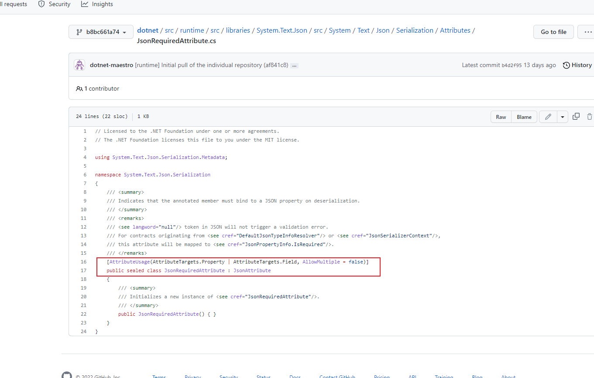
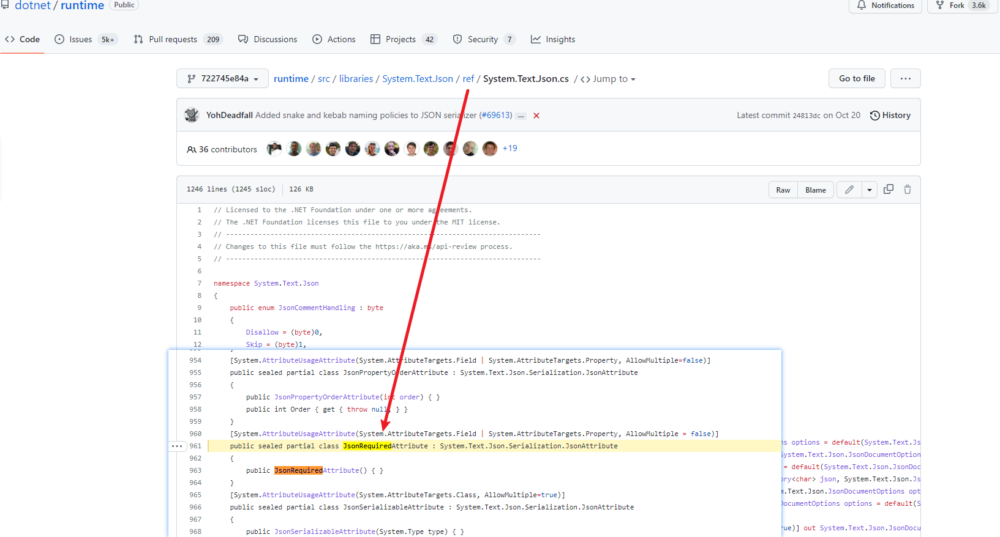

**ASP.NET Core Web API中添加自定义的统一模型验证和SuppressModelStateInvalidFilter的介绍**

[toc]

> 这篇内容最主要的缘起在于 `SuppressModelStateInvalidFilter` 设置的“误伤”，由于对此设置认识不清（太久忘记了），后面更换和升级 ASP.NET Core 版本，更换为不同的项目后，出现模型验证“失效”的问题，即模型验证明明是失败的，但是仍然进入`Action`方法内，`ModelState`被传递进来执行。
> 
> 当时还非常奇怪和郁闷，怎么模型验证无效...，最后只好在每个`Action`方法中添加额外的判断，来处理模型类数据不正确的情况。不过，这也是 `SuppressModelStateInvalidFilter=true` 启用后正确的处理方式。

> 基于 ASP.NET Core 6

# 实现统一模型验证的拦截

> 此部分参考自 [asp.net core 统一模型验证拦截实现](https://www.huaface.com/article/5)

## 自定义的统一模型验证过滤器 APIModelFilter

通过创建继承自`IActionFilter`的过滤器实现模型验证，将其添加为全局过滤器，就能实现统一的验证拦截。

新建 `APIModelFilter.cs` 文件，添加如下内容，`OnActionExecuting`方法中在模型验证失败时，获取模型验证的最后（最内层）的错误消息，设置http状态码为`BadRequest`。

```C#
using Microsoft.AspNetCore.Mvc.Filters;
using Microsoft.AspNetCore.Mvc;
using System.Net;
using System.Linq;
using Microsoft.AspNetCore.Mvc.ModelBinding;
using MyWebServer.APIModel;

namespace MyWebServer.Filters
{
    public class APIModelFilter : IActionFilter
    {
        public void OnActionExecuted(ActionExecutedContext context)
        {
        }

        public void OnActionExecuting(ActionExecutingContext context)
        {
            if (context.ModelState.IsValid)
            {
                return;
            }

            var errorMessage = context.ModelState
                //?.FirstOrDefault(m => m.Value.ValidationState == ModelValidationState.Invalid).Value
                ?.LastOrDefault(m => m.Value.ValidationState == ModelValidationState.Invalid).Value  // 获取最后一个，最内层的错误
                ?.Errors
                //?.FirstOrDefault()
                ?.LastOrDefault()  
                ?.ErrorMessage;

            context.HttpContext.Response.StatusCode = (int)HttpStatusCode.BadRequest;
            context.Result = new JsonResult(new ResultModel()
            {
                Status = 400,
                Message = errorMessage
            });
            // ObjectResult对象
        }
    }
}
```

其中的 `ResultModel` 为 WebAPI 返回的统一模型类：

```C#
namespace MyWebServer.APIModel
{
    public class ResultModel
    {
        public int Status { get; set; } = 200;
        public string Message { get; set; }
    }

    public class ResultDataModel<T>:ResultModel
    {
        public T Data { get; set; }
    }
}
```

## ConfigureServices 中添加`Filter`过滤器

`ConfigureServices`方法中，在控制器选项配置中，添加全局`Filters`自定义的过滤器。

```C#
services.AddControllers(option =>
{
    option.Filters.Add<APIModelFilter>();
});
```

## SuppressModelStateInvalidFilter 禁用自动的 400 BadRequest 响应

### [ApiController]的自动 HTTP 400 响应

设置好以上的过滤器后，如果进行测试验证，会发现不会输出想要的自定义结果，而是返回系统默认的模型验证错误。即 如下的结果：

```json
{
    "type": "https://tools.ietf.org/html/rfc7231#section-6.5.1",
    "title": "One or more validation errors occurred.",
    "status": 400,
    "traceId": "00-394118bbdc04faf52a66ee1d25427b80-fd83c949a359c8c1-00",
    "errors": {
        "myModel": [
            "请确保格式正确"
        ],
        "$.Body.seriallist[0]": [
            "JSON deserialization for type 'MyWebServer.APIModel.MyModel' was missing required properties, including the following: seq"
        ]
    }
}
```

`errors`里面为要验证的模型类和字段。该 400 BadRequest 是模型验证错误时自动响应的。

官方文档 [Web API应用-概述-自动 HTTP 400响应](https://docs.microsoft.com/zh-cn/aspnet/core/web-api/#automatic-http-400-responses) 有介绍。

**`[ApiController]`特性提供了模型验证错误时自动触发 HTTP 400 的响应**，因此，`Action`方法中不需要使用`ModelState.IsValid`，如下的代码：

```C#
if (!ModelState.IsValid)
{
    return BadRequest(ModelState);
}
```

HTTP 400 自动响应的默认类型为 [ValidationProblemDetails](https://learn.microsoft.com/zh-cn/dotnet/api/microsoft.aspnetcore.mvc.validationproblemdetails)，即上面示例的JSON结果。

### 禁用自动 HTTP 400 响应

将 `ApiBehaviorOptions` 中的 `SuppressModelStateInvalidFilter` 设置为 `true` 即可 禁用 (模型验证失败时) 自动的 HTTP 400 BadRequest 响应。

有两种配置方式实现：

```C#
services.AddControllers()
    .ConfigureApiBehaviorOptions(options =>
    {
        options.SuppressModelStateInvalidFilter = true;
    });
```

或

```C#
services.Configure<ApiBehaviorOptions>(options =>
{
    options.SuppressModelStateInvalidFilter = true;
});
```

### SuppressModelStateInvalidFilter 小介绍

`SuppressModelStateInvalidFilter=true` 表示在过滤器`Filter`验证无效时，将`ModelState`传递到`Action`方法，这样，可以在`Action`中使用`ModelState.IsValid`来自己获取处理验证的结果。

如果不设置此项为`true`，将会根据`Model`类中添加的`BindRequired/Required/JsonRequired`等模型验证失败时，自动返回`400`状态码，不会进入`Action`执行。

禁用`自动400行为`之后的作用：一是，可以在`Action`中使用`ModelState.IsValid`（这一点在 WebAPI 中几乎没有什么应用场景）；二是，可以使用自定义的统一模型验证（过滤器），进行拦截处理返回结果，不使用默认的400响应。

## 请求测试 自定义模型验证的结果

举一个很简单的模型类：

```C#
public class MyModel
{
    [JsonRequired]
    public string Id { get; set; }

    [JsonRequired]
    public int Seq { get; set; }
}
```

测试请求，在请求的JSON内容中缺失键`seq`，验证自定义的`APIModelFilter`过滤器，返回结果如下：

```js
{
    "status": 400,
    "message": "JSON deserialization for type 'MyWebServer.APIModel.MyModel' was missing required properties, including the following: Seq"
}
```

这样，就是实现了统一的模型验证。

# 如何实现可以添加自定义错误消息 ErrorMessage 的 JsonRequired 特性【暂未实现】

比如 `Required` 的模型验证，可以很方便的自定义错误消息：`[Required(AllowEmptyStrings = false, ErrorMessage = "必须指定该属性且不能为空",)]`

但是 `JsonRequired` 却没有此属性，甚至没有任何其他可使用的属性。它只是作为标记，在序列化时进行json键必须的判断。

## JsonRequired 验证失败时的默认错误消息

json 序列化模型对象时 `JsonRequired` 无法添加自定义的消息，更无法获取到自定义消息。

使用 JsonRequired 时默认的错误为 "JSON deserialization for type '{ModelClassName}' was missing required properties, including the following: {missed_property_name}"，通过`context.ModelState`能获取到的也只能时这个消息

如果在包含有 `[JsonRequired]property_name`属性 的模型类约束上添加了 `[Required(ErrorMessage ="xxx"]`，在用 `ModelState.Errors.FirstOrDefault()` 获取错误时，会获取到此类约束的`ErrorMessage`，而不是JSON序列化时`JsonRequired`的默认错误，这一点要注意。为防止覆盖真正的原始错误推荐使用`LastOrDefault()`获取，而不是`FirstOrDefault()`。

> 当web传递内容为空，即模型类对象为空时，类约束的`ErrorMessage`才会通过`LastOrDefault()`获取到。

## 继承JsonRequired？

`JsonRequiredAttribute`为密封类，无法继承...

## 关于 JsonRequiredAttribute 特性及其在JSON序列化中的实现

比如 `dotnet/runtime` 中 JSON 序列化的源码，都是没有具体的代码实现，`[JsonRequired]`只在类属性上作为标记，具体判断该属性是否为空（json键是否存在）的实现似乎是在序列化时实现的，不过，这一[序列化时实现]的部分相关源码也没有找到【太菜了，不会找代码，尤其是源码...】

  

  

## 过滤器中也不能获取到错误属性的相关信息

在`APIModelFilter : IActionFilter`中的`OnActionExecuting`方法内，`context.ModelState`相关属性 无法获得有关具体的模型类及其属性信息，更无法通过err错误关联到此模型类上的Attribute标记信息


# 其他参考

[JsonRequiredAttribute](https://learn.microsoft.com/zh-cn/dotnet/api/system.text.json.serialization.jsonrequiredattribute?view=net-7.0)
