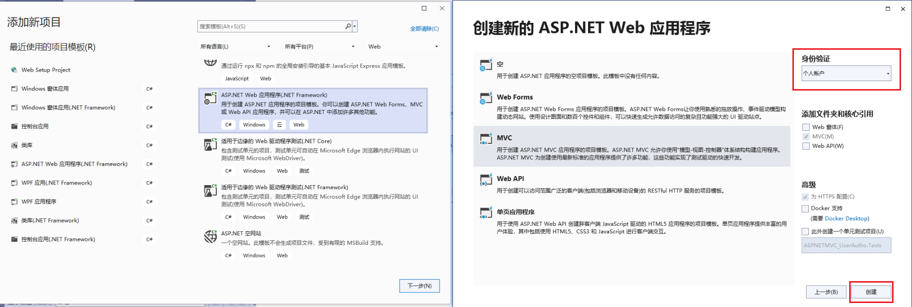
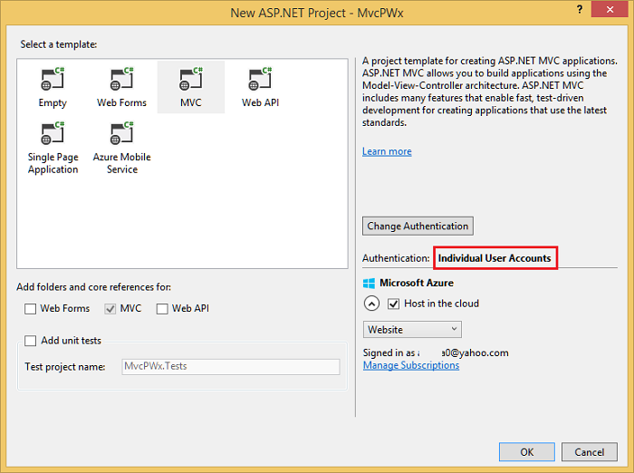
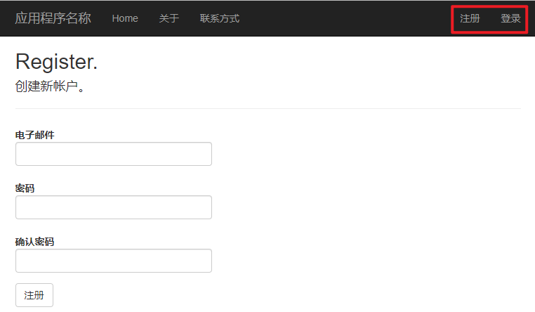
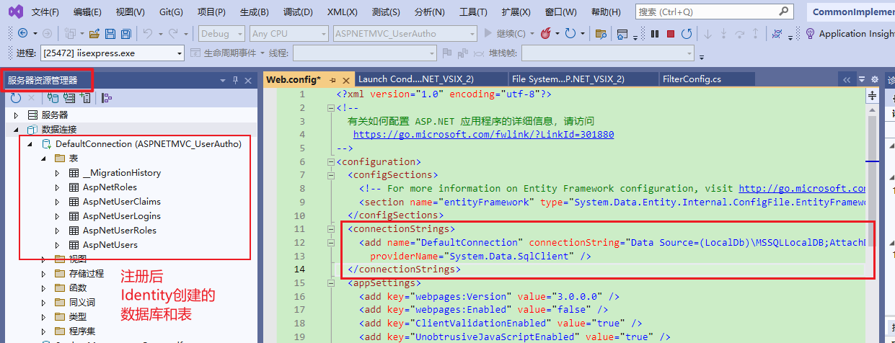
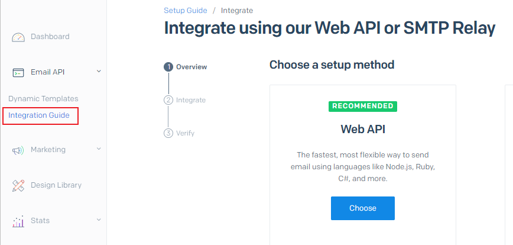
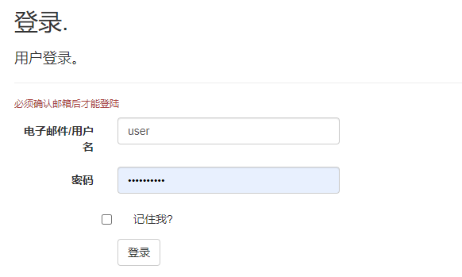
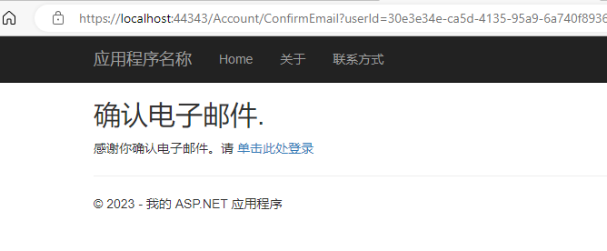

**ASP.NET MVC 5 基础实战：使用 Individual User Accounts 创建具有登陆注册、[SendGrid发送]邮箱验证、密码重置功能的网站**

[toc]


通过在创建ASP.NET MVC网站项目时指定 `Individual User Accounts` Authentication，即使用 **ASP.NET Identity membership system** 实现具有最基础的资源保护（即授权认证）功能的网站。

因此，需要实现的功能有：

- 用户的登陆
- 新用户注册
- 邮箱验证
- 密码重置


# 创建 个人账户 认证的`ASP.NET MVC`项目

创建`ASP.NET MVC`项目，名称为`ASPNETMVC_UserAutho`，authentication 选择 `Individual User Accounts`，使用Https：

  

之前的版本：

  

点击“创建”。

使用个人账户认证创建的web项目，默认已经给出了最基础的相对比较完备的用户认证和授权功能。

可以查看默认生成的`AccountController`控制器中的各种处理逻辑。

  

通过`[Authorize]`过滤器特性实现用户身份的认证，可以用于控制器或Action方法上，也可以注册为全局过滤器，为整个网站添加认证保护。

`[AllowAnonymous]`过滤器特性允许匿名访问（不需要登陆），比如 Login、Register等页面，需要任何人都可以访问。

运行网站，可以看到登陆或注册按钮：

  

点击注册，完成第一个用户的注册。并登陆。

  

# Individual User Accounts 创建的数据库

在 Visual Studio 的服务器资源管理器(`Server Explorer`)中，导航到`Data Connections\DefaultConnection\Table`可以看到创建的表。

默认站点没有任何用户数据。当第一次注册时，会在连接字符串中指定的`|DataDirectory|`（项目的`App_Data\`）路径下创建数据库、表和第一个用户数据。

> 只有注册用户后，`App_Data\`路径下才会创建默认的Identity用到的用户数据库文件。默认附加到`MSSQLLocalDB`中。

> 也可以在数据连接中新建连接，选择数据库文件，查看创建的数据库。

  

选择`AspNetUsers`，可以查看表定义和刚才注册的邮箱用户。【右键-`Open table definition`；右键-`Show Table Data`】

  

  

可以看到刚注册用户的邮箱验证为`False`。

> 表定义中的 UserName 为 `nvarchar(256)`，这个256感觉有些没必要这么大。

选择注册的用户这一行，并删除。后续会重新创建一个需要邮箱验证的用户。

> LocalDB 是 SQL Server Express 数据库引擎的轻型版本，可按需启动并在用户模式下运行。 
> 
> LocalDB 在 SQL Server Express 的特殊执行模式下运行，数据库作为 `.mdf` 文件。
> 
> **通常，`LocalDB` 数据库文件保存在 Web 项目的 `App_Data` 文件夹中**。


> **不建议在生产环境中使用`SQL Server Express`，特别是`LocalDB`。**

# 使用 SendGrid 发送邮件

此处使用 SendGrid邮件提供程序 实现邮件的发送。

> 此外，还可以使用SMTP，或其它机制发送邮件。

>  email service相对SMTP更安全和不易出错，且能提供更多的管理、邮件分析等。

## 注册 SendGrid 并添加 Sender

参考[官网](https://docs.sendgrid.com/ui/sending-email/senders)注册SendGrid，并添加个一个Sender（注册或创建Sender需要邮箱验证）

  

注册后默认提示创建 Identity 就会添加一个 Sender：

然后在集成指导中按照要求创建API Key：

  

复制创建的 API key 用于在`ASP.NET MVC`中使用。（推荐使用机密用户管理的方式存储）

## 配置使用SendGrid发送邮件

在Nuget包管理器控制台中，安装SendGrid：

```sh
Install-Package SendGrid
```

在`App_Start/IdentityConfig.cs`下找到`EmailService`，添加类似如下的代码使用 SendGrid 发送邮件（借助SendGrid提供的帮助类`MailHelper`）：

```C#
public class EmailService : IIdentityMessageService
{
    public async Task SendAsync(IdentityMessage message)
    {
        // 在此处插入电子邮件服务可发送电子邮件。
        await ConfigSendGridasync(message);
    }

    // Use NuGet to install SendGrid (Basic C# client lib) 
    private async Task ConfigSendGridasync(IdentityMessage message)
    {
        var apiKey= WebConfigurationManager.AppSettings["SendGridApiKey"];
        var client = new SendGridClient(apiKey);
        var msg = MailHelper.CreateSingleEmail(from: new EmailAddress("abc@xyz.com", "MyName"),
            to: new EmailAddress(message.Destination),
            subject: message.Subject,
            plainTextContent: message.Body,
            htmlContent: message.Body);

        // Disable click tracking.
        // See https://sendgrid.com/docs/User_Guide/Settings/tracking.html
        msg.SetClickTracking(false, false);
        var response = await client.SendEmailAsync(msg);
        var result = response.Body.ToString();
        if (response.IsSuccessStatusCode)
        {

        }
        else
        {
            var content = await response.Body.ReadAsStringAsync();
            throw new Exception($"邮件发送失败，状态码：{response.StatusCode}，返回内容：{content}");
        }
        // 记录返回信息？
    }
}
```

> from 要和创建Sender时的一致。

`Web.config`文件中`SendGridApiKey`配置项如下（使用了机密数据存储）：

```xml
  <appSettings configBuilders="Secrets">

    <add key="SendGridApiKey" value="SendGrid ApiKey in here" />
  </appSettings>
```

## Account 控制器中启用并完善邮箱验证的功能

`Register` Action 方法中已经给出了邮箱验证的代码，将此部分取消注释即可。

修改`Register`方法，在登陆之前必须进行邮箱验证。默认的注册方法，会使用户直接登陆，但大多数情况下，我们希望验证邮箱后才能登陆。

注释掉`SignInAsync`方法阻止登陆，然后添加需要验证邮箱的提示信息，返回登陆页面。

```C#
//
// POST: /Account/Register
[HttpPost]
[AllowAnonymous]
[ValidateAntiForgeryToken]
public async Task<ActionResult> Register(RegisterViewModel model, string returnUrl = null)
{
    ViewBag.ReturnUrl = returnUrl;

    if (ModelState.IsValid)
    {
        var user = new ApplicationUser { UserName = model.UserName, Email = model.Email };
        var result = await UserManager.CreateAsync(user, model.Password);
        if (result.Succeeded)
        {
            await SignInManager.SignInAsync(user, isPersistent: false, rememberBrowser: false);

            string code = await UserManager.GenerateEmailConfirmationTokenAsync(user.Id);
            var callbackUrl = Url.Action("ConfirmEmail", "Account", new { userId = user.Id, code = code }, protocol: Request.Url.Scheme);
            await UserManager.SendEmailAsync(user.Id, "用户注册确认", "请通过单击<a href=\"" + callbackUrl + "\">此处</a>来确认你的帐户");

            ViewBag.ConfirmEmailMsg = $"检查你的邮箱 {model.Email}  并确认账户, 必须在邮箱确认后才能登陆！";

            // 提示信息：验证邮箱后登陆
            return View("Login", new LoginViewModel());
        }
        AddErrors(result);
    }

    return View(model);
}
```

> `Views\Account\ConfirmEmail.cshtml`视图为邮箱确认成功后的界面。

更新 HttpPost Login Action 方法，实现没验证邮箱不允许登陆。

```C#
//
// POST: /Account/Login
[HttpPost]
[AllowAnonymous]
[ValidateAntiForgeryToken]
public async Task<ActionResult> Login(LoginViewModel model, string returnUrl)
{
    if (!ModelState.IsValid)
    {
        return View(model);
    }

    // Require the user to have a confirmed email before they can log on.
    var user = await UserManager.FindByNameAsync(model.EmailOrUserName) ?? await UserManager.FindByEmailAsync(model.EmailOrUserName);
    if (user != null)
    {
        if (!await UserManager.IsEmailConfirmedAsync(user.Id))
        {
            ViewBag.LoginErrorMsg = "必须确认邮箱后才能登陆";
            return View(model);
        }
    }

    // 这不会计入到为执行帐户锁定而统计的登录失败次数中
    // 若要在多次输入错误密码的情况下触发帐户锁定，请更改为 shouldLockout: true
    var result = await SignInManager.PasswordSignInAsync(user.UserName, model.Password, model.RememberMe, shouldLockout: false);
    switch (result)
    {
        case SignInStatus.Success:
            return RedirectToLocal(returnUrl);
        case SignInStatus.LockedOut:
            return View("Lockout");
        case SignInStatus.RequiresVerification:
            return RedirectToAction("SendCode", new { ReturnUrl = returnUrl, RememberMe = model.RememberMe });
        case SignInStatus.Failure:
        default:
            ModelState.AddModelError("", "无效的登录尝试。");
            return View(model);
    }
}
```

## 测试邮箱验证登陆功能

在 Home 控制器的 Contact 方法上添加 `[Authorize]` 特性。测试访问“联系方式”页面，会返回到登陆页面。

然后进行用户注册：

  

在未验证邮箱前，尝试登陆，提示“必须确认邮箱”：

  

登陆邮箱确认发送的邮件：

  

然后即可登陆成功！

## 无网络时发送的异常

发送邮件的方法`var response = await client.SendEmailAsync(msg);`，如果在无网络时，执行在此处会发生全局的异常。

重点，重点时这个异常无法通过简单的`Try...Catch`直接捕获，应该是`await`异步导致的。

  

当然，不应该出现网络不可用的情况。

# 密码恢复/重置

移除 Account 控制器中的 `HttpPost ForgotPassword` action 方法内的注释：

```C#
//
// POST: /Account/ForgotPassword
[HttpPost]
[AllowAnonymous]
[ValidateAntiForgeryToken]
public async Task<ActionResult> ForgotPassword(ForgotPasswordViewModel model)
{
    if (ModelState.IsValid)
    {
        var user = await UserManager.FindByEmailAsync(model.Email);
        if (user == null)
        {
            ModelState.AddModelError(nameof(model.Email), "邮箱不存在！");
            return View(model);
        }
        if ( !await UserManager.IsEmailConfirmedAsync(user.Id))
        {
            ModelState.AddModelError(nameof(model.Email), "邮箱未确认，请先登陆邮箱确认用户注册！(尝试登陆可以获得再次发送确认邮件的机会)");
            return View(model);
            //// 请不要显示该用户不存在或者未经确认
            //return View("ForgotPasswordConfirmation");
        }

        // 有关如何启用帐户确认和密码重置的详细信息，请访问 https://go.microsoft.com/fwlink/?LinkID=320771
        // 发送包含此链接的电子邮件
        string code = await UserManager.GeneratePasswordResetTokenAsync(user.Id);
        var callbackUrl = Url.Action("ResetPassword", "Account", new { userId = user.Id, code = code }, protocol: Request.Url.Scheme);
        await UserManager.SendEmailAsync(user.Id, "重置密码", "请通过单击<a href=\"" + callbackUrl + "\">此处</a>来重置你的密码");
        ModelState.AddModelError("", "邮件已发送，请查看你的电子邮件以重置密码！");
        return View(model);
    }

    // 如果我们进行到这一步时某个地方出错，则重新显示表单
    return View(model);
}
```

`Views\Account\Login.cshtml` 中移除关于 `ForgotPassword` 忘记密码相关部分的代码注释：

```CSHTML
    @* 在为密码重置功能启用了帐户确认后，启用此项 *@
    <p>
        @Html.ActionLink("忘记了密码?", "ForgotPassword")
    </p>
```

在登陆页面测试“忘记密码”的功能。

# 密码重置功能扩展-倒计时60秒后重发

目前重置密码发送邮件后结果如下，如果再次点击“电子邮件链接”按钮，仍然会立即发送邮件。如何实现重置邮件至少倒计时60秒后才能重发的功能呢？显示频繁发送。

  

要实现需要解决两部分问题：

- 一是后端的计时，保存发送时间，如果再次出现重置请求，需要验证当前邮箱上次的发送时间是否超时，超过时间才能再次重置发送。【需要在用户表添加时间记录的字段】

- 二是前端的计时，显示倒计时，倒计时过后才允许点击发送。


> 另一个需要倒计时发送的地方是，注册后的邮箱确认。

# 参考或推荐

主要参考自官网的 [Create a secure ASP.NET MVC 5 web app with log in, email confirmation and password reset (C#)](https://learn.microsoft.com/en-us/aspnet/mvc/overview/security/create-an-aspnet-mvc-5-web-app-with-email-confirmation-and-password-reset)

推荐 [Account confirmation and password recovery in ASP.NET Core](https://learn.microsoft.com/en-us/aspnet/core/security/authentication/accconfirm?view=aspnetcore-7.0&tabs=visual-studio#configure-email-provider) 对于 ASP.NET Core 邮箱确认的介绍，可以修改验证邮件的有效期、账户不激活的有效期、data protection token的生命周期等更有用的功能。