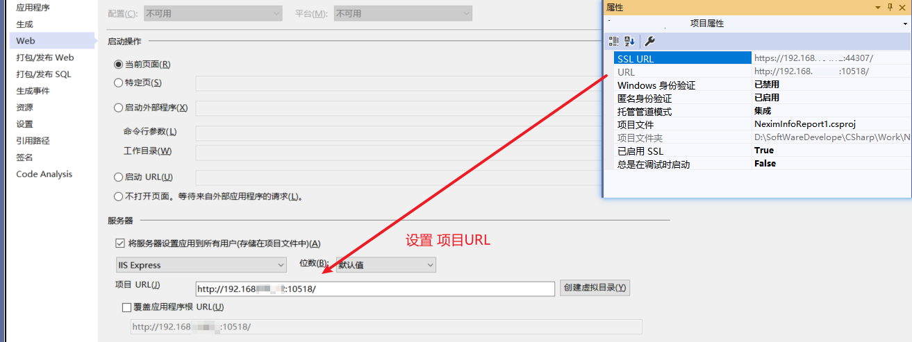
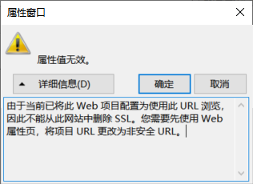
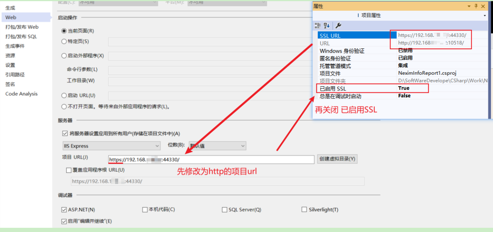

**ASP.NET MVC/WebAPI 调试禁用https，默认打开http**

[toc]

# 设置默认打开http



# VS中关闭SSL

右键项目属性-Web中，修改项目 URL，并保存。

> 否则报错：
> 

单击项目，F4 或 属性页面，修改 已启用 SSL 为 False：




# RequireHttps 过滤器强制使用https

添加全局过滤，强制https 【`Global.asax`文件的 Application_Start 中】：

```C#
GlobalFilters.Filters.Add(new RequireHttpsAttribute());
```

用在 Action ：

```C# 
[RequireHttps]
public ActionResult Index()
{
    return View();
}
```

# 参考

- [Asp.Net MVC Https设置](https://www.cnblogs.com/yscit/p/10404926.html) 好文，介绍了IIS创建和设置服务器证书，及其它一些错误处理

- [vs创建项目以后修改https为http](https://www.cnblogs.com/fangxinliu/p/13535917.html)