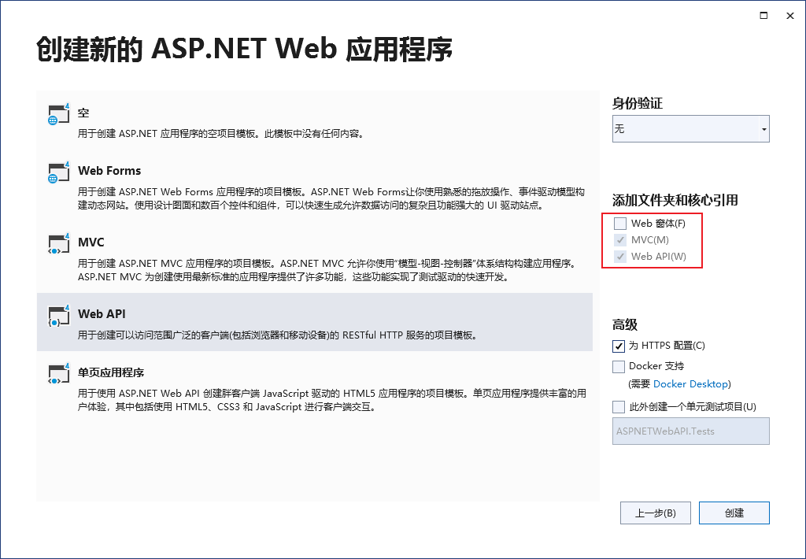
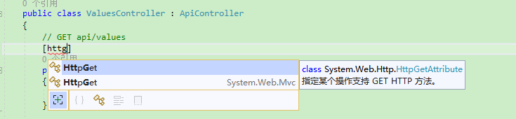

**ASP.NET Web API项目介绍、模型验证、基础的配置和增删改查**

[toc]

# 简单介绍



Web API项目包含Web API和MVC两个架构内容。

API的控制器继承自`ApiController`：

```C#
public class ValuesController : ApiController
{
    // GET api/values
    public IEnumerable<string> Get()
    {
        return new string[] { "value1", "value2" };
    }
}
```

MVC的控制器为`Controller`：

```C#
public class HomeController : Controller
{
    public ActionResult Index()
    {
        ViewBag.Title = "Home Page";

        return View();
    }
}
```

App_Start目录下，`WebApiConfig.cs`文件为 WebApi 的配置信息：

```C#
public static class WebApiConfig
{
    public static void Register(HttpConfiguration config)
    {
        // Web API 配置和服务

        // Web API 路由
        config.MapHttpAttributeRoutes();

        config.Routes.MapHttpRoute(
            name: "DefaultApi",
            routeTemplate: "api/{controller}/{id}",
            defaults: new { id = RouteParameter.Optional }
        );
    }
}
```

可以对比它与`RouteConfig.cs`文件中MVC的路由配置：

```C#
public class RouteConfig
{
    public static void RegisterRoutes(RouteCollection routes)
    {
        routes.IgnoreRoute("{resource}.axd/{*pathInfo}");

        routes.MapRoute(
            name: "Default",
            url: "{controller}/{action}/{id}",
            defaults: new { controller = "Home", action = "Index", id = UrlParameter.Optional }
        );
    }
}
```

在 Web Api 的 ValuesController 中，通过Action的名字就可以区分不同的http方法 `Get`、`Post`、`Put`、`Delete`。

# Web API 中指定 Action 的 Http方法

通过添加特性`[HttpGet]`、`[HttpPost]`等可以使某个Action支持 HttpMethod

如下，添加 Test Action，注意添加 `System.Web.Http` 下的 `HttpGet` 特性：



此时，会与默认的 Get 产生路由冲突，访问`/api/values`：

`找到了与该请求匹配的多个操作: 类型 ASPNETWebAPI.Controllers.ValuesController 的 Test 类型 ASPNETWebAPI.Controllers.ValuesController 的 Get`

因此，需要为不同的Action指定不同的路由，否则会有冲突。

# 指定 Web Api 控制器中 Action 的路由。

`[Route]` 特定用于设置路由模板，注意其路由是基于站点根目录还是相对于上一级的`[Route]`模板路径的。

比如 在默认的Values控制器下新增的Test Action添加的 `[Route("Test")]` 对应的实际路径为 `/Test`。

但是，**如果Values控制器下的Test Action方法上指定Get请求的`[Route("api/[controller]/[action]")]`路由，就会与已有的Get方法发生覆盖**。如果已有的`/api/[controller]/{id}`覆盖了指定的路由，则当访问`/api/values/test`是，其中的`test`会被解析为`{id}`处理，而不是`api/[controller]/[action]`中的Action，这点要注意。所以，需要更加清晰的指定路由，防止覆盖或多个匹配。


```C#

```


# 关于返回xml格式

**WebAPI是根据请求头信息（Accept Header）来查找已经格式化注册的响应头信息（Content-Type）来确定它应该返回的输出类型json、xml。**

**浏览器访问基本都是xml，所以通过浏览器访问Web Api时，返回都是xml格式的数据**。

如果只需要json的话可以通过Global.asax设置：

```C#
protected void Application_Start(object sender, EventArgs e)
{
    //默认JSON
    GlobalConfiguration.Configuration.Formatters.XmlFormatter.SupportedMediaTypes.Clear();
}
```

# 关于Model验证的问题【重要】

## ModelState.IsValid 模型验证

在ASP.NET Web API中，与 MVC 一样，在模型验证失败时，都不会自动向客户端返回错误。而是由控制器的Action决定检查模型状态并做出响应。

> ASP.NET Core 中，通过在控制器上添加`[ApiController]`特性提供Web API的支持，可以自动对模型验证错误进行返回，而不是进入Action内检查决定。

比如下面的的模型：

```C#
    public class Product
    {
        public int Id { get; set; }
        [Required]
        public string Name { get; set; }
        [Required]
        public decimal? Price { get; set; }
        [Range(0, 999)]
        public double Weight { get; set; }
    }
```

> **为了验证必须给Price指定值，需要修改类型为`decimal?`，否则在传递参数时，如果未指定Price这一样，将会使用默认的0，这一点需要根据实际的需求自定决定。**
>
> 对于string类型，还可以指定 `[Required(AllowEmptyStrings =false)]` 不允许空字符串。
> 
> 在 ASP.NET Core 中，通过`[BindRequired]`特性避免参数缺失的问题。
>
> 参数缺失或未指定，称为`Under-Posting`(发布不足)；对应的是`Over-Posting`(过度发布)，指定的上传时发送过多的参数，过多的参数在模板绑定时会被忽略。

在Action方法内，通过 `ModelState.IsValid` 属性，获取模型状态是否验证有效：

```C#
    public class ProductsController : ApiController
    {
        public HttpResponseMessage Post(Product product)
        {
            if (ModelState.IsValid)
            {
                // Do something with the product (not shown).

                return new HttpResponseMessage(HttpStatusCode.OK);
            }
            else
            {
                return Request.CreateErrorResponse(HttpStatusCode.BadRequest, ModelState);
            }
        }
    }
```

或者 提取出错误消息：

```C#
[HttpPost]
public async Task<ActionResult> Init(InitCfgModel initCfg)
{
    if (!ModelState.IsValid)
    {
        return new JsonNetResult(new APIModel() { 
                Status = 400, 
                Message= string.Join(";", ModelState.Values.Where(v=>v.Errors.Count>0).SelectMany(v=>v.Errors.Select(e=>e.ErrorMessage))) 
            });
        //return BadRequest ModelState;
    }
    // 其他处理

}
```

## 添加全局模型验证处理（自动返回错误消息，不进入Action）-全局过滤器

```C#
using System.Net;
using System.Net.Http;
using System.Web.Http.Controllers;

namespace System.Web.Http.Filters
{
    public class ValidateModelAttribute : ActionFilterAttribute
    {
        public override void OnActionExecuting(HttpActionContext actionContext)
        {
            if (actionContext.ModelState.IsValid == false)
            {
                actionContext.Response = actionContext.Request.CreateErrorResponse(
                    HttpStatusCode.BadRequest, actionContext.ModelState);
            }
            // 也可以修改为定义的返回类型 { statsu:400,message:"xxx" }
        }
    }
}
```

在 WebApiConfig 中添加全局过滤器：

```C#
    public static class WebApiConfig
    {
        public static void Register(HttpConfiguration config)
        {
            // Web API 全局过滤器
            config.Filters.Add(new ValidateModelAttribute());

            // ...
        }
    }
```

也可以将其放到Action或Controller上。


# 参考

- [Asp.Net WebApi学习教程之增删改查](https://www.cnblogs.com/webapi/p/10441899.html)
- [Model Validation in ASP.NET Web API](https://learn.microsoft.com/en-us/aspnet/web-api/overview/formats-and-model-binding/model-validation-in-aspnet-web-api)