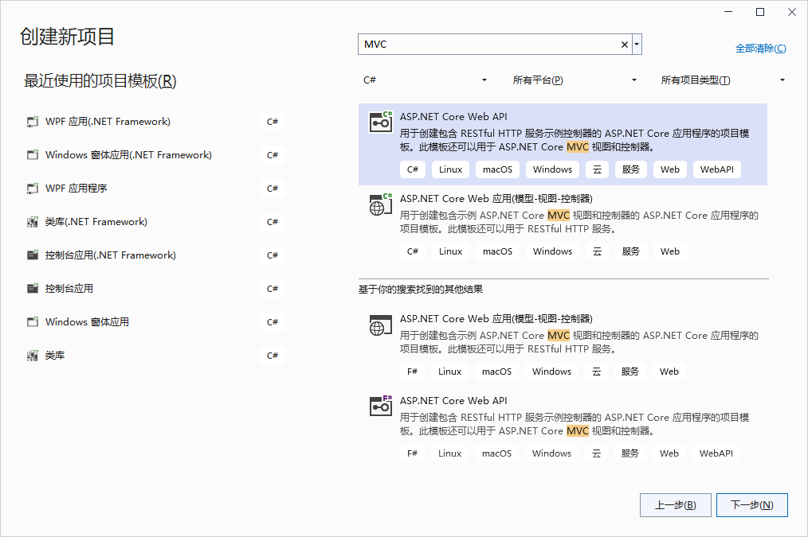
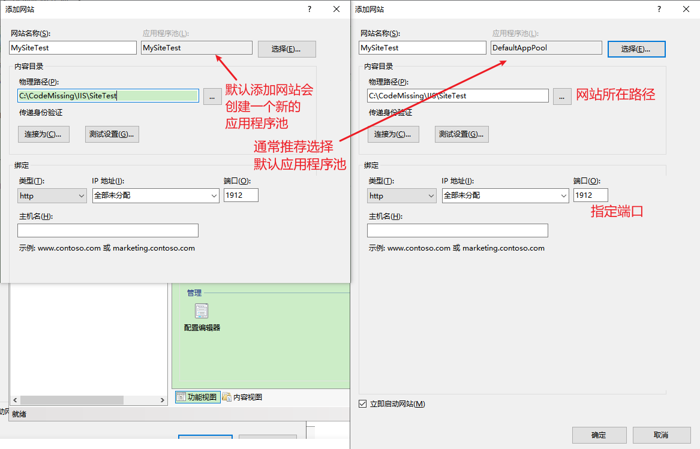

**ASP.NET项目的发布部署一：发布到IIS服务器以及基础介绍(Visual Studio 2022创建ASP.NET项目)**

[toc]

# VS2022 创建 `ASP.NET` Web 项目

## 安装 Web 开发 中的 .NET Framework 项目和项模板

VS 2022 默认安装的 web 项目只支持 `ASP.NET Core`，也就是没有 支持 .NET Framework 的模板项目，如下所示：

  

要创建 `ASP.NET` 项目，需要在 VS2022 顶部菜单的 工具->获取工具和功能（**不建议，而是应该直接从开始菜单中，找到`Visual Studio Installer`程序并运行**） ，即 Visual Studio Installer 中，添加 早期版本的项目模板。

  

在 安装的组件 中，勾选的 “ASP.NET 和 Web 开发” 下，勾选`.NET Framework 项目和项模板`和`其他项目模板(早期版本)`

  

点击底部的 “修改”，等待下载安装完成。

## 创建 `ASP.NET`(.NET Framework) 项目

> 此处创建名为 `ASPNETWebInstall` 的 MVC 项目。后续改为`ASPNETWebMVCBasic`。

安装完成后，在 创建新项目 中就可以选择 ASP.NET Web 应用程序

  

配置项目名称、位置、框架版本，点击创建：

  

选择 MVC 并创建（也可以选择“空”->右侧核心引用选择“MVC”）

  

# 发布到IIS

如果开发修改了项目内容，需要右键项目重新生成。

启动项目，可以测试能否正常启动，并访问web内容。

以管理员模式运行Visual Studio，**只有在本地计算机上发布到 IIS 时，才需要管理员身份运行**。

> **管理员身份运行的 Visual Studio 标题栏右侧可以看到`管路员`字样。**
> 
>   

## 创建IIS站点 或 使用默认站点

> **若使用默认站点(`Default Web Site`)，则可以跳过此步，不需要额外添加网站。** 使用已有网站，则会部署为站点下子路径对应的子站点。

打开 IIS管理器，在左侧的“网站”目录上 右键，选择“添加网站”。

  

根据需要填写 站点名称、选择应用程序池、网站路径、端口等：

  

## 创建发布配置文件

在Visual Studio中的项目上右击，选择->发布：

  

在“发布”页，选择“添加发布配置文件”，然后会显示 “选择发布目标”对话框（通常会默认打开，如果存在`发布配置文件`则不会打开）。

在发布向导中，目标选择 IIS：

  

特定目标（发布方法）选择 web部署：

  

下一步设置 IIS连接，

- 在 **服务器** 中输入 localhost 或 目标服务器的ip

- 站点名称，如果使用`Default Web Site`，则是将项目部署为默认站点下子路径对应的网站，比如 `Default Web Site/ASPNETWebInstall`，对应的 目标URL 则是 `http://localhost/ASPNETWebInstall`

  

我们此处站点名称使用刚才创建的`MySiteTest`，对应的 目标URL 为 IIS所在ip或域名及设置的端口。

  

- 然后设置连接到IIS所在服务器的用户名和密码，可以先验证连接是否正常。

然后点击完成，等待发布配置文件创建成功。

  

此时回到“发布”页就能看到创建的配置文件，原则上直接点击右侧的“发布”，就能将网站发布到站点目录中。

  

通过URL访问成功：

  

> 创建的发布配置文件，默认生成在 `Properties\PublishProfiles\` 路径下。
> 
> `IISProfile.pubxml` 和 `IISProfile.pubxml.user`

# 关于发布配置

点击“显示所有设置”，可以修改其他发布设置。

比如，启用预编译。

  

预编译是一种主要用于大型站点的选项。它可以减少发布网站后首次请求页面的启动时间。

更多介绍参见参考文章

# 关于 发布到文件夹

关于将 `ASP.NET` 项目发布到文件夹，设置和此处的操作没有任何本质的区别，指定发布的文件夹，发布后，在 IIS管理器 中配置添加网站，指向正确路径即可。

# 关于 为IIS注册 v4.0 版本的 .NET CLR

默认高版本的IIS中，应用程序池的 .NET CLR 版本一般为 v4.0，如下：

  

如果没有 v4.0 版本的 .NET，需要进入 `C:\Windows\Microsoft.NET\Framework64\v4.0.30319` 目录。

在命令行中执行 `aspnet_regiis.exe –i`（cmd中应该可以直接输入`aspnet_regiis –i`）

> 或者，使用路径 `%windir%\Microsoft.NET\Framework64\v4.0.30319`。比如，命令行中直接 `cd %windir%\Microsoft.NET\Framework64\v4.0.30319`。

# 附：IIS默认路径`C:\inetpub\wwwroot\`

# 附：关于禁用目录浏览 和 默认文档

如不需要浏览目录，可以在网站设置中，直接禁用“目录浏览”。

  

如果访问报错`Web 服务器被配置为不列出此目录的内容`，可以参考设置 IIS默认文档 添加正确的默认文档名。

一般默认的文档列表为：`Default.htm、Default.asp、index.htm、index.html、iisstart.htm、default.aspx` 。

比如要挂 PHP 网站，默认文档需要添加`index.php`。

# 附：禁用调试信息

修改`Web.config`，将下面的内容修改

```xml
<system.web>
  <compilation debug="true" targetFramework="4.0" />
</system.web>
```

修改为：

```xml
<system.web>
  <compilation debug="false" targetFramework="4.0" />
</system.web>
```

关闭远程访问时的调试信息。

# 附：提示缺少Nuget包：Microsoft.CodeDom.Providers.DotNetCompilerPlatform.2.0.1

在测试过程中，点击“发布”，提示缺少Nuget包，发布失败。

  

缺少包的问题，不仅仅是发布失败，在重新生成项目和启动项目实力时，都会报此错误。虽然最开始测试启动成功，中间也没有操作过其他内容，但是却发生了这个错误。

但是，查看安装的 Nuget 包 和 包目录，都是已经安装且存在的：

  

尝试清理重新生成项目和解决方案、重启，都无法解决。

后面想到， 唯一导致产生问题的操作是，移动过项目文件夹。如果如果仔细看报错提示的路径是 `..\packages` 目录下，但实际目录应该为 `..\..\packages`。

打开项目文件`.csproj`，找到指定包路径的设置 `..\packages`：

  

可以看到，包括报错包在内，很多包路径不正确。

修改路径正确后，重新生成项目成功！

发布到IIS也成功。

# 附：应用程序池报错 对 Temporary ASP.NET Files 没有写访问权限

> 此部分参考自 [ASP.NET如何把ASPX网站部署到IIS上](https://blog.csdn.net/QYUANC/article/details/116946756)

如下所示：

  

解决办法是，找到提示的 `Temporary ASP.NET Files` 所在的 Framework 版本路径，并创建`Temporary ASP.NET Files` 文件夹，右键文件夹，在安全中，设置该文件夹的访问权限为 everyone（或者`IIS_IUSRS`用户）

# 参考

[使用 Visual Studio ASP.NET Web 部署：部署到测试](https://learn.microsoft.com/zh-cn/aspnet/web-forms/overview/deployment/visual-studio-web-deployment/deploying-to-iis)