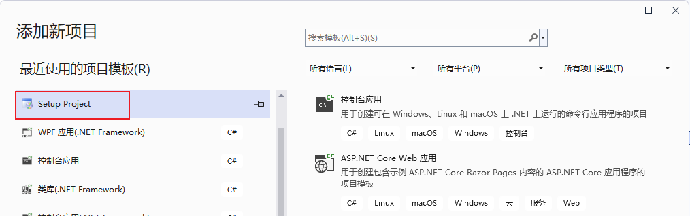
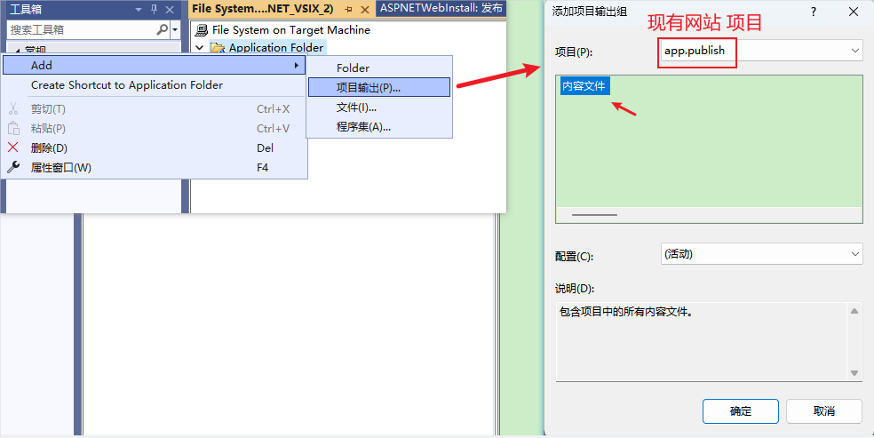
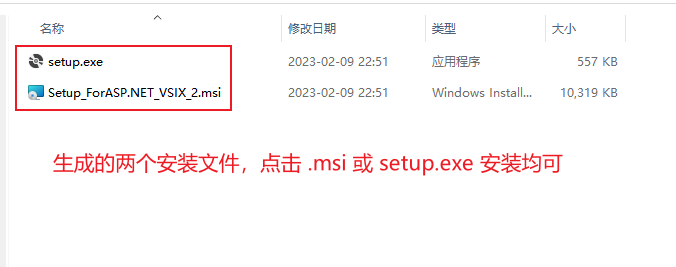
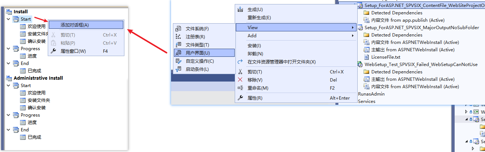
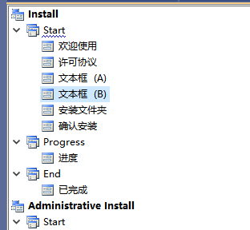
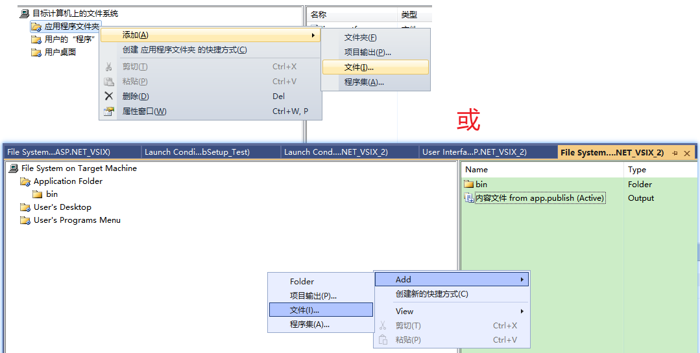
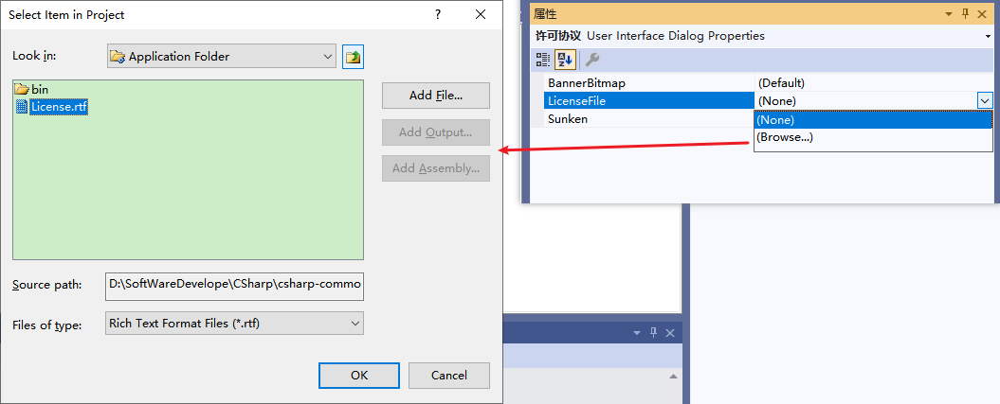
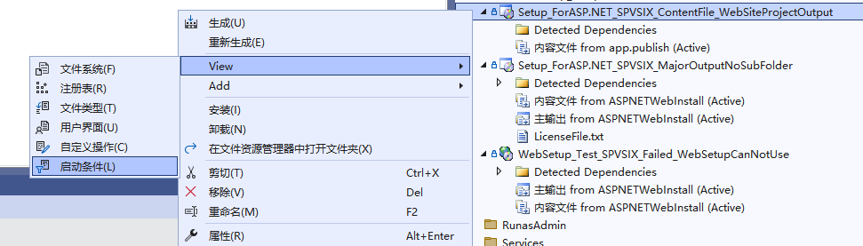
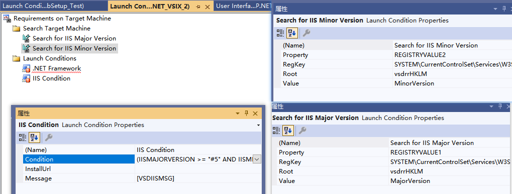
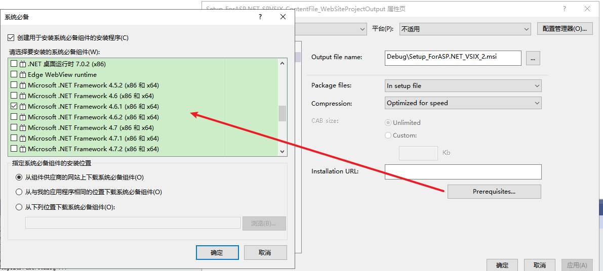

**ASP.NET项目的发布部署三：C#操作IIS、修改文件权限，实现编程部署，Setup Project自定义安装包**

[toc]

# 添加 现有网站 为VS项目【打开一个已发布的网站】

- 发布 ASP.NET MVC 网站到文件夹。

  

- 解决方案下，添加现有网站。

  

- 根据需要选择 文件系统、本地 IIS、FTP 站点。

此处选择上面发布到文件夹的网站，即“文件系统”：

  

点击打开。

网站项目（文件夹）就出现在解决方案资源管理器中。

  

# Setup Project 制作安装包测试

> 后续项目名改为了`Setup_ForASP.NET_SPVSIX_ContentFile_WebSiteProjectOutput`。用于ASP.NET的Setup Project扩展插件项目，引入网站项目输出的内容文件。

- 新建项目->选择“Setup Project”，命名为`Setup_ForASP.NET_VSIX_2`：

  

- 右键查看文件系统。在 Application Folder 下，右键->Add->项目输出。在“项目输出组”中，选在添加的 “现有网站” 项目 `app.publish`：

  

**选择的项目是一个web网站，所以只有一个内容文件输出选项，选中内容文件点击确定。**

- 生成安装包，测试安装效果。

右键安装项目，点击“生成”或“重新生成”，生成安装包`Setup_ForASP.NET_VSIX_2.msi`。

点击安装，成功后，在安装的目录下查看所有文件及文件夹都成功复制了进来（**尤其是`\bin`目录下的子文件夹**），并且测试Web运行访问正常。

  

# 自定义 Setup Project 安装包实现部署到IIS

## 自定义安装界面

右键安装项目，视图->用户界面，然后右键“启动”，选择添加对话框：

  

在添加对话框中，依次选择添加许可协议、文本框（A）、文本框（B），并拖动对话框进行排序：

  

## 添加许可协议

首先在项目目录(或其他目录)下，创建一个License文件，通常为`.rtf`，`.txt`等其他格式也可。

右键安装项目，点击视图=>文件系统，在文件系统中选择“应用程序文件夹”，右击 “应用程序文件夹” 或 右边空白处，点击添加=>文件，添加自己创建的`License.rtf`文件，如图：

  

然后在“用户界面”下，右键“许可协议”->“属性”，`LicenseFile`下拉浏览选择刚添加的`License.rtf`文件：

  

1. 检查是否安装了IIS？
   
2. 如何检查 IIS 是否安装了 `ASP.NET` ？

# 关于：已经安装了该产品的另一个版本，无法继续安装此版本。

  

应该可以通过设置，实现覆盖安装，允许程序安装后再次运行安装包。暂未处理。

# 安装项目 的 启动条件【非必须】

右键项目，View->启动条件，打开启动条件界面。

  

右击“目标计算机上的要求”，选择“添加IIS启动条件”，会生成默认的`Condition1`，以及上面两个查找注册表项的设置。

  

`Condition1`的属性中，将其名称改为`IIS Condition`，Condition内容为 `(IISMAJORVERSION >= "#5" AND IISMINORVERSION >= "#1") OR IISMAJORVERSION >= "#6" OR (IISMAJORVERSION > "#1" AND IISMAJORVERSION < "#2")`，可以根据需要修改。

查找项改为`Search for IIS Major Version`和`Search for IIS Minor Version`：

  

也可以修改默认的`.NET Framework`条件：

  

> 右键安装项目，属性，查看和修改“系统必备”的组件：
> 
>   

# 附：关于 IIS 的离线安装包【默认系统集成的IIS，本身无需联网即可安装】

IIS作为Windows系统级的服务功能，默认不需要提供安装源或安装包，即可安装启用。【非默认版本需要升级实现】。

因此无需考虑是否联网、是否有网卡，默认均可以安装IIS。

Windows家庭版等没有提供IIS功能，无法安装。

对于IIS的安装包，提供有Express版本的安装包：[Internet Information Services (IIS) 10.0 Express](https://www.microsoft.com/zh-CN/download/details.aspx?id=48264)

# 附：关于通过 UI 或 命令行 安装IIS

[Configuring Step 1: Install IIS and ASP.NET Modules](https://learn.microsoft.com/en-us/iis/application-frameworks/scenario-build-an-aspnet-website-on-iis/configuring-step-1-install-iis-and-asp-net-modules)
