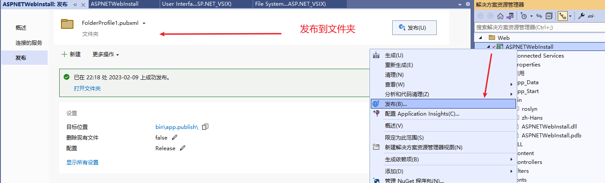
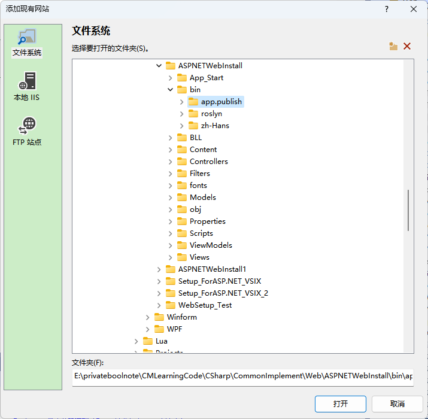
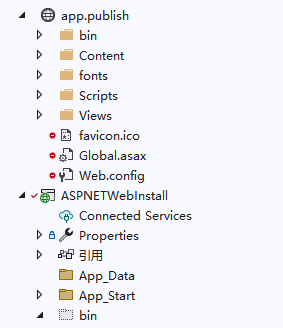

**ASP.NET项目的发布部署三：C#操作IIS、修改文件权限，实现编程部署，Setup Project自定义安装包**

[toc]

# 添加 现有网站 作为VS项目

- 发布 ASP.NET MVC 网站到文件夹。

  

- 解决方案下，添加现有网站。

  

- 根据需要选择 文件系统、本地 IIS、FTP 站点。

此处选择上面发布到文件夹的网站，即“文件系统”：

  

点击打开。

网站项目（文件夹）就出现在解决方案资源管理器中。

  

# Setup Project 制作安装包测试

- 新建项目->选择“Setup Project”，命名为`Setup_ForASP.NET_VSIX_2`：

  

- 右键查看文件系统。在 Application Folder 下，右键->Add->项目输出。在“项目输出组”中，选在添加的 “现有网站” 项目 `app.publish`：

  

**选择的项目是一个web网站，所以只有一个内容文件输出选项，选中内容文件点击确定。**

- 生成安装包，测试安装效果。

右键安装项目，点击“生成”或“重新生成”，生成安装包`Setup_ForASP.NET_VSIX_2.msi`。

点击安装，成功后，在安装的目录下查看所有文件及文件夹都成功复制了进来（**尤其是`\bin`目录下的子文件夹**），并且测试Web运行访问正常。

  

# 自定义安装包实现部署到IIS

1. 检查是否安装了IIS？
   
2. 如何检查 IIS 是否安装了 `ASP.NET` ？

# 关于：已经安装了该产品的另一个版本，无法继续安装此版本。

  

应该可以通过设置，实现覆盖安装，允许程序安装后再次运行安装包。暂未处理。
