**ASP.NET项目的发布部署二：使用VS Installer Projects创建安装包一键安装配置ASP.NET网站到IIS**

[toc]

# 安装 Microsoft Visual Studio Installer Projects 2022

[Microsoft Visual Studio Installer Projects 2022](https://marketplace.visualstudio.com/items?itemName=VisualStudioClient.MicrosoftVisualStudio2022InstallerProjects) 是专用于 VS2022 的扩展，用于制作安装项目。

> 其他 VS 版本的 `Visual Studio Installer Projects`，可以从[此处](https://marketplace.visualstudio.com/items?itemName=visualstudioclient.MicrosoftVisualStudio2017InstallerProjects)下载。

如果没有安装，需要下载并安装。

  

安装时需要关闭VS2022，否则会提示等待安装。

  

> 也可以从 VS 的 扩展 -> 管理扩展 -> Visual Studio Marketplace 中搜索查找，并安装。
> 
> 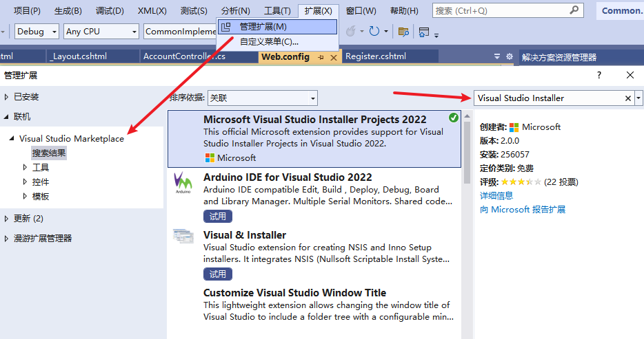  

# Web安装项目

## 创建Web安装项目

在 解决方案资源管理器 中，右键添加新项目，选择“Web安装项目”，如下，可以看到安装VSIX Installer插件后，新增的项目模板`Setup Project`、`Web Setup Project`、`Setup Wizrd`、`Merge Module Project`、`CAB Project`等。

  

下一步，设置项目名称、位置，点击创建：

  

## 项目输出

右键 刚刚创建的Web安装项目，选择“添加”->“项目输出”。

选择要安装的 `ASP.NET` 项目`ASPNETWebInstall`，选择“主输出”、配置为“Release”，点击确定：

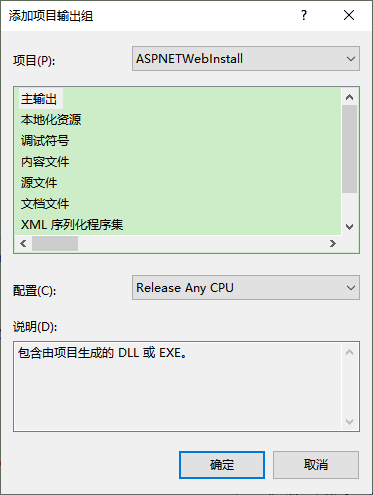  

右击项目，点击“属性”：

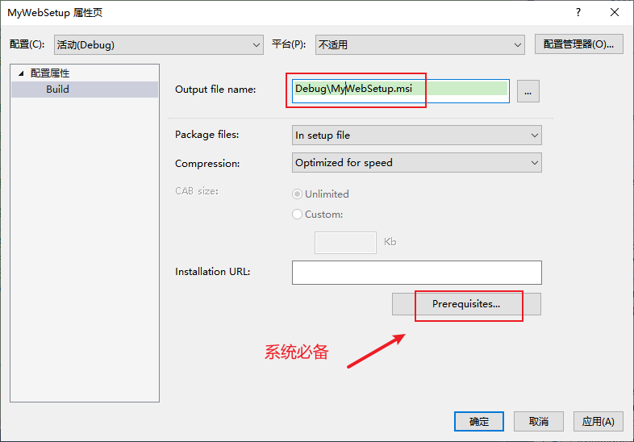  

根据需要修改输出文件名、点击系统必备，选择需要安装的.NET组件：

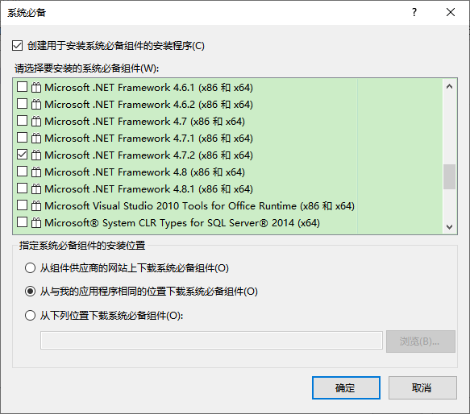  

右键项目，“查看”->“启动条件”。可以查看 IIS条件 的 属性（右键-属性）。

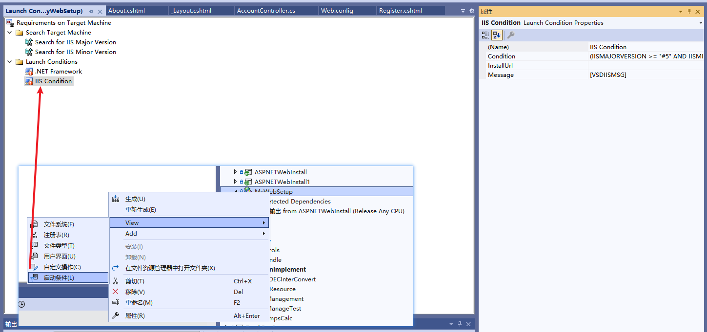  

.NET Framework 的属性，修改下版本：

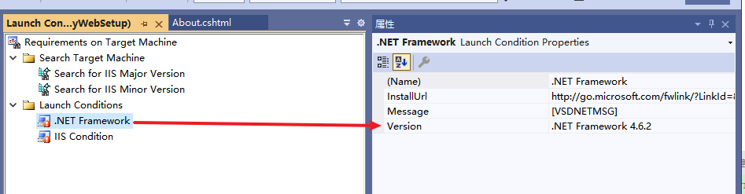  

## 安装界面

右键项目，“查看”->“用户界面”

在用户界面中可以看到安装过程中要显示的界面。

在启动中，右键添加对话框，可以根据需要添加界面，比如许可协议、组件选择等。

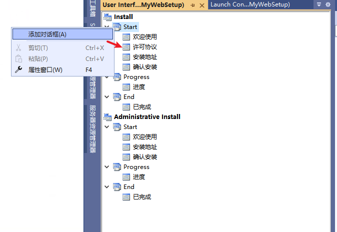  

比如许可协议，在属性中指定License文件。

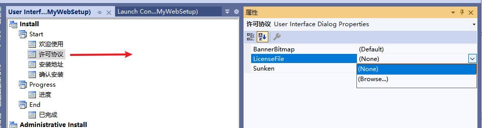  

## 生成安装包

右键安装项目，选择“生成”或“重新生成”。

生成后可以看到安装包和依赖组件：

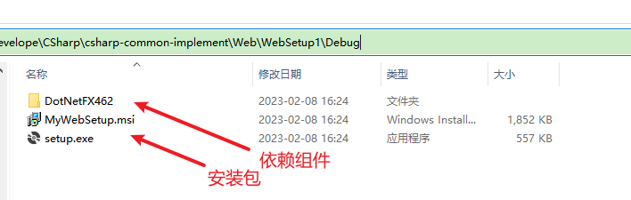  

## 构建安装包报错

### .NET Framework 依赖问题

Building file 'xxxx\MyWebSetup.msi'...

ERROR: 要在“系统必备”对话框中启用“从与我的应用程序相同的位置下载系统必备组件”，必须将“Microsoft .NET Framework 4.6.2 (x86 和 x64)”项的文件“DotNetFX462\NDP462-KB3151800-x86-x64-AllOS-ENU.exe”下载到本地计算机。有关详细信息，请参见 http://go.microsoft.com/fwlink/?LinkId=616018。

ERROR: 要在“系统必备”对话框中启用“从与我的应用程序相同的位置下载系统必备组件”，必须将“Microsoft .NET Framework 4.6.2 (x86 和 x64)”项的文件“DotNetFX462\NDP462-KB3151800-x86-x64-AllOS-CHS.exe”下载到本地计算机。有关详细信息，请参见 http://go.microsoft.com/fwlink/?LinkId=616018。

根据提示，下载对应的文件，一个 .NetFX462 的运行时包，一个 .NetFX462 的语言包。

### .NET Framework 组件下载方式

#### 直接从官网SDK下载

**.NET SDK 的下载地址：https://dotnet.microsoft.com/zh-cn/download ，查找对应的运行时包。**

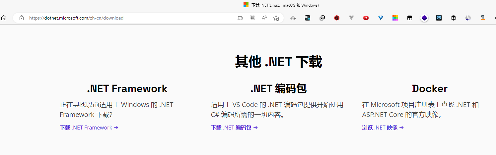  

找到 .NET Framework 的下载地址：https://dotnet.microsoft.com/zh-cn/download/dotnet-framework

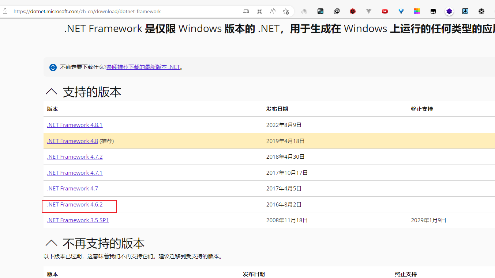  

找到 .NET Framework 4.6.2 ：https://dotnet.microsoft.com/zh-cn/download/dotnet-framework/net462

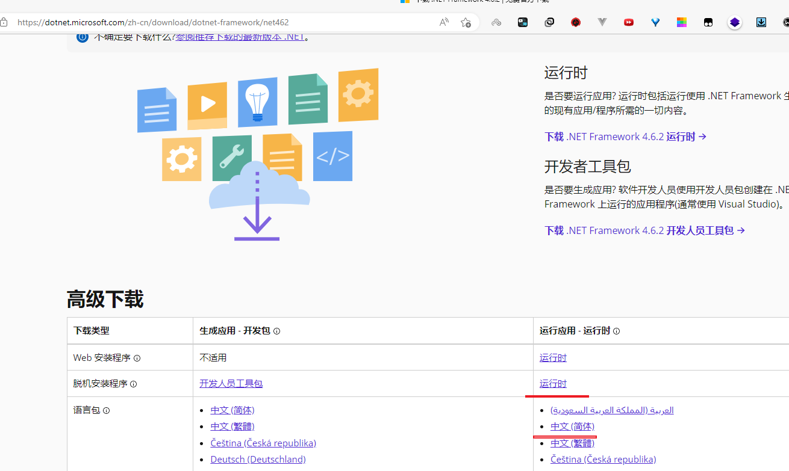  

下载脱机安装的 运行时包 `ndp462-kb3151800-x86-x64-allos-enu.exe` 和 语言包 `ndp462-kb3151800-x86-x64-allos-chs.exe`。

> 运行时包也可以直接从 [The .NET Framework 4.6.2 offline installer for Windows](https://support.microsoft.com/en-us/topic/the-net-framework-4-6-2-offline-installer-for-windows-9dce3874-a9e5-9b11-289d-5594824aafe0) 此处下载，但是单独找 语言包 就比较难找。

#### 依照错误提示链接指出的 Package.xml 下载

以上报错提示给出参考链接：[How to: Include Prerequisites with a ClickOnce Application](http://go.microsoft.com/fwlink/?LinkId=616018) 在安装程序时包含依赖，可以从 本地Microsoft SDK 中的 Package.xml 文件中找到对应版本的下载链接。

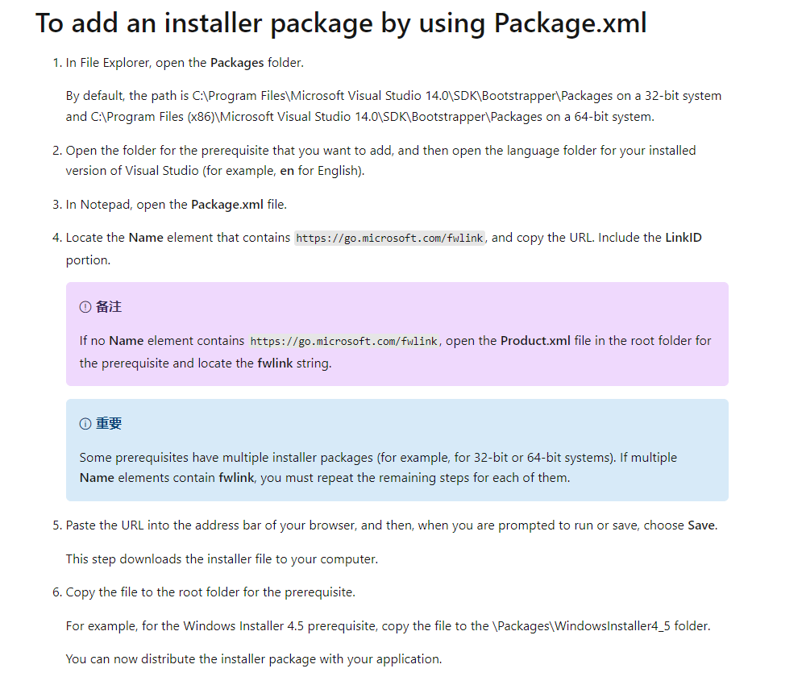  

不过现在 Microsoft SDK 的 Package.xml 路径为 `C:\Program Files (x86)\Microsoft SDKs\ClickOnce Bootstrapper\Packages` 或者 `C:\Program Files (x86)\Microsoft SDKs\ClickOnce Bootstrapper\Packages`。

找到依赖组件的文件夹，如`DotNetFX462\`，里面包含不同语言版本 `en`、`zh-Hans` 等目录，点击进去，打开其中的 `Package.xml` 文件。

找到包含`go.microsoft.com/fwlink`链接的name元素，复制链接及之后的LinkID，如：`http://go.microsoft.com/fwlink/?LinkId=780603` 

将其URL复制到浏览器，然后保存下载文件。

> 但是，只从此处，找到了 离线的 语言包 的下载地址，运行时包，并未找到。

### 将依赖组件放到`Packages\`下的子文件夹及语言文件夹中

还是上面提到的 Microsoft SDK 中依赖组件路径（运行时包） 和 Package.xml 文件所在路径（语言包）。

即，错误提示中的 `DotNetFX462\`，运行时包放在该路径，语言包放在该路径下的`zh-Hans`文件夹下：

`C:\Program Files (x86)\Microsoft SDKs\ClickOnce Bootstrapper\Packages\DotNetFX462\` 和 `C:\Program Files (x86)\Microsoft SDKs\ClickOnce Bootstrapper\Packages\DotNetFX462\zh-Hans\`。

然后，再次重新生成。即可正确打包，**生成安装包**。

## 安装包的安装测试

