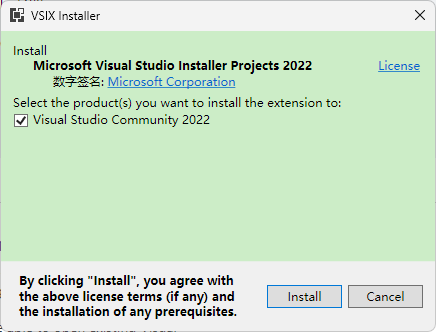
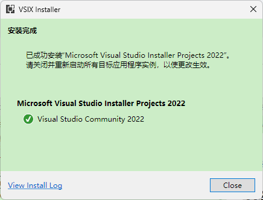
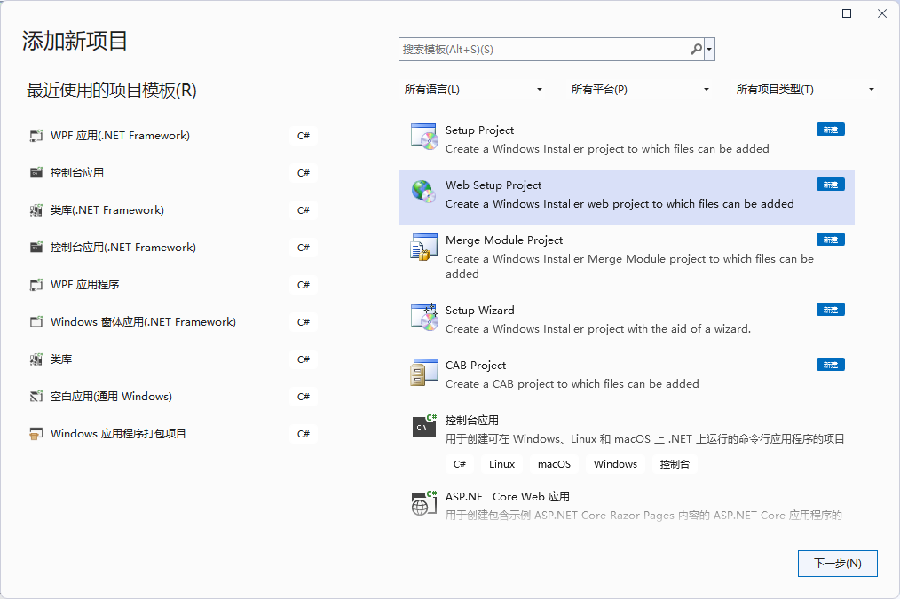
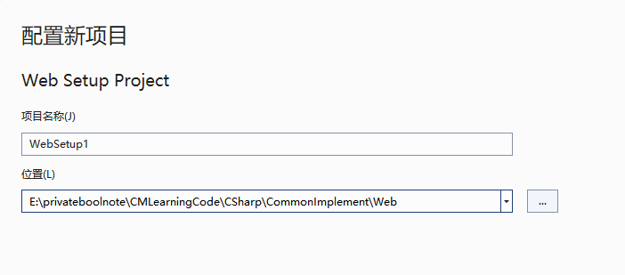

**ASP.NET项目的发布部署二：使用VS Installer Projects创建安装包一键安装配置ASP.NET项目到IIS**

[toc]

# 安装 Microsoft Visual Studio Installer Projects 2022

[Microsoft Visual Studio Installer Projects 2022](https://marketplace.visualstudio.com/items?itemName=VisualStudioClient.MicrosoftVisualStudio2022InstallerProjects) 是专用于 VS2022 的扩展，用于制作安装项目。

> 其他 VS 版本的 `Visual Studio Installer Projects`，可以从[此处](https://marketplace.visualstudio.com/items?itemName=visualstudioclient.MicrosoftVisualStudio2017InstallerProjects)下载。

如果没有安装，需要下载并安装。

  

安装时需要关闭VS2022，否则会提示等待安装。

  

# 创建Web安装项目

在 解决方案资源管理器 中，右键添加新项目，选择“Web安装项目”，如下，可以安装安装VSIX Installer插件后，新增的项目模板`Setup Project`、`Web Setup Project`、`Setup Wizrd`、`Merge Module Project`、`CAB Project`等。

  

下一步，设置项目名称、位置，点击创建：

  

