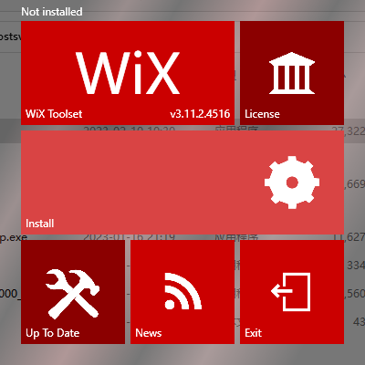
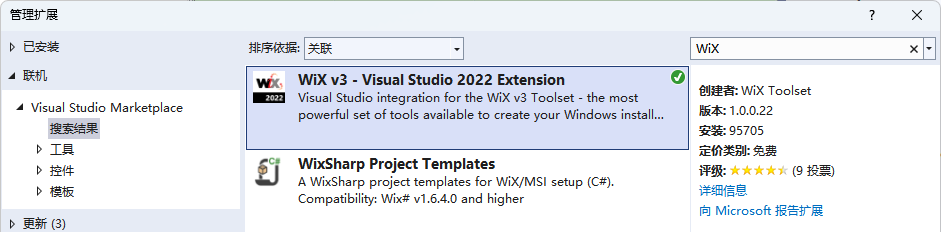
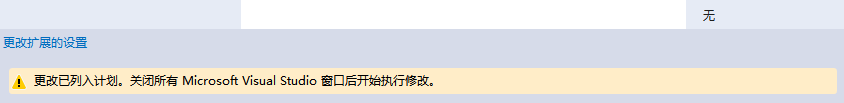
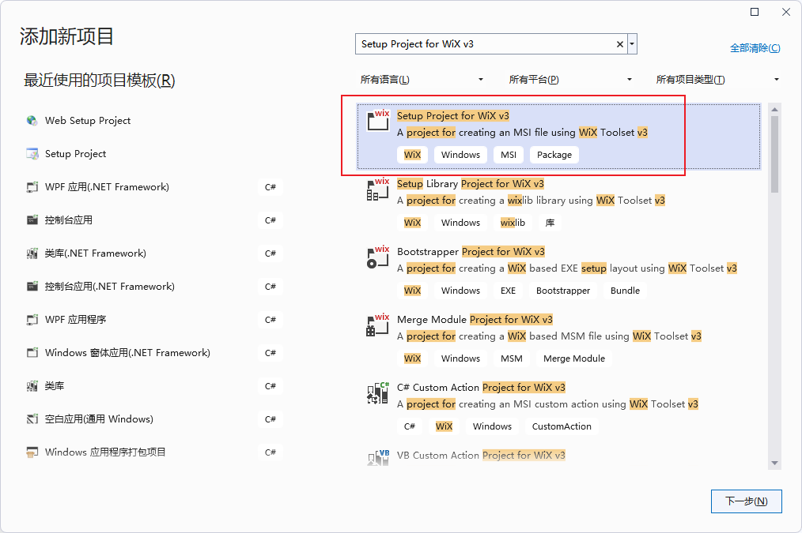

**ASP.NET项目的发布部署四：使用WiX Toolset制作Web项目的安装包，WiX的最简单安装包【winform、wpf】**

[toc]

> 主要参考自 [ASP.NET - Create MSI or setup.exe installer for any .NET Project with WiX](https://www.ryadel.com/en/asp-net-create-msi-setup-exe-installer-project-wix-core-winforms-wpf-xaml/)

> MSI 安装包扩展名是 `MicroSoft Installer` 的缩写。

# Visual Studio 中制作安装包的三种方式

- 使用 **[Visual Studio Windows Installer Deployment Project Template](https://docs.microsoft.com/en-us/previous-versions/visualstudio/visual-studio-2010/2kt85ked(v%3dvs.100)?WT.mc_id=DT-MVP-5003202)**，通常称为`Setup Project Template`，即 `Microsoft Visual Studio Installer Projects` 扩展，目前最新已支持 VS2022。

这几乎是从 VS2002 到 VS2010 中，制作安装包的(官方的)“标准”方式。微软在2012年停止了对其的支持，当时最新的VS版本是2010。得益于强大的 [MSI Installer Project](https://marketplace.visualstudio.com/items?itemName=VisualStudioClient.MicrosoftVisualStudio2022InstallerProjects) 扩展接口，该模板在VS后续版本中一直可以使用。

- 使用 [WiX](http://wixtoolset.org/)，一个开源的用于制作Windows安装包的工具集。

- 使用其它第三方工具，如 [**Advanced Installer**](https://www.advancedinstaller.com/)、**[Actual Installer](https://www.actualinstaller.com/)** 等， [Windows安装软件工具列表](https://en.wikipedia.org/wiki/List_of_installation_software#Windows) 给出了更多介绍。


# 安装 WiX

WiX可以说是制作安装包最好的选择（至少对于ASP.NET开发来说）。它开源、有强大的社区，有很多强大的和可配置的安装部署框架。

要想在VS中使用WiX工具集，需要安装如下两个软件（不在VS中使用，只需要安装`WiX Toolset`）：

- [WiX Toolset v3.11.2](https://wixtoolset.org/docs/wix3/#recommended-build) 下载安装。v4正式版还未推出。【安装后至少要重启VS】
- WiX Toolset Visual Studio 2022 Extension，与VS集成，但需要电脑安装`WiX Toolset`。

  

从 VS 顶部的菜单“扩展”->“管理扩展”中，搜索WiX，并下载`WiX Toolset Visual Studio Extension`，目前官方最新的是 v3 版本，v4正式版即将推出：

  

> 可以看到搜索的第二项为 WiX 用于 C# 的项目模板。

点击下载，下载完成后，关闭所有VS窗口，安装扩展。

  

> 扩展的安装位置？

# WiX的最简单安装包

## Setup Project for WiX v3 项目

VS中新建Wix安装项目（搜索选择`Setup Project for WiX v3 `），命名为`WixSetup_Simple`

  

新建的Wix项目包含一个`Product.wxs`项目，它是 Wix 的配置文件，为 xml 格式，里面的配置用来告诉Wix要做什么。

默认生成的项目，如果直接生成安装包，由于没有包含任何安装的项目或文件，在安装时，会显示类似如下的提示：

> The cabinet 'MySetup.cab' does not contain any files. If this installation contains no files, this warning can likely be safely ignored. Otherwise, please add files to the cabinet or remove it.

只要添加了应用程序或文件，该提示就会消失。

## 最小配置

如下是一个生成MSI文件的最简单配置：

```xml
<?xml version="1.0" encoding="UTF-8"?>
<Wix xmlns="http://schemas.microsoft.com/wix/2006/wi">
 
  <Product Id="*" Name="MyWPFProject" Language="1033" Version="1.0.0.0" Manufacturer="Ryadel" UpgradeCode="424d8179-0d5c-46bc-9984-24964850059b">
    <Package InstallerVersion="200" Compressed="yes" InstallScope="perMachine" />
    <MajorUpgrade DowngradeErrorMessage="A newer version of MyWPFProject is already installed." /> 
    <MediaTemplate />
    <WixVariable Id="WixUILicenseRtf" Value="LicenseAgreement.rtf" />
    <Feature Id="ProductFeature" Title="MySetup" Level="1">
        <ComponentGroupRef Id="ProductComponents" />
    </Feature>
  </Product>
 
  <Fragment>
    <Directory Id="TARGETDIR" Name="SourceDir">
      <Directory Id="ProgramFilesFolder">
        <Directory Id="INSTALLFOLDER" Name="MyWPFProject" />
      </Directory>
    </Directory>
  </Fragment>
 
  <Fragment>
    <ComponentGroup Id="ProductComponents" Directory="INSTALLFOLDER">
      <Component Id="ProductComponent">
        <File Source="$(var.MyWPFProject.TargetPath)" KeyPath="yes" />
      </Component>
    </ComponentGroup>
  </Fragment>
 
</Wix>
```

`wxs`的结构比较清晰：

- `<Product>`：元素包含部署项目的一般信息。
- `<Fragment>`：第一个元素包含在用户机器上创建的目录信息


# 

严重性	代码	说明	项目	文件	行	禁止显示状态
错误		A string was provided with characters that are not available in the specified database code page '1252'. Either change these characters to ones that exist in the database's code page, or update the database's code page by modifying one of the following attributes: Product/@Codepage, Module/@Codepage, Patch/@Codepage, PatchCreation/@Codepage, or WixLocalization/@Codepage.	WixSetup_Simple	E:\privateboolnote\CMLearningCode\CSharp\CommonImplement\PublishExample\WixSetup_Simple\Product.wxs	6	
