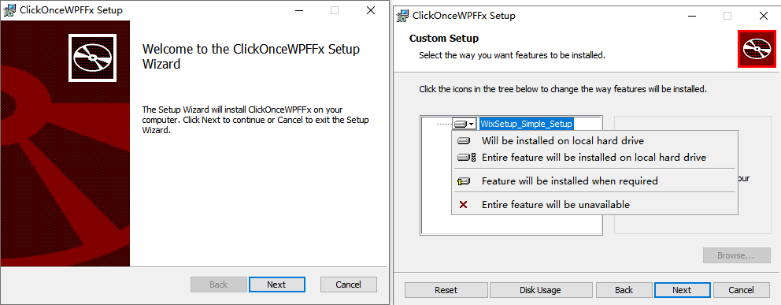
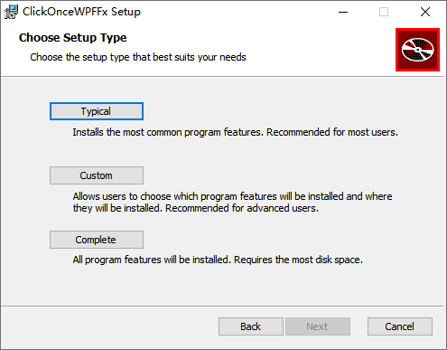
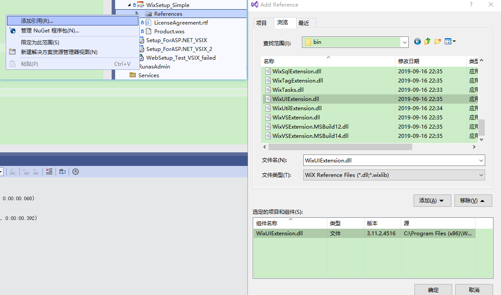

**ASP.NET项目的发布部署四：使用WiX Toolset制作Web项目的安装包，WiX的最简单安装包【winform、wpf】**

[toc]


> MSI 安装包扩展名是 `MicroSoft Installer` 的缩写。

# Visual Studio 中制作安装包的三种方式

- 使用 **[Visual Studio Windows Installer Deployment Project Template](https://docs.microsoft.com/en-us/previous-versions/visualstudio/visual-studio-2010/2kt85ked(v%3dvs.100)?WT.mc_id=DT-MVP-5003202)**，通常称为`Setup Project Template`，即 `Microsoft Visual Studio Installer Projects` 扩展，目前最新已支持 VS2022。

这几乎是从 VS2002 到 VS2010 中，制作安装包的(官方的)“标准”方式。微软在2012年停止了对其的支持，当时最新的VS版本是2010。得益于强大的 [MSI Installer Project](https://marketplace.visualstudio.com/items?itemName=VisualStudioClient.MicrosoftVisualStudio2022InstallerProjects) 扩展接口，该模板在VS后续版本中一直可以使用。

- 使用 [WiX](http://wixtoolset.org/)，一个开源的用于制作Windows安装包的工具集。

- 使用其它第三方工具，如 [**Advanced Installer**](https://www.advancedinstaller.com/)、**[Actual Installer](https://www.actualinstaller.com/)** 等， [Windows安装软件工具列表](https://en.wikipedia.org/wiki/List_of_installation_software#Windows) 给出了更多介绍。


# 安装 WiX

WiX可以说是制作安装包最好的选择（至少对于ASP.NET开发来说）。它开源、有强大的社区，有很多强大的和可配置的安装部署框架。

要想在VS中使用WiX工具集，需要安装如下两个软件（不在VS中使用，只需要安装`WiX Toolset`）：

- [WiX Toolset v3.11.2](https://wixtoolset.org/docs/wix3/#recommended-build) 下载安装。v4正式版还未推出。【安装后至少要重启VS】
- WiX Toolset Visual Studio 2022 Extension，与VS集成，但需要电脑安装`WiX Toolset`。

  

从 VS 顶部的菜单“扩展”->“管理扩展”中，搜索WiX，并下载`WiX Toolset Visual Studio Extension`，目前官方最新的是 v3 版本，v4正式版即将推出：

  

> 可以看到搜索的第二项为 WiX 用于 C# 的项目模板。

点击下载，下载完成后，关闭所有VS窗口，安装扩展。

  

> 扩展的安装位置？

# WiX的最简单安装包

## Setup Project for WiX v3 项目

VS中新建Wix安装项目（搜索选择`Setup Project for WiX v3 `），命名为`WixSetup_Simple`

  

新建的Wix项目包含一个`Product.wxs`项目，它是 Wix 的配置文件，为 xml 格式，里面的配置用来告诉Wix要做什么。

默认生成的项目，如果直接生成安装包，由于没有包含任何安装的项目或文件，在安装时，会显示类似如下的提示：

> The cabinet 'MySetup.cab' does not contain any files. If this installation contains no files, this warning can likely be safely ignored. Otherwise, please add files to the cabinet or remove it.

只要添加了应用程序或文件，该提示就会消失。

## 最小配置

如下是一个生成MSI文件的最简单配置：

```xml
<?xml version="1.0" encoding="UTF-8"?>
<Wix xmlns="http://schemas.microsoft.com/wix/2006/wi">
 
  <Product Id="*" Name="MyWPFProject" Language="1033" Version="1.0.0.0" Manufacturer="Ryadel" UpgradeCode="424d8179-0d5c-46bc-9984-24964850059b">
    <Package InstallerVersion="200" Compressed="yes" InstallScope="perMachine" />
    <MajorUpgrade DowngradeErrorMessage="A newer version of MyWPFProject is already installed." /> 
    <MediaTemplate />
    <WixVariable Id="WixUILicenseRtf" Value="LicenseAgreement.rtf" />
    <Feature Id="ProductFeature" Title="MySetup" Level="1">
        <ComponentGroupRef Id="ProductComponents" />
    </Feature>
  </Product>
 
  <Fragment>
    <Directory Id="TARGETDIR" Name="SourceDir">
      <Directory Id="ProgramFilesFolder">
        <Directory Id="INSTALLFOLDER" Name="MyWPFProject" />
      </Directory>
    </Directory>
  </Fragment>
 
  <Fragment>
    <ComponentGroup Id="ProductComponents" Directory="INSTALLFOLDER">
      <Component Id="ProductComponent">
        <File Source="$(var.MyWPFProject.TargetPath)" KeyPath="yes" />
      </Component>
    </ComponentGroup>
  </Fragment>
 
</Wix>
```

`.wxs`的结构比较清晰：

- `<Product>`：元素包含部署项目的一般信息。
- `<Fragment>`：第一个元素包含在用户机器上创建的目录信息

# 打包安装程序依赖，或程序目录中的所有文件


# 添加桌面、开始菜单等快捷方式


# 使用内建的WixUI对话框集合

默认`.wxs`文件生成的安装包，是一个没有安装过程的无窗口的安装包（只有一个进度窗口）。

如果想要显示欢迎页面、License同意页面，必须使用对应的 WixUI 对话框 来显示。—— `built-in WixUI dialog set`

## 内建的WixUI对话框

WixUI对话框库一共包含以下 5 种内建的安装向导样式界面：

1. [WixUI_Advanced](https://wixtoolset.org/docs/v3/wixui/dialog_reference/wixui_advanced/)
2. [WixUI_FeatureTree](https://wixtoolset.org/docs/v3/wixui/dialog_reference/wixui_featuretree/)
3. [WixUI_InstallDir](https://wixtoolset.org/docs/v3/wixui/dialog_reference/wixui_installdir/)
4. [WixUI_Minimal](https://wixtoolset.org/docs/v3/wixui/dialog_reference/wixui_minimal/)
5. [WixUI_Mondo](https://wixtoolset.org/docs/v3/wixui/dialog_reference/wixui_mondo/)

WixUI内建对话框库位于 `WixUIExtension.dll` 中。

内建对话框集合支持自定义，包括UI的图片显示、添加和移除自定义对话框。参考 [Customizing the WixUI Dialog Sets](https://wixtoolset.org/docs/v3/wixui/wixui_customizations/) 实现自定义。

五种对话框的各自风格如下：

- WixUI_Advanced

- WixUI_FeatureTree

  

- WixUI_InstallDir

- WixUI_Minimal

没有欢迎页面、多余选项，只有最少的安装界面，完成安装。

- WixUI_Mondo

  

## 添加对话框集合到安装包

在Wix配置文件中，按如下步骤引入`built-in WixUI dialog set`：

1. `<Product>` 下添加 `<UIRef>` 元素，Id 对应内建对话框集

```xml
<Product ...> 
    <UIRef Id="WixUI_InstallDir" />
</Product>
```

2. 使用添加的UI对话框。

两种方式：

- 命令行打包时，`light.exe`中传递 -ext 和 -cultures 参数。例如：

 ```sh
 light -ext WixUIExtension -cultures:en-us Product.wixobj -out Product.msi 
 ```

> 位置：
> `C:\Program Files (x86)\WiX Toolset v3.11\bin\light.exe`
> `C:\Program Files (x86)\WiX Toolset v3.11\bin\WixUIExtension.dll`

- 在 Visual Studio 中，需要添加`WixUIExtension.dll`引用。

VS解决方案资源管理器中，右键 WiX Setup project 的 References，添加引用，选择`WixUIExtension.dll`：

  

然后，再重新生成 Wix安装项目 即可。

> 不添加`WixUIExtension.dll`引用无法生成，报错不识别"WixUI_InstallDir"等自定的Id。

# 如何将CAB文件嵌入到 MSI 安装包中

> 生成安装包后，会看到多出一个cab文件。它是msi的安装文件的压缩文件。

Wix Toolset中内嵌cab文件，只需添加如下属性即可：

```xml
<MediaTemplate EmbedCab="yes"/>
```

> 默认"no"。

如下，是一个设置cab文件内嵌进安装包的配置示例：

```xml
<Wix xmlns="http://schemas.microsoft.com/wix/2006/wi">
  <Product Id="*" UpgradeCode="12345678-1111-2222-3333-666666666666"
          Name="My First Installer" Version="1.0.0.0" Manufacturer="My Company" Language="1033">
    <Package InstallerVersion="200" Compressed="yes" Comments="Hello, this is my first installer"/>
    
    <MediaTemplate EmbedCab="yes" />


    <Directory Id="TARGETDIR" Name="SourceDir">
      <Directory Id="ProgramFilesFolder">
        <Directory Id="INSTALLDIR" Name="MyFirstInstaller">
          <Component Id="Files" Guid="11111111-2222-3333-4444-555555555555">
            <File Id="File1" Source="Trace32.exe"/>
          </Component>
        </Directory>
      </Directory>
    </Directory>

    <Feature Id="Feature1" Level="1" Title="First feature" Description="This is the one and only feature in this installation">
      <ComponentRef Id="Files"/>
    </Feature>
  </Product>
</Wix>
```

> WiX 3.8 之前没有`MediaTemplate`元素，需要使用 `<Media Id="1" Cabinet="cab1.cab" EmbedCab="yes"/>`。

# wxs 使用中文报错`code page '1252'`

WiX的配置文件中，如果使用英文（ASCII）之外的字符，比如中文，编译打包时就会报错`code page '1252'`的问题。

A string was provided with characters that are not available in the specified database code page '1252'. Either change these characters to ones that exist in the database's code page, or update the database's code page by modifying one of the following attributes: Product/@Codepage, Module/@Codepage, Patch/@Codepage, PatchCreation/@Codepage, or WixLocalization/@Codepage.	WixSetup_Simple	E:\privateboolnote\CMLearningCode\CSharp\CommonImplement\PublishExample\WixSetup_Simple\Product.wxs	6	

目前似乎没有很好的办法。只能暂时在配置文件中使用英文，后续通过本地化，实现中文或多语言的显示。

# 附：使用Wix工具在命令行中打包安装包

Wix工具生成安装包一共分两步：

1. `candle.exe example.wxs` 将 `example.wxs` 文件生成为Wix对象文件。
2. `light.exe example.wixobj` 将Wix对象文件生成为安装包。

如下，可以将两个过程写在`.bat`文件中（如`make_msi.bat`），然后点击执行。

```bat
"C:\Program Files (x86)\WiX Toolset v3.11\bin\candle.exe" example.wxs
"C:\Program Files (x86)\WiX Toolset v3.11\bin\light.exe" example.wixobj
@pause
```

# 附：关于 .cab 文件（cabinet）

很大的Windows包不仅占用系统资源，而且安装困难。比较好的实践是使用下面的方法减少包装包的大小：

- 压缩安装的文件并将其存储在 cabinet（.cab）文件中。安装程序允许将`.cab`文件作为单独的外部文件存储，或者作为数据流内嵌在 MSI 包中。

- 使用 [Reducing the Size of an .msi File](https://learn.microsoft.com/en-us/windows/win32/msi/reducing-the-size-of-an--msi-file) 中介绍的方法移除`.msi`中浪费的存储空间

- 如果 Windows安装包 包含超过32767个文件，则必须更改数据库的架构。详细信息参见 [Authoring a Large Package](https://learn.microsoft.com/en-us/windows/win32/msi/authoring-a-large-package)


# 参考

- [Windows Installer Best Practices](https://learn.microsoft.com/en-us/windows/win32/msi/windows-installer-best-practices) Windows安装程序最佳实践，很好的文章，推荐。

- 官网文档-[Using Built-in WixUI Dialog Sets](https://wixtoolset.org/docs/v3/wixui/wixui_dialog_library/)

- [How To Embed CAB Files in MSI](https://www.advancedinstaller.com/versus/wix-toolset/embed-cab-file-in-msi.html)

- [ASP.NET - Create MSI or setup.exe installer for any .NET Project with WiX](https://www.ryadel.com/en/asp-net-create-msi-setup-exe-installer-project-wix-core-winforms-wpf-xaml/)
