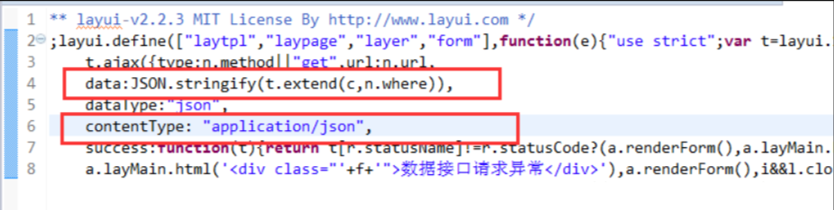

**ASP.net core报错415 unsupported media type【layui table请求数据415错误】**

layui table请求数据默认是以Get请求发送的，其Where等参数会作为查询字符串传递给后台。其上传的请求头参数未指定`Content-Type`(上传的数据类型和字符编码)。

ASP.net core Get方法在使用模型绑定类时，似乎默认不是从查询字符串获取。

**解决办法（有两种）：**

- ASP.net core的 Action方法参数的模型类上指定`[FromQuery]`。【推荐】

> 另：**关于 ASP.Net Core Web API 的查询字符串参数无法进行模型类绑定**，即使将 `[FromQuery]` 放在Action的类型参数、放在绑定类的属性上，都不能成功绑定，未具体进一步探究！
> 
> **查询字符串进行模型类绑定的正确处理方法应该是：QueryString中key的形式为`参数名.属性名`，比如`Input.page`**


> ```C#
> // 显式设置url小写 即 不区分大小写，默认就是不区分大小写的。springboot等其他框架需要额外设置
> // services.AddRouting(options => options.LowercaseUrls = true);
> ```

- 修改 Layui 的 table 组件的源码，添加`Content-Type`。

在其table.js源码中修改，传输参数会附件分页信息 
 
 修改 data:JSON.stringify(t.extend(c,n.where)) 【可选】
 
 添加 contentType: "application/json", 

 dataType: "json",  【可选】



> HTTP响应返回415状态码，错误信息为“Unsupported Media Type”，也就是服务器无法处理请求附带的媒体格式，
> 
> 解决方法就是在请求头中加入Content-Type指定媒体格式类型(也可以理解成编码格式)。
> 
> 另外在请求头中添加Accept可指定客户端能接受的内容类型。
>
> 比如 "Content-Type":"application/json"

# 参考

[HTTP请求响应过程中的Content-type你真的清楚吗](https://zhuanlan.zhihu.com/p/370029419)

[415 unsupported media type错误解决.net core API](https://blog.csdn.net/qq994877603/article/details/112281681)

`application/x-www-form-urlencoded`