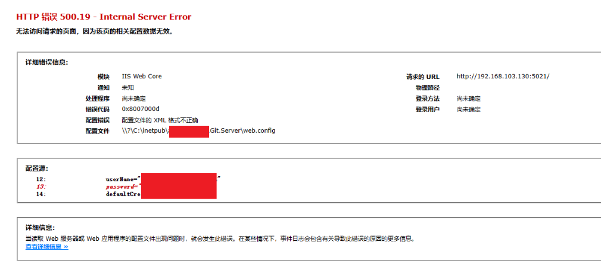

**App.config、Web.config等xml文件中的特殊字符导致解析或配置错误，使用字符实体解决**

[toc]

# xml配置错误

如下，如果`Web.config`配置文件出现特殊字符，会直接报错XML格式不正确！`HTTP 错误 500.19 - Internal Server Error`：

原因在于 xml的配置项的值存在特殊字符`&`，从导致错误。

解决办法，使用`&`的字符实体`&amp;`代替特殊字符。

> 字符实体，也叫做转义字符，是专门针对类xml格式的特殊字符的处理。比如`<`、`>`、`&`、`"`、空格等字符。

> 关于 XML 格式不正确问题的排查，首先要确认的就是是否有特殊字符。其次，可以通过换行配置项、删减配置项，以缩小错误提示的范围。

# HTML特殊转义字符列表

最常用的几个字符实体：

<table style="background: rgba(236, 236, 236, 1); border-collapse: collapse" border="0">
    <tbody valign="top">
    <tr>
        <td style="border: 1.5pt solid rgba(255, 255, 255, 1); padding: 1px" valign="middle">
            
显示

        </td>
        <td style="border-top: 1.5pt solid rgba(255, 255, 255, 1); border-left: none; border-bottom: 1.5pt solid rgba(255, 255, 255, 1); border-right: 1.5pt solid rgba(255, 255, 255, 1); padding: 1px" valign="middle">
            
<strong>说明</strong>

        </td>
        <td style="border-top: 1.5pt solid rgba(255, 255, 255, 1); border-left: none; border-bottom: 1.5pt solid rgba(255, 255, 255, 1); border-right: 1.5pt solid rgba(255, 255, 255, 1); padding: 1px" valign="middle">
            
<strong>实体名称</strong>

        </td>
        <td style="border-top: 1.5pt solid rgba(255, 255, 255, 1); border-left: none; border-bottom: 1.5pt solid rgba(255, 255, 255, 1); border-right: 1.5pt solid rgba(255, 255, 255, 1); padding: 1px" valign="middle">
            
<strong>实体编号</strong>

        </td>
    </tr>
    <tr>
        <td style="border-top: none; border-left: 1.5pt solid rgba(255, 255, 255, 1); border-bottom: 1.5pt solid rgba(255, 255, 255, 1); border-right: 1.5pt solid rgba(255, 255, 255, 1); padding: 1px" valign="middle">&nbsp;
        </td>
        <td style="border-top: none; border-left: none; border-bottom: 1.5pt solid rgba(255, 255, 255, 1); border-right: 1.5pt solid rgba(255, 255, 255, 1); padding: 1px" valign="middle">
            
空格

        </td>
        <td style="border-top: none; border-left: none; border-bottom: 1.5pt solid rgba(255, 255, 255, 1); border-right: 1.5pt solid rgba(255, 255, 255, 1); padding: 1px" valign="middle">
            
&amp;nbsp;

        </td>
        <td style="border-top: none; border-left: none; border-bottom: 1.5pt solid rgba(255, 255, 255, 1); border-right: 1.5pt solid rgba(255, 255, 255, 1); padding: 1px" valign="middle">
            
&amp;#160;

        </td>
    </tr>
    <tr>
        <td style="border-top: none; border-left: 1.5pt solid rgba(255, 255, 255, 1); border-bottom: 1.5pt solid rgba(255, 255, 255, 1); border-right: 1.5pt solid rgba(255, 255, 255, 1); padding: 1px" valign="middle">
            
&lt;

        </td>
        <td style="border-top: none; border-left: none; border-bottom: 1.5pt solid rgba(255, 255, 255, 1); border-right: 1.5pt solid rgba(255, 255, 255, 1); padding: 1px" valign="middle">
            
小于

        </td>
        <td style="border-top: none; border-left: none; border-bottom: 1.5pt solid rgba(255, 255, 255, 1); border-right: 1.5pt solid rgba(255, 255, 255, 1); padding: 1px" valign="middle">
            
&amp;lt;

        </td>
        <td style="border-top: none; border-left: none; border-bottom: 1.5pt solid rgba(255, 255, 255, 1); border-right: 1.5pt solid rgba(255, 255, 255, 1); padding: 1px" valign="middle">
            
&amp;#60;

        </td>
    </tr>
    <tr>
        <td style="border-top: none; border-left: 1.5pt solid rgba(255, 255, 255, 1); border-bottom: 1.5pt solid rgba(255, 255, 255, 1); border-right: 1.5pt solid rgba(255, 255, 255, 1); padding: 1px" valign="middle">
            
&gt;

        </td>
        <td style="border-top: none; border-left: none; border-bottom: 1.5pt solid rgba(255, 255, 255, 1); border-right: 1.5pt solid rgba(255, 255, 255, 1); padding: 1px" valign="middle">
            
大于

        </td>
        <td style="border-top: none; border-left: none; border-bottom: 1.5pt solid rgba(255, 255, 255, 1); border-right: 1.5pt solid rgba(255, 255, 255, 1); padding: 1px" valign="middle">
            
&amp;gt;

        </td>
        <td style="border-top: none; border-left: none; border-bottom: 1.5pt solid rgba(255, 255, 255, 1); border-right: 1.5pt solid rgba(255, 255, 255, 1); padding: 1px" valign="middle">
            
&amp;#62;

        </td>
    </tr>
    <tr>
        <td style="border-top: none; border-left: 1.5pt solid rgba(255, 255, 255, 1); border-bottom: 1.5pt solid rgba(255, 255, 255, 1); border-right: 1.5pt solid rgba(255, 255, 255, 1); padding: 1px" valign="middle">
            
&amp;

        </td>
        <td style="border-top: none; border-left: none; border-bottom: 1.5pt solid rgba(255, 255, 255, 1); border-right: 1.5pt solid rgba(255, 255, 255, 1); padding: 1px" valign="middle">
            
&amp;符号

        </td>
        <td style="border-top: none; border-left: none; border-bottom: 1.5pt solid rgba(255, 255, 255, 1); border-right: 1.5pt solid rgba(255, 255, 255, 1); padding: 1px" valign="middle">
            
&amp;amp;

        </td>
        <td style="border-top: none; border-left: none; border-bottom: 1.5pt solid rgba(255, 255, 255, 1); border-right: 1.5pt solid rgba(255, 255, 255, 1); padding: 1px" valign="middle">
            
&amp;#38;

        </td>
    </tr>
    <tr>
        <td style="border-top: none; border-left: 1.5pt solid rgba(255, 255, 255, 1); border-bottom: 1.5pt solid rgba(255, 255, 255, 1); border-right: 1.5pt solid rgba(255, 255, 255, 1); padding: 1px" valign="middle">
            
"

        </td>
        <td style="border-top: none; border-left: none; border-bottom: 1.5pt solid rgba(255, 255, 255, 1); border-right: 1.5pt solid rgba(255, 255, 255, 1); padding: 1px" valign="middle">
            
双引号

        </td>
        <td style="border-top: none; border-left: none; border-bottom: 1.5pt solid rgba(255, 255, 255, 1); border-right: 1.5pt solid rgba(255, 255, 255, 1); padding: 1px" valign="middle">
            
&amp;quot;

        </td>
        <td style="border-top: none; border-left: none; border-bottom: 1.5pt solid rgba(255, 255, 255, 1); border-right: 1.5pt solid rgba(255, 255, 255, 1); padding: 1px" valign="middle">
            
&amp;#34;

        </td>
    </tr>
    <tr>
        <td style="border-top: none; border-left: 1.5pt solid rgba(255, 255, 255, 1); border-bottom: 1.5pt solid rgba(255, 255, 255, 1); border-right: 1.5pt solid rgba(255, 255, 255, 1); padding: 1px" valign="middle">
            
©

        </td>
        <td style="border-top: none; border-left: none; border-bottom: 1.5pt solid rgba(255, 255, 255, 1); border-right: 1.5pt solid rgba(255, 255, 255, 1); padding: 1px" valign="middle">
            
版权

        </td>
        <td style="border-top: none; border-left: none; border-bottom: 1.5pt solid rgba(255, 255, 255, 1); border-right: 1.5pt solid rgba(255, 255, 255, 1); padding: 1px" valign="middle">
            
&amp;copy;

        </td>
        <td style="border-top: none; border-left: none; border-bottom: 1.5pt solid rgba(255, 255, 255, 1); border-right: 1.5pt solid rgba(255, 255, 255, 1); padding: 1px" valign="middle">
            
&amp;#169;

        </td>
    </tr>
    <tr>
        <td style="border-top: none; border-left: 1.5pt solid rgba(255, 255, 255, 1); border-bottom: 1.5pt solid rgba(255, 255, 255, 1); border-right: 1.5pt solid rgba(255, 255, 255, 1); padding: 1px" valign="middle">
            
®

        </td>
        <td style="border-top: none; border-left: none; border-bottom: 1.5pt solid rgba(255, 255, 255, 1); border-right: 1.5pt solid rgba(255, 255, 255, 1); padding: 1px" valign="middle">
            
已注册商标

        </td>
        <td style="border-top: none; border-left: none; border-bottom: 1.5pt solid rgba(255, 255, 255, 1); border-right: 1.5pt solid rgba(255, 255, 255, 1); padding: 1px" valign="middle">
            
&amp;reg;

        </td>
        <td style="border-top: none; border-left: none; border-bottom: 1.5pt solid rgba(255, 255, 255, 1); border-right: 1.5pt solid rgba(255, 255, 255, 1); padding: 1px" valign="middle">
            
&amp;#174;

        </td>
    </tr>
    <tr>
        <td style="border-top: none; border-left: 1.5pt solid rgba(255, 255, 255, 1); border-bottom: 1.5pt solid rgba(255, 255, 255, 1); border-right: 1.5pt solid rgba(255, 255, 255, 1); padding: 1px" valign="middle">
            
™

        </td>
        <td style="border-top: none; border-left: none; border-bottom: 1.5pt solid rgba(255, 255, 255, 1); border-right: 1.5pt solid rgba(255, 255, 255, 1); padding: 1px" valign="middle">
            
商标（美国）

        </td>
        <td style="border-top: none; border-left: none; border-bottom: 1.5pt solid rgba(255, 255, 255, 1); border-right: 1.5pt solid rgba(255, 255, 255, 1); padding: 1px" valign="middle">
            
™

        </td>
        <td style="border-top: none; border-left: none; border-bottom: 1.5pt solid rgba(255, 255, 255, 1); border-right: 1.5pt solid rgba(255, 255, 255, 1); padding: 1px" valign="middle">
            
&amp;#8482;

        </td>
    </tr>
    <tr>
        <td style="border-top: none; border-left: 1.5pt solid rgba(255, 255, 255, 1); border-bottom: 1.5pt solid rgba(255, 255, 255, 1); border-right: 1.5pt solid rgba(255, 255, 255, 1); padding: 1px" valign="middle">
            
×

        </td>
        <td style="border-top: none; border-left: none; border-bottom: 1.5pt solid rgba(255, 255, 255, 1); border-right: 1.5pt solid rgba(255, 255, 255, 1); padding: 1px" valign="middle">
            
乘号

        </td>
        <td style="border-top: none; border-left: none; border-bottom: 1.5pt solid rgba(255, 255, 255, 1); border-right: 1.5pt solid rgba(255, 255, 255, 1); padding: 1px" valign="middle">
            
&amp;times;

        </td>
        <td style="border-top: none; border-left: none; border-bottom: 1.5pt solid rgba(255, 255, 255, 1); border-right: 1.5pt solid rgba(255, 255, 255, 1); padding: 1px" valign="middle">
            
&amp;#215;

        </td>
    </tr>
    <tr>
        <td style="border-top: none; border-left: 1.5pt solid rgba(255, 255, 255, 1); border-bottom: 1.5pt solid rgba(255, 255, 255, 1); border-right: 1.5pt solid rgba(255, 255, 255, 1); padding: 1px" valign="middle">
            
÷

        </td>
        <td style="border-top: none; border-left: none; border-bottom: 1.5pt solid rgba(255, 255, 255, 1); border-right: 1.5pt solid rgba(255, 255, 255, 1); padding: 1px" valign="middle">
            
除号

        </td>
        <td style="border-top: none; border-left: none; border-bottom: 1.5pt solid rgba(255, 255, 255, 1); border-right: 1.5pt solid rgba(255, 255, 255, 1); padding: 1px" valign="middle">
            
&amp;divide;

        </td>
        <td style="border-top: none; border-left: none; border-bottom: 1.5pt solid rgba(255, 255, 255, 1); border-right: 1.5pt solid rgba(255, 255, 255, 1); padding: 1px" valign="middle">
            
&amp;#247;

        </td>
    </tr></tbody></table>