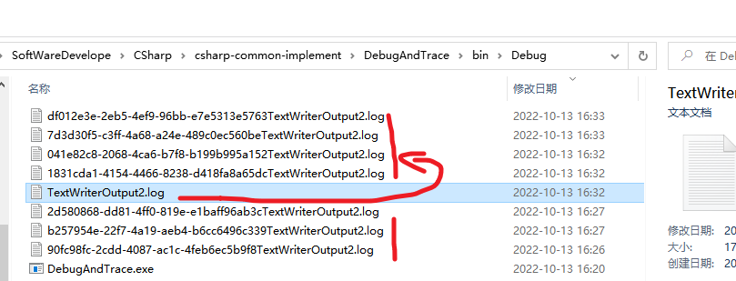

**C# TraceListener介绍，及创建和初始化跟踪侦听器**

[toc]

# TraceListener类

`TraceListener`是一个抽象基类，用于实现监视跟踪和调试输出的侦听器。

对于`TraceListener`的实现示例，可以参考[DefaultTraceListener](https://learn.microsoft.com/en-us/dotnet/api/system.diagnostics.defaulttracelistener)、[TextWriterTraceListener](https://learn.microsoft.com/en-us/dotnet/api/system.diagnostics.textwritertracelistener) 和 [EventLogTraceListener](https://learn.microsoft.com/en-us/dotnet/api/system.diagnostics.eventlogtracelistener) 等类。

如果要实现一个自定义的用于调试跟踪的监听器，最低要求必须实现`Write(String)` 和 `WriteLine(String)`方法。

通过继承`TraceListener`抽象类，实现自定义输出到数据库、网络、文件等位置。

# TextWriterTraceListener侦听器使用

## 调试跟踪输出

`System.Diagnostics.Debug` 和 `System.Diagnostics.Trace` 类就是将信息输出到侦听器。通常可以修改侦听器将信息输出到不同的位置。

比如，`Trace`添加`TextWriterTraceListener`侦听器，输出到文件：

```cs
Trace.Listeners.Add(new TextWriterTraceListener("TextWriterOutput.log", "myListener"));
Trace.TraceInformation("测试消息1.");
Trace.TraceError("测试消息2.");
Trace.TraceWarning("测试消息3.");
// 必须 close or flush trace 以清空输出buffer.
Trace.Flush();
```

## 直接使用侦听器输出

可以直接使用`TextWriterTraceListener`的输出方法，发送输出到侦听器。

```cs
TextWriterTraceListener myListener = new TextWriterTraceListener("TextWriterOutput2.log", "myListener");
myListener.WriteLine("独立使用-测试消息1.");
myListener.WriteLine("独立使用-测试消息2.");
myListener.WriteLine("独立使用-测试消息3.");
// 刷新缓存
myListener.Flush();
```

## TextWriterTraceListener创建时使用文件路径的小情况

创建侦听器时，传入文件路径 `new TextWriterTraceListener("TextWriterOutput2.log", "myListener")` 写入信息时，如果频繁的写入，或者文件被打开时写入，会出现如下的情况：

 

即，将不能及时写入的信息以随机文件名前缀的方式保存到其他文件中。测试，这个生成概率还是很高的。

【并且，要等待不少时间才能重新写入指定的文件】

推荐使用文件流的形式，不会有文件占用阻塞的问题，不会生成其他的临时文件：

```cs
using (var myFileStream = File.Open("TextWriterOutput2.log", FileMode.Append)){
    TextWriterTraceListener myListener = new TextWriterTraceListener(myFileStream);

    // ....

    // 刷新缓存
    myListener.Flush();
}
```

> **文件流的形式写入或读取，没有文件被其他进程占用的问题**，即使占用着，也可以写入和读取成功（可以再次打开查看）。

# ConsoleTraceListener侦听器

`ConsoleTraceListener`类用于将跟踪或调试输出到标准输出或标准错误流中，通常为`Console`控制台。

## ConsoleTraceListener

`new ConsoleTraceListener(true)` 输出到标准输出流。

`new ConsoleTraceListener(true)` 输出到标准输出流或错误输出流。

> `ConsoleTraceListener`的使用，需要启动一个控制台程序。

```cs
var consoleTracer = new ConsoleTraceListener();
var infos = EnvironmentInfo.Infos;
foreach (var info in infos)
{
    consoleTracer.WriteLine(info);
}

/// <summary>
/// 获取系统环境信息
/// </summary>
public static class EnvironmentInfo
{
    public static string[] Infos { get {
            var infos = new List<string>();
            infos.Add("Operating system: " + System.Environment.OSVersion.ToString());
            infos.Add("64 bit Operating System: " + System.Environment.Is64BitOperatingSystem);
            infos.Add("Processor Count: " + System.Environment.ProcessorCount);
            infos.Add("Computer name: " + System.Environment.MachineName);
            infos.Add("User name: " + System.Environment.UserName);
            infos.Add("CLR runtime version: " + System.Environment.Version.ToString());
            infos.Add("Command line: " + System.Environment.CommandLine);

            return infos.ToArray();
        } }
}
```

## TextWriterTraceListener输出信息到控制台

`TextWriterTraceListener` 修改Writer可以输出到不同的位置，比如输出到控制台。

```cs
// TextWriterTraceListener 指定Writer输出到控制台
var consoleListener = new TextWriterTraceListener(System.Console.Out);
// 或
var consoleListener2 = new TextWriterTraceListener();
consoleListener2.Writer = System.Console.Out;
```

## 通过继承TraceListener自定义ConsoleTraceListener

通过继承`TraceListener`类就可以实现一个跟踪侦听器，在其`Write`/`WriteLine`中实现写入消息的方法。

如下，自定义ConsoleTraceListener，实现在控制台的写入处理：

```cs
/// <summary>
/// 自定义的ConsoleTraceListener
/// </summary>
public class MyConsoleTraceListener : System.Diagnostics.TraceListener
{
    public override void Write(string message)
    {
        Console.Write(message);
    }

    public override void WriteLine(string message)
    {
        Console.WriteLine(message);
    }
}
```

使用：

```cs
var myConsoleTraceListener = new MyConsoleTraceListener();
myConsoleTraceListener.WriteLine("测试输出");
```

> 包括在Trace、Debug中的使用、其配置文件的配置，和默认提供的侦听器一样。


# 参考

- [TextWriterTraceListener](https://learn.microsoft.com/en-us/dotnet/api/system.diagnostics.textwritertracelistener.writer)
- [TraceListener](https://learn.microsoft.com/en-us/dotnet/api/system.diagnostics.tracelistener)