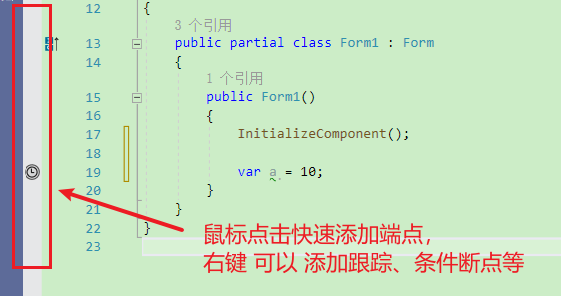

**C#调试跟踪Debug与Trace类的输出和Assert断言**

[toc]

# 调试和跟踪

通常IDE都提供了调试和跟踪的功能，在Visual Studio中，通过右键某行代码，选择“断点”，可以插入断点和跟踪。

  

一般会在VS的左侧点击一下，快速添加断点。

  

> 新建项目`DebugAndTrace`。

# Debug类和`Debug.Assert`

`Debug`类提供了用于debug(调试)代码的一系列方法和属性。其位于`System.Diagnostics`命名空间下。

`Debug`的调试信息需要输出到一个跟踪侦听器中，通常Visual Studio中提供了默认的跟踪侦听器`DefaultTraceListener`，这是VS可以调试输出的默认方式。

`Debug.Listeners`查看跟踪侦听器列表：

```cs
foreach (var listener in Debug.Listeners)
{
    Console.WriteLine(listener);
}

// 输出：
// System.Diagnostics.DefaultTraceListener
```

`Debug`/`Assert`断言在生产代码中会被忽略，调试运行中，主要用于判断一个结果是否和预期的一样，如果一样就正常执行，否则会抛出异常。

即，**所有`Debug`类相关方法，只会在debug模式运行时执行，Release发布的程序不会执行相关代码。如果想要在发行版本中使用断言，应使用`Trace.Assert`。**

> **`Assert`断言用于判断是否通过，不通过(false)将引发异常。**

> Debug 类用于开发阶段，Trace 类用于开发与测试阶段，实现追踪断言程序代码的状态或行为。

## Debug Write方法的使用

`Debug.Write`相关方法：

```cs
Debug.Write("Debug info");
Debug.WriteIf(true, "Debug info if true");
Debug.WriteLine("Debug info Line");
Debug.WriteLineIf(true, "Debug info Line if true");


// 输出：
// Debug infoDebug info if trueDebug info Line
// Debug info Line if true
```

在“输出”的调试界面会看到输出信息。

  

**对于日志记录来说，通常可以使用Write的第二个参数进行分类。**

```cs
Debug.WriteLine("Debug info Line","Info");
Debug.WriteLine("Warning info Line", "Warning");
Debug.WriteLine("Error info Line", "Error");
Debug.WriteLine("Fatal info Line", "Fatal");
```

输出：

```sh
Info: Debug info Line
Warning: Warning info Line
Error: Error info Line
Fatal: Fatal info Line
```

## AutoFlush 和 Indent

`AutoFlush`表示在调用写入方法时是否自动刷新，默认false。使用`Flush()`方法可执行手动刷新。

通常会设置 `AutoFlush=true;`

`Indent`表示输出内容的缩进。默认为0。通常使用`Debug.Indent();`增加缩进并输出，结束后使用`Debug.Unindent();`恢复缩进。而不是直接修改`IndentLevel`属性。

```cs
Debug.WriteLine("错误列表:");
Debug.Indent();
Debug.WriteLine("错误 1: File not found");
Debug.WriteLine("错误 2: Directory not found");
Debug.Unindent();
Debug.WriteLine("错误结束");
```

输出如下：

```sh
错误列表:
    错误 1: File not found
    错误 2: Directory not found
错误结束
```

> `Debug.IndentSize`修改缩进的空格数量，默认4个空格。

## Debug.Fail发出错误消息

执行如下代码，查看`Debug.Fail`发出的错误。

```cs
try
{
    var a = 0;
    var b = 10;
    var foo = b / a;
}
catch (Exception ex)
{
    Debug.Fail($"发生错误: {ex.Message}" ,
        ex.StackTrace);
}
```

  

> 该消息只在Debug调试模式时出现。

## Debug.Assert验证条件是否通过，不通过则引发异常。

`Debug.Assert`用于验证一个条件，如果为false，将输出消息并显示调用堆栈的消息框。

```cs
int index = -40;

// 测试[条件]是否有效
Debug.Assert(index > -1);
```

如下，断言失败：

  

> `Debug.Assert`同样只在调试模式下执行，生产环境将忽略。

`Debug.Assert`第二个参数表示验证不通过时显示的消息。

```cs
public static void MyMethod(Type type, Type baseType)
{
    Debug.Assert(type != null, "Type parameter is null");

    // Perform some processing.
}
```

> 断言失败时，点击“忽略”，程序代码会继续运行。

# 修改默认跟踪侦听器的行为【适用Debug、Trace】

上面提到，Debug类的调试输出都是使用了`DefaultTraceListener`默认跟踪侦听器。如果没有侦听器，则不会处理任何输出。

比如，执行`Debug.Listeners.Clear();`，`Debug`将没有任何输出。

通过修改`App.config`（即生成的`程序名.config`）配置文件，可以修改侦听器的行为。

下面是修改 `DefaultTraceListener` 的示例：自动刷新、缩进，以及断言失败时是否显示消息框、是否启用输出到文件（`DefaultTraceListener.LogFileName`）

```xml
<configuration>
  <system.diagnostics>
    <trace autoflush="true" indentsize="4" />
    <assert assertuienabled="true" logfilename="myFile.log" />
  </system.diagnostics>
</configuration>
```

# Trace类和`Trace.Assert`

Trace断言可以在`Release`生产环境的版本中运行。因此，如果要想在发行版中进行断言，应考虑使用`Trace`。

Trace的默认侦听器，同样使用的是`System.Diagnostics.DefaultTraceListener`。因此，配置文件的修改，对于Trace断言同样有效。

```cs
Trace.Assert(i == 5, "i 不等于 5.");  
```

`Trace`提供的方法与`Debug`中的基本相同，但还提供了其他属性或方法，比如全局锁`UseGlobalLock`，默认是使用全局锁；`TraceError`、`TraceInformation`、`TraceWarning`等特定类型的断言信息。

```cs
Trace.TraceError("TraceError错误");
Trace.TraceInformation("TraceError消息");
Trace.TraceWarning("TraceError警告");
```

输出：

```sh
DebugAndTrace.exe Error: 0 : TraceError错误
DebugAndTrace.exe Information: 0 : TraceError消息
DebugAndTrace.exe Warning: 0 : TraceError警告
```

# Trace 与 Debug 类使用其它的跟踪侦听器

Trace 与 Debug 都默认使用的`DefaultTraceListener`，用于在“输出”窗口输出信息。

更改其它侦听器可以实现将信息输出到其他媒介，如文本文件、xml、csv、Windows Event Log、数据库等。配置和使用侦听器通常有两种方法，代码中设置和配置文件.config中设置。

> .Net 的`TraceListener`实现使用了Observer模型：当客户调用Write等方法时，`Trace.Listeners` 集合里所有的 `TraceListener` 都会调用相关方法。

## 配置文件

程序配置文件`App.config`或`Web.config`中，如下示例可以移除侦听器、添加`TextWriterTraceListener`侦听器输出断言到文件。

```xml
<configuration>  
  <system.diagnostics>  
    <trace autoflush="true" indentsize="4">  
      <listeners>  
        <add name="myListener"  type="System.Diagnostics.TextWriterTraceListener" initializeData="TextWriterOutput.log" />  
        <remove name="Default" />  
      </listeners>  
    </trace>  
  </system.diagnostics>  
</configuration>  
```

## 代码更改TraceListener

通过代码实现替换添加新的`TextWriterTraceListener`。

> 使用文件流时，注意文件模式，比如`FileMode.Append`，防止文件流覆盖原内容。

```cs
// 输出文件 TestFile.txt.
//Stream myFileStream = File.Open("TestFile.txt", FileMode.OpenOrCreate);// 记得使用FileMode.Append，否则文件流会覆盖原有内容，而不是添加。
//FileMode.Append 存在则打开并查找文件尾；不存在则创建新文件
using (Stream myFileStream = File.Open("TestFile.txt", FileMode.Append))
{
    // 清除默认的 listener 或 使用 RemoveAt/Remove
    Trace.Listeners.Clear();
    // 自动刷新
    Trace.AutoFlush = true;

    /* 使用输出流创建 text writer,并添加到 trace listeners. */
    TextWriterTraceListener myTextListener = new
        TextWriterTraceListener(myFileStream);
    Trace.Listeners.Add(myTextListener);

    // 写入输出文件
    Trace.WriteLine("Test output ");

    // 记得关闭流，使用using或Trace.close()
}
```

除此之前，.NET 还提供了其他的跟踪侦听器：`EventLogTraceListener`、`ConsoleTraceListener`、`DelimitedListTraceListener`、`EventSchemaTraceListener`、`XmlWriterTraceListener`。详细使用查看官方介绍。

## Trace、Debug共用Listeners

`Trace`、`Debug`是共用`Listeners`集合的，因此，修改一个，另一个类中的`Listeners`同样修改。

上面代码，`Trace.Listeners`添加了侦听器，对`Debug`同样有效。

# 条件编译符和Debug类与Trace类的编译条件

## 条件编译

实际开发中，为了追踪代码的运行状况，我们通常会加入一些输出调试信息的代码。开发阶段通过断点、本地调试的方式就能解决绝大部分的debug问题。此外，我们也需要通过输出信息确认代码的运行，比如使用`Console.WriteLine`、`System.Diagnostics.Debug.WriteLine`等，对于发布的软件，更是只能通过输出信息（如日志）来确定问题和具体情况。

对于调试信息和调试代码，在软件发布后并不需要，一个很好的解决办法时使用**条件编译**，通过条件编译符，在不同的情况下，编译不同的代码部分，比如debug模式和release模式下选择性编译某些代码（即生产版本中去除不必要的调试代码）。

> 条件编译符另外一个最常见到的用法是：**在跨平台程序的代码中，根据平台不同特性，条件性的编译不同的代码**。

C#中实现条件编译的方式一般有两种：

- 给方法加上`ConditionalAttribute`特性来控制代码的编译
- 使用 `#if..#else..#endif` 控制代码的编译

## Debug类与Trace类不同的条件编译

`Debug`类与`Trace`类在Debug模式和Release模式下的不同行为，是由于条件编译产生的。

Debug类必须在定义了名为“DEBUG”的宏的条件下才会被编译，而Trace必须在定义了名为“TRACE”的宏的条件下才会被编译。

默认条件下VS在debug模式下会定义“DEBUG”与“TRACE”宏，在release模式下只定义“TRACE”宏。

在 项目->属性->生成 中查看：

  

因此，`Debug`类只能在`Debug`模式下执行，`Trace`类在Debug和Release模式下都可以执行。

# 附：DebugView监听调试信息

DebugView 是一个应用程序，可用于监视本地系统或网络能够访问的计算机上的调试输出，并且可以同时显示内核模式和 Win32 调试信息。

> DebugView：https://learn.microsoft.com/zh-cn/sysinternals/downloads/debugview
> 
> `DebugView` 是 Sysinternals 先进的系统实用程序中的一个小工具。

只需执行`DebugView`程序文件(dbgview.exe)，DebugView将立即开始捕获调试输出。

对于运行编译后的exe程序，其内的断言输出，就可以通过`DebugView`捕获监听到。对于程序调试非常有用【对于系统问题排查也很有用，尤其结合`Sysinternals`的其他工具】

DebugView调试介绍的相关文章，可参考：

http://blog.csdn.net/jiankunking/article/details/44984487

https://www.cnblogs.com/hbccdf/p/csharp_debug_induction.html

# 参考

- [Debug](https://learn.microsoft.com/en-us/dotnet/api/system.diagnostics.debug)
- [Trace](https://learn.microsoft.com/en-us/dotnet/api/system.diagnostics.trace)
- [TextWriterTraceListener Class](https://learn.microsoft.com/en-us/dotnet/api/system.diagnostics.textwritertracelistener)
- [C# Debug](https://www.cnblogs.com/lyh523329053/p/8466617.html)