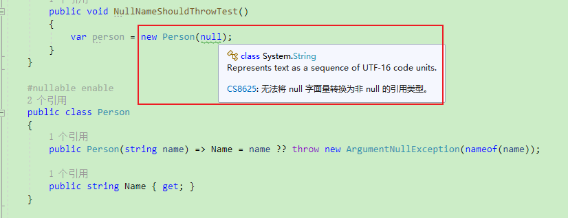

**弄明白C#中可空类型的方方面面（可空上下文、空操作、可空特性、?相关的运算符：?、?.、??、??=、!、?）**

[toc]

> 可空上下文、空操作相关的运算符，需要 C# 8.0 。可空值类型在 C# 2.0 时就已经可用，C#8.0开始，引入了可空引用类型。

# `?` 可空类型声明

`?` 用于声明一个可空类型，包括 **可空引用类型、可空值类型**。

```C#
int? a=null;
string? b=null;
```

明确在可空类型不为空时，获取其成员或属性时，可以使用空包容运算符`!`：

```C#
b!.Length;
```

可空值类型是通过泛型可空类型 [System.Nullable<T>](https://learn.microsoft.com/en-us/dotnet/api/system.nullable-1) 实现的。其声明的简写形式就是 `T?`。

作为引用类型，`string?` 和 `string` 都由 `System.String` 类型表示。而值类型 `int?` 和 `int` 则由 `System.Nullable<System.Int32>` 和 `System.Int32` 表示。

可空引用类型`T?`和`Nullable<T>`没有任何关系，可空引用类型`T?`只在编译时起作用，在运行时和T的作用是相同的。

**可空类型可以在可空上下文中更好的检查空引用的问题。**

**同时，在处理数据库和其他包含可能未赋值的元素的数据类型时，可以将 `null` 赋值给数值类型或布尔型的变量，这个功能特别有用。** 因为数据库中 null 默认值非常常见。

# 可空上下文 Nullable contexts

可空上下文 用于表示所有默认类型不可为空，只有使用使用 `?` 显式声明的类型才是可空类型。

可空上下文的启用可以有效避免`System.NullReferenceException`异常的问题，只有明确可为空的变量，才能为null值，否则 **所有引用类型的变量都被解释为不可为空**。除非显式设置为null，这样避免了null值和null引用。

可空上下文的启用取值有：disable、enable、warnings、annotations(注释)。

**从 .net6 开始，项目默认是启用可空上下文的。**

`可空上下文/可空类型` 的启用方式有三种：

- 项目属性 -> 生成 -> 可为 Null 的类型：

  

- 项目文件`.csproj`中，添加`<Nullable>enable</Nullable>`节点：

```xml
<PropertyGroup>
  <OutputType>WinExe</OutputType>
  <TargetFramework>net6.0-windows</TargetFramework>
  <Nullable>enable</Nullable>
  <UseWPF>true</UseWPF>
</PropertyGroup>
```

- 预编译或预处理指令 `#nullable enable` 用于在文件中的一段代码内或范围中，局部启用可空上下文。

```C#
//enable表示启用
#nullable enable
//disable表示停用
#nullable disable

// 还原这段代码中可空引用类型和可空警告。
#nullable restore
```

# WarningsAsErrors 将警告视为错误

上面的设置，即使 `<Nullable>enable</Nullable>` 启用可空上下文，默认也只是提供警告。

如果想要更严格地执行可空类型的建议，可以使用 `WarningsAsErrors` 将警告转换为编译错误：

```xml
    <Nullable>enable</Nullable>
    <WarningsAsErrors>$(WarningsAsErrors);CS8600;CS8601;CS8602;CS8603;CS8604;CS8609;CS8610;CS8614;CS8616;CS8618;CS8619;CS8622;CS8625</WarningsAsErrors>
```

# 可空值类型的的判断（是否为null、是否有值、类型转换）

使用 类型模式的`is`操作符 或 `as`操作符，可以将 可空值类型 的值转换为值类型，若果为null，则不能转换。如下：

```C#
int? a = 31;
if (a is int valueOfA)
{
    Debug.WriteLine($"a = {valueOfA}");
}
else
{
    Debug.WriteLine("a 没有值");
}

// a = 31
```

`Nullable<T>.HasValue` 判断是否有值；

`Nullable<T>.Value` 获取可空类型的值。

```C#
int? b = 10;
if (b.HasValue)
{
    Debug.WriteLine($"b = {b.Value}");
}
else
{
    Debug.WriteLine("b 没有值");
}

// b = 10
```

可以直接与 `null` 比较，判断可空类型是否为`null`：

```C#
int? c = 7;
if (c != null)
{
    Debug.WriteLine($"c = {c.Value}");
}
else
{
    Debug.WriteLine("c 没有值");
}

// c = 7
```

可空类型如果为null，强制类型转换会抛出异常：

```C#
int? n = null;

//int m1 = n;    // 不能编译
int n2 = (int)n; // 可以编译，但如果a为null，则抛出异常
```

# 可空值类型的类型及基础类型

**GetUnderlyingType() 获取可空类型的基础类型、使用 typeof 获取可空值类型的类型（而不是 GetType()）、不使用 is 判断可空类型**

## GetUnderlyingType 获取基础类型

`Nullable.GetUnderlyingType(type)` 获取可空(值)类型的基础类型，如果不为可空(值)类型（基础类型后面没有基础类型），则返回 `null`。

```C#
Debug.WriteLine(Nullable.GetUnderlyingType(typeof(int)));       // [无基础类型]
Debug.WriteLine(Nullable.GetUnderlyingType(typeof(int?)));  // System.Int32
Debug.WriteLine(Nullable.GetUnderlyingType(typeof(DateTime)));  // [无]
Debug.WriteLine(Nullable.GetUnderlyingType(typeof(DateTime?))); // System.DateTime
Debug.WriteLine(Nullable.GetUnderlyingType(typeof(MyTest)));    // [无]
// Debug.WriteLine(Nullable.GetUnderlyingType(typeof(MyTest?)));
```

因此，可以实现判断是否为可空类型的方法 `IsNullable`：

```C#
bool IsNullable(Type type) => Nullable.GetUnderlyingType(type) != null;
```

## typeof 获取可空值类型的类型

使用 `typeof` 获取可空值类型的 `System.Type` 实例，然后判断该类型是否为可空类型：

```C#
Debug.WriteLine($"int? is {(IsNullable(typeof(int?)) ? "nullable" : "non nullable")} value type");
Debug.WriteLine($"int is {(IsNullable(typeof(int)) ? "nullable" : "non-nullable")} value type");

// int? is nullable value type
// int is non-nullable value type
```

**上面获取可空类型的基础类型的方法，不要使用 `Object.GetType` 获取 Type 实例。这是因为在可空值类型的实例上调用 `Object.GetType` 方法，会先装箱为 Object 对象。** 可空值类型装箱的非空实例的基础类型等于值的装箱类型。即，`GetType` 返回的是装箱后对象的`Type`实例。

```C#
int? a = 17;
Type typeOfA = a.GetType();
Debug.WriteLine(typeOfA.FullName);  // System.Int32

int b = 16;
Type typeOfB = b.GetType();
Debug.WriteLine(typeOfB.FullName);  // System.Int32
```

## 不使用`is`判断可空类型实例

同样，不要使用`is`操作符判断可空类型的实例。如下所示，`is int`和`is int?`都适用于`int`和`int?`类型，无法通过 `is` 操作符判断是否是可空值类型还是基础类型。 

```C#
int? a = 16;
if (a is int)
{
    Debug.WriteLine("int? instance is compatible with int");
}
if (a is int?)
{
    Debug.WriteLine("int? instance is compatible with int?");
}

int b = 15;
if (b is int?)
{
    Debug.WriteLine("int instance is compatible with int?");
}
if (b is int)
{
    Debug.WriteLine("int instance is compatible with int");
}

// int? instance is compatible with int
// int? instance is compatible with int?
// int instance is compatible with int?
// int instance is compatible with int
```

> `underlying type` 基础类型（感觉也可以翻译为`原类型`），表示的是值类型、.NET CLS中规定的基础类型。对应可空值类型原来的类型。
> 
> `primitive types` 原始类型。 


# `?.`、`?[]` 空条件运算符 `Null-conditional operators` 不为空时取值

这是最常用的方式。`空条件运算符`用于成员访问或元素访问，仅在对象不为null时，才会返回成员或元素，否则返回null。

- 如果 `a` 等于 null，则 `a?.x` 或 `a?[x]` 的结果为 null。
- 如果 `a` 不等于 null，则 `a?.x` 或 `a?[x]` 等同于 `a.x` 或 `a[x]`。

```C#
A?.B?.Do(C);
A?.B?[C];
```

等同：

```C#
if(A != null){
    if(A.B != null){
        A.B.Do(C);
        A.B[C];
    }
}
```

# `??` 和 `??=` 空合并运算符

- `??` 空合并运算符（`null-coalescing operator`，coalesce [ˌkəʊəˈles]）：如果表达式的值为`null`，则返回右边的值；如果不为`null`，则返回当前值。

空合并运算符`??` 表示，如果当前值为空时，则取后面的值，否则获取当前值。省去了对当前值是否为`null`的判断。类似于获取一个默认值。

> `??` 也翻译为 `空结合运算符`。

```C#
int? a = null;

Debug.WriteLine(a??double.NaN); // NaN

// b 默认值为 10
var b = a??10;
```

等同：

```C#
if(a == null){
    Debug.WriteLine(double.NaN); // NaN
    var b = 10;
}
else
{
    Debug.WriteLine(a); // NaN
    var b = a;
}
```

借助 `??` 可以方便的实现可空类型到非可空类型的转换：

```C#
int? a = 28;
int b = a ?? -1;

int? c = null;
int d = c ?? -1;
```

空条件和空结合运算符一起使用：

```C#
List<int>? nullInts=null;
Debug.WriteLine($"nullInts的元素数量为：{nullInts?.Count ?? 0}");
nullInts = new List<int> { 1 };
Debug.WriteLine($"nullInts的元素数量为：{nullInts?.Count ?? 0}");

// nullInts的元素数量为：0
// nullInts的元素数量为：1
```

- `??=` 空合并赋值运算符（`null-coalescing assignment operator`）：当左边的变量为`null`时，将右边的值赋值给该变量；否则不赋值。（即，为空时赋值，不为空则不赋值）

```C#
List<int> numbers = null;
int? a = null;

(numbers ??= new List<int>()).Add(5);
Debug.WriteLine(string.Join(" ", numbers));  // 输出: 5

numbers.Add(a ??= 10);
Debug.WriteLine(string.Join(" ", numbers));  // 输出: 5 10
Debug.WriteLine(a);  // 输出: 10
```

等同于

```C#
if( numbers == null){
    numbers = new List<int>();
}
numbers.Add(5);

if( a == null){
    a = 10;
}
numbers.Add(a);
```

# `!` 空包容或空抑制运算符 `null-forgiving operator`/`null-suppression operator`

`!`是一个一元后缀运算符，位于变量的后面。其实称之为 `空抑制运算符` 含义更加贴切。`!`用于获取一个可空类型的非空，或者 将可空类型转换为非空。

即 `x!` 声明 可为空的引用类型的表达式 `x` 不为 `null`。

空包容运算符在运行时不起作用，它仅通过更改表达式的 null 状态来影响编译器的静态流分析。在运行时其结果为 `x` 的结果。

> 一元前缀`!`运算符 是 逻辑非运算符。

使用空抑制运算符，将一个可空类型赋值为不为空的类型：

```C#
string notNull = "Hello";
string? nullable = default;
notNull = nullable!; // null forgiveness
```

比如一个最简单的使用：

```C#
Test MyTest2()
{
    Test? a = new Test();
    //Test? a = null ;

    var b = a ;

    var c = a!;

    return a!;
}
```

空包容运算符 可以用来测试参数的验证逻辑。比如下面的类：

```C#
#nullable enable
public class Person
{
    public Person(string name) => Name = name ?? throw new ArgumentNullException(nameof(name));

    public string Name { get; }
}
```

> `#nullable enable` 预处理指令 用于 启动可空类型。

在测试中，为了验证参数，可以如下处理：

```C#
[TestMethod, ExpectedException(typeof(ArgumentNullException))]
public void NullNameShouldThrowTest()
{
    var person = new Person(null!);
}
```

启用可空类型的情况下，是不允许将 null 传递给 string 类型的，需要为 `string?` 可空字符串才行。将会产生警告：`Warning CS8625: Cannot convert null literal to non-nullable reference type`

如何不使用 空包容运算符 ：

  

通过使用 包容运算符，告知编译器传递 null 是预期行为，不应发出警告。

在明确知道某个表达式不为 null 时，也可以使用 空包容运算符。比如，下面 `IsValid` 方法返回`true`，则说明其参数不是 null，则可以取消 null 类型引用：

```C#
public void NullTest()
{
    Person? p = new Person("John");
    if (IsValid(p))
    {
        Debug.WriteLine($"Found {p!.Name}");
    }
}

public static bool IsValid(Person? person)
=> person is not null && person.Name is not null;
```

如果不使用 null包容运算符，编译器将为 `p.Name` 生成警告：`Warning CS8602: Dereference of a possibly null reference`。

`IsValid` 方法中，可以使用 `NotNullWhen` 特性，当方法返回 true 时，方法的参数不能是 null：

```C#
public static bool IsValid2([NotNullWhen(true)] Person? person)
=> person is not null && person.Name is not null;
```

# `?:` 条件运算符`conditional operator` 或 三元条件运算符

三元条件运算符的语法如下：当条件为真`true`时，取值`consequent`，否则（`false`时）取值`alternative`。

```C#
condition ? consequent : alternative
```

C#9.0 之前，条件表达式中两个可能取值的类型必须相同

```C#
var rand = new Random();

int? x = (rand.NextDouble() > 0.5) ? 12 : 0;

IEnumerable<int> xs = x ==0 ? new int[] { 0, 1 } : new int[] { 2, 3 };
```

从 C#9.0 开始，两个取值的类型可以相同，也可以能够隐式转换的类型。

```C#
var rand = new Random();

int? x = (rand.NextDouble() > 0.5) ? 12 : null;

IEnumerable<int> xs = x is null ? new List<int>() { 0, 1 } : new int[] { 2, 3 };
```

# 可空特性（用于方便灵活的向可空类型迁移和可空类型的各种应用）

> 本部分主要出自 [C# 8.0 的可空引用类型，不止是加个问号哦！你还有很多种不同的可空玩法](https://blog.csdn.net/wpwalter/article/details/103760542) 非常的好文，推荐阅读。

使用可空特性，在项目编译成类库之后，依然可以做到被引用它的程序集识别。原因在于相关的可空特性被编译到了程序集中。

可空特性是通过 `NullableAttribute` 和 `NullableContextAttribute` 这两个特性标记的。因此，对于古老的 .NET Framework 4.5 或者 .NET Standard 2.0 项目，同样可以编译出支持可空信息的程序集（可以通过反编译查看确认）。

将老项目迁移到可空类型、或实际应用可空类型 时，启用可空上下文后，有很多属于代码逻辑的问题，导致无法将类型迁移到可空、或无法正确使用可空。

比如：

1. 有时不得不为非空的类型赋值为 null 
2. 有时获取可空类型时，明确知道此时一定不为 null
3. 一个方法，可能这种情况下返回的是 null ，另一种情况下返回的是非 null；
4. 一个方法，可能调用者传入 null 的时候才返回 null，或者返回非 null 时不允许传入 null。

为了解决和应对这些情况，C# 8.0 在引入可空引用类型时，还同时引入了下面这些 `Attribute`：

- `AllowNull`: 标记一个不可空的输入实际上是可以传入 null 的。
- `DisallowNull`: 标记一个可空的输入实际上不应该传入 null。
- `MaybeNull`: 标记一个非空的返回值实际上可能会返回 null。
- `NotNull`: 标记一个可空的返回值实际上是不可能为 null 的。
- `MaybeNullWhen`: 当返回指定的 true/false 时某个参数才可能为 null，而返回相反的值时那个参数则不可为 null。
- `NotNullWhen`: 当返回指定的 true/false 时，某个参数不可为 null，而返回相反的值时那个参数则可能为 null。
- `NotNullIfNotNull`: 指定的参数传入 null 时才可能返回 null，指定的参数传入非 null 时就不可能返回 null。
- `DoesNotReturn`: 指定一个方法是不可能返回的。
- `DoesNotReturnIf`: 在方法的输入参数上指定一个条件，当这个参数传入了指定的 true/false 时方法不可能返回。

这些特性用于在各种具体情况或问题下，使用它们完成相应的可空操作或可空类型的应用。下面会列出相关典型的例子，查看这些特性如何使用。

## 输入：AllowNull

`[AllowNull]`特性允许为一个非可空类型赋值 null。

如下，写一个处理了 null 的属性：

```C#
public string Text
{
    get => GetValue() ?? "";
    set => SetValue(value ?? "");
}
```

当获取属性值的时候，肯定不会获取到 `null`，因为在`get`里面指定了非 null 的默认值；同时，允许设置 `null` 值到这个属性，因为也处理了 赋值null 的情况。

属性`Text`的类型为`string`，为不可空类型，如果要允许赋值`null`，可以加上特性 `AllowNull`。这样，在获取属性时会得到非`null`的值，而设置的时候可以设置成`null`。

```C#
[AllowNull]
public string Text
{
    get => GetValue() ?? "";
    set => SetValue(value ?? "");
}
```

## 输入：DisallowNull

与前面的场景相反，不允许为`null`。

```C#
private string? _text;

[DisallowNull]
public string? Text
{
    get => _text;
    set => _text = value ?? throw new ArgumentNullException(nameof(value), "不允许将这个值设置为 null");
}
```

当获取这个属性的时候，这个属性可能还没有初始化，因此会得到`null`。然后，并不允许你将这个属性赋值为 `null`，因为这是个不合理的值。

因此，可以为这个属性加上 `DisallowNull` 特性，这样，获取此属性的时候会得到可能为 `null` 的值，而设置的时候却不允许为 `null`。

## 输出：MaybeNull 或泛型约定 notnull

如果你有尝试过迁移代码到可空类型，基本上一定会遇到泛型方法的迁移问题：

```C#
public T Find<T>(int index)
{
}
```

比如以上这个方法，找到了就返回找到的值，找不到就返回 `T` 的默认值。那么问题来了，`T` 没有指定这是值类型还是引用类型。

如果 `T` 是引用类型，那么默认值 `default(T)` 就会引入 `null`。但是泛型 `T` 并没有写成 `T?`，因此它是不可为 `null` 的。然而值类型和引用类型的 `T?` 代表的是不同的含义。这种矛盾应该怎么办？

这个时候，请给返回值标记 `MaybeNull`：**这表示此方法应该返回一个不可为 `null` 的类型，但在某些情况下可能会返回 `null`。**

```C#
[return: MaybeNull]
public T Find<T>(int index)
{
}
```

实际上这样的写法并没有从本质上解决掉泛型 `T` 的问题，不过可以用来给旧项目迁移时用来兼容 API 使用。

如果你可以不用考虑 API 的兼容性，那么可以使用新的泛型契约 `where T : notnull`。

```C#
public T Find<T>(int index) where T : notnull
{
}
```

## 输出：NotNull

如果有一个方法，参数可以传入 `null` ：

```C#
public void EnsureInitialized(ref string? text)
{
}
```

然而，这个方法的语义或者作用，或者逻辑处理上，可以确认此字段初始化，一定会初始化。于是，就表示为，可以传入`null`，但不会返回`null`。此时可以标记为 `NotNull`。

```C#
public void EnsureInitialized([NotNull] ref string? text)
{
}
```

## NotNullWhen, MaybeNullWhen

`string.IsNullOrEmpty` 的实现就使用到了 `NotNullWhen`：

```C#
bool IsNullOrEmpty([NotNullWhen(false)] string? value);
```

**它表示当返回 `false` 的时候，`value` 参数是不可为 `null` 的。**

这样，你在这个方法返回的 `false` 判断分支里面，是不需要对变量进行判空的。

更典型的还有 TryDo 模式。比如下面是 `Version` 类的 `TryParse`：

```C#
bool TryParse(string? input, [NotNullWhen(true)] out Version? result)
```

当返回 `true` 的时候，`result` 一定不为 `null`。

## NotNullIfNotNull

表示当参数不为空的时候，一定不返回空。

**典型的情况，比如指定默认值：**

```C#
[return: NotNullIfNotNull("defaultValue")]
public string? GetValue(string key, string? defaultValue)
{
}
```

这段代码里面，如果指定的默认值（`defaultValue`）是非 `null`，那么返回值也不为 `null` 。

## IsNullOrWhiteSpace

## MemberNotNull特性

# 附：关于`可空值类型`及其要解决的问题

> 本部分出自 [[深入解析C#] 可空值类型](https://cloud.tencent.com/developer/article/1966988) 极具参考的一篇文章，推荐。

Tony Hoare于1965年在Algol语言中首次引入了null引用的概念，后来他把这项举措称为“十亿美金的过失”。无数开发人员饱受NullReferenceException（.NET）、NullPointerException（Java）等的折磨。由于此类问题的普遍性，Stack Overflow上有大量与之相关的典型问题。

既然可空特性如此声名狼藉，为何 C# 2 以及 .NET 2.0 要引入可空值类型呢？

在深入可空值类型的实现细节之前，首先看看它可以解决哪些问题，以前又是如何解决这些问题的。

##　目标：表达信息的缺失

有时我们需要一种变量来保存某种信息，但是相关信息并不需要时刻都“在场”，例如以下几种场景：

- 为客户订单建模，订单中包含公司信息一栏，但并不是所有人都以公司名义提交订单。

- 为个人信息建模，个人信息中包含生卒年月，但并不是每个人都有卒年信息。

- 为某款产品进行筛选器建模，筛选条件中包含产品的价格范围，但是客户可能并没有给出产品的最高价格。

上述场景都指向了一个需求，那就是表示“未提供的值”。即便当前我们能够获得所有信息，但依然需要为信息缺失的可能情况建模，因为在某些场景中，获得的信息可能是不完整的。

在第2个场景中，我们甚至可能连某个人的出生日期也不知道，可能系统刚好没有登记或者是其他情况。有时我们还需要详细区分哪些信息是一定会缺失的，哪些信息是不知是否会缺失的。

不过在多数情况下，只需要能够表达出“信息缺失”就足够了。

对于引用类型，C#语言已经提供了表示其信息缺失的方法：`null`引用。

假设有一个`Company`类和一个`Order`类，`Order`类中有一个与公司信息关联的引用。当客户没有指定具体的公司信息时，就可以把该引用设为`null`。

而对于值类型，C# 1中并没有相应的表示`null`值的方法，当时普遍采用下面两种方式实现：

- 当数据缺失时，采用预设值。比如第3个场景中的价格筛选器，当没有指定最高价格时，可以采用`decimal.MaxValue`作为默认的最大值。

- 单独维护一个布尔型的标志来表示其他字段是实际值还是默认值，这样在访问字段前先检查该标志，即可知道该字段当前值是否有效。

然而，以上两种方式都不太理想。第1种方式挤压了有效值的范围（`decimal`类型还没什么太大问题，但如果是`byte`类型，就必须覆盖所有取值范围）。第2种方式则会导致很多冗余和逻辑重复。

更严重的是，这两种方式都容易出错，因为二者都需要在使用前检查变量。不经过检查，就无法知晓变量是否为有效值，之后代码可能一直默默地使用错误的数据，错误地执行，并把这些错误传递给系统其他部分。这种“静默”的失败是最棘手的，因为很难追踪和撤销。相对而言，**能够在执行路径中明确抛出异常会好很多**。

**可空值类型封装了前面第2种方式：为每个值类型维护一个额外的标志，用该标志来指示当前值是否可用**。封装这一步是关键：它把对值类型访问的安全性和易用性结合了起来。如果当前访问的值是无效的，抛出异常即可。

**可空值类型维持了原有类型的对外使用方式不变，还具备表达信息缺失的能力。这样的实现方式既减轻了开发人员的编码负担，也保证了类库开发人员设计API时符合语法标准。**

有了这些基础概念，下面看一下 framework 和 CLR 为实现可空值类型提供了哪些支持。讲解完这部分内容后，还会介绍C#引入的一些特性，**这些特性可以简化可空值类型的使用方式**。

## CLR 和 framework 的支持：`Nullable<T>`结构体

### `Nullable<T>`结构体

**可空值类型特性背后的核心要素是`Nullable<T>`结构体。**

`Nullable<T>`的一个早期版本如下所示：

```C#
public struct Nullable<T> where T : struct <------ 泛型结构体，其类型约束为非空值类型
{
    private readonly T value;
    private readonly bool hasValue;

    public Nullable(T value) <------ 提供了值的构造器
    {
        this.value = value;
        this.hasValue = true;
    }

    public bool HasValue { get { return hasValue; } } <------ 用于检查值是否存在的属性

    public T Value  (本行及以下10行) 访问值，如果值不存在则抛出异常
    {
        get
        {
            if (!hasValue)
            {
                throw new InvalidOperationException();
            }
            return value;
        }
    }
}
```

以上代码显示：该结构体声明了唯一的构造器，并将`hasValue`的初始值设为`true`，该**结构体类型还隐含了一个无参构造器（结构体类型的共性）**。无参构造器则会将`hasValue`的初始值设为`false`，将`value`的初始值设为`T`类型的默认值：

```C#
Nullable<int> nullable = new Nullable<int>();

Console.WriteLine(nullable.HasValue); <------ 打印结果：False
```

`Nullable<T>`中的`where T : struct`约束表示`T`可以是除`Nullable<T>`外的任意值类型，原始类型、枚举、系统内置结构体和用户自定义结构体等都满足该约束，因此以下写法均合法：

- `Nullable<int>`
- `Nullable<FileMode>`
- `Nullable<Guid>`
- `Nullable<LocalDate>` （来自Noda Time项目）


以下写法皆非法：

- `Nullable<string>`（string是引用类型）；
- `Nullable<int[]>`（数组是引用类型，与内部元素是否是值类型无关）；
- `Nullable<ValueType>`（ValueType本身并不是值类型）；
- `Nullable<Enum>`（Enum本身也不是值类型）；
- `Nullable<Nullable<int>>`（`Nullable<int>`是可空类型本身）；
- `Nullable<Nullable<Nullable<int>>>`（将可空类型嵌套也没有用）。

**在`Nullable<T>`中，`T`称为基础类型，比如`Nullable<int>`的基础类型是`int`。**

至此，已经可以在没有 CLR、framework 或 语言 的支持下，通过`Nullable<T>`类解决之前那个价格筛选器的问题了：

```C#
public void DisplayMaxPrice(Nullable<decimal> maxPriceFilter)
{
    if (maxPriceFilter.HasValue)
    {
        Console.WriteLine("Maximum price: {0}", maxPriceFilter.Value);
    }
    else
    {
        Console.WriteLine("No maximum price set.");
    }
}
```

以上代码可谓良质，使用变量前会对其进行检查。

如果没有检查变量或者检查错了对象会怎么样呢？即使这样也无须担忧，因为当`HasValue`为`false`时，任何访问`maxPriceFilter`的操作都会引发异常。

> 说明：**语言的进步不仅仅体现在让编码变得更简单，还体现在能够让开发人员编写出更健全的代码，或者可以降低错误后果的严重性**。

### `Nullable<T>`结构体的其他方法或运算符

另外，`Nullable<T>`结构体还提供了如下一些方法和运算符。

- 无参数的`GetValueOrDefault()`方法负责返回结构体中的值，如果`HasValue`是`false`，则返回默认值。

- 带参数的`GetValueOrDefault(T defaultValue)`方法同样负责返回结构体中的值，如果`HasValue`是`false`，则返回由实参指定的默认值。

- `Nullable<T>`重写了`object`类的`Equals(object)`和`GetHashCode()`方法，使其行为更加明确：首先比较`HasValue`属性；当两个比较对象的`HasValue`均为`true`时，再比较`Value`属性是否相等。

- 可以执行从`T`到`Nullable<T>`的隐式类型转换。该转换总是会返回对应的可空值，并且其`HasValue`为`true`。该隐式转换等同于调用带参数的构造器。

- 可以执行从`Nullable<T>`到`T`的显式类型转换。当`HasValue`为`true`时返回封装于其中的值，当`HasValue`为`false`时则抛出`InvalidOperationException`。该转换等同于使用Value属性。

`CLR`需要做的事情，就是保证`struct`类型约束。`CLR`针对可空值类型还提供了一项帮助：装箱（`boxing`）。

### 装箱行为

当涉及装箱行为时，可空值类型和非可空值类型的行为有所不同。**当非可空值类型被装箱时，返回结果的类型就是原始的装箱类型**，例如：

```C#
int x = 5;

object o = x;
```

o是对 “装箱int” 对象的引用。在C#中，“装箱int” 和 int 之间的区别通常是不可见的：如果执行`o.GetType()`，返回的`Type`值会和`typeof(int)`的结果相同。诸如`C++/CLI`这样的语言，则允许开发人员对装箱前后的类型加以区分。

然而，**可空值类型并没有直接对等的装箱类型**。`Nullable<T>`类型的值进行装箱后的结果，视`HasValue`属性的值而定：

如果`HasValue`为`false`，那么结果是一个`null`引用；

如果`HasValue`为`true`，那么结果是“装箱T”对象的引用。

如下展现了以上两点，可空值类型的装箱效果：

```C#
Nullable<int> noValue = new Nullable<int>();
object noValueBoxed = noValue; // <------ 值的装箱操作，HasValue为false
Console.WriteLine(noValueBoxed == null); // <------ 打印结果：True。装箱操作的结果是null引用


Nullable<int> someValue = new Nullable<int>(5);
object someValueBoxed = someValue; // <------ 值的装箱操作，HasValue为true
Console.WriteLine(someValueBoxed.GetType()); // <------ System.Int32，装箱操作的结果是装箱后的int
```

这正是理想的装箱行为，不过它有一个比较奇怪的副作用：**在`System.Object`中声明的`GetType()`方法为非虚方法（不能重写），对某个值类型调用`GetType()`方法时总会先触发一次装箱操作**。该行为或多或少会影响效率，但是还不至于造成困扰。

**如果对可空值类型调用`GetType()`，要么会引发`NullReferenceException`，要么会返回对应的非可空值类型**，如下所示，可空值类型调用`GetType`方法会得到奇特的结果：

```C#
Nullable<int> noValue = new Nullable<int>();
// Console.WriteLine(noValue.GetType()); // <------ 会抛出NullReferenceException
Nullable<int> someValue = new Nullable<int>(5);
Console.WriteLine(someValue.GetType());  // <------ System.Int32。与调用typeof(int)得到的结果一致
```

> **对 `T?` 是装箱后，堆中的装箱值是`T`而不是`T?`**。这种优化的结果存在的可能性是因为一个装了箱的值已经成为一个引用类型所以具备表达为null的能力。
> 
> ```C#
> int? a = 5;
> Console.WriteLine(a.GetType().Name);//int
> Console.WriteLine(typeof(int?)); //nullable<int>    
> ```

> C#允许通过as运算符对一个可空值进行拆箱操作，如果操作失败，则返回一个null：
> 
> ```C#
> object o = "string";
> int? x = o as int?;
> Console.WriteLine (x.HasValue); // False
> ```


除了 framework 和 CLR 对可空值类型的支持，C#语言还有其他设计来保证可空值类型的易用性。

## 语言层面的支持

### `?`后缀

从一个最简单特性开始：可空值类型命名的简化`?`后缀。

在类型名后添加`?`后缀是`Nullable<T>`类型简化版的写法。两种写法效果等同，而且该写法对简版类型名（`int`、`double`等）和全版类型名都适用。

下面4个声明完全等价：

```C#
Nullable<int> x;
Nullable<int32> x;
int? x;
int32 x;
```

上述4种写法任意组合、混用都没有问题，它们产生的IL代码没有任何区别。

`?`后缀用于简化类型的表达，下一个特性则用于简化值的表达。

### null字面量

C# 1 中 null 表达式永远代指一个 null 引用。到了C# 2，null 的含义扩展了：**或者表示一个 null 引用，或者表示一个 HasValue 为 false 的可空类型的值**。

**`null`值可用于赋值、函数实参以及比较等任何地方。**

需要强调：**当`null`用于可空值类型时，它表示`HasValue`为`false`的可空类型的值，而不是`null`引用**。

null引用和可空值类型不容易辨明，例如，以下两行代码是等价的：

```C#
int? x = new int?();

int? x = null;
```

推荐使用`null`（第2种写法）而不是显式调用无参构造函数。

不过当涉及比较逻辑时，这两种写法就不容易抉择了，例如：`if (x != null)`、`if (x.HasValue)` 完全可以依照编程习惯来使用。

### 转换

存在从`T`到`Nullable<T>`的隐式类型转换，以及从`Nullable<T>`到`T`的显式类型转换。

此外，C#语言还允许**链式转换**。

```C#
int? x = 5; // implicit
int y = (int)x; // explicit
```

显示转换与直接调用可空类型的`Value`属性是等价的，所以当`HasVaue`为`false`时，会抛出异常。

...... 之后的部分原文比较混乱，但是有不知道原本的出处（应该是某本书中的介绍），也没法去查找，因此再试不摘录了。

# 参考

- [?? and ??= operators (C# reference)](https://learn.microsoft.com/en-us/dotnet/csharp/language-reference/operators/null-coalescing-operator)
- [! （null 包容）运算符](https://learn.microsoft.com/zh-cn/dotnet/csharp/language-reference/operators/null-forgiving)
- [Nullable value types](https://learn.microsoft.com/en-us/dotnet/csharp/language-reference/builtin-types/nullable-value-types)
- [C# 8.0 如何在项目中开启可空引用类型的支持](https://blog.walterlv.com/post/how-to-enable-nullable-reference-types)