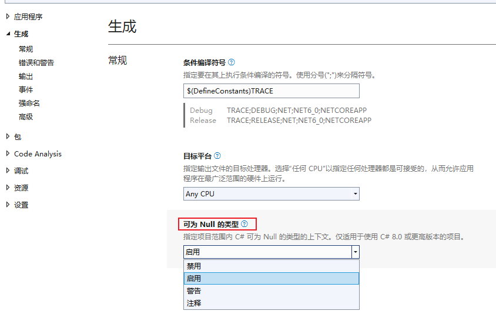

**C#中可空上下文、可空类型的声明使用及判断值、VS设置警告为错误**

[toc]

> 可空上下文、空操作相关的运算符，需要 C# 8.0 。可空值类型在 C# 2.0 时就已经可用，C#8.0开始，引入了可空引用类型。

# `?` 可空类型声明

`?` 用于声明一个可空类型，包括 **可空引用类型、可空值类型**。

```C#
int? a=null;
string? b=null;
```

明确在可空类型不为空时，获取其成员或属性时，可以使用空包容运算符`!`：

```C#
b!.Length;
```

可空值类型是通过泛型可空类型 [System.Nullable<T>](https://learn.microsoft.com/en-us/dotnet/api/system.nullable-1) 实现的。其声明的简写形式就是 `T?`。

作为引用类型，`string?` 和 `string` 都由 `System.String` 类型表示。而值类型 `int?` 和 `int` 则由 `System.Nullable<System.Int32>` 和 `System.Int32` 表示。

可空引用类型`T?`和`Nullable<T>`没有任何关系，可空引用类型`T?`只在编译时起作用，在运行时和T的作用是相同的。

**可空类型可以在可空上下文中更好的检查空引用的问题。**

**同时，在处理数据库和其他包含可能未赋值的元素的数据类型时，可以将 `null` 赋值给数值类型或布尔型的变量，这个功能特别有用。** 因为数据库中 null 默认值非常常见。

# 可空上下文 Nullable contexts

可空上下文 用于表示所有默认类型不可为空，只有使用使用 `?` 显式声明的类型才是可空类型。

可空上下文的启用可以有效避免`System.NullReferenceException`异常的问题，只有明确可为空的变量，才能为null值，否则 **所有引用类型的变量都被解释为不可为空**。除非显式设置为null，这样避免了null值和null引用。

可空上下文的启用取值有：disable、enable、warnings、annotations(注释)。

**从 .net6 开始，项目默认是启用可空上下文的。**

`可空上下文/可空类型` 的启用方式有三种：

- 项目属性 -> 生成 -> 可为 Null 的类型：

  

- 项目文件`.csproj`中，添加`<Nullable>enable</Nullable>`节点：

```xml
<PropertyGroup>
  <OutputType>WinExe</OutputType>
  <TargetFramework>net6.0-windows</TargetFramework>
  <Nullable>enable</Nullable>
  <UseWPF>true</UseWPF>
</PropertyGroup>
```

- 预编译或预处理指令 `#nullable enable` 用于在文件中的一段代码内或范围中，局部启用可空上下文。

```C#
//enable表示启用
#nullable enable
//disable表示停用
#nullable disable

// 还原这段代码中可空引用类型和可空警告。
#nullable restore
```

# WarningsAsErrors 将警告视为错误

上面的设置，即使 `<Nullable>enable</Nullable>` 启用可空上下文，默认也只是提供警告。

如果想要更严格地执行可空类型的建议，可以编辑项目文件，使用 `WarningsAsErrors` 将警告转换为编译错误：

```xml
    <Nullable>enable</Nullable>
    <WarningsAsErrors>$(WarningsAsErrors);CS8600;CS8601;CS8602;CS8603;CS8604;CS8609;CS8610;CS8614;CS8616;CS8618;CS8619;CS8622;CS8625</WarningsAsErrors>
```

# 可空值类型的的判断（是否为null、是否有值、类型转换）

使用 类型模式的`is`操作符 或 `as`操作符，可以将 可空值类型 的值转换为值类型，如果为null，则不能转换。如下：

```C#
int? a = 31;
if (a is int valueOfA)
{
    Debug.WriteLine($"a = {valueOfA}");
}
else
{
    Debug.WriteLine("a 没有值");
}

// a = 31
```

`Nullable<T>.HasValue` 判断是否有值；

`Nullable<T>.Value` 获取可空类型的值。

```C#
int? b = 10;
if (b.HasValue)
{
    Debug.WriteLine($"b = {b.Value}");
}
else
{
    Debug.WriteLine("b 没有值");
}

// b = 10
```

可以直接与 `null` 比较，判断可空类型是否为`null`：

```C#
int? c = 7;
if (c != null)
{
    Debug.WriteLine($"c = {c.Value}");
}
else
{
    Debug.WriteLine("c 没有值");
}

// c = 7
```

可空类型如果为null，强制类型转换会抛出异常：

```C#
int? n = null;

//int m1 = n;    // 不能编译
int n2 = (int)n; // 可以编译，但如果a为null，则抛出异常
```

# 参考

- [Nullable value types](https://learn.microsoft.com/en-us/dotnet/csharp/language-reference/builtin-types/nullable-value-types)
- [C# 8.0 如何在项目中开启可空引用类型的支持](https://blog.walterlv.com/post/how-to-enable-nullable-reference-types)
