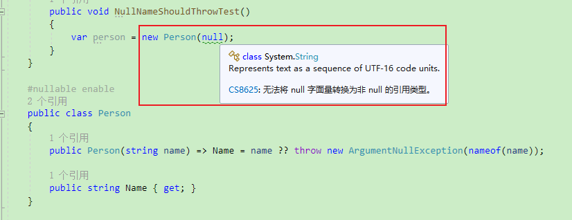

**C# 使用于变量尾部的空包容运算符!，三元条件运算符?:**

[toc]

主要介绍一下在可空类型变量使用过程中，最常遇到的取非空值的情况，由于兼容性的考虑，直接使用可空类型目前只有警告，如果严格一些，只有 可空类型变量 不为空的值才能使用。而 空抑制运算符 可以直接获取非空值，在 明确变量不为空、或者不能使用null值 的情况下，非常有用。

此外，还稍微介绍下，可能是编程语言中非常常见的三元条件运算符 `condition?express1:express2`，同时也是极少达到三元的操作符。

# `!` 空包容或空抑制运算符 `null-forgiving operator`/`null-suppression operator`

`!`是一个一元后缀运算符，位于变量的后面。其实称之为 `空抑制运算符` 含义更加贴切。`!`用于获取一个可空类型的非空，或者 将可空类型转换为非空。

即 `x!` 声明 可为空的引用类型的表达式 `x` 不为 `null`。

空包容运算符在运行时不起作用，它仅通过更改表达式的 null 状态来影响编译器的静态流分析。在运行时其结果为 `x` 的结果。

> 一元前缀`!`运算符 是 逻辑非运算符。

使用空抑制运算符，将一个可空类型赋值为不为空的类型：

```C#
string notNull = "Hello";
string? nullable = default;
notNull = nullable!; // null forgiveness
```

比如一个最简单的使用：

```C#
Test MyTest2()
{
    Test? a = new Test();
    //Test? a = null ;

    var b = a ;

    var c = a!;

    return a!;
}
```

空包容运算符 可以用来测试参数的验证逻辑。比如下面的类：

```C#
#nullable enable
public class Person
{
    public Person(string name) => Name = name ?? throw new ArgumentNullException(nameof(name));

    public string Name { get; }
}
```

> `#nullable enable` 预处理指令 用于 启动可空类型。

在测试中，为了验证参数，可以如下处理：

```C#
[TestMethod, ExpectedException(typeof(ArgumentNullException))]
public void NullNameShouldThrowTest()
{
    var person = new Person(null!);
}
```

启用可空类型的情况下，是不允许将 null 传递给 string 类型的，需要为 `string?` 可空字符串才行。将会产生警告：`Warning CS8625: Cannot convert null literal to non-nullable reference type`

如果不使用 空包容运算符 ，可以看到如下的 CS8625 警告：

  

通过使用 空包容运算符，告知编译器传递 null 是预期行为，不应发出警告。

**在明确知道某个表达式不为 null 时，也可以使用 空包容运算符**。

比如，下面 `IsValid` 方法返回`true`，则说明其参数不是 null，则可以取消 null 类型引用：

```C#
public void NullTest()
{
    Person? p = new Person("John");
    if (IsValid(p))
    {
        Debug.WriteLine($"Found {p!.Name}");
    }
}

public static bool IsValid(Person? person)
=> person is not null && person.Name is not null;
```

如果不使用 null包容运算符，编译器将为 `p.Name` 生成警告：`Warning CS8602: Dereference of a possibly null reference`。

`IsValid` 方法中，可以使用 `NotNullWhen` 特性，当方法返回 true 时，方法的参数不能是 null：

```C#
public static bool IsValid2([NotNullWhen(true)] Person? person)
=> person is not null && person.Name is not null;
```

# `?:` 条件运算符`conditional operator` 或 三元条件运算符

三元条件运算符的语法如下：当条件为真`true`时，取值`consequent`，否则（`false`时）取值`alternative`。

```C#
condition ? consequent : alternative
```

C# 9.0 之前，条件表达式中两个可能取值的类型必须相同

```C#
var rand = new Random();

int? x = (rand.NextDouble() > 0.5) ? 12 : 0;

IEnumerable<int> xs = x ==0 ? new int[] { 0, 1 } : new int[] { 2, 3 };
```

从 C# 9.0 开始，两个取值的类型可以相同，也可以是能够隐式转换的类型。

```C#
var rand = new Random();

int? x = (rand.NextDouble() > 0.5) ? 12 : null;

IEnumerable<int> xs = x is null ? new List<int>() { 0, 1 } : new int[] { 2, 3 };
```

# 参考

- [! （null 包容）运算符](https://learn.microsoft.com/zh-cn/dotnet/csharp/language-reference/operators/null-forgiving)