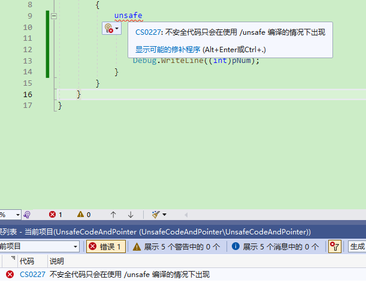
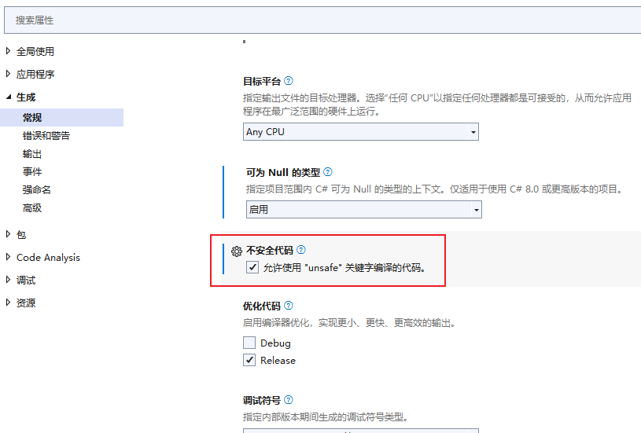
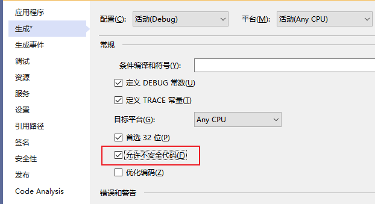

**C#中的不安全代码和指针**

[toc]

平时所写的C#代码都是“可验证的安全代码”（`verifiably safe code`），这表示 .NET 工具可以验证代码是安全的。

安全代码不能使用指针直接访问内存，并且也不分配原始的内存，而是创建托管对象（`managed objects`）。

# unsafe 不安全上下文

通过`unsafe`关键字可以启用不安全的上下文，用以编写`不能验证的`代码。在`unsafe`上下文的代码中可以使用指针、分配和释放内存块、使用函数指针调用方法等。

不安全代码不代表是危险的，仅仅表示代码的安全性不能验证。

不安全代码有下面的几种属性：

- 方法、类型和代码块可以定义为`unsafe`不安全
- 一些情况下，不安全代码通过移除数组边界检查可以提高应用程序的性能
- 当调用需要指针的本地代码时，需要使用不安全代码
- 不安全代码引入了安全性和稳定性的挑战
- 必须启用`AllowUnsafeBlocks`编译器选项才能编译包含不安全代码块的代码

如果要使用不安全代码，需要启用`AllowUnsafeBlocks`，否则会报错`CS0227`。

  

`AllowUnsafeBlocks`的启用分为以下几种方式：

修改`.csproj`项目文件，添加如下即可：

```xml
<AllowUnsafeBlocks>true</AllowUnsafeBlocks>
```

或者，修改vs的项目属性，在“生成”中勾选`不安全代码``允许使用"unsafe"关键字编译的代码`。

  

或者`允许不安全代码`（.Net Framework）

  

# 不安全代码的使用

## 指针类型（Pointer types）

### 指针类型的介绍和声明

在不安全的上下文中，除了值类型（`value type`）和引用类型（`reference type`）之外，还可以使用`指针类型`（`Pointer type`）。指针类型的声明为：

```C#
type* identifier;
void* identifier; //及其不推荐
```

> 不能操作`void*`类型的指针，但是可以将其转换为其他类型的指针；同样其他任何类型的指针都可以转换为`void*`。
> 
> 指针可以是`null`，但是操作空指针可能会有未预见的行为。


**指针类型中`*`之前的类型被称为`referent type`，只有非托管类型可以是`referent type`。**

指针类型并不继承自`object`，并且指针类型和`object`之间不能转换，装箱、拆箱不支持指针。但是，**可以在不同的指针类型之间、指针类型和整型之间进行转换**。

同一声明中声明多个指针时，直接将星号`*`与基础类型写在一起即可，不用作为每个指针名的前缀。

```C#
int* p1, p2, p3;   // Ok
int *p1, *p2, *p3;   // C#中无效
```

### 指针类型的含义

**`MyType*`类型的指针变量的值，是一个`MyType`类型的变量的地址。**

下面是几种指针类型声明的示例：

- `int* p`：`p`是一个指向 `integer` 的指针。
- `int** p`: `p`是一个指向 `integer`指针 的指针。
- `int*[] p`: `p`是一个指向 `integers` 的一维数组指针。
- `char* p`: `p`是一个指向 `char` 的指针。
- `void* p`: `p`是一个指向未知类型的指针。

## `*`间接寻址运算符

`*`除了声明指针变量，还可以作为`指针间接寻址运算符`，用于访问指针变量指向位置的内容。

如下，使用`int*`类型的执行，并`*`寻址获取内容：

```C#
unsafe
{
    int myInt;
    int* myIntPtr=&myInt;

    // 间接寻址运算符
    *myIntPtr = 11;

    Console.WriteLine($"myInt值：{myInt}");
    Console.WriteLine($"*myIntPtr取值：{*myIntPtr}");
    Console.WriteLine($"myInt地址：{(int)myIntPtr}");
}

// 输出：
// myInt值：11
// *myIntPtr取值：11
// myInt地址：3623348284
```

## 引用类型变量使用指针

**指针不能指向引用类型或包含引用类型的结构体(`struct`)**，因为，即使有指针指向，引用对象也可以被垃圾回收。

垃圾回收不会跟踪对象是否有任何的指针指向。

除了垃圾回收之外，引用对象在使用中，还有可能发生位置移动，对象所在的堆地址有可能会发生变化。

因此，要使用引用类型的指针，需要将对象pin住（固定住，钉住），防止其位置移动。C# 提供了`fixed`语句实现pin堆中的对象，从而在使用内部指针时，对象不会移动。

下面的示例来自官方，使用 unsafe 关键字 和 fixed 语句，显示如何增加内部指正和取值赋值：

> `p + n` 和 `n + p` 表达式表示`T*`类型的指针`p`，在其地址上加上`n * sizeof(T)`，即产生新的指针，指向指针`p`之后的第n个元素数据的首地址。
> 
> `n * sizeof(T)`表达式则表示`T*`类型的指针`p`，在其地址上减去`n * sizeof(T)`，指向指针`p`之前的第n个元素地址。

```C#
// Normal pointer to an object.
int[] a = new int[5] { 10, 20, 30, 40, 50 };
// Must be in unsafe code to use interior pointers.
unsafe
{
    // Must pin object on heap so that it doesn't move while using interior pointers.
    fixed (int* p = &a[0])
    {
        // p is pinned as well as object, so create another pointer to show incrementing it.
        int* p2 = p;
        Console.WriteLine(*p2);
        // Incrementing p2 bumps the pointer by four bytes due to its type ...
        p2 += 1;
        Console.WriteLine(*p2);
        p2 += 1;
        Console.WriteLine(*p2);
        Console.WriteLine("--------");
        Console.WriteLine(*p);
        // Dereferencing p and incrementing changes the value of a[0] ...
        *p += 1;
        Console.WriteLine(*p);
        *p += 1;
        Console.WriteLine(*p);
    }
}

Console.WriteLine("--------");
Console.WriteLine(a[0]);

/*
Output:
10
20
30
--------
10
11
12
--------
12
*/
```

**方法之间不应该传递指针**。如果一个方法通过`in`、`out`、`ref`参数或函数返回值返回一个本地变量的指针，如果该指针位于固定块`fixed block`内，则变量将会不再固定，从而产生未定义的行为。


> **关于指针加减运算的含义：**
>  
> 加减算术运算：对于指向数组的指针变量，可以加上或减去一个整数n，指针变量加或减一个整数n的意义：是把指针指向的当前位置(指向某数组元素)向前或向后移动n个位置，指向该位置的数组元素。
>
> 因为数组有不同的类型，各种类型的数组元素所占的字节长度不同；如 **指针变量加 1，即向后移动 1 个位置表示指针变量指向下一个数组元素的首地址，而不是原地址基础上加 1。**
> 
> **指针变量的加减运算只能对数组指针变量进行，对指向其它类型变量的指针变量作加减运算是毫无意义的(虽然可以运算)。**
> 
> 两个指针变量之间的运算只有指向同一数组的两个指针变量之间才能进行运算
> 
> 两指针变量相减：所得之差是两个指针所指数组元素之间相差的元素个数；
> 
> 两指针变量进行关系运算：指向同一数组的两指针变量进行关系运算可表示他们所指数组元素之间的关系：`pf1 == pf2`表示pf1和pf2指向同一数组元素；`pf1 > pf2`表示pf1处于高地址位置；`pf1 < pf2`表示pf2处于高地址位置。
> 
> 设 p 为指针变量，则 `p == 0` 表明 p 是空指针，不指向任何变量； `p != 0` 表示不是空指针；指针变量未赋值时，可以是任意值，但不能使用。
>
> 参考自 [c语言指针向前移动i个位置,C语言指针](https://blog.csdn.net/weixin_29156679/article/details/117104497)


## 指针成员访问操作符`->`

> Pointer member access operator ->

`->` 是指针间接寻址和成员访问的综合。

**如果`x`是一个`T*`类型的指针，`y`是类型`T`的可访问成员，则`x->y`表达式等同于`(*x).y`。**

`->`的使用示例

```C#
public struct Coords
{
    public int X;
    public int Y;
    public override string ToString() => $"({X}, {Y})";
}

public class PointerMemberAccessExample
{
    public static unsafe void Main()
    {
        Coords coords;
        Coords* p = &coords;
        p->X = 3;
        p->Y = 4;
        Console.WriteLine(p->ToString());  // output: (3, 4)
    }
}
```

## 指针元素访问操作符`[]`

> Pointer element access operator []

**`p[n]`指针`p`元素访问等同于`*(p+n)`。**

下面通过指针和`[]`访问数组元素：

```C#
unsafe
{
    char* pointerToChars = stackalloc char[123];

    for (int i = 65; i < 123; i++)
    {
        pointerToChars[i] = (char)i;
    }

    Debug.Write("Uppercase letters: ");
    for (int i = 65; i < 91; i++)
    {
        Debug.Write(pointerToChars[i]);
    }
    Debug.WriteLine("");
    Debug.Write("Lowercase letters: ");
    for (int i = 97; i < 123; i++)
    {
        Debug.Write(pointerToChars[i]);
    }
}

// 输出:
// Uppercase letters: ABCDEFGHIJKLMNOPQRSTUVWXYZ
// Lowercase letters: abcdefghijklmnopqrstuvwxyz
```

> 注意，不检查`out-of-bounds`错误。

## 指针类型转换

下面将`int*`类型的指针强制转换为`byte*`指针，并获取`byte`数据。

> **`sizeof(type)`方法计算一个类型占用的空间大小（字节个数）。**

```C#
int number = 1024;

unsafe
{
    // Convert to byte:
    byte* p = (byte*)&number;

    Debug.Write("整型的四个字节:");

    // Display the 4 bytes of the int variable:
    for (int i = 0; i < sizeof(int); ++i)
    {
        Debug.Write((*p).ToString("X2")+" ");
        // Increment the pointer:
        p++;
    }
    Debug.WriteLine("");
    Debug.WriteLine("整型的值: {0}", number);

    /* Output:
        整型的四个字节: 00 04 00 00
        整型的值: 1024
    */
}
```


# 参考

- [Pointer related operators](https://learn.microsoft.com/en-us/dotnet/csharp/language-reference/operators/pointer-related-operators)