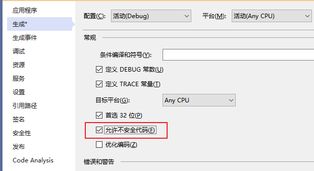

C#中的不安全代码和指针介绍

[toc]

平时所写的C#代码都是“可验证的安全代码”（`verifiably safe code`），这表示 .NET 工具可以验证代码是安全的。

安全代码不能使用指针直接访问内存，并且也不分配原始的内存，而是创建托管对象（`managed objects`）。

> 本篇主要参考翻译自官网文档，参见文末的参考列表

# unsafe 不安全上下文

通过`unsafe`关键字可以启用不安全的上下文，用以编写`不能验证的`代码。在`unsafe`上下文的代码中可以使用指针、分配和释放内存块、使用函数指针调用方法等。

不安全代码不代表是危险的，仅仅表示代码的安全性不能验证。

不安全代码有下面的几种属性：

- 方法、类型和代码块可以定义为`unsafe`不安全
- 一些情况下，不安全代码通过移除数组边界检查可以提高应用程序的性能
- 当调用需要指针的本地代码时，需要使用不安全代码
- 不安全代码引入了安全性和稳定性的挑战
- 必须启用`AllowUnsafeBlocks`编译器选项才能编译包含不安全代码块的代码

如果要使用不安全代码，需要启用`AllowUnsafeBlocks`，否则会报错`CS0227`。

  

`AllowUnsafeBlocks`的启用分为以下几种方式：

修改`.csproj`项目文件，添加如下即可：

```xml
<AllowUnsafeBlocks>true</AllowUnsafeBlocks>
```

或者，修改vs的项目属性，在“生成”中勾选`不安全代码``允许使用"unsafe"关键字编译的代码`。

  

或者`允许不安全代码`（.Net Framework）

  

# 不安全代码的使用

## unsafe 修饰符的使用

通过`unsafe`关键字表示不安全上下文，通常指定一个代码块。

```C#
unsafe{
    // unsafe code block
}
```

可以在属性、方法、类的声明中使用`unsafe`修饰符，表示类型或成员的整个正文范围均被视为不安全上下文。

`fixed`语句用于禁止垃圾回收器重定位可移动的变量（垃圾回收可能不可预知的移动变量地址），主要针对的引用类型的变量；`fixed`修饰符还可用于创建固定大小的缓冲区。

`fixed`语句或修饰符只能出现在不安全的上下文中。

在C#中使用指针时，只能操作struct，不能操作class，不能在泛型类型代码中使用未定义类型的指针。

## 指针类型（Pointer types）

### 指针类型的介绍和声明

在不安全的上下文中，除了值类型（`value type`）和引用类型（`reference type`）之外，还可以使用`指针类型`（`Pointer type`）。指针类型的声明为：

```C#
type* identifier;
void* identifier; //及其不推荐
```

> 不能操作`void*`类型的指针，但是可以将其转换为其他类型的指针；同样其他任何类型的指针都可以转换为`void*`。
> 
> 指针可以是`null`，但是操作空指针可能会有未预见的行为。


**指针类型中`*`之前的类型被称为`referent type`，只有非托管类型可以是`referent type`。**

指针类型并不继承自`object`，并且指针类型和`object`之间不能转换，装箱、拆箱不支持指针。但是，**可以在不同的指针类型之间、指针类型和整型之间进行转换**。

同一声明中声明多个指针时，直接将星号`*`与基础类型写在一起即可，不用作为每个指针名的前缀。

```C#
int* p1, p2, p3;   // Ok
int *p1, *p2, *p3;   // C#中无效
```

### 指针类型的含义

**`MyType*`类型的指针变量的值，是一个`MyType`类型的变量的地址。**

下面是几种指针类型声明的示例：

- `int* p`：`p`是一个指向 `integer` 的指针。
- `int** p`: `p`是一个指向 `integer`指针 的指针。
- `int*[] p`: `p`是一个指向 `integers` 的一维数组指针。
- `char* p`: `p`是一个指向 `char` 的指针。
- `void* p`: `p`是一个指向未知类型的指针。

# 参考

- [Unsafe code, pointer types, and function pointers](https://learn.microsoft.com/en-us/dotnet/csharp/language-reference/unsafe-code)