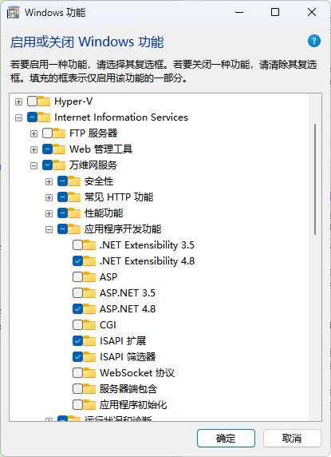

**C#以代码编程方式安装IIS角色和功能、Powershell命令行安装启用IIS**

[toc]

# 命令行中安装IIS

> 命令行中启用IIS功能都需要管理员权限。

## Powershell的`Enable-WindowsOptionalFeature`

### 简单启用

```sh
Enable-WindowsOptionalFeature -Online -FeatureName IIS-WebServerRole, IIS-WebServer, IIS-CommonHttpFeatures, IIS-ManagementConsole, IIS-HttpErrors, IIS-HttpRedirect, IIS-WindowsAuthentication, IIS-StaticContent, IIS-DefaultDocument, IIS-HttpCompressionStatic, IIS-DirectoryBrowsing
```

### PowerShell命令脚本

下面是 安装IIS 及 启用IIS模块 的PowerShell脚本，几乎是所有模块。

> 实际测试，这**些模块在不联网时，也是可以安装的**。

```C#
# This script installs IIS and the features required to
# run West Wind Web Connection.
#
# * Make sure you run this script from a Powershel Admin Prompt!
# * Make sure Powershell Execution Policy is bypassed to run these scripts:
# * YOU MAY HAVE TO RUN THIS COMMAND PRIOR TO RUNNING THIS SCRIPT!
Set-ExecutionPolicy Bypass -Scope Process

# To list all Windows Features: dism /online /Get-Features
# Get-WindowsOptionalFeature -Online 
# LIST All IIS FEATURES: 
# Get-WindowsOptionalFeature -Online | where FeatureName -like 'IIS-*'

Enable-WindowsOptionalFeature -Online -FeatureName IIS-WebServerRole
Enable-WindowsOptionalFeature -Online -FeatureName IIS-WebServer
Enable-WindowsOptionalFeature -Online -FeatureName IIS-CommonHttpFeatures
Enable-WindowsOptionalFeature -Online -FeatureName IIS-HttpErrors
Enable-WindowsOptionalFeature -Online -FeatureName IIS-HttpRedirect
Enable-WindowsOptionalFeature -Online -FeatureName IIS-ApplicationDevelopment

Enable-WindowsOptionalFeature -online -FeatureName NetFx4Extended-ASPNET45
Enable-WindowsOptionalFeature -Online -FeatureName IIS-NetFxExtensibility45

Enable-WindowsOptionalFeature -Online -FeatureName IIS-HealthAndDiagnostics
Enable-WindowsOptionalFeature -Online -FeatureName IIS-HttpLogging
Enable-WindowsOptionalFeature -Online -FeatureName IIS-LoggingLibraries
Enable-WindowsOptionalFeature -Online -FeatureName IIS-RequestMonitor
Enable-WindowsOptionalFeature -Online -FeatureName IIS-HttpTracing
Enable-WindowsOptionalFeature -Online -FeatureName IIS-Security
Enable-WindowsOptionalFeature -Online -FeatureName IIS-RequestFiltering
Enable-WindowsOptionalFeature -Online -FeatureName IIS-Performance
Enable-WindowsOptionalFeature -Online -FeatureName IIS-WebServerManagementTools
Enable-WindowsOptionalFeature -Online -FeatureName IIS-IIS6ManagementCompatibility
Enable-WindowsOptionalFeature -Online -FeatureName IIS-Metabase
Enable-WindowsOptionalFeature -Online -FeatureName IIS-ManagementConsole
Enable-WindowsOptionalFeature -Online -FeatureName IIS-BasicAuthentication
Enable-WindowsOptionalFeature -Online -FeatureName IIS-WindowsAuthentication
Enable-WindowsOptionalFeature -Online -FeatureName IIS-StaticContent
Enable-WindowsOptionalFeature -Online -FeatureName IIS-DefaultDocument
Enable-WindowsOptionalFeature -Online -FeatureName IIS-WebSockets
Enable-WindowsOptionalFeature -Online -FeatureName IIS-ApplicationInit
Enable-WindowsOptionalFeature -Online -FeatureName IIS-ISAPIExtensions
Enable-WindowsOptionalFeature -Online -FeatureName IIS-ISAPIFilter
Enable-WindowsOptionalFeature -Online -FeatureName IIS-HttpCompressionStatic

Enable-WindowsOptionalFeature -Online -FeatureName IIS-ASPNET45

# If you need classic ASP (not recommended)
#Enable-WindowsOptionalFeature -Online -FeatureName IIS-ASP


# The following optional components require 
# Chocolatey OR Web Platform Installer to install


# Install UrlRewrite Module for Extensionless Urls (optional)
###  & "C:\Program Files\Microsoft\Web Platform Installer\WebpiCmd-x64.exe" /install /Products:UrlRewrite2 /AcceptEULA /SuppressPostFinish
#choco install urlrewrite -y
    
# Install WebDeploy for Deploying to IIS (optional)
### & "C:\Program Files\Microsoft\Web Platform Installer\WebpiCmd-x64.exe" /install /Products:WDeployNoSMO /AcceptEULA /SuppressPostFinish
# choco install webdeploy -y

# Disable Loopback Check on a Server - to get around no local Logins on Windows Server
# New-ItemProperty HKLM:\System\CurrentControlSet\Control\Lsa -Name "DisableLoopbackCheck" -Value "1" -PropertyType dword
```

比如，在断网的情况下，单独安装 WebSocket 协议 模块：

```sh
PS C:\windows> Enable-WindowsOptionalFeature -Online -FeatureName IIS-WebSockets
```

**Disable-WindowsOptionalFeature 命令用于禁用卸载Windows功能。**

比如，断网情况下，卸载IIS的WebSocket 模块功能：

```sh
PS C:\windows> Disable-WindowsOptionalFeature -Online -FeatureName IIS-WebSockets
```

均成功！

可以从 `启用或关闭 Windows 功能` 中查看 WebSocket魔窟 是否安装



## Windows Server Powershell 的 Install-WindowsFeature 命令

Windows Server 版本下的Powershell安装特性和功能的命令为`Install-WindowsFeature`。

非 Server 版本下只能使用 `Enable-WindowsOptionalFeature` 命令。

- **Server下安装IIS**：

`Install-WindowsFeature –name Web-Server -IncludeManagementTools`

- **Server下卸载IIS**：

`Uninstall-WindowsFeature Web-Server` 或，添加上 `-IncludeManagementTools` 参数

> 使用`-Remove`参数完全卸载IIS和它的配置。如果只是卸载IIS服务器，并想在以后重新安装，**不要使用`-Remove`参数**。
>
> `Uninstall-WindowsFeature -Remove Web-Server`

> [Different ways for installing Windows features on the command line](https://peter.hahndorf.eu/blog/WindowsFeatureViaCmd.html)

## dism命令

> [DISM](http://msdn.microsoft.com/en-us/library/windows/desktop/dd371719(v=vs.85).aspx) ：Deployment Image Servicing and Management

```sh
START /WAIT DISM /Online /Enable-Feature /FeatureName:IIS-ApplicationDevelopment /FeatureName:IIS-ASP /FeatureName:IIS-ASPNET /FeatureName:IIS-BasicAuthentication /FeatureName:IIS-CGI /FeatureName:IIS-ClientCertificateMappingAuthentication /FeatureName:IIS-CommonHttpFeatures /FeatureName:IIS-CustomLogging /FeatureName:IIS-DefaultDocument /FeatureName:IIS-DigestAuthentication /FeatureName:IIS-DirectoryBrowsing /FeatureName:IIS-FTPExtensibility /FeatureName:IIS-FTPServer /FeatureName:IIS-FTPSvc /FeatureName:IIS-HealthAndDiagnostics /FeatureName:IIS-HostableWebCore /FeatureName:IIS-HttpCompressionDynamic /FeatureName:IIS-HttpCompressionStatic /FeatureName:IIS-HttpErrors /FeatureName:IIS-HttpLogging /FeatureName:IIS-HttpRedirect /FeatureName:IIS-HttpTracing /FeatureName:IIS-IIS6ManagementCompatibility /FeatureName:IIS-IISCertificateMappingAuthentication /FeatureName:IIS-IPSecurity /FeatureName:IIS-ISAPIExtensions /FeatureName:IIS-ISAPIFilter /FeatureName:IIS-LegacyScripts /FeatureName:IIS-LegacySnapIn /FeatureName:IIS-LoggingLibraries /FeatureName:IIS-ManagementConsole /FeatureName:IIS-ManagementScriptingTools /FeatureName:IIS-ManagementService /FeatureName:IIS-Metabase /FeatureName:IIS-NetFxExtensibility /FeatureName:IIS-ODBCLogging /FeatureName:IIS-Performance /FeatureName:IIS-RequestFiltering /FeatureName:IIS-RequestMonitor /FeatureName:IIS-Security /FeatureName:IIS-ServerSideIncludes /FeatureName:IIS-StaticContent /FeatureName:IIS-URLAuthorization /FeatureName:IIS-WebDAV /FeatureName:IIS-WebServer /FeatureName:IIS-WebServerManagementTools /FeatureName:IIS-WebServerRole /FeatureName:IIS-WindowsAuthentication /FeatureName:IIS-WMICompatibility /FeatureName:WAS-ConfigurationAPI /FeatureName:WAS-NetFxEnvironment /FeatureName:WAS-ProcessModel /FeatureName:WAS-WindowsActivationService
```

## 获取关于IIS的所有特性或功能

```sh
DISM.exe /Online /Get-Features | find "IIS"
```

## 其他

如下安装（去掉`/online`参数如何？）：

```sh
dism /online /enable-feature /featurename:IIS-WebServerRole
/featurename:IIS-WebServerManagementTools /featurename:IIS-ManagementConsole
```

但是似乎无法指定本地文件，参见[Install IIS Windows features by DISM on windows 10](https://stackoverflow.com/questions/49251453/install-iis-windows-features-by-dism-on-windows-10/54823436#54823436)

## PkgMgr【已被弃用，推荐使用DISM】

### 安装命令（全部功能）

```sh
start /w pkgmgr /iu:IIS-WebServerRole;IIS-WebServer;IIS-CommonHttpFeatures;IIS-StaticContent;IIS-DefaultDocument;IIS-DirectoryBrowsing;IIS-HttpErrors;IIS-ApplicationDevelopment;IIS-ISAPIExtensions;IIS-ISAPIFilter;IIS-NetFxExtensibility45;IIS-ASPNET45;IIS-NetFxExtensibility;IIS-ASPNET;IIS-HealthAndDiagnostics;IIS-HttpLogging;IIS-RequestMonitor;IIS-Security;IIS-RequestFiltering;IIS-HttpCompressionStatic;IIS-WebServerManagementTools;IIS-ManagementConsole;WAS-WindowsActivationService;WAS-ProcessModel;WAS-NetFxEnvironment;WAS-ConfigurationAPI
```

- `/iu:{update name}` 安装
- `/uu:{update name}` 卸载

### 介绍

Pkgmgr.exe is a new command tool in Windows Vista® / Windows Server® 2008 for installing Windows Optional Features。

### 安装IIS的默认功能

```sh
start /w pkgmgr /iu:IIS-WebServerRole;WAS-WindowsActivationService;WAS-ProcessModel;WAS-NetFxEnvironment;WAS-ConfigurationAPI
```

# C#实现启用安装IIS

## Process启动运行命令行cmd或PowerShell

【管理员权限运行】

> C#程序`DISM`命令，记得生成的程序选择`32bit`，否则可能会无效。

```C#
string command = "上面的命令";
ProcessStartInfo pStartInfo = new ProcessStartInfo("cmd.exe", "/c " + command);

//设置启动动作,确保以管理员身份运行 
pStartInfo.Verb = "runas";

Process p = new Process();
p.StartInfo = pStartInfo;
p.Start();
```

例子：

```C#
// 执行
string dism = "dism /NoRestart /online /enable-feature /featurename:IIS-WebServerRole /featurename:IIS-WebServerManagementTools /featurename:IIS-ManagementConsole /featurename:IIS-WindowsAuthentication";

ProcessEx.Run("cmd.exe","/c " + dism)

// 或者：

string SetupIIS()
{
    var featureNames = new [] 
    {
        "IIS-ApplicationDevelopment",
        "IIS-CommonHttpFeatures",
        "IIS-DefaultDocument",
        "IIS-ISAPIExtensions",
        "IIS-ISAPIFilter",
        "IIS-ManagementConsole",
        "IIS-NetFxExtensibility",
        "IIS-RequestFiltering",
        "IIS-Security",
        "IIS-StaticContent",
        "IIS-WebServer",
        "IIS-WebServerRole",
    };

    return ProcessEx.Run(
        "dism",
        string.Format(
            "/NoRestart /Online /Enable-Feature {0}",
            string.Join(
                " ", 
                featureNames.Select(name => string.Format("/FeatureName:{0}",name)))));
}           


// ProcessEx 启用运行Process
static string Run(string fileName, string arguments)
{
    ProcessStartInfo pStartInfo = new ProcessStartInfo
    {
        FileName = fileName,
        Arguments = arguments,
        CreateNoWindow = true,
        WindowStyle = ProcessWindowStyle.Hidden,
        RedirectStandardOutput = true,
        UseShellExecute = false,
    };  

    //设置启动动作,确保以管理员身份运行 
    pStartInfo.Verb = "runas";

    using (var process = Process.Start(pStartInfo))
    {
        process.WaitForExit();
        return process.StandardOutput.ReadToEnd();
    }
} 
```

## 使用 PowerShell Host 应用

[Adding and invoking commands](https://learn.microsoft.com/en-us/powershell/scripting/developer/hosting/adding-and-invoking-commands?view=powershell-7.2)


# 另：IIS的Windows服务名称 `iisadmin`

# 另：iisreset 命令，直接运行或调用，重启IIS

# 参考

- [Enable IIS Feature in windows 10 programaticaaly using c#](https://learn.microsoft.com/en-us/answers/questions/993288/enable-iis-feature-in-windows-10-programaticaaly-u)

- [Better way to install IIS7 programmatically](https://stackoverflow.com/questions/16079030/better-way-to-install-iis7-programmatically)

- [Installing IIS 7.0 from the Command Line](https://learn.microsoft.com/en-us/iis/install/installing-iis-7/installing-iis-from-the-command-line)
- [Programmatically enable (install) IIS
](https://stackoverflow.com/questions/32097336/programmatically-enable-install-iis)

> InstallShield 中提供的启用Windows功能：[Enabling Windows Roles and Features During a Suite/Advanced UI Installation](http://helpnet.flexerasoftware.com/installshield22helplib/helplibrary/SteWindowsFeat.htm)