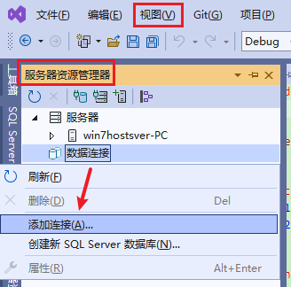

**C#使用ConfigurationManager读取和修改App.config配置文件、App.config自定义配置信息**

[toc]

> ConfigurationManager 的使用，需要添加`System.Configuration.dll`引用，`using System.Configuration;`

> 再早之前有一个`ConfigurationSettings`类用于操作配置文件（`.Net FrameWork 2.0`之前），不过已经过时，明确已经废弃，不推荐使用。

# App.config 配置文件介绍

## App.config

**应用程序配置文件是标准的 XML 文件，XML 标记和属性是区分大小写的。**

配置文件的根节点是`configuration`。经常访问用到的`appSettings`是由`.Net`预定义的配置节，“配置节”可以理解为进行配置一个XML的节点。

App.config 在 Winfrom、WPF 项目创建时会自动生成（.NET Framework版本），Web.config 则时`ASP.Net`项目创建时生成的，用于Web项目的配置。

  

> `appSettings`配置节为整个程序的配置。

## 添加 App.config 配置文件（App.config 的生成）

控制台应用、.NET Core/.NET6+ 等项目，默认不会生成 App.config 或 Web.config。

添加 或 创建 config 配置文件的方法如下：

1. 右键项目，添加 - 新建项：`应用程序配置文件(Application Configuration File)`；
2. 修改新建的配置文件名称。
3. 修改配置文件的属性：复制到输出目录-较新则复制；生成操作-内容。

**只有第一步是必须的。**

  

可以添加多个配置，但是，通常只需要一个默认的足够用了。

再生成后，项目的`App.config`会生成为`[ApplicationName].exe.config`文件。

> 生成后，默认应用程序名的`.config`文件，可以直接读取、操作其中的配置项。

> 有的 .NET 版本生成的`.config`文件会有两个，另一个为`[ApplicationName].vshost.exe.config`，它是原代码“app.config”的同步文件，在程序运行中不会发生更改。

> 类库dll添加的 App.config 文件打开时，可能需要指定程序集路径：
> `Configuration dllConfig = ConfigurationManager.OpenExeConfiguration(Assembly.GetExecutingAssembly().Location);`

# ConfigurationManager 操作配置文件

ConfigurationManager是一个提供对客户端应用程序配置文件访问的静态类，此类不能被继承。

## 引用 System.Configuration

使用 ConfigurationManager 类，需要引用 `System.Configuration.dll` 或 `System.Configuration.ConfigurationManager` Nuget 包。

  

比如直接读取`appSettings`配合节下的`Key`的值：

`ConfigurationManager.AppSettings[Key];`

`ConfigurationManager.AppSettings["key"]` 获取的结果是一个字符串值，因此，无法在其配置项下添加子节点。

```xml
<?xml version="1.0" encoding="utf-8" ?>
<configuration>
    <appSettings>
        <add key="key1" value="key1_value" />
        <add key="key2" value="key2_value" />
        <add key="key3" value="key3_value" />
    </appSettings>
    <startup> 
        <supportedRuntime version="v4.0" sku=".NETFramework,Version=v4.6.2" />
    </startup>
</configuration>
```

## ConfigurationHelper 帮助类读取、设置、删除 AppSettings 的配置项

> 关于 `ConfigurationManager.AppSettings.Set(key,value)` 修改配置项，它只是在内存中修改，并不会保存到配置文件中。
> 
> 因此，需要 `ConfigurationManager.OpenExeConfiguration()` 方法打开配置文件对象，并调用对象的 `save()` 保存配置修改到文件中。
> 
> 然后调用`ConfigurationManager.RefreshSection("appSettings")`更新读取到内存中的配置数据，实现配置修改的热更新。

> 实际测试，不用调用`ConfigurationManager.RefreshSection("appSettings"/"connectionStrings")`，也会获取到最新更新的值。

> 官网介绍刷新节点的方法为：`ConfigurationManager.RefreshSection(configFile.AppSettings.SectionInformation.Name);`，这种方法感觉比 **直接写节点名** 方便且正确多了。

```C#
using System;
using System.Collections.Generic;
using System.Configuration;
using System.Linq;

namespace AppConfigFile_Net46
{
    /// <summary>
    /// 应用程序配置文件 App.config/Web.config 访问辅助类【访问的是 AppSettings 配置节下的配置项】
    /// </summary>
    internal class ConfigurationHelper
    {
        /// <summary>
        /// 读取string配置项
        /// </summary>
        /// <param name="appSettingKey">AppSetting配置项的Key值</param>
        /// <param name="defaultValue">默认值</param>
        /// <returns>返回对应配置项的string类型value值</returns>
        public static string GetAppSettingValue(string appSettingKey, string defaultValue = "")
        {
            string result = ConfigurationManager.AppSettings[appSettingKey];
            if (string.IsNullOrEmpty(result))
            {
                return defaultValue;
            }
            return result;
        }

        /// <summary>
        /// 读取bool配置项
        /// </summary>
        /// <param name="appSettingKey">AppSetting配置项的Key值</param>
        /// <param name="defaultValue">默认值</param>
        /// <returns>返回对应配置项的bool类型value值</returns>
        public static bool GetAppSettingValue(string appSettingKey, bool defaultValue)
        {
            string result = ConfigurationManager.AppSettings[appSettingKey];
            if (String.IsNullOrEmpty(result))
            {
                return defaultValue;
            }
            bool boolResult = false;
            if (bool.TryParse(result, out boolResult))
            {
                return boolResult;
            }
            else
            {
                return defaultValue;
            }
        }

        /// <summary>
        /// 读取int配置项
        /// </summary>
        /// <param name="appSettingKey">AppSetting配置项的Key值</param>
        /// <param name="defaultValue">默认值</param>
        /// <returns>返回对应配置项的int类型value值</returns>
        public static int GetAppSettingValue(string appSettingKey, int defaultValue)
        {
            string result = ConfigurationManager.AppSettings[appSettingKey];
            if (String.IsNullOrEmpty(result))
            {
                return defaultValue;
            }
            int intResult = 0;
            if (int.TryParse(result, out intResult))
            {
                return intResult;
            }
            else
            {
                return defaultValue;
            }
        }

        /// <summary>
        /// 读取double类型配置项
        /// </summary>
        /// <param name="appSettingKey">AppSetting配置项的Key值</param>
        /// <param name="defaultValue">默认值</param>
        /// <returns>返回对应配置项的double类型value值</returns>
        public static double GetAppSettingValue(string appSettingKey, double defaultValue)
        {
            string result = ConfigurationManager.AppSettings[appSettingKey];
            if (String.IsNullOrEmpty(result))
            {
                return defaultValue;
            }
            double doubleResult = 0.0;
            if (double.TryParse(result, out doubleResult))
            {
                return doubleResult;
            }
            else
            {
                return defaultValue;
            }
        }

        /// <summary>
        /// 修改App.config中AppSetttings中的配置项
        /// </summary>
        /// <param name="name">要修改的配置项的名称</param>
        /// <param name="value">要修改的配置项的值</param>
        /// <returns></returns>
        public static bool SetAppSettings(string name, string value)
        {
            try
            {
                Configuration config = ConfigurationManager.OpenExeConfiguration(ConfigurationUserLevel.None);//当前应用程序的配置文件
                if (config != null)
                {
                    //AppSettingsSection appSettings = (AppSettingsSection)config.GetSection("appSettings");
                    // if (appSettings.Settings.AllKeys.Contains(name))
                    if (config.AppSettings.Settings.AllKeys.Contains(name))
                    {
                        config.AppSettings.Settings[name].Value = value;
                    }
                    else
                    {
                        config.AppSettings.Settings.Add(name, value);
                    }
                    config.Save(); //保存配置文件  // config.Save(ConfigurationSaveMode.Full);
                    //ConfigurationManager.RefreshSection("appSettings"); // 刷新，更新缓存。无需重启，获取最新的配置值
                    ConfigurationManager.RefreshSection(config.AppSettings.SectionInformation.Name);
                    return true;
                }
                return false;
            }
            catch (Exception ex)
            {
                Console.WriteLine(String.Format("修改app.config配置{0}的值为{1}异常：{2}", name, value, ex.Message));
                return false;
            }
        }

        /// <summary>
        /// 修改App.config中AppSetttings中的配置项
        /// </summary>
        /// <param name="name">要修改的配置项的名称</param>
        /// <param name="value">要修改的配置项的值</param>
        /// <returns></returns>
        public static bool SetAppSettings(params KeyValuePair<string, string>[] keyValuePairs)
        {
            if (keyValuePairs == null || keyValuePairs.Length == 0)
            {
                throw new Exception("未指定设置的配置项");
            }
            try
            {
                Configuration config = ConfigurationManager.OpenExeConfiguration(ConfigurationUserLevel.None);//当前应用程序的配置文件
                if (config != null)
                {
                    for (int i = 0; i < keyValuePairs.Length; i++)
                    {
                        var name = keyValuePairs[i].Key;
                        if (config.AppSettings.Settings.AllKeys.Contains(name))
                        {
                            config.AppSettings.Settings[name].Value = keyValuePairs[i].Value;
                        }
                        else
                        {
                            config.AppSettings.Settings.Add(name, keyValuePairs[i].Value);
                        }
                    }
                    config.Save(); //保存配置文件  // config.Save(ConfigurationSaveMode.Full);
                    //ConfigurationManager.RefreshSection("appSettings"); // 刷新，更新缓存。无需重启，获取最新的配置值
                    ConfigurationManager.RefreshSection(config.AppSettings.SectionInformation.Name);
                    return true;
                }
                return false;
            }
            catch (Exception ex)
            {
                Console.WriteLine(String.Format("修改app.config配置时发生异常：{0}", ex.Message));
                return false;
            }
        }

        /// <summary>
        /// 删除appsetting节点下配置项
        /// </summary>
        /// <param name="key"></param>
        /// <param name="value"></param>
        public static void DeleteAppSettings(string key)
        {
            if (ConfigurationManager.AppSettings.AllKeys.Contains(key))
            {
                var config = ConfigurationManager.OpenExeConfiguration(ConfigurationUserLevel.None);//当前应用程序的配置文件
                //如果当前节点存在，则删除当前节点
                config.AppSettings.Settings.Remove(key);
                config.Save(ConfigurationSaveMode.Modified);
                //ConfigurationManager.RefreshSection("appSettings");
                ConfigurationManager.RefreshSection(config.AppSettings.SectionInformation.Name);
            }
            else
            {
                Console.WriteLine("当前节点不存在");
            }
        }
    }
}
```

## 测试使用 ConfigurationHelper

```C#
// 读取 和 添加
private void button1_Click(object sender, EventArgs e)
{
   var key1= ConfigurationHelper.GetAppSettingValue("key1");
   var key1_defalut= ConfigurationHelper.GetAppSettingValue("key1","key1_default");

   ConfigurationHelper.SetAppSettings("key1", "key1_value");
   ConfigurationHelper.SetAppSettings("key2", "key2_value");
   ConfigurationHelper.SetAppSettings("key3", "key3_value");

   ConfigurationHelper.SetAppSettings(new KeyValuePair<string, string>("1", "2"));
   ConfigurationHelper.SetAppSettings(new KeyValuePair<string, string>("1", "5"), new KeyValuePair<string, string>("2", "6"));


   ConfigurationHelper.SetAppSettings("keyM.1.2.3", "keyM.1.2.3_value");
}

// 修改
private void button2_Click(object sender, EventArgs e)
{
   MessageBox.Show(ConfigurationHelper.GetAppSettingValue("key2"));

   ConfigurationHelper.SetAppSettings("key2", "key2_"+(new Random().Next()));

   MessageBox.Show(ConfigurationHelper.GetAppSettingValue("key2"));
}

// 删除
private void button3_Click(object sender, EventArgs e)
{
   MessageBox.Show(ConfigurationHelper.GetAppSettingValue("key3"));

   ConfigurationHelper.DeleteAppSettings("key3");

   MessageBox.Show(ConfigurationHelper.GetAppSettingValue("key3"));
}
```

# ConnectionStrings 配置节

## 简要介绍

`ConnectionStrings` 是 .NET 预置的另一个配置节点。表示 `ADO.NET` 连接数据库的连接字符串的配置。

读取连接字符串：

`string connectionString = ConfigurationManager.ConnectionStrings[connectionName].ConnectionString;`

使用ConnectionString的好处： 

第一：可将连接字符串加密，使用MS的一个加密工具即可。 
第二：可直接邦定到数据源控件，而不必写代码读出来再赋值给控件。 
第三：可方便的更换数据库平台，如换为Oracle数据库，只需修改providerName。 【通常也要更换连接字符串】

【关于这几个好处，等后续再了解】

## ConnectionStrings 的读取和修改添加【抽象的方法】

`connectionStrings` 在 `App.config` 中的基本配置如下：

```xml
<configuration>
  <connectionStrings>
    <add name="Mariadb" connectionString="Server=localhost;Database=userdb;User=user;Password=pwd;ConvertZeroDateTime=true;" />
    <add name="SQLServer1" connectionString="Data Source=服务器名;Initial Catalog=数据库名;User ID=用户;Password=密码" providerName="System.Data.SqlClient" />
    <add name="SQLServer2" connectionString="server=服务器名;database=数据库名; Ueer ID=用户;Password=密码" providerName="System.Data.SqlClient" />
  </connectionStrings>
</configuration>
```

- 读取连接字符串

```C#
var server1_connStr = ConfigurationManager.ConnectionStrings["SQLServer1"].ConnectionString;
var mariadb_connStr = ConfigurationManager.ConnectionStrings["Mariadb"].ConnectionString;
```

- `SetConnectionStrings` 方法 修改 或 添加 连接字符串

```C#
/// <summary>
/// 修改 或 添加 ConnectionStrings 连接字符串 并 保存
/// </summary>
/// <param name="connStr"></param>
/// <param name="connStrName"></param>
/// <param name="providerName">SQLServer为 System.Data.SqlClient；</param>
private static void SetConnectionStrings(string connStrName, string connStr, string providerName = null)
{
    Configuration config = ConfigurationManager.OpenExeConfiguration(ConfigurationUserLevel.None);//当前应用程序的配置文件
    var connStrSets = config.ConnectionStrings.ConnectionStrings[connStrName];
    if (connStrSets != null)
    {
        connStrSets.ConnectionString = connStr;
        if (!string.IsNullOrWhiteSpace(providerName))
        {
            connStrSets.ProviderName = providerName;
        }
    }
    else
    {
        config.ConnectionStrings.ConnectionStrings.Add(new ConnectionStringSettings()
        {
            ConnectionString = connStr,
            Name = connStrName,
            ProviderName = providerName
        });
    }
    config.Save(); //保存配置文件  // config.Save(ConfigurationSaveMode.Full);
    //ConfigurationManager.RefreshSection("connectionStrings"); // 刷新，更新缓存。无需重启，获取最新的配置值
    ConfigurationManager.RefreshSection(config.ConnectionStrings.SectionInformation.Name);
}
```

测试修改和添加：

```C#
var connStr = "server=127.0.0.1;database=数据库名; Ueer ID=用户;Password=密码";
var connStrName = "SQLServer2";
SetConnectionStrings(connStrName, connStr);

var server2_connStr = ConfigurationManager.ConnectionStrings["SQLServer2"].ConnectionString;

SetConnectionStrings("SQLServer测试", connStr);

var serverT_connStr = ConfigurationManager.ConnectionStrings["SQLServer测试"].ConnectionString;
```


> `ConfigurationManager.ConnectionStrings[name].ConnectionString = "server=127.0.0.1;database=数据库名; Ueer ID=用户;Password=密码";` 直接赋值修改会报错，**该配置是只读的**。不能这样修改，而且这样无法保存到文件。

## 使用 服务器资源管理器 的 数据连接 获取数据库连接字符串

在 Visual Studio 中，选择 视图 -> 服务器资源管理器，右键“数据连接”，点击“添加连接”：

  

> 或者，点击“工具”->“连接数据库”：
> 
>   

  

> **. 或 localhost 表示连接本地。也可以指定ip，或电脑名。**
> 
> **如果不是默认实例，需要指定实例名：`ip\InstanceName`，SQL Server Express 安装的实例名并不是默认实例，连接时需要指定。**

选择数据库后，可以点击“测试连接”。点击“确定”。

在“服务器资源管理器”中，“数据连接”下就可以看见已连接的数据库。

右键该连接，点击“属性”，查看并复制链接字符串。

  

就可以将其复制到 App.config 的 `connectionStrings` 配置节下使用。

# 附：Web.config的操作方式

```C#
Configuration config = System.Web.Configuration.WebConfigurationManager.OpenWebConfiguration("~");

//其实这里微软建议采用as操作符转换 config.GetSection("appSettings") as AppSettingsSection;   

AppSettingsSection appsection = (AppSettingsSection)config.GetSection("appSettings");             

appsection.Settings[key].Value;  //读取某键值配置

appsection.Settings[key].Value = value; //修改某键值配置
```

> 除了`WebConfigurationManager`，似乎仍旧使用`ConfigurationManager`类也是可以的。

# 附：关于修改数据后配置不生效的问题

参考文章中，有提到`修改数据后配置文件未能立即生效`的问题，应该是未调用`RefreshSection()`方法导致，一般调用后就能更新缓存，可以做到不重启系统，读取最新的配置。

原文给出了简单的使用 xml操作类库 修改配置文件的示例：

```C#
void UpdateConfig(string key,string value)
{
    // 经常遇到的问题是修改数据后配置文件未能立即生效，再次读取时依然是修改前的数据。可尝试添加此处的“Xml方式”修改。

    // 通过Xml方式（需using System.xml;)
    //XmlDocument doc = new XmlDocument();
    //doc.Load(Application.ExecutablePath + ".config");
    //XmlNode node = doc.SelectSingleNode(@"//add[@key='" + key + "']"); // 定位到add节点
    //XmlElement element = (XmlElement)node;
    //element.SetAttribute("value", value); // 赋值
    //doc.Save(Application.ExecutablePath + ".config");
    //ConfigurationManager.RefreshSection("appSetting"); // 刷新节点

    // 利用Configuration
    Configuration config = ConfigurationManager.OpenExeConfiguration(ConfigurationUserLevel.None);
    config.AppSettings.Settings[key].Value = value;
    config.Save(ConfigurationSaveMode.Full);
    ConfigurationManager.RefreshSection("appSettings");
}
```


# 参考

- [C# 动态获取、修改、更新配置文件 实现思路](https://blog.csdn.net/sean4m/article/details/51685990)
- [c# 操作.config中AppSettings配置节](https://codeantenna.com/a/VlXlyu6cAC)
- [Connection Strings and Configuration Files](https://learn.microsoft.com/en-us/dotnet/framework/data/adonet/connection-strings-and-configuration-files) ，推荐此篇好文
