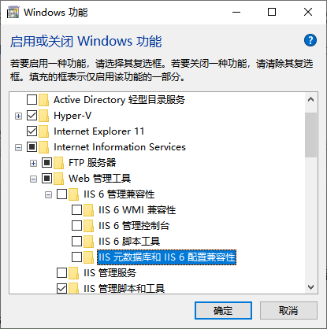
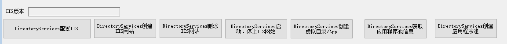
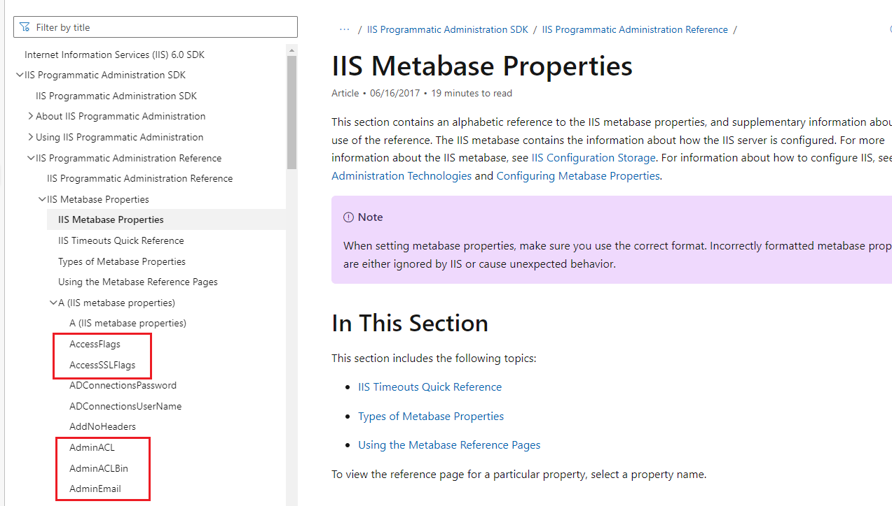

**C#使用DirectoryServices操作IIS服务器站点【IIS6】**

[toc]

> 更多的使用介绍参见 [Creating Sites and Virtual Directories Using System.DirectoryServices](https://learn.microsoft.com/en-us/previous-versions/iis/6.0-sdk/ms524896(v=vs.90)) 及与之相关的一系列介绍。

`System.DirectoryServices`主要是 IIS6中 用于配置服务器站点、虚拟目录的API，通过`DirectoryEntry`完成创建站点、应用程序和虚拟目录、操作应用程序池、修改获取各种属性等。

> 需要引用`System.DirectoryServices.dll`。

# IIS7+ 使用报错`System.Runtime.InteropServices.COMException:“未知错误(0x80005000)”`

如果在 IIS7+ 中使用`DirectoryServices`的`DirectoryEntry`，会发生异常报错：

`[System.Runtime.InteropServices.COMException] {"Unknown error (0x80005000)"} `

这是因为该操作的API主要用于 IIS6 ，错误原因在于缺少 IIS6的兼容编程 支持。IIS7+ 默认并没有安装。

如果想在 IIS7及以上版本中 使用，解决这个问题，需要安装 **“IIS 元数据库和IIS 6配置兼容性”**。

“控制面板”->“程序和功能”->面板左侧“启用或关闭 Windows 功能”->“Internet信息服务”->“Web管理工具”->“IIS 6管理兼容性”->“IIS 元数据库和IIS 6 配置兼容性”：

  

> IIS7+版本推荐使用`Microsoft.Web.Administration`相关API管理。

# 帮助类代码

参考了很多地方，所有代码基本都经过了测试。具体的实现直接参考代码内的注释。

> `ADSI`默认创建的应用程序池的托管管道模式为“经典模式”。`newpool.Properties["ManagedPipelineMode"][0] = "0"` 实现创建的为“集成模式”。
> 
> 0-集成模式；1-经典模式。

> 此外，还可以考虑添加在创建站点时是否可以创建的代码。比如判断是否存在网站名称、绑定信息(ip、port、hostName)是否存在，存在则不能创建。

```C#
using HelperCollections.IIS.Model;
using System;
using System.Collections;
using System.Collections.Generic;
using System.Diagnostics;
using System.DirectoryServices;
using System.Linq;

namespace HelperCollections
{
    /// <summary>
    /// 主要用于 IIS6 的配置操作。严格来说只是IIS中的Web
    /// 
    /// 由于IIS6，不推荐使用
    /// 更多参见 https://learn.microsoft.com/en-us/previous-versions/iis/6.0-sdk/ms524896(v=vs.90)
    /// 
    /// 引用 System.DirectoryServices.dll
    /// Windows功能 启用 - “IIS 元数据库和IIS 6 配置兼容性”
    /// </summary>
    public class IISSiteHelper_DirectoryServices
    {
        public DirectoryEntry IISEntry { get; }

        /// <summary>
        /// 
        /// </summary>
        /// <param name="iisServer">servername，通常为本地localhost</param>
        public IISSiteHelper_DirectoryServices(string iisServer = "localhost")
        {
            //  metabasePath is of the form "IIS://<servername>/<path>"
            //    for example "IIS://localhost/W3SVC/1/Root/MyVDir" 
            //    or "IIS://localhost/W3SVC/AppPools/MyAppPool"
            //new DirectoryEntry(metabasePath);

            // FTP则应是”MSFTPSVC”

            IISEntry = new DirectoryEntry($"IIS://{iisServer}/w3svc");
        }

        /// <summary>
        /// Application Pool Entry
        /// </summary>
        public DirectoryEntry GetAppPoolsEntry()
        {
            foreach (DirectoryEntry childEntry in IISEntry.Children)
            {
                if (childEntry.Name == "APPPOOLS")//"AppPools"
                {
                    return childEntry;
                }
            }
            return null;
        }
        /// <summary>
        /// Application Pool Entry
        /// </summary>
        public DirectoryEntry GetInfoEntry()
        {

            //DirectoryEntry entry = new DirectoryEntry("IIS://" + _hostName + "/W3SVC/INFO");
            //DirectoryEntry entry = IISEntry.Children.Find("INFO"); // System.AccessViolationException:“尝试读取或写入受保护的内存。这通常指示其他内存已损坏。”
            //DirectoryEntry entry = null;
            foreach (DirectoryEntry childEntry in IISEntry.Children)
            {
                if (childEntry.Name == "INFO")
                {
                    return childEntry;
                }
            }
            return null;
        }

        /// <summary>  
        /// 获取IIS版本  
        /// </summary>  
        /// <returns></returns>  
        public string IISVersion
        {
            get
            {
                try
                {
                    var entry = GetInfoEntry();
                    if (entry == null)
                    {
                        return String.Empty;
                    }
                    var MinorIIsVersionNumber = entry.Properties["MajorIISVersionNumber"].Value?.ToString();
                    return entry.Properties["MajorIISVersionNumber"].Value.ToString() + (string.IsNullOrEmpty(MinorIIsVersionNumber) ? "" : ($".{MinorIIsVersionNumber}"));
                }
                catch (Exception se)
                {
                    //说明一点:IIS5.0中没有(int)entry.Properties["MajorIISVersionNumber"].Value;属性，  
                    //将抛出异常 证明版本为 5.0  
                    return String.Empty;
                }
            }
        }

        /// <summary>  
        /// 创建 IIS网站  
        /// </summary>  
        /// <param name="webSiteName">网站名称</param>  
        /// <param name="physicalPath">物理路径</param>  
        /// <param name="ip">ip</param>  
        /// <param name="port">端口，不能为空，1024~65534</param>  
        /// <param name="hostName">主机名，即 域名</param>  
        /// <param name="isStart">WEB启动状态</param>  
        /// <param name="appPoolName">应用程序池，如果为空将使用默认DefaultAppPool</param>
        /// <returns></returns>  
        public void CreateWebSite(string webSiteName, string physicalPath, string ip = "", int port = 80, string hostName = "", bool isStart = true, string appPoolName = "")
        {
            // 为新WEB站点查找一个未使用的ID  
            int siteID = 1;
            foreach (DirectoryEntry e in IISEntry.Children)
            {
                if (e.SchemaClassName.Equals("IIsWebServer", StringComparison.OrdinalIgnoreCase))
                {
                    int ID = Convert.ToInt32(e.Name);
                    if (ID >= siteID) { siteID = ID + 1; }
                }
            }

            //是否应该创建目录  
            System.IO.DirectoryInfo dir = new System.IO.DirectoryInfo(physicalPath);
            if (!dir.Exists) { dir.Create(); }

            DirectoryEntry newSite = IISEntry.Children.Add(siteID.ToString(), "IIsWebServer");
            newSite.Properties["ServerComment"].Value = webSiteName;
            newSite.Properties["ServerBindings"].Value = ((string.IsNullOrWhiteSpace(ip) || ip == "*") ? "" : ip) + $":{port}:{hostName}";
            newSite.CommitChanges();

            DirectoryEntry newVDRoot = newSite.Children.Add("Root", "IIsWebVirtualDir");
            newVDRoot.Properties["Path"].Value = physicalPath;
            newVDRoot.Properties["AccessScript"][0] = true;
            //newVDRoot.Properties["ServerAutoStart"].Value = isStart;//网站是否启动，默认启动
            newVDRoot.CommitChanges();

            if (!string.IsNullOrWhiteSpace(appPoolName))
            {
                AssignVDir2AppPool(newVDRoot, appPoolName);
            }

            // 其他属性设置
            //newVDRoot.Invoke("AppCreate", true);
            //newVDRoot.Properties["AccessRead"][0] = true; //设置读取权限
            //newVDRoot.Properties["AccessWrite"][0] = true;
            //newVDRoot.Properties["AccessExecute"][0] = false;

            //.Properties["AccessScript"][0] = true;
            //newVDRoot.Properties["AccessScript"].Value = true; // System.Runtime.InteropServices.COMException:“异常来自 HRESULT:0x80005005”

            //newVDRoot.Properties["DefaultDoc"][0] = "Login_gdzc.aspx";//设置默认文档
            //newVDRoot.Properties["AppFriendlyName"][0] = "LabManager"; //应用程序名称           
            //newVDRoot.Properties["AuthFlags"][0] = 1;//0表示不允许匿名访问,1表示就可以3为基本身份验证，7为windows继承身份验证
            //newVDRoot.CommitChanges();

            #region 此处更像创建后的 Put 更新
            //// 创建WEB站点  
            //DirectoryEntry site = (DirectoryEntry)IISEntry.Invoke(State.Create.ToString(), new Object[] { "IIsWebServer", siteID });
            //site.Invoke("Put", "ServerComment", webSiteNameOrAppName);
            //site.Invoke("Put", "KeyType", "IIsWebServer");
            //site.Invoke("Put", "ServerBindings", domainPort + ":");
            //site.Invoke("Put", "ServerState", serverState);
            ////site.Invoke("Put", "FrontPageWeb", 1);  
            ////site.Invoke("Put", "DefaultDoc", "Login.html");  
            //// site.Invoke("Put", "SecureBindings", ":443:");  
            ////site.Invoke("Put", "ServerAutoStart", 1);  
            ////site.Invoke("Put", "ServerSize", 1);  
            //site.Invoke("SetInfo");
            //// 创建应用程序虚拟目录  
            //DirectoryEntry siteVDir = site.Children.Add("Root", "IISWebVirtualDir");
            //siteVDir.Properties["Path"][0] = physicalPath;

            ////siteVDir.Properties["AppIsolated"][0] = 2;  // 在应用程序池进程捏运行。不应该配置
            ////siteVDir.Properties["AccessFlags"][0] = 513;  
            ////siteVDir.Properties["FrontPageWeb"][0] = 1;  
            ////siteVDir.Properties["AppRoot"][0] = "LM/W3SVC/" + siteID + "/Root";  
            ////siteVDir.Properties["AppFriendlyName"][0] = "Root";  
            //siteVDir.CommitChanges();
            //site.CommitChanges(); 
            #endregion
        }

        /// <summary>  
        /// 更新 IIS网站  
        /// </summary>  
        /// <param name="oldWebSiteName">旧网站名称</param>  
        /// <param name="webSiteName">网站名称</param>  
        /// <param name="physicalPath">物理路径</param>  
        /// <param name="ip">ip</param>  
        /// <param name="port">端口，不能为空，1024~65534</param>  
        /// <param name="hostName">主机名，即 域名</param>  
        /// <returns></returns>  
        public void UpdateIISWebSite(String oldWebSiteName, string webSiteName, string physicalPath, string ip = "", int port = 80, string hostName = "", string appPoolName = "")
        {
            DirectoryEntry childrenEntry = this.GetWebEntry(oldWebSiteName);
            childrenEntry.Properties["ServerComment"].Value = webSiteName;
            //siteEntry.Properties["ServerState"].Value = serverState;
            childrenEntry.Properties["ServerBindings"].Value = ((string.IsNullOrWhiteSpace(ip) || ip == "*") ? "" : ip) + $":{port}:{hostName}";
            //更新程序所在目录  
            foreach (DirectoryEntry childrenDir in childrenEntry.Children)
            {
                if (childrenDir.Name == "Root" && childrenDir.SchemaClassName.Equals("IISWebVirtualDir", StringComparison.OrdinalIgnoreCase))
                {
                    if (!string.IsNullOrWhiteSpace(appPoolName))
                    {
                        AssignVDir2AppPool(childrenDir, appPoolName);
                    }

                    childrenDir.Properties["Path"].Value = physicalPath;
                    childrenDir.CommitChanges();
                    break;
                }
            }
        }

        /// <summary>
        /// 通过 serverComment站点名称-webSiteNameOrAppName 设置单个属性
        /// </summary>
        /// <param name="serverComment">serverComment-站点名称</param>
        public void SetSingleProperty(string webSiteName, string propertyName, object newValue)
        {
            DirectoryEntry childrenEntry = this.GetWebEntry(webSiteName);

            SetSingleProperty(childrenEntry, propertyName, newValue);
        }
        /// <summary>
        /// 通过 Entry Name_ServerComment(站点id) 设置单个属性
        /// </summary>
        /// <param name="name"></param>
        /// <param name="propertyName"></param>
        /// <param name="newValue"></param>
        public void SetSinglePropertyByNameId(string name, string propertyName, object newValue)
        {
            DirectoryEntry childrenEntry = this.GetWebEntryByNameId(name);
            SetSingleProperty(childrenEntry, propertyName, newValue);
        }
        /// <summary>
        /// 设置站点Entry的单个属性
        /// </summary>
        /// <param name="siteEntry">具体某个站点的Entry</param>
        /// <param name="propertyName"></param>
        /// <param name="newValue"></param>
        public static void SetSingleProperty(DirectoryEntry siteEntry, string propertyName, object newValue)
        {
            try
            {
                PropertyValueCollection propValues = siteEntry.Properties[propertyName];
                string oldType = propValues.Value.GetType().ToString();
                string newType = newValue.GetType().ToString();

                if (newType == oldType)
                {
                    siteEntry.Properties[propertyName][0] = newValue;
                    siteEntry.CommitChanges();
                    Console.WriteLine("Done");
                }
                else
                    Console.WriteLine(" Failed in SetSingleProperty; type of new value does not match property");
            }
            catch (Exception ex)
            {
                if ("HRESULT 0x80005006" == ex.Message)
                    Console.WriteLine(" Property {0} does not exist at", propertyName);
                else
                    Console.WriteLine("Failed in SetSingleProperty with the following exception: \n{0}", ex.Message);
            }
        }
        /// <summary>
        /// 设置站点Entry的单个属性
        /// </summary>
        /// <param name="siteEntry">具体某个站点的Entry</param>
        /// <param name="propertyName"></param>
        /// <param name="serverBindings">如 :8080:,xxx.xxx.xxx.xxx:8081:</param>
        [Obsolete("暂时不想实现，具体参加代码内容的获取，serverBindings可以添加多个绑定信息，也可以是单个", true)]
        public void SetMutilServerBindings(string webSiteName, string propertyName, string[] serverBindings)
        {
            //try
            //{
            //    DirectoryEntry siteEntry = this.GetWebEntry(webSiteNameOrAppName);

            //    // 获取ServerBindings的方法：
            //    if (!(siteEntry.Properties["ServerBindings"].Value is null))
            //    {
            //        string[] currServerBindings;
            //        if (siteEntry.Properties["ServerBindings"].Value is object[] _serverBindings)
            //        {
            //            currServerBindings = _serverBindings.Select(b => b.ToString()).ToArray();
            //        }
            //        else
            //        {
            //            currServerBindings = new string[] { childEntry.Properties["ServerBindings"].Value.ToString() };
            //        }

            //       var ServerBindingDatas = new List<ServerBindingData>();
            //        foreach (var serverBinding in currServerBindings)
            //        {
            //            var ip_port_hostname = serverBinding.Split(':');

            //            ServerBindingDatas.Add(new ServerBindingData()
            //            {
            //                Ip = ip_port_hostname[0],
            //                Port = ip_port_hostname[1],
            //                HostName = ip_port_hostname[2]
            //            });
            //        }
            //    }
            //}
            //catch (Exception ex)
            //{
            //    if ("HRESULT 0x80005006" == ex.Message)
            //        Console.WriteLine(" Property {0} does not exist at", propertyName);
            //    else
            //        Console.WriteLine("Failed in SetSingleProperty with the following exception: \n{0}", ex.Message);
            //}
        }

        /// <summary>
        /// 创建虚拟路径/应用程序
        /// </summary>
        /// <param name="webSiteNameOrAppName">serverComment-站点名称 或 (应用程序/虚拟目录名称)，在该站点下创建虚拟路径</param>
        /// <param name="vDirName"></param>
        /// <param name="physicalPath"></param>
        /// <param name="isApplication">是否是应用程序</param>
        /// <param name="appPoolName">应用程序池，如果为空将使用默认的DefaultAppPool;当为应用程序时，可指定应用程序池</param>
        public void CreateVDirApplication(string webSiteNameOrAppName, string vDirName, string physicalPath, bool isApplication = true, string appPoolName = "")
        {
            //  metabasePath is of the form "IIS://<servername>/<service>/<siteID>/Root[/<vdir>]"
            //    for example "IIS://localhost/W3SVC/1/Root" 
            //  vDirName is of the form "<name>", for example, "MyNewVDir"
            //  physicalPath is of the form "<drive>:\<path>", for example, "C:\Inetpub\Wwwroot"

            DirectoryEntry siteEntry = this.GetWebEntryVirtualDir(webSiteNameOrAppName);
            if (siteEntry == null)
            {
                return;
            }
            try
            {

                string className = siteEntry.SchemaClassName;
                if ((className.EndsWith("Server")) || (className.EndsWith("VirtualDir")))
                {
                    // 如果是站点下创建
                    if (className.EndsWith("Server"))
                    {
                        // 必须在虚拟目录下创建，否则Children.Add不成功，会有问题
                        // vDirName = $"Root{vDirName}"; // 取巧的处理，但最终会出现一下name上的混乱。
                        foreach (DirectoryEntry vDir in siteEntry.Children)
                        {
                            if (vDir.SchemaClassName == "IIsWebVirtualDir")
                            {
                                siteEntry = vDir;
                                break;
                            }
                        }
                    }
                    DirectoryEntry newVDir = siteEntry.Children.Add(vDirName, "IIsWebVirtualDir");
                    newVDir.Properties["Path"].Value = physicalPath;

                    // 会报错
                    //DirectoryEntry newVDir = siteEntry.Children.Add(vDirName, (className.Replace("Service", "VirtualDir")));

                    if (isApplication)
                    {
                        newVDir.Properties["AccessScript"][0] = true;
                        // These properties are necessary for an application to be created.
                        //newVDir.Properties["AppFriendlyName"][0] = vDirName+"Name_ServerComment"; // 显示的名称,似乎无效

                        // AppIsolated 和 AppRoot 均不应该设置
                        // The AppIsolated property indicates whether an application is to run in-process, out-of-process, or in a pooled-process.
                        // A value of 0 indicates that the application is to run in-process,
                        // a value of 1 indicates out-of-process,
                        // and a value of 2 indicates a pooled-process.
                        // Use the application management methods of the IIsWebVirtualDir and IIsWebDirectory objects to set the process space for your application.
                        // Because this property is internally configured by IIS, you should consider it to be read-only. Do not configure this property.
                        //newVDir.Properties["AppIsolated"][0] = "1";

                        // The AppRoot property contains the metabase path to the application root. For example, the metabase path for the application root of your Default Web Site is:
                        // /LM/W3SVC/1/ROOT
                        // Because this property is internally configured by IIS, you should consider it to be read-only. Do not configure this property.
                        // webPath = webPath.Trim('/');
                        // newVDir.Properties["AppRoot"][0] = string.IsNullOrWhiteSpace(webPath) ? $"/{webSiteNameOrAppName}" : $"/{webPath}"; // 必须指定，否则会生成虚拟目录。但指定其他名称无效
                        newVDir.Properties["AppRoot"][0] = $"/{webSiteNameOrAppName}"; // 必须指定，否则会生成虚拟目录。但指定其他名称无效

                        #region other
                        //virEntry.Properties["AccessFlags"][0] = MD_ACCESS_READ | MD_ACCESS_SCRIPT;
                        //virEntry.Properties["AppFriendlyName"][0] = siteName;
                        //virEntry.Properties["AppIsolated"][0] = "2";
                        //virEntry.Properties["AppRoot"][0] = "/LM/W3SVC/" + siteID.ToString() + "/Root";
                        //virEntry.Properties["AuthFlags"][0] = 1 | 7;// 设置目录的安全性，0表示不允许匿名访问，1为允许，3为基本身份验证，7为windows继承身份验证    
                        #endregion

                        if (!string.IsNullOrWhiteSpace(appPoolName))
                        {
                            AssignVDir2AppPool(newVDir, appPoolName);
                        }
                    }
                    newVDir.CommitChanges();
                }
                else
                    Debug.WriteLine(" Failed. A virtual directory can only be created in a site or virtual directory node.");
            }
            catch (Exception ex)
            {
                Debug.WriteLine("Failed in CreateVDirApplication with the following exception: \n{0}", ex.Message);
            }
        }

        #region IISWeb 启动/停止/删除 
        /// <summary>
        /// 通过 serverComment站点名称-webSiteNameOrAppName 启动
        /// </summary>
        /// <param name="serverComment"></param>
        public void StartWebSite(String serverComment)
        {
            this.WebEnable(serverComment, IISState.Start);
        }

        /// <summary>
        /// 通过 Entry Name_ServerComment(站点id) 启动
        /// </summary>
        public void StartWebSiteByNameId(string name)
        {
            WebEnableByNameId(name, IISState.Start);
        }
        /// <summary>
        /// 通过 serverComment站点名称-webSiteNameOrAppName 重置
        /// </summary>
        /// <param name="serverComment"></param>
        public void ResetWebSite(String serverComment)
        {
            WebEnable(serverComment, IISState.Reset);
        }

        /// <summary>
        /// 通过 Entry Name_ServerComment(站点id) 重置
        /// </summary>
        public void ResetWebSiteByNameId(string name)
        {
            WebEnableByNameId(name, IISState.Reset);
        }
        /// <summary>
        /// 通过 serverComment站点名称-webSiteNameOrAppName 停止
        /// </summary>
        /// <param name="serverComment"></param>
        public void StopWebSite(String serverComment)
        {
            WebEnable(serverComment, IISState.Stop);
        }
        /// <summary>
        /// 通过 Entry Name_ServerComment(站点id) 停止
        /// </summary>
        public void StopWebSiteByNameId(string name)
        {
            WebEnableByNameId(name, IISState.Stop);
        }
        /// <summary>  
        /// 依据 ServerComment网站名称-webSiteNameOrAppName 删除 站点
        /// <param name="serverComment">网站名称-webSiteNameOrAppName。如:Test</param>  
        /// </summary>  
        public void RemoveIISWebSite(String serverComment)
        {
            DirectoryEntry siteEntry = this.GetWebEntry(serverComment);
            RemoveIISWebSiteVirtualDir(siteEntry);
        }
        /// <summary>  
        /// 依据 ServerComment网站名称-webSiteNameOrAppName 【删除 站点、应用程序、虚拟路径】
        /// <param name="serverComment">网站名称-webSiteNameOrAppName。如:Test</param>  
        /// </summary>  
        public void RemoveIISWebSiteVirtualDir(String serverComment)
        {
            DirectoryEntry siteEntry = this.GetWebEntryVirtualDir(serverComment);
            RemoveIISWebSiteVirtualDir(siteEntry);
        }
        /// <summary>
        /// 通过 站点的Entry 删除 站点、应用程序、虚拟路径 
        /// </summary>
        /// <param name="siteEntry"></param>
        internal static void RemoveIISWebSiteVirtualDir(DirectoryEntry siteEntry)
        {
            //WebEnable(siteEntry,IISState.Stop);
            //先停止IIS站点  
            siteEntry?.DeleteTree();
            // 不用调用CommitChanges
            //siteEntry.CommitChanges(); // System.IO.DirectoryNotFoundException:“系统找不到指定的路径。 (异常来自 HRESULT: 0x80070003)”
        }

        /// <summary>  
        /// 依据网站名称在IIS中的排列顺序删除【通过 Entry Name_ServerComment(站点id) 删除 站点】
        /// <param name="name">排列顺序，</param>  
        /// </summary>  
        public void RemoveIISWebSiteByNameId(string name)
        {
            DirectoryEntry siteEntry = this.GetWebEntryByNameId(name);
            RemoveIISWebSiteVirtualDir(siteEntry);
        }
        /// <summary>
        /// 启用Web状态，启动、停止、重置
        /// </summary>
        /// <param name="serverComment">ServerComment网站名称-webSiteNameOrAppName</param>
        /// <param name="state"></param>
        public void WebEnable(string serverComment, IISState state)
        {
            DirectoryEntry siteEntry = GetWebEntry(serverComment);
            WebEnable(siteEntry, state);
        }
        /// <summary>
        /// 启用Web状态，启动、停止、重置
        /// </summary>
        /// <param name="name">Entry Name_ServerComment(站点id)</param>
        /// <param name="state"></param>
        private void WebEnableByNameId(string name, IISState state)
        {
            DirectoryEntry siteEntry = GetWebEntryByNameId(name);
            WebEnable(siteEntry, state);
        }

        /// <summary>
        /// 启用Web状态，启动、停止、重置
        /// </summary>
        /// <param name="serverComment"></param>
        /// <param name="state"></param>
        public static void WebEnable(DirectoryEntry siteEntry, IISState state)
        {
            siteEntry?.Invoke(state.ToString(), new Object[] { });
        }
        /// <summary>
        /// 获取 web 的 DirectoryEntry 【根据 Entry Name_ServerComment - 站点id】
        /// </summary>
        /// <param name="name">通常为站点对应的id</param>
        /// <returns></returns>
        public DirectoryEntry GetWebEntryByNameId(string entryName)
        {
            foreach (DirectoryEntry entry in IISEntry.Children)
            {
                if (entry.SchemaClassName.Equals("IIsWebServer", StringComparison.OrdinalIgnoreCase))
                {
                    if (entry.Name
                        .Equals(entryName))
                    {
                        return entry;
                    }
                }
            }
            return null;
        }
        /// <summary>
        /// 获取 web 的 DirectoryEntry【根据 serverComment-站点名称】【仅获取站点】
        /// </summary>
        /// <param name="serverComment">serverComment 站点名称</param>
        /// <returns></returns>
        public DirectoryEntry GetWebEntry(string serverComment)
        {
            foreach (DirectoryEntry entry in IISEntry.Children)
            {
                if (entry.SchemaClassName.Equals("IIsWebServer", StringComparison.OrdinalIgnoreCase))
                {
                    if (entry.Properties["ServerComment"].Value.ToString()
                        .Equals(serverComment, StringComparison.OrdinalIgnoreCase))
                    {
                        return entry;
                    }
                }
                if (entry.SchemaClassName.Equals("IIsWebVirtualDir", StringComparison.OrdinalIgnoreCase))
                {
                    if (entry.Properties["ServerComment"].Value.ToString()
                        .Equals(serverComment, StringComparison.OrdinalIgnoreCase))
                    {
                        return entry;
                    }
                }
            }
            return null;
        }
        /// <summary>
        /// 获取 web 的 DirectoryEntry【根据 serverComment-站点名称】【获取站点和虚拟目录(应用程序)】
        /// </summary>
        /// <param name="serverComment">serverComment 站点名称</param>
        /// <returns></returns>
        public DirectoryEntry GetWebEntryVirtualDir(string serverComment)
        {
            return GetWebEntryVirtualDir(IISEntry, serverComment);
        }
        /// <summary>
        /// 获取 web 的 DirectoryEntry【根据 serverComment-站点名称】【获取站点和虚拟目录(应用程序)】
        /// </summary>
        /// <param name="serverComment">serverComment 站点名称</param>
        /// <returns></returns>
        public static DirectoryEntry GetWebEntryVirtualDir(DirectoryEntry entry, string serverComment)
        {
            foreach (DirectoryEntry currEntry in entry.Children)
            {
                if (currEntry.SchemaClassName.Equals("IIsWebServer", StringComparison.OrdinalIgnoreCase))
                {
                    if (currEntry.Properties["ServerComment"].Value.ToString()
                        .Equals(serverComment, StringComparison.OrdinalIgnoreCase))
                    {
                        return currEntry;
                    }
                }
                if (currEntry.SchemaClassName.Equals("IIsWebVirtualDir", StringComparison.OrdinalIgnoreCase))
                {
                    if (currEntry.Name
                        .Equals(serverComment, StringComparison.OrdinalIgnoreCase))
                    {
                        return currEntry;
                    }
                }
            }
            foreach (DirectoryEntry currEntry in entry.Children)
            {
                var nextEntry = GetWebEntryVirtualDir(currEntry, serverComment);
                if (nextEntry != null)
                {
                    return nextEntry;
                }
            }
            return null;
        }
        #endregion


        #region 得到物理路径+程序池  
        /// <summary>  
        /// 得到网站的物理路径  
        /// </summary>  
        /// <param name = "rootEntry" > 网站节点 </ param >
        /// < returns ></ returns >
        private String GetWebsitePhysicalPath(DirectoryEntry rootEntry)
        {
            return GetDirectoryEntryChildren(rootEntry, "Path");
        }
        /// < summary >
        /// 得到网站的应用程序池
        /// </ summary >
        /// < param name="rootEntry">网站节点</param>  
        /// <returns></returns>  
        private String GetAppPoop(DirectoryEntry rootEntry)
        {
            return GetDirectoryEntryChildren(rootEntry, "AppPoolId");
        }
        private String GetDirectoryEntryChildren(DirectoryEntry rootEntry, String properties)
        {
            String propValue = String.Empty;
            foreach (DirectoryEntry childEntry in rootEntry.Children)
            {
                if ((childEntry.SchemaClassName.Equals("IIsWebVirtualDir", StringComparison.OrdinalIgnoreCase))
                    && (childEntry.Name.Equals("root", StringComparison.OrdinalIgnoreCase)))
                {
                    if (childEntry.Properties[properties].Value != null)
                    {
                        propValue = childEntry.Properties[properties].Value.ToString();
                    }
                }
            }
            return propValue;
        }

        #region 应用城池的相关操作
        /// <summary>
        /// 分配虚拟目录到应用程序池
        /// </summary>
        /// <param name="vDir">虚拟目录</param>
        /// <param name="appPoolName"></param>
        public void AssignVDir2AppPool(DirectoryEntry vDir, string appPoolName)
        {
            if (!string.IsNullOrWhiteSpace(appPoolName))
            {
                    var exist = AppPoolExists(appPoolName);

                    // 不存在则创建
                    if (!exist)
                    {
                        CreateAppPool(appPoolName);
                    }
                

                // 分配虚拟目录(Application)到AppPool
                string className = vDir.SchemaClassName.ToString();
                if (className.EndsWith("VirtualDir"))
                {
                    #region // 使用该参数 appPoolName 不存在时会自动创建 创建的是 经典托管管道模式
                    //objIIsWebDirectory.AppCreate3(
                    //  lAppMode As LONG,
                    //  bstrAppPooI As VARIANT,
                    //  bCreatePool As VARIANT
                    //)
                    // lAppMode 取值 in-process (0), out-of-process (1), or in a pooled process (2).
                    // 第三个参数指示不存在时是否创建。
                    //object[] param = { 0, appPoolName, true }; 
                    #endregion

                    object[] param = { 0, appPoolName, false };
                    vDir.Invoke("AppCreate3", param);
                    vDir.Properties["AppIsolated"][0] = "2";

                    //// 或者直接指定 AppPoolId 实现分配 AppPool
                    //vDir.Properties["AppPoolId"].Value = appPoolName;

                    vDir.CommitChanges();
                }
            }
        }

        /// <summary>
        /// appPoolEntry 下 创建 appPoolName 应用程序池 【集成托管管道模式】
        /// </summary>
        /// <param name="appPoolName"></param>
        public DirectoryEntry CreateAppPool(string appPoolName)
        {
            DirectoryEntry appPoolEntry = GetAppPoolsEntry();
            return CreateAppPool(appPoolEntry, appPoolName);
        }
        /// <summary>
        /// appPoolEntry 下 创建 appPoolName 应用程序池 【集成托管管道模式】
        /// </summary>
        /// <param name="appPoolName"></param>
        public void CreateAppPoolWithOutReturn(string appPoolName)
        {
            DirectoryEntry appPoolEntry = GetAppPoolsEntry();
            CreateAppPool(appPoolEntry, appPoolName);
        }
        /// <summary>
        /// appPoolEntry 下 创建 appPoolName 应用程序池 【集成托管管道模式】
        /// </summary>
        /// <param name="appPoolsEntry"></param>
        /// <param name="appPoolName"></param>
        /// <returns>新建的 poolEntry</returns>
        public static DirectoryEntry CreateAppPool(DirectoryEntry appPoolsEntry, string appPoolName)
        {
            DirectoryEntry newpool = appPoolsEntry.Children.Add(appPoolName, "IIsApplicationPool");
            // 默认创建的是 经典托管管道模式。此处改为集成
            // 0-集成模式；1-经典模式
            newpool.Properties["ManagedPipelineMode"][0] = "0";
            newpool.CommitChanges();
            return newpool;
        }

        /// <summary>
        /// 应用程序池Entry下的appPoolName是否存在
        /// </summary>
        /// <param name="appPoolEntry"></param>
        /// <param name="appPoolName"></param>
        /// <returns></returns>
        public static bool AppPoolExists(DirectoryEntry appPoolsEntry, string appPoolName)
        {
            if (appPoolsEntry == null || string.IsNullOrWhiteSpace(appPoolName))
            {
                return false;
            }
            // 判断 appPoolName 是否存在
            foreach (DirectoryEntry item in appPoolsEntry.Children)
            {
                if (item.SchemaClassName == "IIsApplicationPool" && item.Name == appPoolName)
                {
                    return true;
                }
            }
            return false;
        }
        /// <summary>
        /// appPoolName 是否存在
        /// </summary>
        /// <param name="appPoolName"></param>
        /// <returns></returns>
        public bool AppPoolExists(string appPoolName)
        {
            var appPoolEntry = GetAppPoolsEntry();
            return AppPoolExists(appPoolEntry, appPoolName);
        }

        /// <summary>
        /// 获取应用程序池的信息
        /// </summary>
        /// <returns></returns>
        public List<IISAppPoolInfo> GetAppPools()
        {
            List<IISAppPoolInfo> list = new List<IISAppPoolInfo>();
            DirectoryEntry appPoolsEntry = GetAppPoolsEntry();
            foreach (DirectoryEntry entry in appPoolsEntry.Children)
            {
                var schmeName = entry.Name;
                list.Add(new IISAppPoolInfo()
                {
                    AppPoolName = entry.Name,
                    AppPoolIdentityType = entry.Properties["AppPoolIdentityType"].Value.ToString(),
                    AppPoolCommand = Convert.ToInt32(entry.Properties["AppPoolCommand"].Value),
                    AppPoolState = Convert.ToInt32(entry.Properties["AppPoolState"].Value),
                    ManagedPipelineMode = Convert.ToInt32(entry.Properties["ManagedPipelineMode"].Value),
                    ManagedRuntimeVersion = entry.Properties["ManagedRuntimeVersion"].Value.ToString()
                });
            }
            return list;
        }
        /// <summary>
        /// 删除应用程序池
        /// </summary>
        /// <param name="appPool"></param>
        /// <returns></returns>
        public Boolean DeleteAppPool(String appPool)
        {
            Boolean flag = false;
            if (String.IsNullOrEmpty(appPool)) return flag;
            DirectoryEntry de = GetAppPoolsEntry();
            foreach (DirectoryEntry entry in de.Children)
            {
                if (entry.Name.Equals(appPool, StringComparison.OrdinalIgnoreCase))
                {
                    try
                    {
                        entry.DeleteTree();
                        flag = true;
                    }
                    catch
                    {
                        flag = false;
                    }
                }
            }
            return flag;
        }
        /// <summary>
        /// 创建应用程序池
        /// </summary>
        /// <param name="appPoolName"></param>
        /// <param name="appPoolCommand"></param>
        /// <param name="appPoolState"></param>
        /// <param name="managedPipelineMode"></param>
        /// <param name="managedRuntimeVersion"></param>
        /// <param name="appPoolIdentityType"></param>
        /// <param name="Username"></param>
        /// <param name="Password"></param>
        /// <returns></returns>

        public Boolean CreateAppPool(String appPoolName, String appPoolCommand, String appPoolState,
            String managedPipelineMode, String managedRuntimeVersion,
            String appPoolIdentityType, String Username, String Password)
        {
            Boolean issucess = false;
            try
            {
                //创建一个新程序池  
                //DirectoryEntry apppools = new DirectoryEntry("IIS://" + _hostName + "/W3SVC/AppPools");
                DirectoryEntry apppools = GetAppPoolsEntry();
                DirectoryEntry newpool = apppools.Children.Add(appPoolName, "IIsApplicationPool");

                //设置属性 访问用户名和密码 一般采取默认方式  
                newpool.Properties["WAMUserName"][0] = Username;
                newpool.Properties["WAMUserPass"][0] = Password;

                //newpool.Properties["AppPoolIdentityType"].Value = "4"; //这个默认,不晓得是什么参数  
                newpool.Properties["AppPoolCommand"].Value = appPoolCommand;
                newpool.Properties["AppPoolState"].Value = appPoolState;
                newpool.Properties["ManagedPipelineMode"].Value = managedPipelineMode;
                newpool.Properties["ManagedRuntimeVersion"].Value = managedRuntimeVersion;

                newpool.CommitChanges();
                issucess = true;
                return issucess;
            }
            catch // (Exception ex)   
            {
                return false;
            }
        }
        /// <summary>
        /// 更新应用程序池
        /// </summary>
        /// <param name="appPoolName"></param>
        /// <param name="appPoolCommand"></param>
        /// <param name="appPoolState"></param>
        /// <param name="managedPipelineMode"></param>
        /// <param name="managedRuntimeVersion"></param>
        /// <param name="Username"></param>
        /// <param name="Password"></param>
        /// <returns></returns>
        public Boolean UpdateAppPool(String appPoolName, String appPoolCommand,
            String appPoolState, String managedPipelineMode, String managedRuntimeVersion,
            String Username, String Password)
        {
            Boolean issucess = false;
            try
            {
                //DirectoryEntry appPoolsEntry = new DirectoryEntry("IIS://" + _hostName + "/W3SVC/AppPools");
                DirectoryEntry appPoolsEntry = GetAppPoolsEntry();
                foreach (DirectoryEntry entry in appPoolsEntry.Children)
                {
                    if (entry.Name.Equals(appPoolName, StringComparison.OrdinalIgnoreCase))
                    {
                        // entry.Properties["AppPoolIdentityType"].Value = appPoolIdentityType;  
                        entry.Properties["AppPoolCommand"].Value = appPoolCommand;
                        entry.Properties["AppPoolState"].Value = appPoolState;
                        entry.Properties["ManagedPipelineMode"].Value = managedPipelineMode;
                        entry.Properties["ManagedRuntimeVersion"].Value = managedRuntimeVersion;
                        entry.CommitChanges();
                        issucess = true;
                        return issucess;
                    }
                }
            }
            catch // (Exception ex)   
            {
            }
            return issucess;
        }


        /// <summary>  
        /// 建立程序池后关联相应应用程序  
        /// </summary>  
        public void SetAppToPool(String appname, String poolName)
        {
            DirectoryEntry children = this.GetWebEntry(appname);
            foreach (DirectoryEntry childrenRoot in children.Children)
            {
                if (childrenRoot.SchemaClassName.Equals("IIsWebVirtualDir", StringComparison.OrdinalIgnoreCase))
                {
                    childrenRoot.Properties["AppPoolId"].Value = poolName;
                    childrenRoot.CommitChanges();
                    return;
                }
            }
        }


        #endregion


        /// <summary>
        /// 获取所有的站点信息。信息格式为 Tuple<Name_ServerComment, SchemaClassName, ServerComment>
        /// </summary>
        /// <returns></returns>
        public List<Tuple<string, string, string>> GetAllWebSites()
        {
            return GetAllSites(IISEntry);
        }
        /// <summary>
        /// 获取所有的站点信息。信息格式为 Tuple<Name_ServerComment, SchemaClassName, ServerComment>
        /// </summary>
        /// <param name="iisMetabasePath">metabasePath is of the form "IIS://<servername>/<path>"
        //    for example "IIS://localhost/W3SVC/1/Root/MyVDir" 
        //    or "IIS://localhost/W3SVC/AppPools/MyAppPool"</param>
        /// <returns></returns>
        public static List<Tuple<string, string, string>> GetAllWebSites(string iisMetabasePath)
        {
            return GetAllSites(new DirectoryEntry(iisMetabasePath));
        }
        /// <summary>
        /// 获取所有的站点信息。信息格式为 Tuple<Name_ServerComment, SchemaClassName, ServerComment>
        /// </summary>
        /// <param name="iisEntry"></param>
        /// <returns></returns>
        public static List<Tuple<string, string, string>> GetAllSites(DirectoryEntry iisEntry)
        {
            var allSiteInfos = new List<Tuple<string, string, string>>();

            foreach (DirectoryEntry childEntry in iisEntry.Children)
            {
                switch (childEntry.SchemaClassName)
                {
                    case "IIsWebServer": // IIS网站的类型，其Name全部都是数字形式的Id；ServerComment为网站的名称
                                         // IIsWebServer 的 ServerComment 不会为空，其他类型有可能为null。
                        allSiteInfos.Add(Tuple.Create(childEntry.Name, childEntry.SchemaClassName, childEntry.Properties["ServerComment"].Value?.ToString()));
                        break;
                    case "IIsWebVirtualDir": // IIS虚拟目录的类型
                        allSiteInfos.Add(Tuple.Create(childEntry.Name, childEntry.SchemaClassName, childEntry.Properties["ServerComment"].Value?.ToString()));
                        break;
                    //case "IIsApplicationPools": // IIS应用程序池s

                    //    allSiteInfos.Add(Tuple.Create(childEntry.Name_ServerComment, childEntry.SchemaClassName, childEntry.Properties["ServerComment"].Value?.ToString()));
                    //    break;
                    //case "IIsApplicationPool": // IIS应用程序池s

                    //    allSiteInfos.Add(Tuple.Create(childEntry.Name_ServerComment, childEntry.SchemaClassName, childEntry.Properties["ServerComment"].Value?.ToString()));
                    //    break;
                    default:
                        // 没有 "Application" 类型

                        // 其他类型
                        Debug.Print(childEntry.SchemaClassName);
                        break;
                }

                allSiteInfos.AddRange(GetAllSites(childEntry));
            }
            return allSiteInfos;
        }

        /// <summary>
        /// 获取 IIS DirectoryEntry 的所有属性名和值
        /// </summary>
        /// <returns></returns>
        public Dictionary<string, string> EnumerateProperties()
        {
            try
            {
                var dict = new Dictionary<string, string>();
                foreach (string propName in IISEntry.Properties.PropertyNames)
                {
                    Console.Write(" {0} =", propName);
                    dict.Add(propName, IISEntry.Properties[propName].Value?.ToString());
                }
                return dict;
            }
            catch (Exception ex)
            {
                Console.WriteLine("Failed in EnumeratePath with the following exception: \n{0}", ex.Message);
                throw ex;
            }
        }


        /// <summary>
        /// 获取所有的站点信息 嵌套类型的SiteInfo信息【树形】
        /// </summary>
        /// <returns></returns>
        public List<SiteInfo> GetSiteList()
        {
            return GetSiteList(IISEntry);
        }
        /// <summary>
        /// 获取所有的站点信息 获取嵌套类型的SiteInfo信息【树形】
        /// </summary>
        /// <returns></returns>
        public static List<SiteInfo> GetSiteList(DirectoryEntry iisEntry)
        {
            var entry = iisEntry;

            var result = new List<SiteInfo>();
            foreach (DirectoryEntry childEntry in entry.Children)
            {
                var sites = GetSiteList(childEntry);
                if (childEntry.SchemaClassName == "IIsWebServer")
                {
                    var site = new SiteInfo();
                    site.Id = childEntry.Name;
                    site.Name_ServerComment = childEntry.Properties["ServerComment"].Value.ToString();
                    site.Path = sites[0].Path;
                    site.IsApp = true;
                    site.Children = new List<SiteInfo>();
                    foreach (var subSite in sites[0].Children)
                        site.Children.Add(subSite);

                    if (!(childEntry.Properties["ServerBindings"].Value is null))
                    {
                        if (childEntry.Properties["ServerBindings"].Value is object[] serverBindings)
                        {
                            site.ServerBindings = serverBindings.Select(b => b.ToString()).ToArray();
                        }
                        else
                        {
                            site.ServerBindings = new string[] { childEntry.Properties["ServerBindings"].Value.ToString() };
                        }

                        site.ServerBindingDatas = new List<ServerBindingData>();
                        foreach (var serverBinding in site.ServerBindings)
                        {
                            var ip_port_hostname = serverBinding.Split(':');

                            site.ServerBindingDatas.Add(new ServerBindingData()
                            {
                                Ip = ip_port_hostname[0],
                                Port = ip_port_hostname[1],
                                HostName = ip_port_hostname[2]
                            });
                        }
                    }

                    result.Add(site);
                }
                else if (childEntry.SchemaClassName == "IIsWebVirtualDir")
                {
                    var site = new SiteInfo();
                    //site.Id = childEntry.Name_ServerComment;
                    site.Name_ServerComment = childEntry.Name;
                    site.Path = childEntry.Properties["Path"].Value.ToString();
                    site.Children = sites;
                    if (childEntry.Properties.Contains("AppRoot")
                        && childEntry.Properties["AppRoot"].Value != null
                        && !string.IsNullOrEmpty(childEntry.Properties["AppRoot"].Value.ToString()))
                        site.IsApp = true;

                    result.Add(site);
                }
            }
            return result;
        }
        /// <summary>
        /// 将嵌套树形格式的 List<SiteInfo> 转换为文本格式
        /// </summary>
        /// <param name="sites"></param>
        /// <param name="parentPadding"></param>
        /// <returns></returns>
        public static List<KeyValuePair<SiteInfo, string>> GetFlatSiteList(List<SiteInfo> sites, string parentPadding = "")
        {
            var result = new List<KeyValuePair<SiteInfo, string>>();
            foreach (var site in sites)
            {
                var currentPrefix = string.IsNullOrEmpty(parentPadding) ? string.Empty : "└" + parentPadding;
                result.Add(new KeyValuePair<SiteInfo, string>(site, currentPrefix + site.Name_ServerComment));
                result.AddRange(GetFlatSiteList(site.Children, parentPadding + "--"));
            }
            return result;
        }


        /// <summary>  
        /// 获取站点信息  
        /// </summary>  
        [Obsolete("ServerBindings获取时没考虑多绑定的情况，但是里面 注释掉的 获取其他属性名，可以参考")]
        public List<SiteInfo> ServerBindings(DirectoryEntry rootEntry)
        {
            List<SiteInfo> iislist = new List<SiteInfo>();
            DirectoryEntry rootChildrenEntry = null;
            IEnumerator enumeratorRoot = null;
            foreach (DirectoryEntry entry in rootEntry.Children)
            {
                if (entry.SchemaClassName.Equals("IIsWebServer", StringComparison.OrdinalIgnoreCase))
                {
                    var props = entry.Properties;

                    // if (props["ServerComment"][0].ToString().Contains("Default")) { continue; }  
                    //获取网站绑定的IP，端口，主机头  
                    String[] serverBindings = props["ServerBindings"].Value.ToString().Split(':');
                    var physicalPath = "";
                    var appPoolId = "";
                    enumeratorRoot = entry.Children.GetEnumerator();
                    while (enumeratorRoot.MoveNext())
                    {
                        rootChildrenEntry = (DirectoryEntry)enumeratorRoot.Current;
                        appPoolId = rootChildrenEntry.Properties["AppPoolId"].Value.ToString();
                        if (rootChildrenEntry.SchemaClassName.Equals("IIsWebVirtualDir", StringComparison.OrdinalIgnoreCase))
                        {
                            physicalPath = rootChildrenEntry.Properties["Path"].Value.ToString();
                            break;
                        }
                    }

                    iislist.Add(new SiteInfo()
                    {
                        Id = entry.Name,
                        Name_ServerComment = props["ServerComment"].Value.ToString(),
                        //DomainIP = serverBindings[0].ToString(),
                        //DomainPort = Convert.ToInt32(serverBindings[1]),
                        SiteState = props["ServerState"][0].ToString(),//运行状态  
                        PhysicalPath = physicalPath,
                        AppPoolId = appPoolId
                    });

                    //String EnableDeDoc = props["EnableDefaultDoc"][0].ToString();  
                    //String DefaultDoc = props["DefaultDoc"][0].ToString();//默认文档  
                    //String MaxConnections = props["MaxConnections"][0].ToString();//iis连接数,-1为不限制  
                    //String ConnectionTimeout = props["ConnectionTimeout"][0].ToString();//连接超时时间  
                    //String MaxBandwidth = props["MaxBandwidth"][0].ToString();//最大绑定数  
                    //String ServerState = props["ServerState"][0].ToString();//运行状态  
                    //var ServerComment = (String)Server.Properties["ServerComment"][0];  
                    //var AccessRead = (Boolean)Server.Properties["AccessRead"][0];  
                    //var AccessScript = (Boolean)Server.Properties["AccessScript"][0];  
                    //var DefaultDoc = (String)Server.Properties["DefaultDoc"][0];  
                    //var EnableDefaultDoc = (Boolean)Server.Properties["EnableDefaultDoc"][0];  
                    //var EnableDirBrowsing = (Boolean)Server.Properties["EnableDirBrowsing"][0];  
                    //var Port = Convert.ToInt32(((String)Server.Properties["Serverbindings"][0])  
                    //   .Substring(1, ((String)Server.Properties["Serverbindings"][0]).Length - 2));  

                    //ieRoot = Root.Children.GetEnumerator();  
                    //while (ieRoot.MoveNext())  
                    //{  
                    //    VirDir = (DirectoryEntry)ieRoot.Current;  
                    //    if (VirDir.SchemaClassName != "IIsWebVirtualDir" && VirDir.SchemaClassName != "IIsWebDirectory")  
                    //        continue;  
                    //    var TName = VirDir.Name_ServerComment;  
                    //    var TAccessRead = (Boolean)VirDir.Properties["AccessRead"][0];  
                    //    var TAccessScript = (Boolean)VirDir.Properties["AccessScript"][0];  
                    //    var TDefaultDoc = (String)VirDir.Properties["DefaultDoc"][0];  
                    //    var TEnableDefaultDoc = (Boolean)VirDir.Properties["EnableDefaultDoc"][0];  
                    //    if (VirDir.SchemaClassName == "IIsWebVirtualDir")  
                    //    {  
                    //        var TPath = (String)VirDir.Properties["Path"][0];  
                    //    }  
                    //    else if (VirDir.SchemaClassName == "IIsWebDirectory")  
                    //    {  
                    //        var TPath = Root.Properties["Path"][0] + @"\" + VirDir.Name_ServerComment;  
                    //    }  
                    //}  

                    //String str = "";  
                    //System.DirectoryServices.PropertyCollection props = entry.Properties;  
                    //foreach (String name in props.PropertyNames)  
                    //{  
                    //    foreach (Object o in props[name])  
                    //    {  
                    //        str += name.ToString() + ":" + o.ToString() + "\n";  
                    //    }  
                    //}  
                }
            }
            return iislist;
        }
        #endregion
    }


    /// <summary>
    /// IIS网站的运行状态
    /// </summary>
    public enum IISState
    {
        Start,
        Stop,
        Reset
    }

    /// <summary>  
    /// IIS应用程序池 信息
    /// </summary>  
    public class IISAppPoolInfo
    {
        /// <summary>  
        /// 应用程序池名称  
        /// </summary>  
        public String AppPoolName { set; get; }

        public String AppPoolIdentityType { get; set; }

        private Int32 _AppPoolState = 2;
        /// <summary>  
        /// 是否启动:2:启动,4:停止,XX:回收  
        /// </summary>  
        public Int32 AppPoolState
        {
            get { return _AppPoolState; }
            set { _AppPoolState = value; }
        }
        private Int32 _AppPoolCommand = 1;
        /// <summary>  
        /// 立即启动应用程序池.1:以勾选,2:未勾选  
        /// </summary>  
        public Int32 AppPoolCommand
        {
            get { return _AppPoolCommand; }
            set { _AppPoolCommand = value; }
        }
        /// <summary>  
        /// .NET Framework版本.  
        /// "":无托管代码,V2.0: .NET Framework V2.0XXXX,V4.0: .NET Framework V4.0XXXX  
        /// </summary>  
        public String ManagedRuntimeVersion { get; set; }
        /// <summary>
        /// 0-集成模式；1-经典模式
        /// </summary>
        private Int32 _ManagedPipelineMode = 0;
        /// <summary>  
        /// 托管管道模式 —— 0:集成,1:经典  
        /// </summary>  
        public Int32 ManagedPipelineMode
        {
            get { return _ManagedPipelineMode; }
            set { _ManagedPipelineMode = value; }
        }
    }

        /// <summary>
    /// 站点信息
    /// </summary>
    public class SiteInfo
    {
        public string Id { get; set; }
        /// <summary>
        /// 如果是IIS网站，Properties["ServerComment"]为其名称
        /// </summary>
        public string Name_ServerComment { get; set; }
        public string Path { get; set; }
        public string[] ServerBindings { get; set; }
        public List<ServerBindingData> ServerBindingDatas { get; set; }
        public bool IsApp { get; set; }

        public string AppPoolId { get; set; }

        public List<SiteInfo> Children { get; set; }
        public string  SiteState { get; set; }

        public string PhysicalPath { get; set; }
    }

    public class ServerBindingData {
        public string HostName { get; set; }
        public string Ip { get; set; }
        public string Port { get; set; }
        //public string Type { get; set; }
    }

}
```

# 测试

  

# 重要：IIS Programmatic Administration SDK 

[IIS Programmatic Administration SDK](https://learn.microsoft.com/en-us/previous-versions/iis/6.0-sdk/ms525644(v=vs.90)) 

从这里面可以查看所需要编程用到的修改属性名和值，以实现更多更准确的控制、修改IIS的配置。

  

# 其他

```C#
string[] serverBind = ppC["ServerBindings"][0].ToString().Split(':');//获取网站绑定的IP，端口，主机头
string EnableDeDoc = ppC["EnableDefaultDoc"][0].ToString();
string DefaultDoc = ppC["DefaultDoc"][0].ToString();//默认文档
string MaxConnections = ppC["MaxConnections"][0].ToString();//iis连接数,-1为不限制
string ConnectionTimeout = ppC["ConnectionTimeout"][0].ToString();//连接超时时间
string MaxBandwidth = ppC["MaxBandwidth"][0].ToString();//最大绑定数
string ServerState = ppC["ServerState"][0].ToString();//运行状态    
```

# 参考

- [DirectoryEntry配置IIS7出现ADSI Error：未知错误(0x80005000)](https://blog.csdn.net/ts1030746080/article/details/8741399)

- [C#获取IIS所有站点及虚拟目录和应用程序(包含名称及详细信息)](https://www.cnblogs.com/nanfei/p/6296825.html)

- [Creating Application Pools Using System.DirectoryServices](https://learn.microsoft.com/en-us/previous-versions/iis/6.0-sdk/ms525598(v=vs.90))

- [Deleting Metabase Nodes Using System.DirectoryServices](https://learn.microsoft.com/en-us/previous-versions/iis/6.0-sdk/ms525865(v=vs.90))

- [IIsWebDirectory.AppCreate3 (ADSI)](https://learn.microsoft.com/en-us/previous-versions/iis/6.0-sdk/ms525258(v=vs.90))

- [VC,C#创建IIS站点，应用程序池 ADSI](https://www.cnblogs.com/ytjjyy/archive/2012/04/09/2438559.html)

- [C#操作IIS程序池及站点的创建配置](https://www.bbsmax.com/A/6pdDrgMkJw/)

- [DirectoryEntry 类](https://learn.microsoft.com/zh-cn/dotnet/api/system.directoryservices.directoryentry?view=windowsdesktop-7.0)