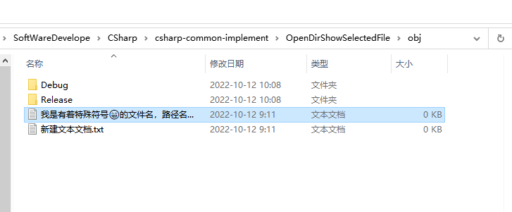

**CSharp打开文件夹并选择文件**

[toc]

> **方法1、方法2 在打开文件夹时，只能选择一个文件。**
> 
> 目前暂时不知道选中多个文件的方法。

# 方法1 - 通过explorer程序打开并选择

资源管理器本身就能通过接受传入的参数，打开文件夹选择文件的功能，其命令使用为：`explorer.exe /select,filepath`【,和filepath之间无空格】

```cs
/// <summary>
/// 方法1. explorer进程打开文件夹并选择文件(夹)。只能选择一个文件打开
/// </summary>
/// <param name="path">文件或文件夹路径，不存在将打开"我的文档"</param>
void OpenDirSelectedFile_Process(string path)
{
    Process.Start("explorer", "/select,\"" + path + "\"");
}
```

调用测试：

```cs
OpenDirSelectedFile_Process(fileName1);
OpenDirSelectedFile_Process(fileName2);
```

  

> Win10之前的系统中，似乎无法识别emoji等多字节的特殊字符，会无法打开成功。目前测试在win10可正常打开特殊字符文件名的文件。
> 
> **`explorer /select` 无法找到文件，打开失败时，会默认打开“我的文档”。**

# 方法2 - SHOpenFolderAndSelectItems API

`SHOpenFolderAndSelectItems` API 打开路径并定位文件，如果文件夹已打开则置前再选中，而不是再打开一个新的文件夹。

```cs
#region 方法2 SHOpenFolderAndSelectItems API      // Win32
/// <summary>
/// 释放命令行管理程序分配的ITEMIDLIST结构
/// Frees an ITEMIDLIST structure allocated by the Shell.
/// </summary>
/// <param name="pidlList"></param>
[DllImport("shell32.dll", ExactSpelling = true)]
public static extern void ILFree(IntPtr pidlList);
/// <summary>
/// 返回与指定文件路径关联的ITEMIDLIST结构。
/// Returns the ITEMIDLIST structure associated with a specified file path.
/// </summary>
/// <param name="pszPath"></param>
/// <returns></returns>
[DllImport("shell32.dll", CharSet = CharSet.Unicode, ExactSpelling = true)]
public static extern IntPtr ILCreateFromPathW(string pszPath);
/// <summary>
/// 打开一个Windows资源管理器窗口，其中选择了特定文件夹中的指定项目。
/// Opens a Windows Explorer window with specified items in a particular folder selected.
/// </summary>
/// <param name="pidlList"></param>
/// <param name="cild"></param>
/// <param name="children"></param>
/// <param name="dwFlags"></param>
/// <returns></returns>
[DllImport("shell32.dll", ExactSpelling = true)]
public static extern int SHOpenFolderAndSelectItems(IntPtr pidlList, uint cild, IntPtr children, uint dwFlags);


/// <summary>
/// 方法2 SHOpenFolderAndSelectItems API 打开路径并定位文件【如果文件夹已打开则置前再选中，而不是再打开一个新的文件夹】
/// </summary>
/// <param name="fullPath">文件或文件夹绝对路径</param>
public static void OpenDirSelectedFile_Win32(string fullPath)
{
    if (string.IsNullOrWhiteSpace(fullPath))
        throw new ArgumentNullException(nameof(fullPath));

    fullPath = Path.GetFullPath(fullPath);
    // 如何获取多个pidlList即列表
    var pidlList = ILCreateFromPathW(fullPath);
    if (pidlList == IntPtr.Zero) return;

    try
    {
        Marshal.ThrowExceptionForHR(SHOpenFolderAndSelectItems(pidlList, 0, IntPtr.Zero, 0));
    }
    finally
    {
        ILFree(pidlList);
    }
}
#endregion
```

# 参考

- [C# 打开文件夹](https://blog.csdn.net/acdyf/article/details/107045158)