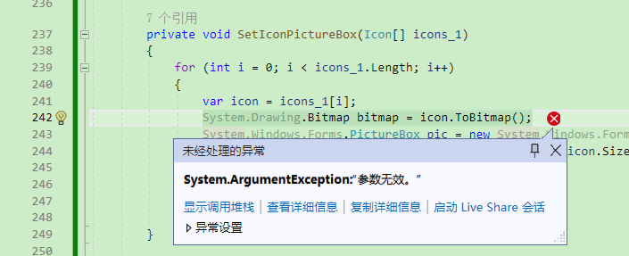
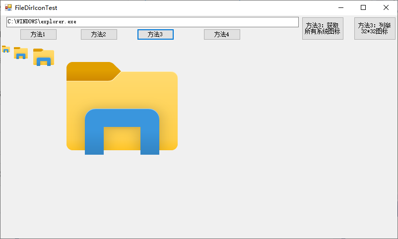

**C#获取Windows下文件图标、文件夹图标的方法总结，提取磁盘、收藏夹、共享目录、程序文件、文件扩展名图标**

[toc]

.NET 中提供了多种方法实现获取文件、文件夹图标，可做到显示类似文件资源管理器中的文件文件夹图标。

如果对 文件/文件夹 图标进行分类，可以分为普通文件夹图标、特殊文件夹图标（磁盘根目录、收藏夹、网络共享目录等）、不同的文件类型图标、应用程序文件图标等。

获取文件图标的方法主要有：

- GDI+ 中的 `Icon.ExtractAssociatedIcon()` 方法，从指定文件中获取图标，通常为 32x32 大小。
- Win32 API `ExtractIconEx` 函数，从指定可执行文件、DLL 或 图标文件 中提取不同大小的图标，可以获取 32x32、16x16 大小两种图标。
- Win32 API `SHGetFileInfo` 获取图标索引号，`SHGetImageList`获取图标列表，根据索引号从图标列表中获取 文件或文件夹 图标，可以获取 16x16、32x32、48x48、256x256 大小的图标。【相对比较全面的获取图标的方式，文件/文件夹】
- Win32 API `SHGetFileInfo` 获取的 `SHFILEINFO` 中提取图标，可以获取 16x16、32x32 大小的图标，同样可以获取 文件或文件夹 图标。【对于获取图标来说，比较推荐】

> `SHGetFileInfo`：检索文件系统中有关对象的信息，例如文件、文件夹、目录或驱动器根目录。

> 从上面介绍中，可以看出 `Icon.ExtractAssociatedIcon()` 与 `ExtractIconEx` 是相同，从文件中获取图标。

> 注：`DestroyIcon`用于销毁icon句柄。类似如下所示：
>
> ```C#
> var icon= System.Drawing.Icon.FromHandle(info.hIcon);
> Win32Extern.DestroyIcon(info.hIcon);
> ```
> 
> 但是，如果销毁icon句柄，对应的 `Icon.FromHandle` Icon 对象也将无法使用。因此，通常需要在使用完 Icon 对象后，显式释放Icon（`icon.Dispose()`）。
> 
> 也可以，通过 `icon.clone()` 之后，释放当前 icon 对象直接关联的 Icon 句柄（或者释放当前icon对象）【有点多此一举】。

# 多次获取ImageList时，可能的出错 System.ArgumentException:参数无效

如下，如果使用下面“很繁琐”的方式调用GetImageList，多次（第二次）调用时就会出现`System.ArgumentException`的异常。

原因不知，，，

```C#
var icons_1 = FileDirIconHelper_ImageList.GetImageList(IMAGELIST_SIZE_FLAG.SHIL_SYSSMALL);
SetIconPictureBox(icons_1);

var icons_2 = FileDirIconHelper_ImageList.GetImageList(IMAGELIST_SIZE_FLAG.SHIL_SMALL);
SetIconPictureBox(icons_2);
var icons_3 = FileDirIconHelper_ImageList.GetImageList( IMAGELIST_SIZE_FLAG.SHIL_LARGE);
SetIconPictureBox(icons_3);
var icons_4 = FileDirIconHelper_ImageList.GetImageList( IMAGELIST_SIZE_FLAG.SHIL_EXTRALARGE);
SetIconPictureBox(icons_4);
var icons_5 = FileDirIconHelper_ImageList.GetImageList( IMAGELIST_SIZE_FLAG.SHIL_JUMBO);
SetIconPictureBox(icons_5);
var icons_6 = FileDirIconHelper_ImageList.GetImageList( IMAGELIST_SIZE_FLAG.SHIL_LAST);
SetIconPictureBox(icons_6);
```




# FileIconHelper - 获取文件图标、文件夹图标 的帮助类

```cs
    /// <summary>
    /// 获取文件图标、文件夹图标 的帮助类
    /// System.Drawing.dll 引用
    /// </summary>
    public class FileIconHelper
    {
        /// <summary>
        /// 获取文件、文件夹的图标
        /// System.Drawing.dll 引用
        /// </summary>
        /// <param name="fileDirName">文件、文件夹名</param>
        /// <param name="largeIcon">图标的大小，默认 false，获取16x16大小图标；否则32x32</param>
        /// <returns></returns>
        public static Icon GetFileDirIcon(string fileDirName, bool largeIcon = false)
        {
            SHFILEINFO info = new SHFILEINFO();
            int size = Marshal.SizeOf(info);
            SHGFI flags;
            if (largeIcon)
                flags = SHGFI.Icon | SHGFI.LargeIcon;//| SHGFI.UseFileAttributes;网上都有加这项导致只对文件有效，去掉后文件夹也可以。
            else
                flags = SHGFI.Icon | SHGFI.SmallIcon;//| SHGFI.UseFileAttributes;网上都有加这项导致只对文件有效，去掉后文件夹也可以。
            IntPtr iconIntPtr = Win32Extern.SHGetFileInfo(fileDirName, 0, out info, (uint)size, flags);
            if (iconIntPtr.Equals(IntPtr.Zero))
                return null;
            return System.Drawing.Icon.FromHandle(info.hIcon);
        }
    }
```

- Win32Extern 中的 Win32 API

```C#
    /// <summary>
    /// Win32 API 的外部方法
    /// </summary>
    internal partial class Win32Extern
    {
        /// <summary>
        /// 获取文件信息
        /// </summary>
        /// <param name="pszPath">一个包含要取得信息的文件相对或绝对路径的缓冲。它可以处理长或短文件名。（也就是指定的文件路径）</param>
        /// <param name="dwFileAttributes">此参数仅用于uFlags中包含SHGFI_USEFILEATTRIBUTES标志的情况(一般不使用)。如此，它应该是文件属性的组合：存档，只读，目录，系统等。</param>
        /// <param name="psfi">指向 SHFILEINFO 结构的指针，用于接收文件信息。</param>
        /// <param name="cbfileInfo">指向的 SHFILEINFO 结构的大小</param>
        /// <param name="uFlags">[要检索的文件信息的标志] 函数的核心变量，通过所有可能的标志，指定函数的行为和实际得到的信息</param>
        /// <returns></returns>
        [DllImport("Shell32.dll")]
        public static extern IntPtr SHGetFileInfo
        (
            string pszPath,
            uint dwFileAttributes,
            out SHFILEINFO psfi,
            uint cbfileInfo,
            SHGFI uFlags
        );

        [DllImport("Shell32.dll", EntryPoint = "SHGetFileInfo")]
        public static extern IntPtr SHGetFileInfo_ref(string pszPath, uint dwFileAttributes, ref SHFILEINFO psfi, uint cbFileInfo, uint uFlags);

        #region SHGetImageList 相关 获取文件或目录图标

        [DllImport("shell32.dll", EntryPoint = "#727")]
        public extern static int SHGetImageList(IMAGELIST_SIZE_FLAG iImageList, ref Guid riid, ref IImageList ppv);

        /// <summary>
        /// 清除图标
        /// </summary>
        /// <param name="hIcon">图标句柄</param>
        /// <returns>返回非零表示成功，零表示失败</returns>
        [DllImport("user32.dll", EntryPoint = "DestroyIcon", SetLastError = true)]
        public static extern int DestroyIcon(IntPtr hIcon);

        [DllImport("shell32.dll")]
        public static extern uint SHGetIDListFromObject([MarshalAs(UnmanagedType.IUnknown)] object iUnknown, out IntPtr ppidl);

        #endregion
    }

    
    /// <summary>
    /// SHGetFileInfo 要获取的文件信息 的标志【指定获取哪些信息】
    /// </summary>
    internal enum SHGFI
    {
        SmallIcon = 0x00000001,
        LargeIcon = 0x00000000,
        Icon = 0x00000100,
        DisplayName = 0x00000200,//Retrieve the display name for the file, which is the name as it appears in Windows Explorer. The name is copied to the szDisplayName member of the structure specified in psfi. The returned display name uses the long file name, if there is one, rather than the 8.3 form of the file name. Note that the display name can be affected by settings such as whether extensions are shown.
        Typename = 0x00000400,  //Retrieve the string that describes the file's type. The string is copied to the szTypeName member of the structure specified in psfi.
        SysIconIndex = 0x00004000, //Retrieve the index of a system image list icon. If successful, the index is copied to the iIcon member of psfi. The return value is a handle to the system image list. Only those images whose indices are successfully copied to iIcon are valid. Attempting to access other images in the system image list will result in undefined behavior.
        OpenIcon = 0x000000002,
        UseFileAttributes = 0x00000010 //Indicates that the function should not attempt to access the file specified by pszPath. Rather, it should act as if the file specified by pszPath exists with the file attributes passed in dwFileAttributes. This flag cannot be combined with the SHGFI_ATTRIBUTES, SHGFI_EXETYPE, or SHGFI_PIDL flags.
    }

    /// <summary>
    /// SHGetFileInfo 获取的文件信息 结构
    /// </summary>
    [StructLayout(LayoutKind.Sequential)]
    internal struct SHFILEINFO
    {
        public IntPtr hIcon;//图标句柄
        public int iIcon;//系统图标列表的索引
        public uint dwAttributes; //文件的属性
        [MarshalAs(UnmanagedType.LPStr, SizeConst = 260)]
        public string szDisplayName;//文件的路径等 文件名最长256（ANSI），加上盘符（X:\）3字节，259字节，再加上结束符1字节，共260
        [MarshalAs(UnmanagedType.LPStr, SizeConst = 80)]
        public string szTypeName;//文件的类型名 固定80字节
    };
```

# FileIconHelper - 获取指定文件内的图标【可执行文件、DLL 或 图标文件】

提供两种方法 `Icon.ExtractAssociatedIcon` 、 `ExtractIconEx` 获取指定文件的图标

```C#
    /// <summary>
    /// 获取指定文件内的图标【可执行文件、DLL 或 图标文件】
    /// </summary>
    public class FileIconHelper
    {
        #region GDI+ Icon
        /// <summary>
        /// 获取指定文件中的ICON图标[一般是Size(32,32)]
        /// </summary>
        /// <param name="fileName">文件名</param>
        /// <returns></returns>
        public static System.Drawing.Icon GetIconFromFile(string fileName)
        {
            if (System.IO.File.Exists(fileName) == false)
                return null;
            return System.Drawing.Icon.ExtractAssociatedIcon(fileName);
        }
        #endregion

        #region ExtractIconEx  win32 API
        /// <summary>
        /// 方法2：使用【ExtractIconEx】从可执行文件、DLL 或 图标文件 中提取不同大小的图标
        /// </summary>
        /// <param name="fileName">应用程序文件名</param>
        /// <returns>返回获取到的Icon图标集，顺序为图标A Size(32,32)、图标A Size(16,16)、图标B Size(32,32)、图标B Size(16,16)....</returns>
        public static System.Drawing.Icon[] GetIconFromFile2(string fileName)
        {
            int count = ExtractIconEx(fileName, -1, null, null, 0);

            IntPtr[] largeIcons = new IntPtr[count];

            IntPtr[] smallIcons = new IntPtr[count];

            ExtractIconEx(fileName, 0, largeIcons, smallIcons, count);
            System.Drawing.Icon[] icons = new System.Drawing.Icon[count * 2];
            for (int i = 0; i < count; i++)
            {
                icons[i * 2] = System.Drawing.Icon.FromHandle(largeIcons[i]);
                icons[i * 2 + 1] = System.Drawing.Icon.FromHandle(smallIcons[i]);
            }
            return icons;
        }

        [DllImport("shell32.dll")]
        private static extern int ExtractIconEx(string lpszFile, int nIconIndex, IntPtr[] phiconLarge, IntPtr[] phiconSmall, int nIcons);
        #endregion
    }
```

- `FileDirIconHelper_ImageList` - 从 SHGetImageList 图标列表中，根据 SHGetFileInfo 获取文件、文件夹图标 的帮助类

```C#
   /// <summary>
    /// 从 SHGetImageList 图标列表中，根据 SHGetFileInfo 获取文件、文件夹图标 的帮助类
    /// </summary>
    public class FileDirIconHelper_ImageList
    {
        #region win32 API SHGetFileInfo  SHGetImageList

        /// <summary>
        /// 获取文件、文件夹的图标
        /// </summary>
        /// <param name="fileDirName">文件、文件夹名</param>
        /// <param name="flag">图标尺寸标识，默认获取16x16</param>
        /// <returns></returns>
        public static System.Drawing.Icon GetFileDirIcon(string fileDirName, IMAGELIST_SIZE_FLAG flag= IMAGELIST_SIZE_FLAG.SHIL_SMALL| IMAGELIST_SIZE_FLAG.SHIL_SYSSMALL)
        {
            return GetIcon(GetIconIndex(fileDirName), flag);
        }

        /// <summary>
        /// SHGetImageList 获取所有文件/系统图标列表
        /// </summary>
        /// <param name="flag">图标尺寸标识</param>
        /// <returns></returns>
        public static System.Drawing.Icon[] GetImageList(IMAGELIST_SIZE_FLAG flag = IMAGELIST_SIZE_FLAG.SHIL_SMALL | IMAGELIST_SIZE_FLAG.SHIL_SYSSMALL)
        {
            IImageList list = null;
            
            Win32Extern.SHGetImageList(flag, ref theGuid, ref list);//获取系统图标列表
            int count = 0;
            int r = list.GetImageCount(ref count);//获取图标索引总数

            var icons = new Icon[count];

            IntPtr hIcon = IntPtr.Zero;
            for (int i = 0; i < count; i++)
            {
                hIcon = IntPtr.Zero;
                list.GetIcon(i, ILD_TRANSPARENT | ILD_IMAGE, ref hIcon);//获取指定索引号的图标句柄
                if (hIcon== IntPtr.Zero)
                {
                    continue;
                }
                icons[i] = Icon.FromHandle(hIcon);

            }
            return icons;
        }


        private const int ILD_TRANSPARENT = 0x00000001;
        private const int ILD_IMAGE = 0x00000020;

        private const string IID_IImageList2 = "192B9D83-50FC-457B-90A0-2B82A8B5DAE1";//GUID的两个com标识中的一个，底层固定
        private const string IID_IImageList = "46EB5926-582E-4017-9FDF-E8998DAA0950";//GUID的两个com标识中的一个，底层固定

        private static Guid theGuid = new Guid(IID_IImageList);//目前所知用IID_IImageList2也是一样的

        /// <summary>
        /// 获取文件的图标索引号
        /// </summary>
        /// <param name="fileName">文件名</param>
        /// <returns>图标索引号</returns>
        private static int GetIconIndex(string fileName)
        {
            SHFILEINFO info = new SHFILEINFO();
            IntPtr iconIntPtr = Win32Extern.SHGetFileInfo_ref(fileName, 0, ref info, (uint)Marshal.SizeOf(info), (uint)(SHGFI.SysIconIndex | SHGFI.OpenIcon));
            if (iconIntPtr == IntPtr.Zero)
                return -1;
            return info.iIcon;
        }

        /// <summary>
        /// 根据图标索引号获取图标
        /// </summary>
        /// <param name="iIcon">图标索引号</param>
        /// <param name="flag">图标尺寸标识</param>
        /// <returns></returns>
        private static System.Drawing.Icon GetIcon(int iIcon, IMAGELIST_SIZE_FLAG flag)
        {
            IImageList list = null;
            //Guid theGuid = new Guid(IID_IImageList);//目前所知用IID_IImageList2也是一样的
            Win32Extern.SHGetImageList(flag, ref theGuid, ref list);//获取系统图标列表
            IntPtr hIcon = IntPtr.Zero;
            int r = list.GetIcon(iIcon, ILD_TRANSPARENT | ILD_IMAGE, ref hIcon);//获取指定索引号的图标句柄
            return System.Drawing.Icon.FromHandle(hIcon);
        }

        #endregion
    }
```


用到的类或结构：

```C#

    [ComImportAttribute()]
    [GuidAttribute("192B9D83-50FC-457B-90A0-2B82A8B5DAE1")]
    [InterfaceTypeAttribute(ComInterfaceType.InterfaceIsIUnknown)]
    internal interface IImageList
    {
        [PreserveSig]
        int Add(IntPtr hbmImage, IntPtr hbmMask, ref int pi);

        [PreserveSig]
        int ReplaceIcon(int i, IntPtr hicon, ref int pi);

        [PreserveSig]
        int SetOverlayImage(int iImage, int iOverlay);

        [PreserveSig]
        int Replace(int i, IntPtr hbmImage, IntPtr hbmMask);

        [PreserveSig]
        int AddMasked(IntPtr hbmImage, int crMask, ref int pi);

        [PreserveSig]
        int Draw(ref IMAGELISTDRAWPARAMS pimldp);

        [PreserveSig]
        int Remove(int i);

        [PreserveSig]
        int GetIcon(int i, int flags, ref IntPtr picon);

        [PreserveSig]
        int GetImageInfo(int i, ref IMAGEINFO pImageInfo);

        [PreserveSig]
        int Copy(int iDst, IImageList punkSrc, int iSrc, int uFlags);

        [PreserveSig]
        int Merge(int i1, IImageList punk2, int i2, int dx, int dy, ref Guid riid, ref IntPtr ppv);

        [PreserveSig]
        int Clone(ref Guid riid, ref IntPtr ppv);

        [PreserveSig]
        int GetImageRect(int i, ref RECT prc);

        [PreserveSig]
        int GetIconSize(ref int cx, ref int cy);

        [PreserveSig]
        int SetIconSize(int cx, int cy);

        [PreserveSig]
        int GetImageCount(ref int pi);

        [PreserveSig]
        int SetImageCount(int uNewCount);

        [PreserveSig]
        int SetBkColor(int clrBk, ref int pclr);

        [PreserveSig]
        int GetBkColor(ref int pclr);

        [PreserveSig]
        int BeginDrag(int iTrack, int dxHotspot, int dyHotspot);

        [PreserveSig]
        int EndDrag();

        [PreserveSig]
        int DragEnter(IntPtr hwndLock, int x, int y);

        [PreserveSig]
        int DragLeave(IntPtr hwndLock);

        [PreserveSig]
        int DragMove(int x, int y);

        [PreserveSig]
        int SetDragCursorImage(ref IImageList punk, int iDrag, int dxHotspot, int dyHotspot);

        [PreserveSig]
        int DragShowNolock(int fShow);

        [PreserveSig]
        int GetDragImage(ref POINT ppt, ref POINT pptHotspot, ref Guid riid, ref IntPtr ppv);

        [PreserveSig]
        int GetItemFlags(int i, ref int dwFlags);

        [PreserveSig]
        int GetOverlayImage(int iOverlay, ref int piIndex);
    }


    [StructLayout(LayoutKind.Sequential)]
    public struct POINT
    {
        int x;
        int y;
    }

    [StructLayout(LayoutKind.Sequential)]
    public struct IMAGELISTDRAWPARAMS
    {
        public int cbSize;
        public IntPtr himl;
        public int i;
        public IntPtr hdcDst;
        public int x;
        public int y;
        public int cx;
        public int cy;
        public int xBitmap;    // x offest from the upperleft of bitmap
        public int yBitmap;    // y offset from the upperleft of bitmap
        public int rgbBk;
        public int rgbFg;
        public int fStyle;
        public int dwRop;
        public int fState;
        public int Frame;
        public int crEffect;
    }


    [StructLayout(LayoutKind.Sequential)]
    public struct RECT
    {
        public int left, top, right, bottom;
    }

    [StructLayout(LayoutKind.Sequential)]
    public struct IMAGEINFO
    {
        public IntPtr hbmImage;
        public IntPtr hbmMask;
        public int Unused1;
        public int Unused2;
        public RECT rcImage;
    }


        /// <summary>
    /// IMAGELIST 的 图标大小标识
    /// </summary>
    public enum IMAGELIST_SIZE_FLAG : int
    {
        /// <summary>
        /// Size(32,32)
        /// </summary>
        SHIL_LARGE = 0x0,
        /// <summary>
        /// Size(16,16)
        /// </summary>
        SHIL_SMALL = 0x1,
        /// <summary>
        /// Size(48,48)
        /// </summary>
        SHIL_EXTRALARGE = 0x2,
        /// <summary>
        /// Size(16,16)
        /// </summary>
        SHIL_SYSSMALL = 0x3,
        /// <summary>
        /// Size(256,256)
        /// </summary>
        SHIL_JUMBO = 0x4,
        /// <summary>
        /// 保留使用：目前测试效果为Size(256,256)
        /// </summary>
        SHIL_LAST = 0x4,
    }
```

# 获取文件扩展名的图标

https://www.cnblogs.com/1175429393wljblog/p/5345022.html

## 从 注册表 中读取 指定扩展名的文件图标

https://blog.csdn.net/lusunqing/article/details/9133017

## SHGetFileInfo 中指定获取文件类型的图标

https://blog.csdn.net/lusunqing/article/details/9133017

// SHGFI.UseFileAttributes | SHGFI.TypeName | SHGFI.DisplayName 实现获取文件扩展名的图标

# 测试使用

`MiscellaneousTest/FileDirIconTest.cs`



```C#
System.Drawing.Icon icon = FileDirIconHelper_ImageList.GetFileDirIcon(name);
System.Drawing.Bitmap bitmap = icon.ToBitmap();
System.Windows.Forms.PictureBox pic = new System.Windows.Forms.PictureBox();
pic.Size = new System.Drawing.Size(icon.Size.Width, icon.Size.Height);
flowLayout.Controls.Add(pic);
pic.Image = bitmap;
icon.Dispose();

icon = FileDirIconHelper_ImageList.GetFileDirIcon(name, IMAGELIST_SIZE_FLAG.SHIL_LARGE);
bitmap = icon.ToBitmap();
pic = new System.Windows.Forms.PictureBox();
pic.Size = new System.Drawing.Size(icon.Size.Width, icon.Size.Height);
flowLayout.Controls.Add(pic);
pic.Image = bitmap;
icon.Dispose();

icon = FileDirIconHelper_ImageList.GetFileDirIcon(name, IMAGELIST_SIZE_FLAG.SHIL_EXTRALARGE);
bitmap = icon.ToBitmap();
pic = new System.Windows.Forms.PictureBox();
pic.Size = new System.Drawing.Size(icon.Size.Width, icon.Size.Height);
flowLayout.Controls.Add(pic);
pic.Image = bitmap;
icon.Dispose();

icon = FileDirIconHelper_ImageList.GetFileDirIcon(name, IMAGELIST_SIZE_FLAG.SHIL_JUMBO);
bitmap = icon.ToBitmap();
pic = new System.Windows.Forms.PictureBox();
pic.Size = new System.Drawing.Size(icon.Size.Width, icon.Size.Height);
flowLayout.Controls.Add(pic);
pic.Image = bitmap;
icon.Dispose();
```

# 另：PrivateExtractIcons 函数

Win 32 API 的 PrivateExtractIcons 函数可以获取指定大小的Icon图标，比如 256x256。

但是该函数不用于常用用途，后续Windows版本可能会变更。

具体使用和示例，可以参考 [C# 获取exe、dll中的图标，支持获取256x256分辨率](https://www.cnblogs.com/JmlSaul/p/7515885.html)

# 参考

- 本文基础代码和测试代码，均出自 [C# 获取Windows系统ICON图标的四种方式-可提取各种文件夹、文件等等图标](https://blog.csdn.net/lzl_li/article/details/117038323)
- [ExtractIconExA 函数 (shellapi.h)](https://learn.microsoft.com/zh-cn/windows/win32/api/shellapi/nf-shellapi-extracticonexa)
- [SHGetImageList 函数 (shellapi.h)](https://learn.microsoft.com/zh-cn/windows/win32/api/shellapi/nf-shellapi-shgetimagelist)
- [SHGetFileInfoA 函数 (shellapi.h)](https://learn.microsoft.com/zh-cn/windows/win32/api/shellapi/nf-shellapi-shgetfileinfoa)

另，可参考 [C#获取系统文件、文件夹和磁盘驱动器图标](https://blog.csdn.net/lusunqing/article/details/9133017)
