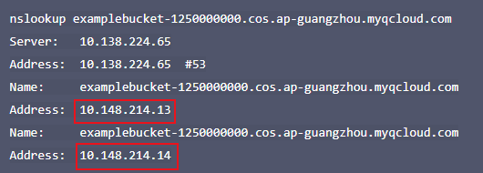
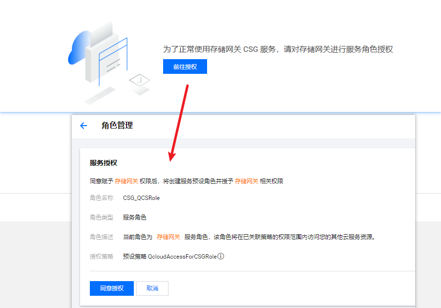

**CVM腾讯云服务器linux系统[内网] CentOS 8 挂载COS云对象存储的实现**

[toc]

COS 是否有内网域名？

对象存储（Cloud Object Storage，COS）的默认源站域名格式为：`<BucketName-APPID>.cos.<Region>.myqcloud.com`，默认已支持公网访问和同地域的内网访问。参见 [地域和访问域名](https://cloud.tencent.com/document/product/436/6224)。

同地域范围内的访问将会自动被指向到内网地址，即自动使用内网连接，在内网环境下通过存储桶的域名访问 COS 时，COS 会智能解析到内网 IP 上。内网流量不计费。


# 云服务器 判断 内网访问对象存储 方法

1. 获取存储桶访问域名，并记录该地址
2. 登录实例，并执行 nslookup 命令。假设 `examplebucket-1250000000.cos.ap-guangzhou.myqcloud.com` 为目标存储桶地址，则执行以下命令：

```sh
nslookup examplebucket-1250000000.cos.ap-guangzhou.myqcloud.com
```

返回如下图，其中`10.148.214.13`和`10.148.214.14`这两个 IP 就代表了是通过内网访问 COS。



> **内网 IP 地址一般形如 `10.*.*.*`、`100.*.*.*` ，VPC 网络一般为`169.254.*.*` 等，这两种形式的 IP 都属于内网。**

> 虚拟私有云VPC（Virtual Private Cloud）
> 
> 虚拟专属私有网络（Virtual Private Cloud，简称 VPC 网络）是为用户在云上构建的私有网络空间，为用户创建的云资源提供隔离的虚拟网络环境。

具体参见 [云服务器通过内网访问对象存储](https://cloud.tencent.com/document/product/213/57441)

# CVM 挂载 COS 【不推荐】

访问 [CVM 挂载 COS](https://console.cloud.tencent.com/cos/bucket?bucket=pan-storage-bucket-1256319690&region=ap-beijing&type=csg) 



这种方式是通过创建文件系统的形式实现CVM挂载COS，需要创建网关【费用不低】


# 腾讯云cosfs工具将COS的存储桶挂载到CentOS 8

## COSFS 工具 介绍

COSFS 工具支持将对象存储（Cloud Object Storage，COS）存储桶挂载到本地，像使用本地文件系统一样直接操作腾讯云对象存储中的对象， COSFS 提供的主要功能包括：

- 支持 POSIX 文件系统的大部分功能，如：文件读写、目录操作、链接操作、权限管理、uid/gid 管理等功能。
- 大文件分块传输功能。
- MD5 数据校验功能。
- 将本机数据上传至 COS，建议使用 [COS Migration 工具](https://cloud.tencent.com/document/product/436/15392) 或 [COSCMD 工具](https://cloud.tencent.com/document/product/436/10976)。

COSFS 并未提供 CentOS 8 的版本，因此，只能最好通过下载源码，通过编译安装的形式安装，应该是兼容的。目前最新版本 cosfs-1.0.20-centos7.0.x86_64.rpm

## 安装COSFS工具

- 获取源码

```sh
git clone https://github.com/tencentyun/cosfs /usr/cosfs
```

- 安装依赖软件

```sh
sudo yum install automake gcc-c++ git libcurl-devel libxml2-devel fuse-devel make openssl-devel fuse
```

- 编译和安装 COSFS

```sh
cd /usr/cosfs
./autogen.sh
./configure
make
sudo make install
cosfs --version  #查看 cosfs 版本号
```

如下：

```sh
# cosfs --version
Tencentyun Object Storage Service File System V1.0.20(commit:774e9ae) with OpenSSL
License GPL2: GNU GPL version 2 <http://gnu.org/licenses/gpl.html>
This is free software: you are free to change and redistribute it.
There is NO WARRANTY, to the extent permitted by law.
```

## 获取存储桶相关的挂载信息

登录腾讯云-控制台-对象存储-存储桶获取相关信息

- BucketName-APPID : test-1250000000 即存储桶名称（直接从存储桶列表中获取`存储桶名称`即可）
- SecretId : XXXXXX
- SecretKey : XXXXXX
- 区域地址 : `https://cos.ap-guangzhou.myqcloud.com` 存储桶所在的区域[域名](https://cloud.tencent.com/act/pro/domain-sales?from=20065&from_column=20065).

背景：https://cos.ap-beijing.myqcloud.com  可以通过存储桶信息的域名信息中获取。

## 配置密钥文件

在文件 `/etc/passwd-cosfs` 中，写入存储桶名称（格式为 BucketName-APPID），以及该存储桶对应的 `<SecretId>` 和 `<SecretKey>`，使用半角冒号隔开。为了防止密钥泄露，COSFS 要求您将密钥文件的权限值设置为640。

```sh
sudo su  # 切换到 root 身份，以修改 /etc/passwd-cosfs 文件；如果已经为 root 用户，无需执行该条命令。
echo <BucketName-APPID>:<SecretId>:<SecretKey> > /etc/passwd-cosfs
chmod 640 /etc/passwd-cosfs
```

示例：

```sh
echo examplebucket-1250000000:AKIDHTVVaVR6e3****:PdkhT9e2rZCfy6**** > /etc/passwd-cosfs
chmod 640 /etc/passwd-cosfs
```

## 挂载COS

将密钥文件中配置的存储桶挂载到指定目录：

```sh
cosfs <BucketName-APPID> <MountPoint> -ourl=http://cos.<Region>.myqcloud.com -odbglevel=info -oallow_other -onoxattr
```

- `<MountPoint>` 为本地挂载目录（例如`/mnt`）。
- `<Region>` 为地域简称， 例如 ap-guangzhou 、 eu-frankfurt 等。更多地域简称信息，请参见 [可用地域](https://cloud.tencent.com/document/product/436/6224)。
- `-odbglevel` 指定日志级别，默认为crit，可选值为crit、error、warn、info、debug。
- `-oallow_other` 允许非挂载用户访问挂载文件夹。
- `-onoxattr` 禁用 getattr/setxattr 功能，在1.0.9之前版本的 COSFS 不支持设置和获取扩展属性，如果在挂载时使用了 use_xattr 选项，可能会导致 mv 文件到 Bucket 失败。

> 通过 `-opasswd_file=[path]` 可以指定密钥文件的路径，这样可以将密钥保存在自定义的位置，同时密钥文件权限设置为 600。

创建想要挂载的路径：

```sh
mkdir -p /mnt/cosfs
```

挂载：

```sh
cosfs examplebucket-1250000000 /mnt/cosfs -ourl=http://cos.ap-beijing.myqcloud.com -onoxattr -oallow_other -odbglevel=error
```

也可以挂载子目录：

```sh
cosfs examplebucket-1250000000:/my-dir /mnt/cosfs -ourl=http://cos.ap-beijing.myqcloud.com -onoxattr -oallow_other -odbglevel=error
```

## 卸载COS

```sh
umount -l /mnt/cosfs
```

或 

```sh
fusermount -u /mnt
```

> fusermount 命令专用于卸载 FUSE 文件系统

或

```sh
umount /mnt
```

如果有程序引用文件系统中的文件时，`umount /mnt`进行卸载会报错。

## 日志文件

在 CentOS 中，COSFS 产生的日志存储在 `/var/log/messages` 中；

在 Ubuntu 中，COSFS 日志存储在 `/var/log/syslog` 中

## 设定 COSFS 开机自动挂载

- 先安装 fuse 包

```sh
sudo yum install -y fuse
```

- 在 `/etc/fstab` 文件中添加如下的内容，其中，`_netdev` 选项使得网络准备好后再执行当前命令：

```sh
cosfs#examplebucket-1250000000 /mnt/cosfs fuse _netdev,allow_other,url=http://cos.ap-beijing.myqcloud.com,dbglevel=error,onoxattr
```

## 设置挂载点下的文件以及目录的用户和用户组？

有些场景（例如 nginx 服务器），需要设置挂载点下的文件和目录的用户和用户组，例如 www 用户（uid=1002，gid=1002），则添加如下挂载参数：

```sh
-ouid=1002 -ogid=1002
```

# GooseFS-Lite 工具 挂载COS存储桶

COSFS 基于 S3FS 构建，读取和写入操作都经过磁盘中转。

相比于 COSFS，更建议您使用 GooseFS-Lite工具访问 COS，GooseFS-Lite 是一个轻量级单机 COS Fuse 工具，具有更好的读写性能和稳定性。大文件的读写速度更高，提升性能。

GooseFS-Lite 支持 POSIX 文件系统的主要功能，例如文件顺序/随机读，顺序写、目录操作等功能。

> GooseFS-Lite 不支持对文件进行随机写和 truncate 操作。


# 参考

- [COSFS 工具](https://cloud.tencent.com/document/product/436/6883)

- [CentOS 7 挂载腾讯云COS对象存储教程](https://www.ioiox.com/archives/65.html)

- [COSFS 工具常见问题](https://cloud.tencent.com/document/product/436/30743)

- [GooseFS-Lite 工具](https://cloud.tencent.com/document/product/1424/73687)
