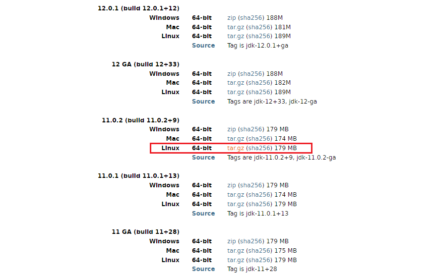

**CentOS 8 安装 OpenJDK 11 的过程**

[toc]

# 下载 OpenJDK

https://jdk.java.net/archive/  包含所有版本的 Open JDK，根据需要下载所需的版本即可。



```sh
wget https://download.java.net/java/GA/jdk11/9/GPL/openjdk-11.0.2_linux-x64_bin.tar.gz
```

# 创建Java目录

在 /usr/ 目录下创建 java 目录

```sh
mkdir /usr/java
# cd /usr/java
```

# 解压 Open JDK

将下载的文件 openjdk-11.0.2_linux-x64_bin.tar.gz 解压到到 `/usr/java/` 目录下

```sh
tar -zxvf openjdk-11.0.2_linux-x64_bin.tar.gz -C /usr/java
```

# 设置环境变量

编辑 `/etc/profile` 文件，在 profile 文件中添加如下内容并保存：

```ini
set java environment
JAVA_HOME=/usr/java/jdk-11.0.2        
JRE_HOME=/usr/java/jdk-11.0.2/jre     
CLASS_PATH=.:$JAVA_HOME/lib/dt.jar:$JAVA_HOME/lib/tools.jar:$JRE_HOME/lib
PATH=$PATH:$JAVA_HOME/bin:$JRE_HOME/bin
export JAVA_HOME JRE_HOME CLASS_PATH PATH
```

- vim 打开追加

```sh
vim /etc/profile
```

- 执行 source 使修改生效

```sh
source /etc/profile
```

# 测试 Java 安装成功

```sh
java -version
```

若显示 Java 版本信息，则说明 JDK 安装成功：

```sh
openjdk version "11.0.2" 2019-01-15
OpenJDK Runtime Environment 18.9 (build 11.0.2+9)
OpenJDK 64-Bit Server VM 18.9 (build 11.0.2+9, mixed mode)
```
