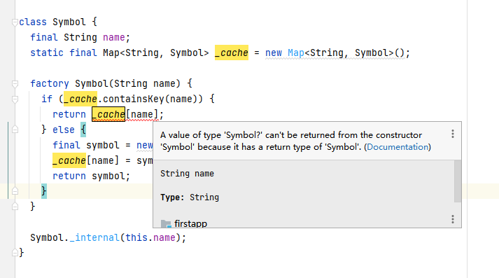

**[Flutter]足够入门的Dart语言系列之面向对象：类成员的可见性、常量和工厂构造函数详解**

[toc]

# 类及其成员的可见性

类在封装过程中，并不是所有的成员都应该暴露给外界访问，一些私有的属性，通常只在内部使用，过多的暴露内部细节只会增加使用的复杂度，以及误操作的安全风险。

Dart中没有提供限制成员访问的关键字，其**私有成员的定义是通过`_`前缀进行限定的**。

将上面含有`_name`成员变量的`MyAdd`类单独提取到`MyAdd.dart`文件中。通过`import 'MyAdd.dart';`命令引入，当访问`_name`时，会提示“未定义”。

  

这是因为，作为“包”引入时，`_name`成员是私有的，对外界不可见，无法访问到，所以报错未定义。

同样，**如果成员方法、类的名称以`_`开头，也表示是私有的，外界同样无法访问**。

对于私有变量的修改和访问，通常需要结合属性的`set`或`get`方法实现，设置或修改属性时通常也会进行一些额外的逻辑处理。

> 注意：可见性是以`包`/`文件`为单位的。同一个文件中没有可见性的区分。只要是在同一个文件中，`_`开头的类、成员方法、成员变量都可以正常访问，不受限制。

#  `Object.runtimeType`属性用于获取一个对象的类型

# factory 工厂构造函数

`factory`关键字标识类的构造函数为工厂构造函数，它的作用是，使构造函数不返回新的实例，而是由代码实现控制是否返回新的示例，或使用缓存中的实例，或返回一个子类型的实例等等。

普通的构造函数，在实例化时都会自动生成并返回一个新的对象；但工厂构造函数函数需要通过代码控制返回实例对象。

> 工厂构造函数不需要每次构建新的实例，且不会自动生成实例，而是通过代码来决定返回的实例对象。
> 
> 工厂构造函数类似于 static 静态成员，无法访问 this 指针；一般需要依赖其他类型构造函数；工厂构造函数还可以实现单例；

## 实现单例

通过factory工厂构造函数，可以非常方便的实现单例。

```dart
class FactoryClass{
    //单例对象
    static final FactoryClass _instance =  FactoryClass._init();
    //私有的构造函数
    FactoryClass._init();
    //工厂构造函数
    factory FactoryClass()=>_instance;
}
```

不太优雅的单例实现方式：

```dart
class SingletonClass{
  static SingletonClass? _singleton;

  factory SingletonClass(){
    if(_singleton==null){
      _singleton = SingletonClass._internal();
    }
    return _singleton!;
  }
  SingletonClass._internal();
}
```

还可以稍微简化为：

```dart
class SingletonClass {
  static SingletonClass? _singleton;

  factory SingletonClass() {
    _singleton ??= SingletonClass._internal();
    return _singleton!;
  }
  SingletonClass._internal();
}
```

## 避免创建过多的实例，如果实例已存在则从缓存获取

当执行构造函数并不总是创建这个类的一个新实例时，则使用 `factory` 关键字。

可以通过工厂构造函数会返回一个 cache 中的实例，而不是重复创建过多实例。

下面的Symbol类，通过工厂构造函数从`cache`中获取已经初始化过的实例

```dart
class Symbol {
  final String name;
  static final Map<String, Symbol> _cache = new Map<String, Symbol>();

  factory Symbol(String name) {
    if (_cache.containsKey(name)) {
      return _cache[name]!;
    } else {
      final symbol = new Symbol._internal(name);
      _cache[name] = symbol;
      return symbol;
    }
  }

  Symbol._internal(this.name);
}
```

返回时需要使用`_cache[name]!`的问题

  

> 后置操作符`!`为空断言操作符(`Null assertion operator`)，将表达式的类型转换为其基础类型，如果转换失败会抛出运行时异常。
> 
> **上面`_cache[name]!`中作后缀的`!`会让左侧的表达式转成对应的非空类型。** `a value of int? can’t be assigned to a variable type of ‘int’`类似的可空类型不能转换为基础类型的问题，就可以使用`!`解决。
>
> 与其他所有转换一样，使用 ! 会失去部分静态的安全性。这些转换必须在运行时进行。

还可以简化为：

```dart
class Symbol {
  final String name;
  static final Map<String, Symbol> _cache = new Map<String, Symbol>();

  factory Symbol(String name) {
    if (!_cache.containsKey(name)) {
      final symbol = new Symbol._internal(name);
      _cache[name] = symbol;
    }
    return _cache[name]!;
  }

  Symbol._internal(this.name);
}
```

使用`putIfAbsent`方法[推荐]，还可以简化为：

```dart
class Symbol {
  final String name;
  static final Map<String, Symbol> _cache = new Map<String, Symbol>();

  factory Symbol(String name) {
    return _cache.putIfAbsent(name, () => Symbol._internal(name));
  }

  Symbol._internal(this.name);
}
```

测试生成的实例：

```dart
var symbol1 = new Symbol('one');
var symbol2 = new Symbol('two');

var symbol3 = new Symbol('one');
var symbol4 = new Symbol('two');

print(identical(symbol1, symbol3));  // true
print(identical(symbol2, symbol4));  // true

// 或
print(symbol1==symbol3);    // true
print(symbol2==symbol4);    // true
```

> Dart官方给出的示例也是相同的。如下，一个log输出类`Logger`：
> 
> ```dart
> class Logger {
>   final String name;
>   bool mute = false;
> 
>   // _cache is library-private, thanks to
>   // the _ in front of its name.
>   static final Map<String, Logger> _cache = <String, Logger>{};
> 
>   factory Logger(String name) {
>     return _cache.putIfAbsent(name, () => Logger._internal(name));
>   }
> 
>   factory Logger.fromJson(Map<String, Object> json) {
>     return Logger(json['name'].toString());
>   }
> 
>   Logger._internal(this.name);
> 
>   void log(String msg) {
>     if (!mute) print(msg);
>   }
> }
> ```
> 
> 使用功能测试：
> 
> ```dart
> var logger = Logger('UI');
> logger.log('Button clicked');
> 
> var logMap = {'name': 'UI'};
> var loggerJson = Logger.fromJson(logMap);
> ```

## 返回一个子类的实例

通常情况下，子类实现某些限制型接口，由工厂类来负责具体的实例化子类的内容，构造并返回具体的子类对象。

```dart
//此代码只是语法正确的代码，实际并不会如此实现
abstract class Animal {
  String? name;
  factory Animal(String type, String name) {
    switch(type) {
      case "cat":
        return new Cat(name);
      case "dog":
        return new Dog(name);
      default:
        throw "The '$type' is not an animal";
    }
  }
}

class Cat implements Animal {
  String? name;
  Cat(this.name);
}

class Dog implements Animal {
  String? name;
  Dog(this.name);
}


void main() {
  Cat cat = Animal("cat","小猫") as Cat; // 小猫
  Dog dog = Animal("dog","小狗") as Dog; // 小狗
 
  print(cat.name);
  print(dog.name);
}
```

# const 常量构造函数

> 常量构造函数创建的实例并不总是常量

## const构造函数的使用

`const`关键字用于构造函数，表示常量构造函数。如果类生成的对象从不会改变，可以将这些对象创建为编译时常量，则可以定义常量构造函数并确保所有的实例变量为`final`类型。

比如：

```dart
class ImmutablePoint {
  static const ImmutablePoint origin = ImmutablePoint(0, 0);

  final double x, y;

  const ImmutablePoint(this.x, this.y);

  ImmutablePoint.clone(ImmutablePoint other): x = other.x, y = other.y;

  void t(){
    print('测试');
  }
}
```

使用常量构造函数时，在构造函数名之前加 `const` 关键字，创建编译时常量：

```dart
var p = const ImmutablePoint(2, 2);
```

使用相同构造函数、相同参数值构造的编译时常量是同一个对象：

```dart
var a = const ImmutablePoint(1, 1);
var b = const ImmutablePoint(1, 1);

print(identical(a, b)); 
```

在 常量上下文 的环境中，通常是可以省略const关键字的。但是，`const`不应该轻易忽略掉，因为，即使是常量构造函数，不使用`const`也会创建一个非常量对象：

```dart
var a = const ImmutablePoint(1, 1); // 常量
var b = ImmutablePoint(1, 1); // 没有创建常量   隐含 new ImmutablePoint(1, 1);
var c = ImmutablePoint(1, 1); // 没有创建常量   隐含 new ImmutablePoint(1, 1);

print(identical(a, b)); // false
print(identical(a, c)); // false
print(identical(b, c)); // false

a.t();  // 测试

var d = ImmutablePoint.clone(a);
print(identical(a, d)); // false
```

## const构造函数的作用

> 此部分更多介绍参见下面的参考文章。

const构造函数创建一个“规范化”实例。也就是说，所有常量表达式都开始规范化，然后使用这些“规范化”符号来识别这些常量的等效性。

规范化：一种将具有多个可能的表示的数据转换为“标准”规范表示的过程。

如果要比较不同表示形式的等效性，可以通过计算不同数据结构的数量，消除重复计算来提高各种算法的效率，或者可以强加有意义的排序顺序。

这意味着，const常量之类的表达式可以表示对虚拟机比较有用的任何可用形式。

VM仅需要按在const表达式中出现的顺序考虑值类型和参数，同时，减少它们以进行优化。

**常量不会每次都重新创建。它们在编译时被规范化，并存储在特殊的查找表中（在其中通过规范签名进行哈希处理），以后可以从中重新使用它们。**

任何类都可以具有`final字段`，也可以具有`const构造函数`。

Dart中的字段实际上是一个匿名存储位置，结合了自动创建的`getter`和`setter`来读取和更新存储，还可以在构造函数的初始化列表中对其进行初始化。

`final字段`是相同的，只是没有设置器，因此设置其值的唯一方法是在构造函数初始化器列表中，并且此后无法更改值——因此是“final”。

**`const构造函数`的目的不是初始化`final`字段，任何`生成构造函数`都可以做到这一点**。关键是创建编译时常量值：**在编译时已经知道所有字段值的对象，而不执行任何语句**。

这对类和构造函数带来了一些限制。`const构造函数`不能具有主体（不执行任何语句！注意，是`常量构造函数`没有主体，类中还是可以有方法的），并且其类不得具有任何非`final字段`（在编译时“已经知道”的值以后不能更改）。初始化程序列表还必须仅将字段初始化为其他编译时常量，因此右侧仅限于“编译时常量表达式”(或实际上：“可能是编译时常量表达式”，因为它也可能引用构造函数参数。) 。并且必须以“const”作为前缀——否则，将得到一个满足这些要求的普通构造函数。这不是`const构造函数`。

将`new`应用到`const构造函数`将会创建一个普通的对象，也就是，`const构造函数`可以用作普通的构造函数，以在运行时创建对象；但更重要的是，在编译时创建编译时常量对象。


# 参考

- [Dart构造函数最详细的解析](https://www.moban555.com/article/977388.html)

