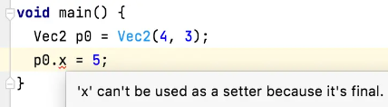
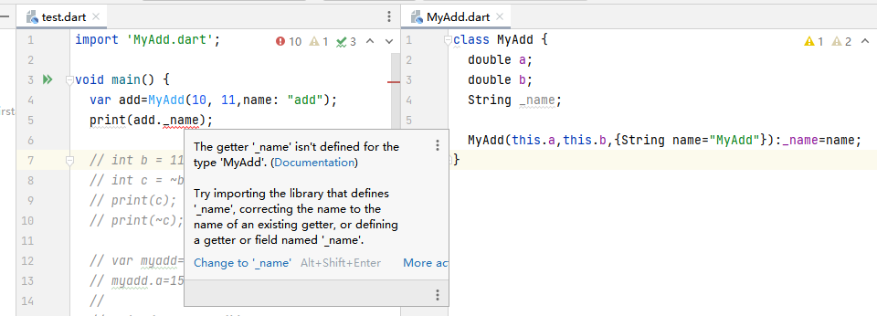

**[Flutter]足够入门的Dart语言系列之面向对象：类的定义和实例使用**

[toc]

`类`表示的是分类，一类问题或事物，它是对具体或现实世界的抽象。比如`动物类`、`犬科动物类`、`猫科动物类`、`房子类`、`数学类`，类是具体事物的描述，它不是具体的某个动物、某栋房子、某个数学题，而是对它们的概括。

上面的定义虽然比较正式化，但它却能明确的表达编程中`类`的含义，一个`类`可以描述这个事物，另一个`类`就可以描述另一个事物（只是抽象程度可能有所不同），由此可以推出，可以用`类`描述任何事物。`类`可以抽象现实中任何事物（包括非现实中的），`类`的具体化就是一个具体的特指的对象，任何事物可以用描述为一个对象，这就是面向对象的开发思想。

`类`不仅描述数据或状态，通常还包含行为或功能，用来"完整"的表示一类事物，完成指定的功能逻辑。

# 类class介绍

## 类的定义

`class`关键字用来定义一个`类`，后面的标识符表示`类的名称`。名称后面，通过 `{}` 表示类定义的作用域，在其中可以定义类的 `成员变量` 及 `成员方法`。

```dart
class ClassName{
	// 类中的成员
}
```

比如我们定义一个`MyAdd`实现加法功能的类。

```dart
class MyAdd{
    double a=0;
    double b=0;

    double sum(){
        return a+b;
    }
}
```

## 类的实例化

定义了类就需要使用，使用类就要创建类对应的具体的对象。

创建对象的过程称为类的实例化，对象是类的一个实例。

```dart
var myClassName=ClassName();
```

比如，我们创建加法类`MyAdd`的实例，并使用其中的成员：

```dart
var myadd=MyAdd();

myadd.a=10;
print(myadd.sum()); // 10
```

> dart提供可选的`new`关键字来创建对象： `var myClassName=new ClassName();`

## 成员方法

成员变量表示类有哪些数据或状态；成员方法表示类有哪些功能或行为。

`MyAdd`类的成员方法`sum`用于实现计算和的功能。通过`.`进行方法的调用。

```dart
var sum=myadd.sum();
```

成员方法的作用就是对类的逻辑功能的`封装`，可以达到直接调用，使用对应功能的目的。


## 构造函数

声明一个与类名一样的函数即可声明一个构造函数。构造函数的作用是用于创建一个类的实例，实现类的实例化，创建一个具体的对象。

### 构造函数的特定

构造函数是一个特殊的函数：

1. 构造函数在声明时无返回值。
2. 构造函数可以没有方法体。
3. 在参数列表中可以通过 `this.成员` ，为成员变量进行赋值。
4. 没有显式声明构造函数时，默认自动生成一个无参、无方法体的构造函数。

比如上面的`MyAdd`类，其对应的完整类定义如下，两者等同：

```dart
class MyAdd{
    double a=0;
    double b=0;

    MyAdd();
    // ...
}
```

声明一个有参的构造函数，函数体内实现对属性的赋值。

```dart
class MyAdd{
    double a=0;
    double b=0;

    MyAdd(double a,double b){
        this.a=a;
        this.b=b;
    }
    // ...
}
```

> `this`关键字引用当前实例，指代的是当前对象。
> 
> 上面使用`this`是因为参数和成员变量有命名冲突，为了区分才显式的使用`this`。如果没有冲突，通常不需要指定`this`。

使用时，构造函数需要传入正确的参数。

```dart
var myadd = MyAdd(10,6);
```

### 参数的初始化形式

构造函数的参数有简化的初始化形式，而不用在构造函数体内进行赋值。

如下，这是为实例变量赋值简化的语法糖：

```dart
class MyAdd {
  double a;
  double b;

  MyAdd(this.a,this.b);
}
```

### 初始化列表

构造函数可以在执行函数体之前，初始化实例变量。

```dart
MyAdd(double a, double b)
    : this.a=a,
    this.b=b;
```

通过在构造函数的右括号有加`:`，后面跟随对变量的赋值，多个变量之间用逗号分隔。

> **在开发模式下，HIA可以在初始化列表中使用 `assert` 来验证输入数据**
> 
> ```dart
> MyAdd(this.a, this.b): assert(a>0&&b>0){
>   print('参数需要大于0');
> }
> ```

### 构造函数的参数

构造函数的参数和普通函数参数一样，可以是位置参数、可选位置、命名参数等。

如下，使用命名参数对`_name`成员变量赋值。

```dart
class MyAdd {
  double a;
  double b;
  String? _name;

  MyAdd(this.a,this.b,{String? name}):_name=name;
  //...
}
```

使用方法：

```dart
var add1=MyAdd(1,2);
var add2=MyAdd(1,2,name:"add2");
```

和普通函数的调用一样。

**类中的非空类型的成员变量，必须进行初始化，要么在声明时初始化，要么在构造函数中进行初始化。**

`命名参数`是可选的，所以，要么是可空的类型，要么需要提供默认值，否则，就要使用`required`关键字，保证参数是必须的，实现成员的初始化。

```dart
class MyAdd {
  double a;
  double b;
  String _name;

  MyAdd(this.a,this.b,{String name="MyAdd"}):_name=name;
}
```

Dart中大量使用了命名参数的形式，将`MyAdd`构造函数改为命名参数。

```dart
class MyAdd {
  double a;
  double b;
  String? _name;

  MyAdd({
    this.a=0,
    required this.b,
    String? name
  }):_name=name;
  // ...
}
```

使用形式如下：

```dart
var add1=MyAdd(b:2);
var add2=MyAdd(a:10,b:15,name:"add2");
```

### 命名构造函数

> 在Dart中，上面所示的构造函数形式被称为“生成式构造函数”(`generative constructor`)。

使用命名式构造函数(`Named constructor`)，可以为一个类声明多个构造函数，用于以不同形式创建对象。通过命名的方式，表达更明确的意图。

以一个表示向量的类为例：

```dart
import 'dart:math' as math;

class Vec2 {
  double x;
  double y;

  Vec2(this.x, this.y);

  Vec2.polar(double length, double rad)
      : x = length * math.cos(rad),
        y = length * math.sin(rad);
}
```

通常，都是使用`Vec2(this.x, this.y)`坐标系中的坐标来构建向量；

除此之外，还可以使用`极坐标`来获取，即命名构造函数`Vec2.polar(double length, double rad)`，通过长度和角度来创建向量。

命名构造函数通过`类名.构造名`的形式定义，可以定义多个不同含义或使用场景命名的构造函数。

### 重定向构造函数

有时，类中的构造函数仅用于调用类中其它的构造函数，此时该构造函数没有函数体，在函数签名后使用`:`，通过`this`指定需要重定向的其他构造函数。

本质上，是构造函数的重新利用，避免写相关的重复代码。

```dart
class Vec2 {
  double x;
  double y;

  Vec2(this.x, this.y);

  Vec2.alongXAxis(double x) : this(x, 0);
}
```

## 成员变量（对象属性）的 Getter 和 Setter

类中的变量称为**成员变量**，也称为**对象的属性**，或，**实例变量**。通过对象可以访问和修改其属性。

比如`MyAdd`的`a`、`b`成员变量、`Vec2`的`x`、`y`成员变量。

除了像正常的变量一样定义和使用成员变量，还可以使用 `Getter` 和 `Setter` 实现对象属性的读写方法。

> 默认，实例对象的每一个属性都有一个隐式的 Getter 方法，如果为非 final 属性的话还会有一个 Setter 方法。

> **所有未初始化的实例变量其值均为 null。**

**可以使用 get 和 set 关键字显式的定义 Getter 和 Setter 方法。get/set属性本质上是特殊的方法。**

比如，为`Vec2`添加一个只读的`length`属性。

```dart
import 'dart:math' as math;

class Vec2 {
  double x;
  double y;

  Vec2(this.x, this.y);

  double get length => math.sqrt(x * x + y * y);
  // 等同
  // double get length{
  //   return math.sqrt(x * x + y * y);
  // }
}
```

通常 Getter 和 Setter 都写为箭头函数的形式。

下面以一个正方形的类为例，看一下get、set两者的具体使用：

```dart
class Rectangle {
  double left, top, width, height;

  Rectangle(this.left, this.top, this.width, this.height);

  // 定义两个计算属性: right 和 bottom.
  double get right => left + width;
  set right(double value) => left = value - width;
  
  double get bottom => top + height;
  set bottom(double value) => top = value - height;
}
```

`get` 关键字用于获取属性值，此方法不能传参；`set` 关键字用于向属性设置值，此方法只能传入一个参数（即属性赋值时`=`右边的值）。

> 只有get方法的属性称为只读属性；只有set方法的属性称为只写属性。

# 类变量和方法（静态成员）

使用`static`关键字可以声明静态成员，静态变量和静态方法是属于类的，而不是类创建的对象，因此，也被称为类变量和类方法。

**静态成员由 类 本身直接访问和修改，不依附于 对象。**

下面定义一个`Person`类，其中静态变量`dynasty`表示朝代。

```dart
class Person {
  String name;
  static String dynasty = "";

  Person(this.name);

  void info() {
    print('$name是$dynasty人');
  }
}
```

**通过`类名.静态成员名`直接访问或修改静态成员。**

```dart
Person.dynasty = "唐朝";
print(Person.dynasty); // 唐朝
```

**普通成员方法可以直接访问静态成员，但是静态成员中不能访问实例方法或属性。**

下面通过Person对象的`info`方法直接访问静态变量：

```dart
Person.dynasty = "唐朝";

var p = Person('李白');
p.info(); // 李白是唐朝人
```

**静态成员是属于类的，实例对象共享同一个静态成员，通过类修改静态成员后，所有的对象都能访问到。**

这是静态成员变量的特点，它不依赖于具体对象，**是类本身的一种属性，是所有对象的公共属性或特性**。 

下面，首先创建一些唐朝人，然后修改朝代，再创建一些宋朝人：

```dart
// 创建一些唐朝Person对象
Person.dynasty = "唐朝";
var p1 = Person('李白');
var p2 = Person('杜甫');
p1.info();
p2.info();


// 创建一些宋朝Person对象
Person.dynasty = "宋朝";
var p3 = Person('苏轼');
var p4 = Person('范仲淹');
p3.info();
p4.info();

// -------------------------
// 输出：
// 李白是唐朝人
// 杜甫是唐朝人
// 苏轼是宋朝人
// 范仲淹是宋朝人
```

`static`也可以修饰类的成员方法，和静态变量一样，静态方法也是属于类的，独立于具体的对象而存在。通过`类名.静态方法名();`进行调用。

比如下面的静态方法`printDynasty`，调用方式`Person.printDynasty();`。

```dart
class Person {
  String name;
  static String dynasty = "";

  Person(this.name);

  void info() {
    print('$name是$dynasty人');
  }

  static void printDynasty() {
    print("现在朝代是: $dynasty");
  }
}
```

静态方法中不能访问实例变量或实例方法，因为实例成员属于**对象**，只用对象才能调用。而静态方法中是没有当前实例对象的。

如果在静态方法中访问实例成员将会报错。

# 类中的不可变成员

`final`关键字修饰的成员在声明后只能被赋值一次，在类中，通常用于构造函数中对其进行初始化赋值。此后，不允许被修改。

```dart
class Vec2 {
 final double x;
 final double y;

  Vec2(this.x, this.y);
}
```

修改final变量将会报错：

  

通常对于没有修改需求的成员变量使用`final`修饰，避免后续对其进行误操作，修改掉固定值。比如上面的`Vec2`对象，在创建后表示一个唯一的点，点对象创建后不允许修改。如果想要得到另一个点，需要创建一个新的`Vec2`对象。


`const`关键字用在类中，必须修饰静态成员，并且要在声明时初始化。


# 成员和类的可见性

类在封装过程中，并不是所有的成员都应该暴露给外界访问，一些私有的属性，通常只在内部使用，过多的暴露内部细节只会增加使用的复杂度，以及误操作的安全风险。

Dart中没有提供限制成员访问的关键字，其**私有成员的定义是通过`_`前缀进行限定的**。

将上面含有`_name`成员变量的`MyAdd`类单独提取到`MyAdd.dart`文件中。通过`import 'MyAdd.dart';`命令引入，当访问`_name`时，会提示“未定义”。

  

这是因为，作为“包”引入时，`_name`成员是私有的，对外界不可见，无法访问到，所以报错未定义。

同样，**如果成员方法、类的名称以`_`开头，也表示是私有的，外界同样无法访问**。

对于私有变量的修改和访问，通常需要结合属性的`set`或`get`方法实现，设置或修改属性时通常也会进行一些额外的逻辑处理。

> 注意：可见性是以`包`/`文件`为单位的。同一个文件中没有可见性的区分。只要是在同一个文件中，`_`开头的类、成员方法、成员变量都可以正常访问，不受限制。

# 附：factory 工厂构造函数

# 附：const 常量构造函数
