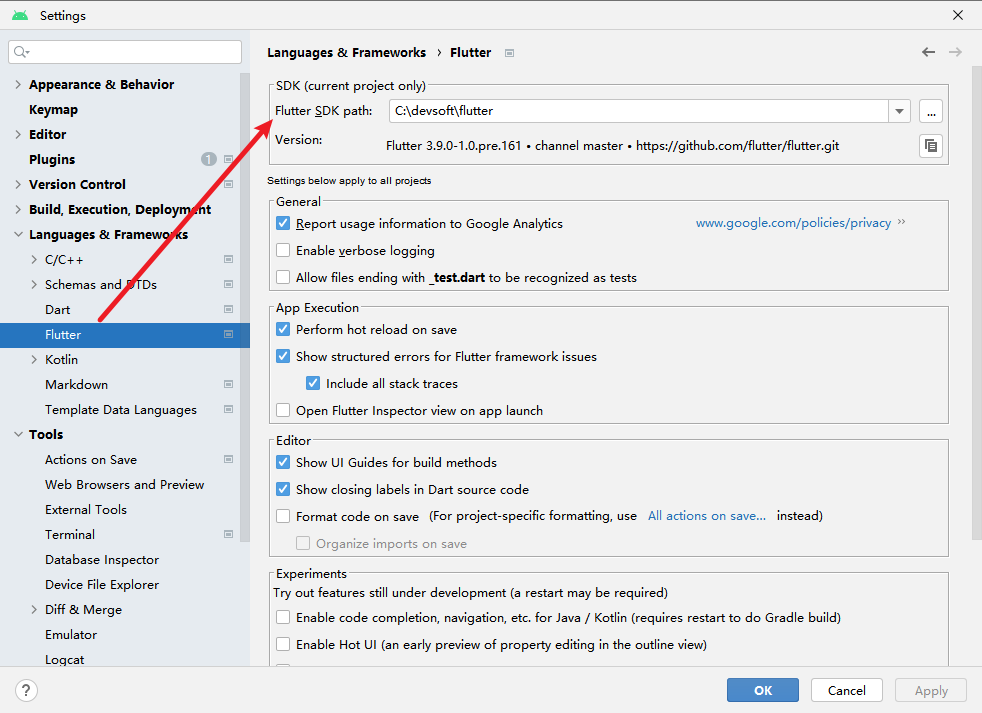

**Flutter Android 打包保姆式全流程的详细介绍【转】**

[toc]

> 主要转载自 [Flutter Android 打包保姆式全流程 2023 版](https://juejin.cn/post/7207078219215929402)，对 Flutter Android 打包的过程进行详细介绍和记录。

Flutter 打包的文章一共有两篇

- [Flutter Android 打包保姆式全流程 2023 版](https://juejin.cn/post/7207078219215929402 "https://juejin.cn/post/7207078219215929402")
- [Flutter IOS 新建打包发布全流程 2023 版](https://juejin.cn/post/7209653045310210108 "https://juejin.cn/post/7209653045310210108")

本篇介绍 Android 的打包全流程。

# 为什么写这篇文章？

对于一个没有 android 开发经验，从未有过打包经历的新人来说，要想成功打包，是很困难的。因为受到的阻碍太多，是完全陌生的领域，几乎是寸步难行。如果有老人带还行，如果没有，那就只能自己四处找人或搜索资料求指导了。可惜的是，网上的文章不是过时了，就是不全，或是讲的不够明白，要几经坎坷才能成功。

但是只要成功打包一次，回头再看，其实也是满简单的嘛，所缺少的只是一份完整的资料而已。

本篇力争做到，从此 android 打包不求人！

> 原文记录的是 Mac OS 下的打包 Android，本篇记录 Windows 下的打包。

# 查看 Flutter 和 Android SDK 版本

- `flutter --version` 查看 Flutter SDK 版本

在 Android Studio 中查看 Flutter 指定的 SDK 路径！ 

> 下载的 Flutter 中会包含 Dart 