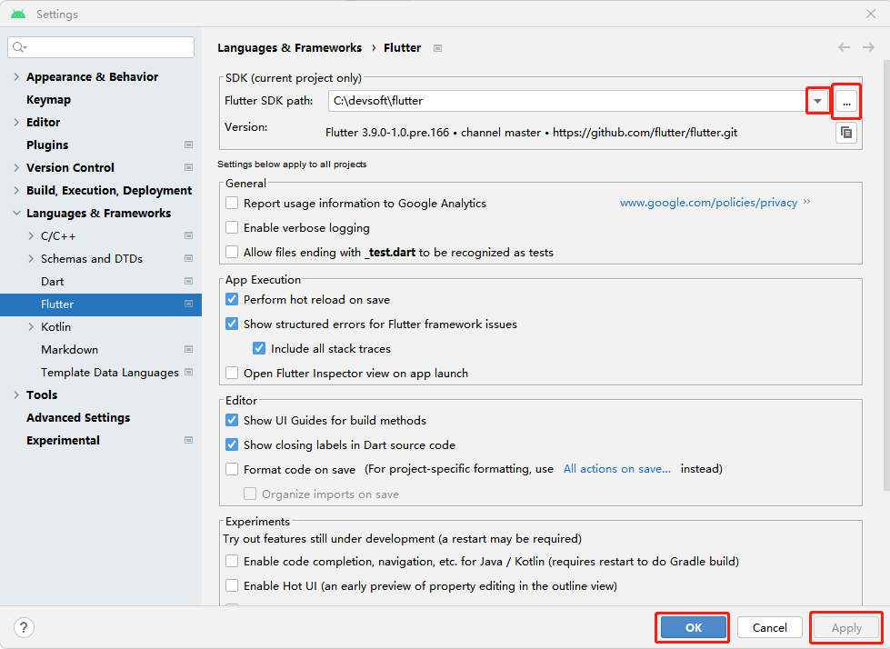
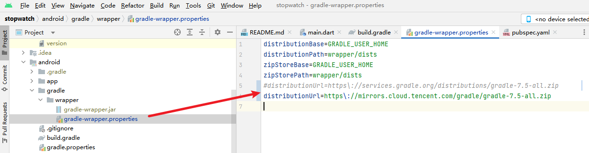

**Flutter环境问题、打包运行报错及修复记录【汇总】**

[toc]

# The current configured Flutter SDK is not known to be fully supported

> The current configured Flutter SDK is not known to be fully supported.Please update yout SDK and restart lntelliJ.

解决办法：执行 `flutter upgrade` 升级 Flutter SDK，然后，执行 `flutter doctor` 尝试检查是否有相关问题，并解决。

# Android Studio 导入 Flutter 项目提示 Dart SDK is not configured

原因：**Android Studio没有识别出电脑中的Flutter环境。**

解决办法：

打开 Android Studio 设置窗口。

- Windows版本打开方式：File -> Setting
- Mac版本打开方式：左上角 Android Studio -> Preferences

找到 `Languages & Frameworks` -> Flutter，在右侧的 `Flutter SDK path` 下拉菜单中选择本地的Flutter路径；如果没有，点击右边的三个点，手动选择Flutter路径。



最后点Apply，然后点OK，等待 Android Studio 重新开始配置好即可。


# Flutter项目运行报错 Exception in thread "main" java.net.ConnectException: Connection timed out: connect

Flutter项目第一运行打包Android软件时，报错：`Exception in thread "main" java.net.ConnectException: Connection timed out: connect`

尝试了n多次，一直报这个错误。

其基本原因是 网络超时，之前在`Running Gradle task`的问题时，修改过`Gradle`的源为国内的阿里镜像源。但是，此处仍然发生超时！

那么，就还有一个办法，提前下载需要的 `Gradle` 资源，然后修改构建时使用的 `Gradle` 路径，直接使用本地的资源，而不是请求网络（出现超时）。

**找到项目的 `android\gradle\wrapper\gradle-wrapper.properties` 文件，查看里面 `distributionUrl` 属性指向的 gradle 版本**。

如下所示，使用的是 `gradle-7.5-all.zip`：



对应的解决办法有两个（选择一个即可）：

1. 直接修改 `distributionUrl` 的资源地址为镜像源地址。

如上图所示，直接改成了腾讯云的镜像源 `distributionUrl=https\://mirrors.cloud.tencent.com/gradle/gradle-7.5-all.zip`

修改后报错，重新运行项目，打包构建成功！

> gradle 的腾讯云镜像源：https://mirrors.cloud.tencent.com/gradle/

2. 直接从 `http://services.gradle.org/distributions/` 或 其他镜像源中 下载 `gradle-7.5-all.zip`。

将下载的gradle文件放在用户文件夹下（或其他位置），比如，放在`%UserProfile%\.gradle\wrapper\dists`下。

然后，修改项目的 `gradle-wrapper.properties` 文件，将 `distributionUrl` 指向刚下载保存的 `gradle-7.5-all.zip` 本地路径地址：

```ini
distributionUrl=file:///C:/Users/{UserName}/.gradle/wrapper/dists/gradle-7.5-all.zip
```

重新运行，构建成功！