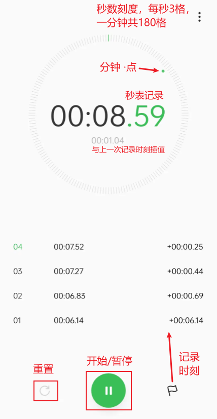
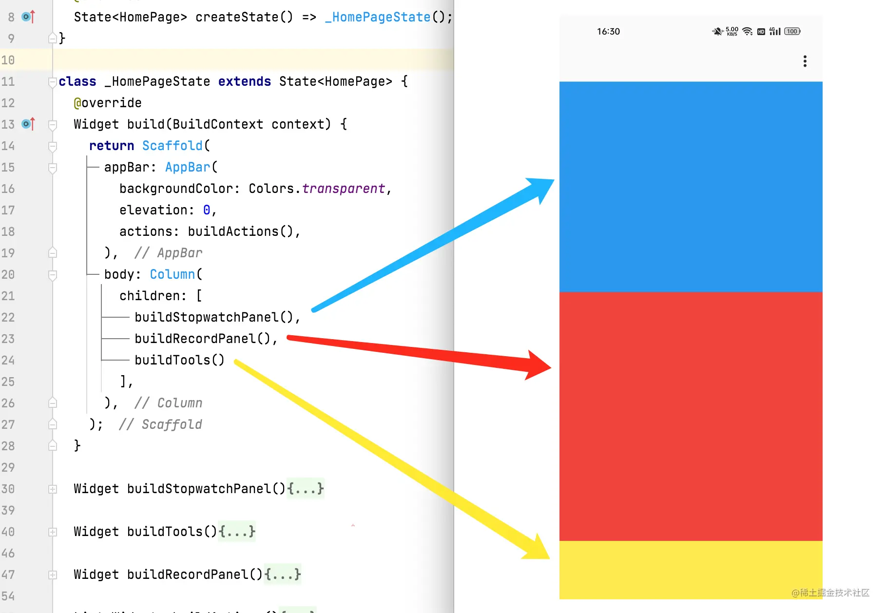

**Flutter跨平台之旅：一个功能齐全的秒表项目**

[toc]

# 功能界面分析

界面及其对应的功能如下：



- 核心功能：
    - 秒表计时功能。秒表表盘，一圈`1分钟`，每秒对应`3`格，共`180`格，每格之间的夹角为`2°`，小圆点表示分钟进度。表盘中间显示计时时长。
    - 运行状态控制。底部包含有控制功能，秒表的`重置`、`启动/暂停`。
    - 记录时刻功能。底部右侧按钮用于记录时刻值，会显示在记录列表中。当有记录值时，在秒表面板中显示与上一时刻的相对时长。

# 界面结构布局

界面的整体结构分为上、中、下三部分，分别显示秒表面板、记录数据、操作按钮。

如下所示，先进行界面拆分，将三块区域的构建逻辑封装为三个方法（**将一个大问题，划分为若干小问题，逐一解决**）：



新建 flutter 项目 `stopwatch`：`flutter create stopwatch`

## 程序入口

修改默认的`main.dart`入口文件内容（`lib/`）如下：

```dart

```

- `StopwatchApp` 作为顶层组件，传入 `runApp` 方法中进行显示。
- `StopwatchApp` 继承自 `StatelessWidget` ，在 `build` 方法中，返回 `MaterialApp` 组件。
- `HomePage` 组件为显示主页。