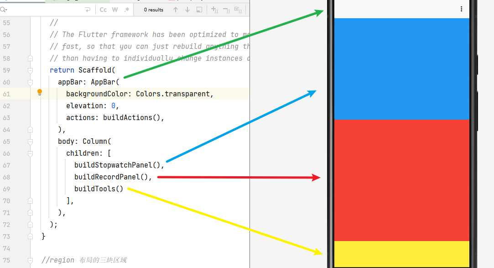
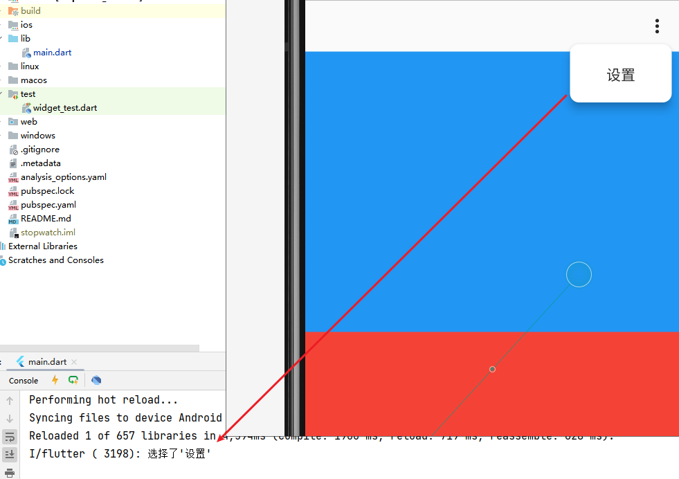

**Flutter跨平台之旅：一个功能齐全的秒表项目**

[toc]

# 功能界面分析

界面及其对应的功能如下：


- 核心功能：
    - 秒表计时功能。秒表表盘，一圈`1分钟`，每秒对应`3`格，共`180`格，每格之间的夹角为`2°`，小圆点表示秒针进度。表盘中间显示计时时长。
    - 运行状态控制。底部包含有控制功能，秒表的`重置`、`启动/暂停`。
    - 记录时刻功能。底部右侧按钮用于记录时刻值，会显示在记录列表中。当有记录值时，在秒表面板中显示与上一时刻的相对时长。

额外功能：顶部菜单栏，右侧的三个小点下拉“设置”按钮（仅做显示）。

> 修改完善，比如 表盘刻度 表示分钟，秒针每多转20秒，分钟刻度颜色改变，随着时间的转动，颜色逐渐增多；修改小圆点的形状，比如为椭圆形等...

# 界面结构布局

界面的整体结构分为上、中、下三部分，分别显示秒表面板、记录数据、操作按钮。

如下所示，先进行界面拆分，将三块区域的构建逻辑封装为三个方法（**将一个大问题，划分为若干小问题，逐一解决**）：



**新建 flutter 项目 `stopwatch`：`flutter create stopwatch`。**

## 程序入口

修改默认的`main.dart`入口文件内容（`lib/`）如下：

```dart
void main() {
  runApp(const StopwatchApp());
}

class StopwatchApp extends StatelessWidget {
  const StopwatchApp({super.key});

  // This widget is the root of your application.
  @override
  Widget build(BuildContext context) {
    return MaterialApp(
      debugShowCheckedModeBanner: false,
      home: const MyHomePage(),
    );
  }
}
```

- `StopwatchApp` 作为顶层组件，传入 `runApp` 方法中进行显示。
- `StopwatchApp` 继承自 `StatelessWidget` ，作为主界面，在 `build` 方法中，返回 `MaterialApp` 组件。
- `MyHomePage` 组件 `MaterialApp` 组件的显示主页。

## 应用主界面

主界面由 `MyHomePage` 组件负责展示，使用 **可以维护数据和触发更新的 `StatefulWidget` 派生类**。

通过 **方法封装构建逻辑** 的形式分别维护三块显示和操作的区域：

- `buildStopwatchPanel` 方法，负责构建秒表面板。
- `buildRecordPanel` 方法，负责构建记录面板。
- `buildTools` 方法，负责构建工具按钮。

```dart
class MyHomePage extends StatefulWidget {
  const MyHomePage({Key? key}) : super(key: key);

  @override
  State<MyHomePage> createState() => _HomePageState();
}

class _HomePageState extends State<MyHomePage> {
  @override
  Widget build(BuildContext context) {
    return Scaffold(
      appBar: AppBar(
        backgroundColor: Colors.transparent,
        elevation: 0,
        actions: buildActions(), // 标题栏右侧显示
      ),
      body: Column(
        children: [
          buildStopwatchPanel(),
          buildRecordPanel(),
          buildTools()
        ],
      ),
    );
  }
}
```

`appBar` 指定顶部的菜单栏，`AppBar`组件`actions`方法指定下拉弹出的小按钮`PopupMenuButton`。


##  弹框菜单按钮组件 ：PopupMenuButton

`AppBar` 的 `actions` 的参数，通过传入 `Widget` 列表，可以在标题栏右侧显示传入的组件。

此处传入一个 `PopupMenuButton` 组件，功能是弹出菜单按钮：



`PopupMenuButton` 组件参数：

- `itemBuilder` 弹框中的菜单列表，即 `PopupMenuEntry` 列表对象。通过后面的`_buildItem`方法实现。此处仅显示“设置”。
- `onSelected` 菜单点击选择后的回调。比如跳转到设置界面。
- `icon`、`position`、`shape` 指定图标、菜单弹出的位置、形状（`RoundedRectangleBorder`圆角矩形）

```dart
  List<Widget> buildActions(){
    return [
      PopupMenuButton<String>(
        itemBuilder: _buildItem,
        onSelected: _onSelectItem,
        icon: const Icon( Icons.more_vert_outlined, color: Color(0xff262626)),
        position:PopupMenuPosition.under,
        shape: const RoundedRectangleBorder(
            borderRadius: BorderRadius.all(Radius.circular(10))
        ),
      )
    ];
  }

  List<PopupMenuEntry<String>> _buildItem(BuildContext context) {
    return const [
      PopupMenuItem<String>(
        value: "设置",
        child: Center(child: Text("设置")),
      )
    ];
  }

  void _onSelectItem(String value) {
      print("选择了'${value}'");
  }
```

## 主体布局的三部分色块

`buildStopwatchPanel`、`buildRecordPanel`、`buildTools` 三部分的区域：

```dart
  Widget buildStopwatchPanel(){
    // MediaQuery.of(context).size 可以获取屏幕的尺寸
    double radius = MediaQuery.of(context).size.width/2*0.75;
    return Container(
      height: radius*2,
      color: Colors.blue,
    );
  }

  Widget buildRecordPanel(){
    return Expanded(
      child: Container(
        color: Colors.red,
      ),
    );
  }

  Widget buildTools(){
    return Container(
      height: 80,
      color: Colors.yellow,
    );
  }
```

`Container` 容器组件，指定颜色、高度，此外还有宽度、内外边距、对齐方式等。

`Expanded` 组件实现在垂直方向上延伸，当上下区域固定高度时，中间部分“自动撑满”剩余界面。

`MediaQuery.of(context).size` 获取屏幕的尺寸。

这样，基本结构就完成了。

# 自定义绘制和封装组件

图示中这种秒表表盘的显示效果，几乎很难通过已有组件进行组合构建。而 **自定义绘制** 就是一个很好的实现方式。

通过自定义绘制构建组件，是应对特殊显示效果最重要的手段，也是GUI界面编程的基础。

## 自定义绘制组件

> 具体绘制介绍参见 [Flutter 绘制集录 | 秒表盘的绘制](https://juejin.cn/post/7137081179315896350)。

- `CustomPainter` 为自定义绘制的基类。
- 重写 `paint` 方法，使用参数 `Canvas` 对象实现绘制逻辑。


```dart

```

## 封装组件

