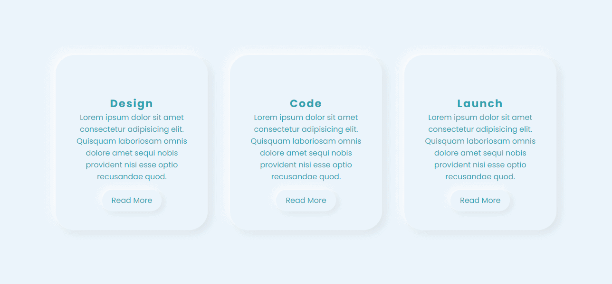
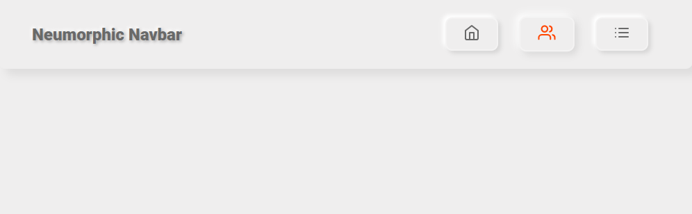

**HTML、CSS和JavaScript的5个新拟态设计组件【译】**

[toc]

> 原文 [5 Neumorphic Design Components in HTML, CSS, and JavaScript](https://www.makeuseof.com/5-neumorphic-design-components-using-html-css-and-javascript/)

紧跟最新的 Web 开发趋势。让你的设计充满新拟态。


新拟态是一种结合平面设计(`flat design`)和拟物化(`skeuomorphism`)的新设计趋势。这是一种使用柔软、挤压塑料、几乎是 3D 风格外观进行设计的最小方法。目前，这种设计在互联网上很流行，并被设计师和开发人员广泛使用。

如果你想在下一个项目中尝试新拟态，这里有一些代码片段可以用以开始。

# 1. 新拟态卡片 - Neumorphic Cards


gif 演示：



使用下面的 HTML 和 CSS 代码片段创建上述的 新拟态卡片。

- HTML 代码

```html
<!DOCTYPE html>
<html lang="en" dir="ltr">
<head>
    <meta charset="utf-8">
    <title>Neumorphic Cards</title>
    <link rel="stylesheet" href="styles.css">
</head>

<body>
    <div class="container">
        <div class="card">
            <div class="imgBx">
                
            </div>
            <div class="contentBx">
                <h2>Design</h2>
                <p>Lorem ipsum dolor sit amet consectetur adipisicing elit. Quisquam laboriosam omnis dolore amet sequi
                    nobis provident nisi esse optio recusandae quod.</p>
                <a href=""><span>Read More</span></a>
            </div>

        </div>
        <div class="card">
            <div class="imgBx">
                
            </div>
            <div class="contentBx">
                <h2>Code</h2>
                <p>Lorem ipsum dolor sit amet consectetur adipisicing elit. Quisquam laboriosam omnis dolore amet sequi
                    nobis provident nisi esse optio recusandae quod.</p>
                <a href=""><span>Read More</span></a>
            </div>

        </div>
        <div class="card">
            <div class="imgBx">
                
            </div>
            <div class="contentBx">
                <h2>Launch</h2>
                <p>Lorem ipsum dolor sit amet consectetur adipisicing elit. Quisquam laboriosam omnis dolore amet sequi
                    nobis provident nisi esse optio recusandae quod.</p>
                <a href=""><span>Read More</span></a>
            </div>

        </div>
    </div>
</body>
</html>
```

- CSS 代码

```css
        @import url('https://fonts.googleapis.com/css?family=Poppins:400,500,600,700,800,900&display=swap');

        * {
            margin: 0;
            padding: 0;
            box-sizing: border-box;
            font-family: 'Poppins', sans-serif;
        }

        body {
            display: flex;
            justify-content: center;
            align-items: center;
            min-height: 100vh;
            background: #ebf5fc;
        }

        .container {
            position: relative;
            display: flex;
            justify-content: space-around;
            align-items: center;
            flex-wrap: wrap;
            width: 1100px;
        }

        .container .card {
            width: 320px;
            margin: 20px;
            padding: 40px 30px;
            background: #ebf5fc;
            border-radius: 40px;
            box-shadow: -6px -6px 20px rgba(255, 255, 255, 1), 6px 6px 20px rgba(0, 0, 0, 0.1);
        }

        .container .card:hover {
            box-shadow: inset -6px -6px 20px rgba(255, 255, 255, 0.5), inset 6px 6px 20px rgba(0, 0, 0, 0.05);
        }

        .container .card .imgBx {
            position: relative;
            text-align: center;
        }

        .container .card .imgBx img {
            max-width: 120px;
        }

        .container .card .contentBx {
            position: relative;
            margin-top: 20px;
            text-align: center;
        }

        .container .card .contentBx h2 {
            color: #32a3b1;
            font-weight: 700;
            font-size: 1.4em;
            letter-spacing: 2px;
        }

        .container .card .contentBx p {
            color: #32a3b1;
        }

        .container .card .contentBx a {
            display: inline-block;
            padding: 10px 20px;
            margin-top: 15px;
            border-radius: 40px;
            color: #32a3b1;
            font-size: 16px;
            text-decoration: none;
            box-shadow: -4px -4px 15px rgba(255, 255, 255, 1), 4px 4px 15px rgba(0, 0, 0, 0.1);
        }

        .container .card .contentBx a:hover {
            box-shadow: inset -4px -4px 10px rgba(255, 255, 255, 0.5), inset 4px 4px 10px rgba(0, 0, 0, 0.1);
        }

        .container .card a:hover span {
            display: block;
            transform: scale(0.98);
        }

        .container .card:hover .imgBx,
        .container .card:hover .contentBx {
            transform: scale(0.98);
        }
```

# 2. 新拟态表单 - Neumorphic Form


gif 演示：


- HTML 代码

```html
<!DOCTYPE html>
<html lang="en" dir="ltr">

<head>
    <meta charset="utf-8">
    <title>Neumorphic Form</title>
    <link rel="stylesheet" href="https://unpkg.com/ionicons@4.5.10-0/dist/css/ionicons.min.css">
    <style>
        @import url('https://fonts.googleapis.com/css?family=Montserrat:500,700&amp;display=swap');
    </style>
    <link rel="stylesheet" href="styles.css">
</head>

<body>
    <form>

        <div class="segment">
            <h1>Sign up</h1>
        </div>

        <label>
            <input type="text" placeholder="Email Address" />
        </label>
        <label>
            <input type="password" placeholder="Password" />
        </label>
        <button class="red" type="button"><i class="icon ion-md-lock"></i> Log in</button>

        <div class="segment">
            <button class="unit" type="button"><i class="icon ion-md-arrow-back"></i></button>
            <button class="unit" type="button"><i class="icon ion-md-bookmark"></i></button>
            <button class="unit" type="button"><i class="icon ion-md-settings"></i></button>
        </div>

        <div class="input-group">
            <label>
                <input type="text" placeholder="Email Address" />
            </label>
            <button class="unit" type="button"><i class="icon ion-md-search"></i></button>
        </div>

    </form>
</body>

</html>
```

- CSS 代码

```css
        body, html {
            background-color: #EBECF0;
        }

        body, p, input, select, textarea, button {
            font-family: "Montserrat", sans-serif;
            letter-spacing: -0.2px;
            font-size: 16px;
        }

        div, p {
            color: #BABECC;
            text-shadow: 1px 1px 1px #FFF;
        }

        form {
            padding: 16px;
            width: 320px;
            margin: 0 auto;
        }

        .segment {
            padding: 32px 0;
            text-align: center;
        }

        button, input {
            border: 0;
            outline: 0;
            font-size: 16px;
            border-radius: 320px;
            padding: 16px;
            background-color: #EBECF0;
            text-shadow: 1px 1px 0 #FFF;
        }

        label {
            display: block;
            margin-bottom: 24px;
            width: 100%;
        }

        input {
            margin-right: 8px;
            box-shadow: inset 2px 2px 5px #BABECC, inset -5px -5px 10px #FFF;
            width: 100%;
            box-sizing: border-box;
            transition: all 0.2s ease-in-out;
            appearance: none;
            -webkit-appearance: none;
        }

        input:focus {
            box-shadow: inset 1px 1px 2px #BABECC, inset -1px -1px 2px #FFF;
        }

        button {
            color: #61677C;
            font-weight: bold;
            box-shadow: -5px -5px 20px #FFF, 5px 5px 20px #BABECC;
            transition: all 0.2s ease-in-out;
            cursor: pointer;
            font-weight: 600;
        }

        button:hover {
            box-shadow: -2px -2px 5px #FFF, 2px 2px 5px #BABECC;
        }

        button:active {
            box-shadow: inset 1px 1px 2px #BABECC, inset -1px -1px 2px #FFF;
        }

        button .icon {
            margin-right: 8px;
        }

        button.unit {
            border-radius: 8px;
            line-height: 0;
            width: 48px;
            height: 48px;
            display: inline-flex;
            justify-content: center;
            align-items: center;
            margin: 0 8px;
            font-size: 19.2px;
        }

        button.unit .icon {
            margin-right: 0;
        }

        button.red {
            display: block;
            width: 100%;
            color: #AE1100;
        }

        .input-group {
            display: flex;
            align-items: center;
            justify-content: flex-start;
        }

        .input-group label {
            margin: 0;
            flex: 1;
        }
```

# 3. 新拟态导航栏 - Neumorphic Navbar



- HTML 代码

```html
<!DOCTYPE html>
<html lang="en" dir="ltr">
<head>
    <meta charset="utf-8">
    <title>Neumorphic Navbar</title>
    <style>
        @import url('https://fonts.googleapis.com/css?family=Roboto:400,900&amp;display=swap');
    </style>

    <link rel="stylesheet" href="styles.css">
</head>
<body>
    <ul class="nav">
        <li class="logo">Neumorphic Navbar</li>
        <li tabindex="0"><i data-feather="home"></i></li>
        <li tabindex="0"><i data-feather="users"></i></li>
        <li tabindex="0"><i data-feather="list"></i></li>
    </ul>

    <script src="https://cdnjs.cloudflare.com/ajax/libs/feather-icons/4.24.1/feather.min.js"></script>

    <script type="text/javascript">
        feather.replace();
    </script>
</body>
</html>
```


- CSS 代码

```css
        * {
            margin: 0;
            padding: 0;
            box-sizing: border-box;
        }

        body {
            background-color: #efeeee;
        }

        .nav {
            width: 100vw;
            height: 100px;
            background-color: #efeeee;
            box-shadow: 10px 10px 12px 0 rgba(0, 0, 0, 0.07);
            border-radius: 0 0 10px 10px;
            display: flex;
            justify-content: flex-end;
            align-items: center;
            padding: 0 3rem;
            list-style-type: none;
        }

        .nav li.logo {
            margin-right: auto;
            font-family: "Roboto", sans-serif;
            font-size: 1.5rem;
            color: dimgray;
            font-weight: 900;
            text-shadow: 2px 2px 4px rgba(0, 0, 0, 0.3), -2px -2px 4px white;
        }

        .nav li:not(.logo) {
            margin: 0 1rem;
            padding: 0.5rem 1.5rem;
            border: 2px solid rgba(255, 255, 255, 0.3);
            box-shadow: 4px 4px 6px 0 rgba(0, 0, 0, 0.1), -4px -4px 6px white;
            border-radius: 10px;
            font-family: "Roboto", sans-serif;
            cursor: pointer;
            transition: color 0.2s ease-out, transform 0.2s ease-out;
            color: dimgray;
        }

        .nav li:not(.logo):hover {
            transform: scale(1.05);
            box-shadow: 4px 4px 10px 0 rgba(0, 0, 0, 0.1), -4px -4px 10px white;
        }

        .nav li:not(.logo):focus {
            outline: none;
            transform: scale(0.95);
            box-shadow: 4px 4px 10px 0 rgba(0, 0, 0, 0.1), -4px -4px 10px white, 4px 4px 10px 0 rgba(0, 0, 0, 0.1) inset, -4px -4px 10px white inset;
        }

        .nav li:not(.logo):hover,
        .nav li:not(.logo):focus {
            color: orangered;
        }
```

# 4. 新拟态文本和形状 - Neumorphic Text and Shapes


- HTML 代码

```html
<!DOCTYPE html>
<html lang="en" dir="ltr">

<head>
    <meta charset="utf-8">
    <title>Neumorphic Text and Shapes</title>
    
    <link rel="stylesheet" href="styles.css">
</head>
<body>
    <div class="n-outset n-circle">Circle</div>
    <div class="n-outset n-donut">
        <div class="n-inset">Donut</div>
    </div>
    <div class="n-outset n-square">Square</div>
    <div class="n-outset n-smooth-sq">Smooth Square</div>
    <div class="n-outset n-tumbler">
        <div class="n-outset">Tumbler</div>
    </div>
    <div class="n-text">Neumorphic Text</div>
    <div class="n-text">Welcome to MUO</div>
    </script>
</body>
</html>
```

- CSS 代码

```css
        *,
        *::before,
        *::after {
            box-sizing: border-box;
        }

        :root {
            --nColor: #aaa;
            --brShadow: -6px 6px 10px rgba(0, 0, 0, 0.5);
            --tlShadow: 6px -6px 10px rgba(255, 255, 255, 0.5);
        }

        body {
            margin: 0;
            font-family: sans-serif;
            min-height: 100vh;
            display: flex;
            align-items: center;
            justify-content: center;
            flex-wrap: wrap;
            background: var(--nColor);
        }

        .n-outset,
        .n-inset {
            display: flex;
            align-items: center;
            justify-content: center;
        }

        .n-circle {
            background-color: var(--nColor);
            box-shadow: var(--brShadow), var(--tlShadow);
            border-radius: 50%;
            width: 200px;
            height: 200px;
            margin: 10px;
        }

        .n-donut {
            background-color: var(--nColor);
            box-shadow: var(--brShadow), var(--tlShadow);
            border-radius: 50%;
            width: 200px;
            height: 200px;
            margin: 10px;
        }

        .n-donut .n-inset {
            background-color: var(--nColor);
            box-shadow: inset var(--brShadow), inset var(--tlShadow);
            border-radius: 50%;
            width: 50%;
            height: 50%;
            margin: 0;
        }

        .n-tumbler {
            background-color: var(--nColor);
            box-shadow: var(--brShadow), var(--tlShadow);
            border-radius: 50%;
            width: 200px;
            height: 200px;
            margin: 10px;
        }

        .n-tumbler .n-outset {
            background-color: var(--nColor);
            box-shadow: var(--brShadow), var(--tlShadow);
            border-radius: 50%;
            width: 80%;
            height: 80%;
            margin: 0;
        }

        .n-square {
            background-color: var(--nColor);
            box-shadow: var(--brShadow), var(--tlShadow);
            border-radius: 0;
            width: 200px;
            height: 200px;
            margin: 10px;
        }

        .n-smooth-sq {
            background-color: var(--nColor);
            box-shadow: var(--brShadow), var(--tlShadow);
            border-radius: 10%;
            width: 200px;
            height: 200px;
            margin: 10px;
        }

        .n-text {
            color: var(--nColor);
            text-shadow: var(--brShadow), var(--tlShadow);
            font-size: 6em;
            font-weight: bold;
        }
```

# 5. 新拟态按钮 - Neumorphic Buttons


gif 演示：


- HTML 代码

```html
<!DOCTYPE html>
<html lang="en" dir="ltr">

<head>
    <meta charset="utf-8">
    <title>Neumorphic Buttons</title>
    <link href="https://fonts.googleapis.com/css?family=Quicksand&display=swap" rel="stylesheet">
    <link rel="stylesheet" href="styles.css">
</head>

<body>
    <div class="btn-holder">
        <p class="intro-text">Press the buttons</p>
        <button id="play-pause" onclick="changeStyle('play-pause')" aria-label="Play/Pause Button."
            class="btn neumorphic">
            <span class="icon">
                <i id="play" class="material-icon">
                    play_arrow
                </i>

                <i id="pause" class="material-icon">
                    pause
                </i>
            </span>
        </button>

        <button id="shuffle-btn" onclick="changeStyle('shuffle-btn')" aria-label="Shuffle Button."
            class="btn neumorphic">
            <i id="shuffle" class="material-icon">
                shuffle
            </i>
        </button>
    </div>
    <script type="text/javascript" src="script.js"></script>
</body>

</html>
```

- CSS 代码

```css
        @import url('https://fonts.googleapis.com/icon?family=Material+Icons');

        body {
            background-color: #6ec7ff;
        }

        .btn-holder {
            display: block;
            margin: 0 auto;
            margin-top: 64px;
            text-align: center;
        }

        .intro-text {
            margin-bottom: 48px;
            font-family: 'Quicksand', sans-serif;
            color: white;
            font-size: 18px;
        }

        .btn {
            width: 110px;
            height: 110px;
            font-size: 30px;
            border-radius: 30px;
            border: none;
            color: white;
            vertical-align: top;
            -webkit-transition: .6s ease-in-out;
            transition: .6s ease-in-out;
        }

        .btn:hover {
            cursor: pointer;
        }

        .btn:focus {
            outline: none;
        }


        .btn:first-of-type {
            margin-right: 30px;
        }


        .neumorphic {
            background: linear-gradient(145deg, #76d5ff, #63b3e6);

            box-shadow: 30px 30px 40px #1e7689,
                -30px -30px 40px #7fe5ff;
            border: 3px solid rgba(255, 255, 255, .4);
        }

        .neumorphic-pressed {
            background: linear-gradient(145deg, #63b3e6, #76d5ff);
            -webkit-box-shadow: inset 15px 15px 20px -20px rgba(0, 0, 0, .5);
            -moz-box-shadow: inset 15px 15px 20px -20px rgba(0, 0, 0, .5);
            box-shadow: inset 15px 15px 20px -20px rgba(0, 0, 0, .5);
        }

        .neumorphic:focus,
        .neumorphic:hover,
        .neumorphic:focus,
        .neumorphic:hover,
        .neumorphic-pressed:focus,
        .neumorphic-pressed:hover {
            border: 3px solid rgba(46, 74, 112, .75);
        }


        .material-icon {
            font-family: 'Material Icons';
            font-weight: normal;
            font-style: normal;
            font-size: 32px;
            display: inline-block;
            line-height: 1;
            text-transform: none;
            letter-spacing: normal;
            word-wrap: normal;
            white-space: nowrap;
            direction: ltr;

            -webkit-font-smoothing: antialiased;
            text-rendering: optimizeLegibility;
            -moz-osx-font-smoothing: grayscale;
            font-feature-settings: 'liga';
        }

        #pause {
            color: #143664;
            display: none;
        }
```

- JavaScript 代码

```js
        function changeStyle(btnPressed) {
            var btn = document.getElementById(btnPressed);
            btn.classList.toggle("neumorphic");
            btn.classList.toggle("neumorphic-pressed");

            if (btnPressed === 'play-pause') {
                play();
            } else if (btnPressed === 'shuffle-btn') {
                shuffle();
            }
        }

        function play() {
            var playBtn = document.getElementById('play');
            var pauseBtn = document.getElementById('pause');

            if (playBtn.style.display === 'none') {
                playBtn.style.display = 'block';
                pauseBtn.style.display = 'none';
            } else {
                playBtn.style.display = 'none';
                pauseBtn.style.display = 'block';
            }
        }

        function shuffle() {
            var shuffleBtn = document.getElementById('shuffle-btn');

            if (shuffleBtn.style.color == 'white' || shuffleBtn.style.color == '') {
                shuffleBtn.style.color = '#143664';
            } else {
                shuffleBtn.style.color = 'white';
            }
        }
```

> 如果你想要查看本文使用的完整源代码，请访问 [GitHub repository](https://github.com/Yuvrajchandra/Neumorphism-Code-Snippets)。
> 
> **注意：** The code used in this article is MIT Licensed.


# 用新拟态设计你的网站样式

你可以使用新拟态的简约设计概念（`minimalistic design concept`）来设计你的网站，提供美观的界面。但是，新拟态仍然具有可访问性的局限性。

有不同的方法可以让网站看起来优雅。如果你想在你的网站上设置平淡边框的样式，试试 `box-shadow` CSS属性。
