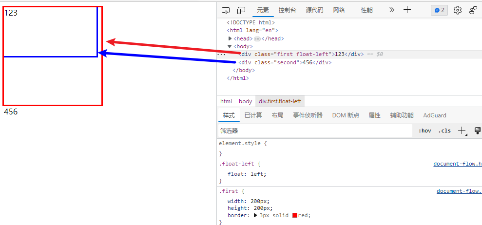

**HTML脱离文档流的三种方法【转】**

[toc]

> 原文 [HTML脱离文档流的三种方法](https://blog.csdn.net/theLostLamb/article/details/79581984)

# 一、什么是文档流？

将窗体自上而下分成一行一行，并在每行中按从左至右依次排放元素，称为文档流，也称为普通流。

这个应该不难理解，HTML中全部元素都是盒模型，盒模型占用一定的空间，依次排放在HTML中，形成了文档流。


# 二、什么是脱离文档流？

元素脱离文档流之后，将不再在文档流中占据空间，而是处于浮动状态（可以理解为漂浮在文档流的上方）。

脱离文档流的元素的定位基于正常的文档流，当一个元素脱离文档流后，依然在文档流中的其他元素将忽略该元素并填补其原先的空间。


# 三、怎么脱离文档流？

## 1：float

使用float可以脱离文档流。

注意！！！：**使用float脱离文档流时，其他盒子会无视这个元素，但其他盒子内的文本依然会为这个元素让出位置，环绕在该元素的周围。**

举个栗子：

```html
<!DOCTYPE html>
<html lang="en">
<head>
    <meta charset="UTF-8">
    <title>Title</title>
    <style>
        .first {
            width: 200px;
            height: 200px;
            border: 3px solid red;
        }
        .float-left{
            float: left;
        }
        .second {
            width: 190px;
            height: 100px;
            border: 3px solid blue;
        }
    </style>
</head>
 
<body>
 
<div class="first float-left">123</div>
<div class="second">456</div>
 
</body>
</html>
```



这段代码中把红色的框设置为了左浮，所以红色的框称为了浮动状态（浮动在蓝色框的上面），而蓝色框占用了原来空色框的位置。

注意到，蓝色框中的文本依然认为红色框存在，所以为红色框让出了位置。由于div是块状元素，所以456出现在下方。

