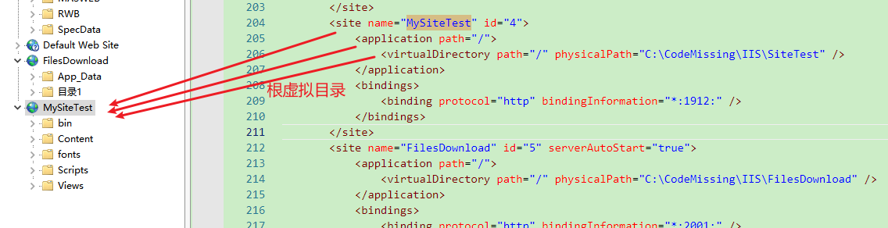
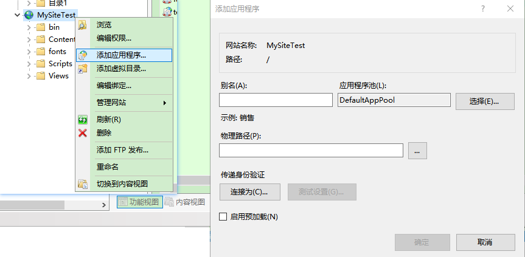
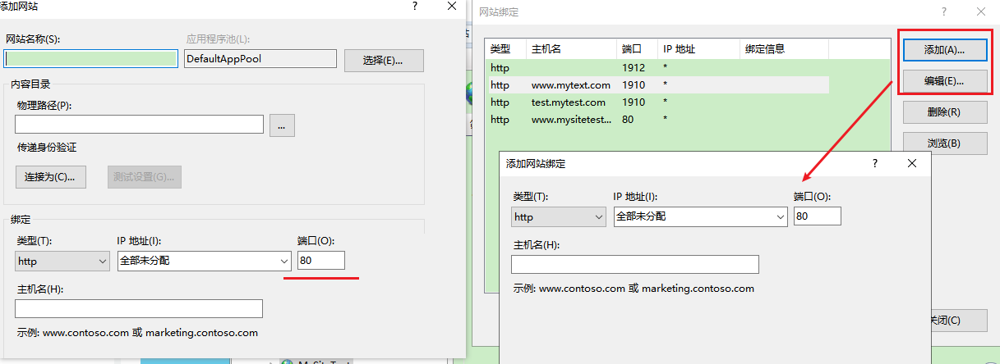

**IIS中站点、虚拟目录、应用程序的区别，以及实现同一端口绑定多个域名站点**

[toc]

# 站点、虚拟目录、应用程序的区别

一个 site 中可以有一个或者多个 application，一个 application 中可以有一个或者多个`virtual directory`，而一个`virtual directory`则对应着一个物理路径。

一个site默认会至少有一个application，称为根应用程序(root application)或者默认应用程序（default application），而一个application至少有一个vitual director，称为根虚拟目录(root virtual directory)。

比如，IIS上一个site的结构和这个site在IIS的`applicationHost.config`文件中的配置是怎样对应的：

  

site本身也是一个application，也就是root application。

> **注：`applicationHost.config`文件在目录：`%windir%\system32\inetsrv\config\`目录下**

一个site运行在一个`application pool`中，而一个`application pool`默认有一个w3wp.exe（Worker进程）。

site中的application运行在对应的w3wp.exe进程中的app domain（应用程序域）中(不同application运行在不同app domain中，以进行隔离)，而同一个application的virtual directory运行在相同的app domain下。

但site下的application不一定必须跟这个site运行在相同的`application pool`，application可以指定一个跟这个application的site不同的`application pool`。

## 站点(site)

> 一个网站，基本就是一个站点，可以绑定N个域名，绑定N个IP、Port，通过指定应用程序池，就可以运行使用了。

### 介绍

一个站点包含一个或者多个application和一个或者多个虚拟目录。

可以通过对site进行不同的绑定以用不同的方式对site进行访问。

这里的“绑定”包含两个方面，一个是绑定的协议，另一个就是绑定信息。绑定协议用于指定通过什么协议去和该site进行通信。IIS7+中，对一个site可以的协议包括 http、https、net.tcp、net.pipe、net.msmq、net.formatname 这几种。

对于一个网站，最常用的就是http和https。

而绑定信息则定义了通信的基本信息，比如IP地址，通信端口，站点的一些头部信息(header)。

**可以为一个site添加多种绑定，只需要在IIS中对某个site进行“编辑绑定”操作即可**。

### site 的其他设置

除了包含应用程序(应用程序包含虚拟目录)和指定绑定，网站还包含以下设置：

- Limits: configure settings to limit the amount of bandwidth, the number of connections, or the amount of time allowed for connections to a site.

限制 —— 配置设置以限制带宽量、连接数或连接到站点的超时时间。

- Logging: configure settings for handling and storage of log files for the site.

日志记录 —— 配置用于处理和存储站点的日志文件。

- Failed request trace logs: configure settings for logging failed-request traces for the site.

失败的请求跟踪日志 —— 配置设置站点的失败请求跟踪的日志记录。

## 应用程序(application)

### 介绍

application是为一个site提供功能的基本单位，例如一个购物站点可以包含两个application：一个负责呈现商品，给消费者去选购，并放入购物车；而另一个appliation则可以专注于用户的登录以及支付业务。

当一个site只有一个application时候，这个application也就是root application或者default application，代表着这个site本身，在`applicationHost.config`中的 `<application path="/" >` 里面，`path="/"`就表示该application是该site的根应用程序。　

application运行在IIS中的应用程序池中，以`app domain`隔离。application可以运行在IIS中任意一个应用程序池中，而不一定要运行在这个application所在的site的应用程序池中，但对于使用托管代码开发的application（例如一个asp.net网站）必须运行在运行在.NET之上的应用程序池。

可以在IIS中对应用程序池进行设置，包括设置.NET版本(或者是非托管环境)，以及设置管道模式等操作。

### 应用程序配置特点（同一域名下程序的独立开发，独立部署）

应用程序是指在父级目录下建立的一个单独的应用程序，可以独享应用程序池。

假设有一个`TestWeb`站点及子应用程序`SubTestA`。

1、应用程序可以与父级站点拥有不同的应用程序池。

即`TestWeb`可以为`AppPool1`，使用`Framework V2.0` 的 CLR；而`SubTestA`可以是`AppPool2`，使用`Framework V4.0` 的 CLR，二者互不影响

2、`SubTestA`的可执行文件独立的放置在其应用路径的根目录下的bin中，不能放置在`TestWeb`的bin目录中

3、`SubTestA`的`web.config`独立于`TestWeb`的`web.config`

4、`SubTestA`中的应用其根目录为父级站点的根目录

## 虚拟目录(virtual directory)

>  **虚拟目录只是路径映射，不是应用程序，不能运行asp.net程序**。
> 
>  IIS中的虚拟目录能运行html、图片等静态资源文件。若要运行aspx，需要把该目录转为应用程序，就可以执行。

### 介绍

一个虚拟目录就是一个site（实际上是application）上的对一个本地计算机或者远程计算机上一个物理目录路径的映射名称。

一个application可以拥有至少一个虚拟目录。在`applicationHost`中的 `<virtualDirectory path="/" >` 里面，`path="/"`就表示该`virtual directory`是该`application`(或者该site)的根虚拟目录。

当设置一个虚拟路径映射到一个物理路径后，这个物理路径中的目录名称就会变成这个site（或者application）的url的一部分。

一个site(application)可以拥有多个虚拟目录，例如，一个site中的虚拟目录“www.site.com/script”映射到本地计算机上该站点中script文件夹，而”www.site.com/image”则映射到远程图片服务器上的一个“image”文件夹。

IIS7+利用虚拟目录映射的目录路径下的`web.config`配置文件来管理该虚拟目录及其子目录（可以在`applicationHost.config`的`sites/virtualDirectory/Defaults`节中使用`allowSubDirConfig="false"`属性来关闭`web.config`对子目录的控制。）

### 虚拟目录配置特点

虚拟目录是指在站点下建立一个虚拟子目录，指定一个固定的物理路径做为站点的应用路径。

1、虚拟目录与父级站点共用一个应用程序池。

例如：站点`TestWeb`（`c:\Inetpub\wwwroot\TestWeb`）下建立了`SubTestA`(`D:\SubTestA`)的虚拟目录，若TestWeb为设定了`Framework V2.0`，则`SubTestA`也必须是`Framework V2.0`的应用程序，否则将给带来Framework不匹配的各种错误。

2、虚拟目录必须将可执行文件（dll等)放置在父级站点的bin目录下。

3、虚拟目录中的`web.config`文件继承父级站点的`web.config`。

就是说如果父级站点声明过的引用，在虚拟目录下的`web.config`中不应重复声明

4、虚拟目录中的应用其根目录为父级站点的根目录

5、虚拟目录中的`AppSetting.config`设置应使用相对路径来进行引用。

# 应用程序、虚拟目录 的使用场景（实际应用）

## 1、域名的分布：

### 举例一：通常一个网站，分前台和后台（系统管理站点的后台）

对于后台，通常情况下，部署之后的域名：

基本不会用：`admin.DomainName.com`

多数是采用：`www.DomainName.com/admin`

采用后者的原因，多数是因为 **同一个域名下，cookie好办事**。

## 2、IIS对应的部署：

- **A: 传统的部署方式**：

要采用第二种方式，如果你不知道应用程序的应用场景，可能会采取如下的部署方式：

将网站发布到`www.DomainName.com`主域名的根目录下的文件夹名叫`admin`的路径中。

这样部署，**就等于开发时是独立，最终运行是一个站点在运行**，当然修改后台程序，也会影响到前台应用程序。

- **B：使用应用程序方式部署**：

先看一下添加应用程序的界面：

  

可以看三个点：

1. 别名：（相当于目录名，之后访问路径就变成：http://www.xx.com/别名）

2. 应用程序池：可以独立一个应用程序域运行，后台的程序修改，将不再影响前台。

3. 物理路径：可以将后台放到任意路径，而不用非要放在主站的根目录。

从这三点，可以看出，**应用程序方式的部署，才是推荐选择的方式**。

> 整个站点，就是一个默认的根应用程序。

### 举例二、常见的站点频道：

比如：
- `http://www.cyqdata.com/news` 代表一个新闻频道
- `http://www.cyqdata.com/sport` 代表一个体育频道

后期还可能有多种频道上线，而且互相独立开发，在最终部署时，应用程序部署这种方式的威力就出来了。

## 3、虚拟目录（分布式文件存储方案之一）

简单说明：

- 虚拟目录，是可以把一个目录，映射到网络上的任意共享目录。

虚拟目录的功效，在于后期的分布式文件存储：

- 举例一：**将大量的静态Html独立到一个系统盘符**

如果在程序中，需要生成了大量的html，而我们程序中，通常路径就是根目录下："/Html/..."

通过把Html设置成虚拟目录，可以把存储文件移到其它盘。

就算你想删除时，直接格式化就OK了。

假设如果你文件是直接存在网站根目录下的Html文件夹，想删除你就头大了。

- 举例二：**网络节点分布，提升硬盘IO性能**

除了本地路径映射，你还可以映射到网络不同的硬盘，要知道IO的瓶颈，就是单块硬盘的极限，通过映射到不同的硬盘，性能的提升点就是：单块硬盘的极限*N块硬盘。

而这一切的扩展，只是简单的虚拟目录映射，再移动相应的文件，而程序上，并不需要动刀，简单就完成文件的分布式存储。

这种方式，可以横向扩展，不停的加独立硬盘，就可让性能增加。

# IIS一个端口绑定多个域名站点（共用80端口）

右键“网站”-“添加网站”，可以在绑定中指定网站的协议、ip地址、域名（主机名）、端口号；

同样，右键已有的网站 - “编辑绑定”，可以修改已有的绑定信息，指定端口域名。

  

一个完整的绑定信息是唯一的，**完整的绑定信息由协议类型、主机名(域名)、端口、IP组成，也就是一个端口，只能对应唯一的域名或IP**。

一个端口绑定多个域名站点，实现共用端口的方法就是，**直接绑定即可**。

如上图所示，`www.mytext.com`、`test.mytest.com`两个域名共用一个1910端口，直接绑定即可。`www.mysitetest.com`域名和无域名的默认站点共用一个80端口。

但是，如果没有域名，80端口被绑定到`*`IP上，则只能出现一个。不能再次添加新的绑定到80端口的无域名网站。

> 主机头是绑定域名，没有域名不用设置主机头。
> 
> 所谓的主机头的叫法起自IIS中对域名绑定的功能，一般的web服务器一个ip地址的80端口只能正确对应一个网站，处理一个域名的访问请求。
> 
> web服务器在不使用多个ip地址和端口的情况下，如果需要支持多个相对独立的网站就需要一种机制来分辨同一个ip地址上的不同网站的请求，这就出现了主机头绑定的方法。
> 
> 简单的说就是，将不同的网站空间对应不同的域名，以连接请求中的域名字段来分发和应答正确的对应空间的文件执行结果。
>
> 即，**用主机头分辨当前端口的请求对应哪个域名下的网站**。

# 参考

- [IIS 网站应用程序与虚拟目录的区别及高级应用说明](http://www.cyqdata.com/cyq1162/article-detail-54370)
- [IIS8中的站点、应用程序和虚拟目录详细介绍](https://dsadad.blog.csdn.net/article/details/88845250)
[iis中虚拟目录、应用程序的区别有哪些](https://blog.csdn.net/iBenxiaohai123/article/details/84526365)