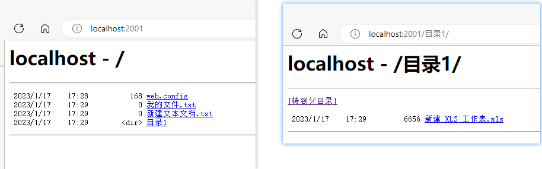

**IIS搭建文件下载服务器**

[toc]

IIS文件下载服务可以通过创建最简单的 IIS网站 即可，只需要开启“目录浏览”功能。

通过提供目录浏览功能，可以从浏览器下载文件的网站，并在目录浏览中隐藏指定文件、配置文件的点击下载、文本文档中中文显示乱码问题，同时介绍默认文档对目录浏览下文件列表显示的影响。以及介绍 IIS中的请求筛选（禁止请求某些文件）和设置站点路径下文件文件夹的权限。


此外，还有 IIS网站 的 身份验证，这部分本质上和 WebDAV 没有关系（也不是完完全全没关联，只是这是一个相对独立的身份验证功能），是 IIS 提供的身份验证功能。也可以算作独立的第三部分。

# 创建和配置文件下载站点

## 创建网站

打开 IIS管理器，右键 网站，选择 添加网站，添加一个文件下载的站点`FilesDownload`。

  

## 修改网站路径文件和文件夹权限

以网站根目录`C:\CodeMissing\IIS\FilesDownload`为例，如果是为网站下某一路径提供文件下载功能，可以考虑只为特定文件夹指定用户权限。

右键 `FilesDownload`->属性，在 安全 中，新增 “IIS_IUSRS”、“NETWORK SERVICE” 两个用户。

  

只需要增加用户后的默认权限即可。

## 站点启用 目录浏览

打开IIS管理器，点击之前创建的`FilesDownload`网站，右侧找到 **目录浏览**。

  

双击进入，右侧 操作 中，点击“启用”

  

## 浏览器访问 文件下载测试

浏览器中访问刚才创建的站点 `http://localhost:2001/`

  

点击非文本文档（非.txt文件）会直接进行下载。但是如果点击`.txt`、`.html`文件，会打开该文件显示在浏览器中，而不是下载。

## 文件列表中隐藏 web.config 配置文件

### 隐藏文件 不会显示在 目录浏览 中

从上面的目录浏览中，网站访问会直接显示出`web.config`配置文件，显然这是不应该的。

文件列表中隐藏 web.config 配置文件的最简单办法就是：**设置`web.config`为隐藏文件**。

右键文件->属性，常规 下面的 属性 勾选“隐藏”，点击“应用”。

  

刷新网页，可以看到，已经没有了 `web.config` 文件。

  

### 关于 请求筛选（禁止访问文件）

IIS中提供有配置站点请求删选的功能，用于刷选指定规则的文件不被访问。

但是在目录浏览中并不会被隐藏，仍会列出来，只不过不允许访问内容。

如下，点击站点下的 请求筛选：

  

如下，添加拒绝文件扩展名，该扩展名的文件将会拒绝被访问。

  

比如，默认已经拒绝访问`.config`后缀的文件。

尝试访问`test.config`文件将会报错`HTTP 错误 404.7 - Not Found`：

  

可以配置的筛选规则有很多种，比如 **隐藏段** 中，可以设置不允许访问的部分文件名（路径或名字中的一部分）：

  

## 目录浏览 下 配置文件下载

在 目录浏览 模式下，有的文件点击会直接下载；有的是打开显示内容（文本格式的文件）；有的则是提示 404 错误，不会打开该文件，也不会下载。

`HTTP 错误 404.3 - Not Found`：

  

根据提示可以看到，需要配置 文件扩展名 和 MIME类型 的映射。

打开 MIME类型：

  

点击 **添加**，自定义 **扩展名和MIME类型**：

  

回到 网页 中，测试点击文件，就能下载了。

  

此处测试的是 自己定义的类型，一般对于二进制文件(非文本)，MIME类型通常为：`application/octet-stream`。比如`.exe`程序文件就是这个类型。

比如，如果是安卓安装包，`.apk` 可以设置为 `application/vnd.android.package-archive` 类型。

## 浏览 .txt 文本文档时显示中文乱码

### 正确解决办法：mimetype指定编码

我们访问上面列出来的 `我的文件.txt` 会发现中文显式乱码。

  

响应头为 `Content-Type: text/plain`，未指定编码。

标准的解决方法，应该是设置文件编码为 `utf-8`，实现正确的解码显示。

先说 **正确解决方法：设置 `.txt` 后缀的 mimetype 类型 `Content-Type: text/plain;charset=utf-8`，指定编码。**

点击 IIS 的 MIME类型，进入找到`.txt`的设置

  

MIME类型指定编码：

  

或者，也可以直接在网站根目录下的 `web.config` 配置文件中修改（`remove`和`mimeMap`部分），两者的设置等同。

```xml
<?xml version="1.0" encoding="UTF-8"?>
<configuration>
    <system.webServer>
        <directoryBrowse enabled="true" />
        <staticContent>
            <remove fileExtension=".txt" />
            <mimeMap fileExtension=".txt" mimeType="text/plain;charset=utf-8" />
        </staticContent>
    </system.webServer>
</configuration>
```

再次访问`.txt`，中文显示正常：

  

### 其它参考解决办法

此部分几项设置虽然无法正确地解决该问题，但仍有参考价值，相关情况下可以进行参考设置。

#### 设置 IIS站点 的 .NET全球化

打开 IIS网站，点击 `.NET全球化`：

  

将编码设置为 utf-8（文件默认为`gb2312`）：

  

修改后，要 点击 右侧操作中的 应用，保存设置。

等同于在 `web.config` 文件中添加如下配置：

```xml
<system.web>
    <globalization fileEncoding="utf-8" />
</system.web>
```

请求和相应编码的设置对应为：

```xml
<system.web>
<globalization requestEncoding="utf-8" responseEncoding="utf-8"/>
</system.web>
```
#### 注意txt文档的编码

在win10中，txt文本文档默认的编码已经为 utf-8，通常不需要额外设置。

之前的 Windows 版本，编码通常为 ANSI 或 gb2312 ，需要在另存文件时，修改保存的编码格式为 utf-8，便于浏览器中正确显示。

#### web.config 中 添加 customHeaders 自定义响应头

显示乱码的问题在于请求返回数据的 响应头 中指定 `Content-Type` 的编码不正确或未指定编码。

因此，如果可以修改或自定义`Content-Type`响应头，将编码指定，即可正确显示。

如下，在站点根目录的 `web.config` 中 添加 `customHeaders`，指定`Content-Type`：

```xml
<?xml version="1.0" encoding="UTF-8"?>
<configuration>
  <system.webServer>
    <httpProtocol>
      <customHeaders>
        <add name="Content-Type" value="text/plain; charset=utf-8" />
      </customHeaders>
    </httpProtocol>
  </system.webServer>
</configuration>
```

可以看到，`.txt` 中的乱码消失了，但是，访问其他路径，会变为如下所示。

**自定义的添加的响应头`Content-Type`，会在所有返回的内容的`Content-Type`中，再添加`text/plain; charset=utf-8`，这对于`text/plain`格式的数据是问题的**，但是对于其他类型，则会导致产生解码错误，产生乱码等。

  

其等同的设置，对应在 IIS 中的操作为：

点击网站，在 IIS 中点击 `HTTP 响应标头`：

  

操作中点击添加，即可添加额外的响应头。

  

当然，通常关于响应头的设置，都会放在 ASP.NET 等的代码中中实现，比如`C#`。

## 关于默认文档

如果路径中存在默认文档，将会直接显示默认文档的网页内容，而不是目录浏览。


# 附：关于 响应头 Content-Type:application/force-download

访问任何路径均会执行下载，很不好的一个情况。仅作了解。

# 参考

- [How to hide web.config from directory browsing?](https://stackoverflow.com/questions/26349491/how-to-hide-web-config-from-directory-browsing)
- [IIS部署日志站点时出现的UTF8文件乱码问题及解决](https://blog.csdn.net/youbl/article/details/78028092)