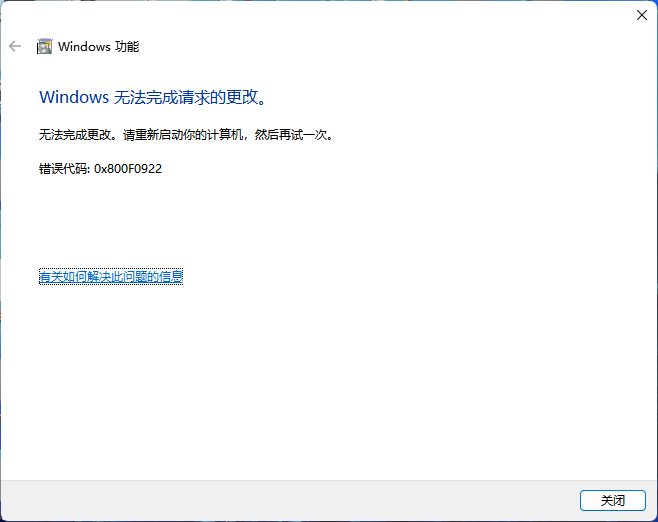
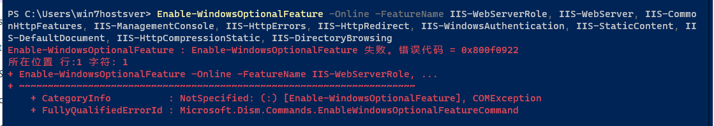
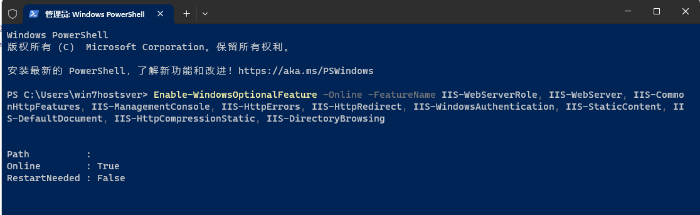

**由于缺少文件导致IIS无法安装，报错0x800F0922**

网上找到的完全卸载IIS的方法也不靠谱，比如 `%windir%\System32\inetsrv` 即使安全模式下、修改TrustedInstaller权限也无法删除。最最重要的是，**正是由于删除了该文件夹，尤其是该文件夹下config的一些内容（无法全部删除），才导致了IIS无法重新安装。解决办法就是恢复删除的文件，即可重新安装IIS成功。**

> inetsrv 中缺少文件导致 IIS安装报错`0x800F0922`，这个报错目前似乎没有找到解决办法。
> 
> 唯一的解决办法就是，**恢复缺少的文件**，或者，**从其它计算机中拷贝相关文件过来**。
> 
> 在此之外，就是 **重装系统**，或者，**升级系统**。

从 启用和关闭 Windows 功能 中，勾选安装IIS，无法重新安装，报错如下：

  

目前，似乎除了重装系统，没有解决办法。

Powershell中启用：

```shell
Enable-WindowsOptionalFeature -Online -FeatureName IIS-WebServerRole, IIS-WebServer, IIS-CommonHttpFeatures, IIS-ManagementConsole, IIS-HttpErrors, IIS-HttpRedirect, IIS-WindowsAuthentication, IIS-StaticContent, IIS-DefaultDocument, IIS-HttpCompressionStatic, IIS-DirectoryBrowsing
```

  

Powershell中启用成功：

  

> Windows Server 版本下的Powershell安装特性和功能的命令为`Install-WindowsFeature`。
> 
> 非 Server 版本下只能使用 `Enable-WindowsOptionalFeature` 命令。
>
> - Server下安装IIS：
> 
> `Install-WindowsFeature –name Web-Server -IncludeManagementTools`
>
> - Server下卸载IIS：
> 
> `Uninstall-WindowsFeature Web-Server` 或，添加上 `-IncludeManagementTools` 参数
>
> - 使用`-Remove`参数完全卸载IIS和它的配置。如果只是卸载IIS服务器，并想在以后重新安装，**不要使用`-Remove`参数**。
> 
> `Uninstall-WindowsFeature -Remove Web-Server`

> [Different ways for installing Windows features on the command line](https://peter.hahndorf.eu/blog/WindowsFeatureViaCmd.html)

# 可能 参考

IIS will not install on Windows 10：https://answers.microsoft.com/en-us/windows/forum/all/iis-will-not-install-on-windows-10/251699ca-627a-49e8-800e-a8d038f4b6c3


# 参考

[Use Command line to Enable IIS Web server on Windows 11](https://www.how2shout.com/how-to/use-command-line-to-enable-iis-web-server-on-windows-11.html)
