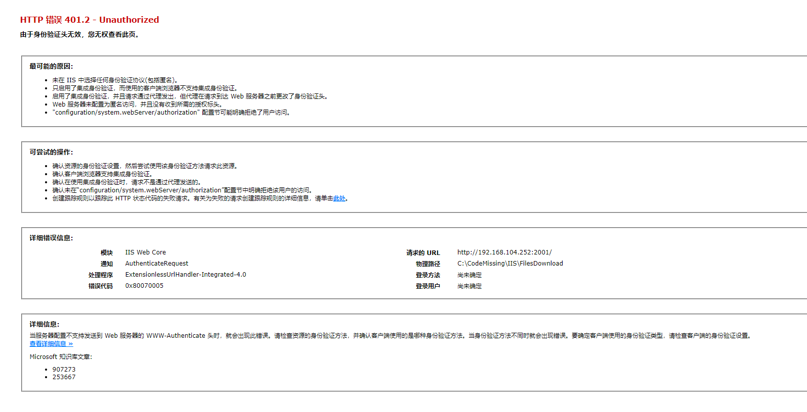

**IIS网站中身份验证的正确使用：匿名身份验证、Windows身份验证、摘要式身份验证、基本身份验证等**

[toc]

# IIS中的身份认证介绍

、基本身份认证、摘要身份认证

# 正确使用Windows身份认证

## 正确的 IIS集成Windows身份验证

## 设置Windows身份验证

IIS 站点下点击“身份验证”：

  

创建的站点，默认情况下，启用的是“匿名身份验证”，即不需要验证即可访问站点。

我们可以根据需要，启用相关的身份验证功能。如下，禁用匿名身份验证，启用“Windows 身份验证”。

  

然后，通过浏览器访问`http://ip:port`，即可看到Windows认证的弹窗，需要输入用户密码进行身份验证。

  

> 不应该使用 localhost 或 127.0.0.1 本地地址访问网址，因此它们不会引发身份验证。

## Windows 身份验证无法登陆的问题

通过上面的设置可以发现，虽然弹出需要验证用户、密码的弹窗，但是，即使输入正确的用户名和密码，也无法登陆。

详细访问错误：

  

