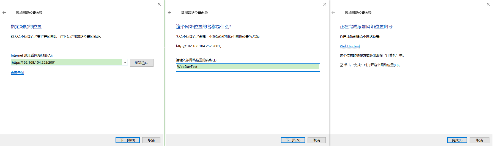
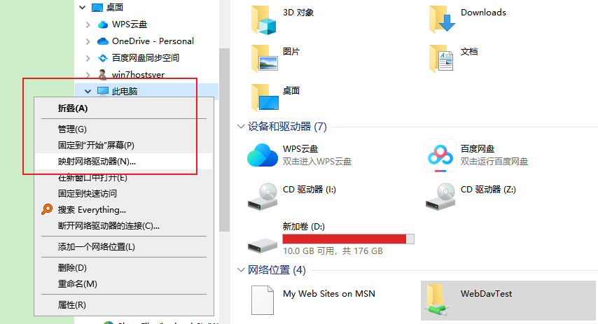

**IIS配置WebDAV文件服务器，提供文件管理的云盘或网络文件存储功能**

[toc]

IIS内置的WebDAV组件可以提供支持 WebDAV 协议，实现通过 HTTP访问 的网络文件管理、存储的功能（通常用于NAS网络存储、云盘功能中）。WebDAV是基于http实现的一种文件管理协议（包括下载、文件编辑、创建、保存、加锁等），通过网络驱动（或网络位置）映射，可以实现本地硬盘一样的体验，具体参见 WebDAV 相关介绍。

此外，简单介绍了下 IIS 为网站添加基本身份验证，用于访问WebDAV服务器的用户名密码验证，通常应该考虑比 基本身份 更好的身份验证方式。

> 关于更多的IIS身份验证，推荐参考 [IIS网站中身份验证的正确使用：匿名身份验证、Windows身份验证、摘要式身份验证、基本身份验证等](./IIS%E7%BD%91%E7%AB%99%E4%B8%AD%E8%BA%AB%E4%BB%BD%E9%AA%8C%E8%AF%81%E7%9A%84%E6%AD%A3%E7%A1%AE%E4%BD%BF%E7%94%A8%EF%BC%9A%E5%8C%BF%E5%90%8D%E3%80%81Windows%E3%80%81%E6%91%98%E8%A6%81%E5%BC%8F%E3%80%81%E5%9F%BA%E6%9C%AC%E8%BA%AB%E4%BB%BD%E9%AA%8C%E8%AF%81%E7%AD%89.md)

# 配置 WebDAV 服务器

## 安装 WebDAV 发布 组件

> `WebDAV 发布`、`Windows 身份验证` 默认会在安装IIS时安装，`基本身份验证`需要单独添加安装。

确认已经安装(启用) **基本身份验证** 与 **WebDAV发布**。如下是不同版本下的查看：

  

在控制面板->程序和功能->启用或关闭 Windows 功能：

  

## 配置 WebDAV 创作规则

### WebDAV 设置

进入网站，点击“WebDAV 创作规则”：

  

点击“操作”中的“WebDAV 设置”：

  

进入后，主要 启用 “请求删选行为” 和 “允许匿名属性查询”，如有需要也可以启用 “允许属性查询具有无限深度”。

点击 **操作** 中的 **应用**，保存设置。（保存后返回再重新进入，确认应用设置成功！）

  

  

> 锁定 是 WebDAV 协议中 Class 2（Level 2）级别的内容，在Windows自带的网络驱动映射、Mac的Finder中连接服务器，都需要`Class 2`支持才能实现文件的编辑、保存和上传，否则只能以 **只读模式** 访问。
> 
> 借助其他支持 WebDAV协议 的第三方工具，通常都没这个要求。

### 创作规则 和 启用WebDAV

返回到“WebDAV 创作规则”，点击“添加创作规则”：

  

创作规则中，可以指定 允许访问的内容、允许的用户及角色、以及访问权限。通常应该只允许指定用户或用户组访问。

  

点击“确定”，添加创作规则。

然后，点击右侧操作中的“启用 WebDAV”：

  

以上关于 WebDAV 设置基本已经完成。

> 关于允许访问的用户或用户组，其作用在于后续介绍的身份验证，验证登陆http的用户，有权限访问此处设置的用户或角色。比如，是允许的用户、属于允许的用户组。
> 
> 同时，还要注意，站点目录下的文件或目录，应该具有允许用户或用户组访问的权限，即最开始第二步介绍的 [修改网站路径文件和文件夹权限](./IIS%E6%90%AD%E5%BB%BA%E6%96%87%E4%BB%B6%E4%B8%8B%E8%BD%BD%E6%9C%8D%E5%8A%A1%E5%99%A8.md#修改网站路径文件和文件夹权限)
> 
> 此处设置为 **所有用户**，已经要求不需要用户验证（默认的匿名用户），就可以正常的访问和使用、管理文件。
> 
> **但是，通过作为 WebDAV 协议访问，都是需要提供用户名和密码的**，比如常用的Windows下的 RaiDrive 连接 WebDAV 必须为https，且提供用户/密码。

# Windows下 网络驱动映射 或 添加网络位置 访问无身份验证 WebDAV 服务器

网络驱动映射 或 添加网络位置 可以添加共享文件夹、http的WebDAV服务或共享，同时 添加网络位置 还可以添加 ftp位置（网络驱动映射 不确定是否也可以）。

此处主要演示，访问无身份验证的 WebDAV 服务。

## 添加网络位置

右键“此电脑”，即可选择“添加一个网络位置”：

  

然后依照向导，一步步选择：

  

输入刚才启用 WebDAV 的站点网址，然后设置下网络位置的名称，点击最后的“完成”。

  

在 此电脑 中 网络位置 下，就可以看到的 刚才添加的`WebDavTest`：

  

## 映射网络驱动器

“此电脑”下右键，选择“映射网络驱动器”：

  

在“文件夹”处填写 WebDAV 地址：

  

由于没有身份验证，不用勾选“使用其他凭据连接”。

点击完成即可。

  

## 无身份验证访问 WebDAV 时的权限问题

进入添加的网络位置或网络驱动器后，可以发现，是没有查看、编辑、新建权限的。

  

主要在于WebDAV站点根目录文件夹的权限问题。因为此处没有任何身份认证就访问成功，其身份相当于匿名用户。几乎没有任何权限。

# 网站 启用 IIS 基本身份验证

> **[安装WebDAV组件](#安装-webdav-发布-组件)部分已经介绍，IIS需要添加`基本身份验证`功能。**

> **基本身份验证相对来说是一种很简单的验证方式，由于其密码采用明文传输，因此通常不推荐使用。此处只是为了简单演示，实际中应考虑更好的身份验证。**

进入网站的 **身份验证**，启用`基本身份验证`，其它关闭。

  

启用后，浏览器中刷新访问 WebDAV 服务器，可以看到需要输入用户名密码才能访问：

  

输入一个Windows本地系统用户和密码，登陆成功。

# 使用 基本身份验证 的 WebDAV 应该(或必须)采用https

正如上面介绍，IIS 基本身份验证 会采用明文传递 密码，可能正式处于安全方面的考虑，映射网络驱动器时，要连接的WebDAV服务需要采用https。否则，连接时会报错：`发生系统错误 67`（比如命令行中使用 `NET USE * http://ip:port` 就会报改错，具体参见参考文章 [Using the WebDAV Redirector](https://learn.microsoft.com/en-us/iis/publish/using-webdav/using-the-webdav-redirector) 中的详细介绍）

通常大多数如 RaiDrive 之类的网络存储服务连接管理软件，在连接WebDAV时，默认都只能输入`https`的地址，且必须指定用户名密码。

> 直接在浏览器中访问没有这个限制（但功能无法和`网络驱动器`相比），且，非https确实不安全。

# Windows 网络驱动映射 有身份验证的WebDAV

> **原则上不需要勾选“使用其他凭据连接”，因为在连接中会自动弹出弹窗，提示输入用户名密码。**
> 
> 在 映射网络驱动器 中，勾选下面的“使用其他凭据连接”：
> 
>   

> **测试无法登陆连接成功！**

# 参考

- [Using the WebDAV Redirector](https://learn.microsoft.com/en-us/iis/publish/using-webdav/using-the-webdav-redirector) 本篇强烈推荐，基本是官方介绍的关于 映射网络驱动器 连接 WebDAV 的最全介绍资料，对连接 WebDAV 的设置、**错误或故障排查**、如何连接和所需组件等都有介绍。