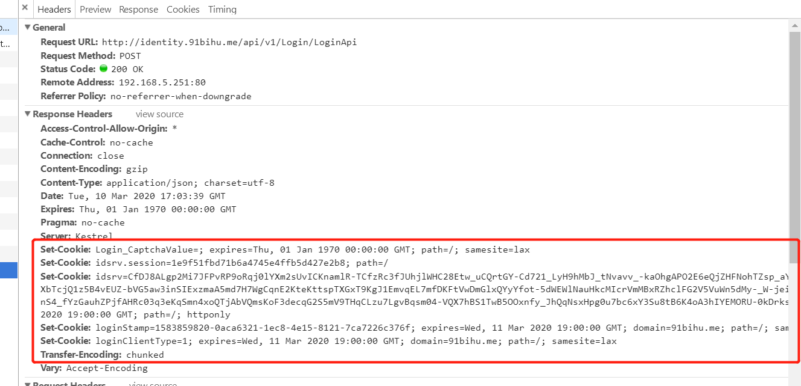

**IdentityServer4登录时验证成功但是无法登陆跳转，samesite=none导致无法设置Cookie的问题**

[toc]

主要参考自 [IdentityServer4登录后无法跳转samesite=none](https://www.cnblogs.com/qixinbo/p/12495995.html)、[How To Prepare Your IdentityServer For Chrome’s SameSite Cookie Changes – And How To Deal With Safari, Nevertheless](https://www.thinktecture.com/en/identityserver/prepare-your-identityserver/)。

# `samesite=none`导致无法设置Cookie，无法登陆

问题的发生和第一篇参考文章中的一样，登录提交的账户密码都没问题，并且登陆的Action也设置了登陆成功的处理，但是返回到浏览器前端页面就是无法跳转，无法登陆成功。

通过查看 Login 是的 网络请求，可以找到登陆相关的Cookie信息：

  

可以看到下面的警告提示：`通过Set-Cookie 标头设置 Cookie 时被阻止，因为它具有"Samesite=None"属性,但没有使用"Samesite=None"所必须的"Secure“属性`。

基本可以断定，是由于`Samesite=None`导致`Set-Cookie`浏览器设置Cookie失败，因此无法登陆（没有cookie）。

正常情况，登陆时的响应头`Set-Cookie`中没有`samesite`这一项，或者这一项不为`none`。如下所示：

  

如下是 **登陆失败时的情况**，多出了`samesite=none`这一项：

  

> 实际我这边遇到的问题更有些无法理解，因为在不同的电脑上运行 ASP.NET Core 项目，有的就没有`samesite=none`可以登陆成功；有的就有，无法登陆跳转。
>
> 非常奇怪，同样的程序代码。

# 解决办法

## 最简单处理

在 ASP.NET Core 的`ConfigureServices`中，添加 `CookiePolicyOptions` cookie策略的选项处理，添加Cookie时判断如果为`samesite=none`，则修改为其它值。

```C#           

#region ConfigureServices中的cookie策略
services.Configure<CookiePolicyOptions>(options =>
{
    options.MinimumSameSitePolicy = SameSiteMode.Lax;
    options.OnDeleteCookie = cookieContext => CheckSameSite(cookieContext.Context, cookieContext.CookieOptions);
    options.OnAppendCookie = cookieContext => CheckSameSite(cookieContext.Context, cookieContext.CookieOptions);
});
#endregion

// .........

/// <summary>
/// samesite=none无法设置cookie，导致无法登陆的处理
/// </summary>
/// <param name="httpContext"></param>
/// <param name="options"></param>
private static void CheckSameSite(HttpContext httpContext, CookieOptions options)
{
if (options.SameSite == SameSiteMode.None)
{
        options.SameSite = SameSiteMode.Lax;
}
}
```

另外，要在 `Configure` 方法中启用Cookie策略，尽量放在所有处理的中间件之前：

```C#
public void Configure(IApplicationBuilder app, IHostingEnvironment env)
{
   // Add this before any other middleware that might write cookies
   app.UseCookiePolicy();

   // ............

   // This will write cookies, so make sure it's after the cookie policy
   app.UseAuthentication();
}
```

## 依据不同浏览器处理samesite=none的情况

第二个参考文章则给出了更详细的由于浏览器升级导致的Cookie设置策略的变更，而无法处理`samesite=none`的情况。

如下，是给出的判断不同浏览器并处理Cookie策略的服务配置扩展类：

```C#
using Microsoft.AspNetCore.Builder;
using Microsoft.AspNetCore.Http;

namespace Microsoft.Extensions.DependencyInjection
{
   public static class SameSiteCookiesServiceCollectionExtensions
   {
      /// <summary>
      /// -1 defines the unspecified value, which tells ASPNET Core to NOT
      /// send the SameSite attribute. With ASPNET Core 3.1 the
      /// <seealso cref="SameSiteMode" /> enum will have a definition for
      /// Unspecified.
      /// </summary>
      private const SameSiteMode Unspecified = (SameSiteMode) (-1);

      /// <summary>
      /// Configures a cookie policy to properly set the SameSite attribute
      /// for Browsers that handle unknown values as Strict. Ensure that you
      /// add the <seealso cref="Microsoft.AspNetCore.CookiePolicy.CookiePolicyMiddleware" />
      /// into the pipeline before sending any cookies!
      /// </summary>
      /// <remarks>
      /// Minimum ASPNET Core Version required for this code:
      ///   - 2.1.14
      ///   - 2.2.8
      ///   - 3.0.1
      ///   - 3.1.0-preview1
      /// Starting with version 80 of Chrome (to be released in February 2020)
      /// cookies with NO SameSite attribute are treated as SameSite=Lax.
      /// In order to always get the cookies send they need to be set to
      /// SameSite=None. But since the current standard only defines Lax and
      /// Strict as valid values there are some browsers that treat invalid
      /// values as SameSite=Strict. We therefore need to check the browser
      /// and either send SameSite=None or prevent the sending of SameSite=None.
      /// Relevant links:
      /// - https://tools.ietf.org/html/draft-west-first-party-cookies-07#section-4.1
      /// - https://tools.ietf.org/html/draft-west-cookie-incrementalism-00
      /// - https://www.chromium.org/updates/same-site
      /// - https://devblogs.microsoft.com/aspnet/upcoming-samesite-cookie-changes-in-asp-net-and-asp-net-core/
      /// - https://bugs.webkit.org/show_bug.cgi?id=198181
      /// </remarks>
      /// <param name="services">The service collection to register <see cref="CookiePolicyOptions" /> into.</param>
      /// <returns>The modified <see cref="IServiceCollection" />.</returns>
      public static IServiceCollection ConfigureNonBreakingSameSiteCookies(this IServiceCollection services)
      {
         services.Configure<CookiePolicyOptions>(options =>
         {
            options.MinimumSameSitePolicy = Unspecified;
            options.OnAppendCookie = cookieContext =>
               CheckSameSite(cookieContext.Context, cookieContext.CookieOptions);
            options.OnDeleteCookie = cookieContext =>
               CheckSameSite(cookieContext.Context, cookieContext.CookieOptions);
         });

         return services;
      }

      private static void CheckSameSite(HttpContext httpContext, CookieOptions options)
      {
         if (options.SameSite == SameSiteMode.None)
         {
            var userAgent = httpContext.Request.Headers["User-Agent"].ToString();

            if (DisallowsSameSiteNone(userAgent))
            {
               options.SameSite = Unspecified;
            }
         }
      }

      /// <summary>
      /// Checks if the UserAgent is known to interpret an unknown value as Strict.
      /// For those the <see cref="CookieOptions.SameSite" /> property should be
      /// set to <see cref="Unspecified" />.
      /// </summary>
      /// <remarks>
      /// This code is taken from Microsoft:
      /// https://devblogs.microsoft.com/aspnet/upcoming-samesite-cookie-changes-in-asp-net-and-asp-net-core/
      /// </remarks>
      /// <param name="userAgent">The user agent string to check.</param>
      /// <returns>Whether the specified user agent (browser) accepts SameSite=None or not.</returns>
      private static bool DisallowsSameSiteNone(string userAgent)
      {
         // Cover all iOS based browsers here. This includes:
         //   - Safari on iOS 12 for iPhone, iPod Touch, iPad
         //   - WkWebview on iOS 12 for iPhone, iPod Touch, iPad
         //   - Chrome on iOS 12 for iPhone, iPod Touch, iPad
         // All of which are broken by SameSite=None, because they use the
         // iOS networking stack.
         // Notes from Thinktecture:
         // Regarding https://caniuse.com/#search=samesite iOS versions lower
         // than 12 are not supporting SameSite at all. Starting with version 13
         // unknown values are NOT treated as strict anymore. Therefore we only
         // need to check version 12.
         if (userAgent.Contains("CPU iPhone OS 12")
            || userAgent.Contains("iPad; CPU OS 12"))
         {
            return true;
         }

         // Cover Mac OS X based browsers that use the Mac OS networking stack.
         // This includes:
         //   - Safari on Mac OS X.
         // This does not include:
         //   - Chrome on Mac OS X
         // because they do not use the Mac OS networking stack.
         // Notes from Thinktecture:
         // Regarding https://caniuse.com/#search=samesite MacOS X versions lower
         // than 10.14 are not supporting SameSite at all. Starting with version
         // 10.15 unknown values are NOT treated as strict anymore. Therefore we
         // only need to check version 10.14.
         if (userAgent.Contains("Safari")
            && userAgent.Contains("Macintosh; Intel Mac OS X 10_14")
            && userAgent.Contains("Version/"))
         {
            return true;
         }

         // Cover Chrome 50-69, because some versions are broken by SameSite=None
         // and none in this range require it.
         // Note: this covers some pre-Chromium Edge versions,
         // but pre-Chromium Edge does not require SameSite=None.
         // Notes from Thinktecture:
         // We can not validate this assumption, but we trust Microsofts
         // evaluation. And overall not sending a SameSite value equals to the same
         // behavior as SameSite=None for these old versions anyways.
         if (userAgent.Contains("Chrome/5") || userAgent.Contains("Chrome/6"))
         {
            return true;
         }

         return false;
      }
   }
}
```

然后是配置和启用Cookie策略，在 startup 代码中：

```C#
public void ConfigureServices(IServiceCollection services)
{
   // Add this
   services.ConfigureNonBreakingSameSiteCookies();
}

public void Configure(IApplicationBuilder app)
{
   // Add this before any other middleware that might write cookies
   app.UseCookiePolicy();

   // This will write cookies, so make sure it's after the cookie policy
   app.UseAuthentication();
}
```
