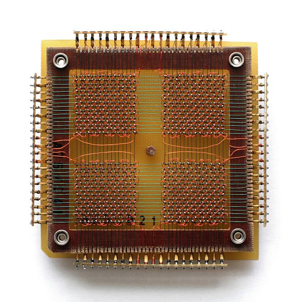

**Linux下的core dump详解及总结记录【RHEL 8 / CentOS 8 为例】**

[toc]

> 下面有关实际系统的测试都是基于 RHEL 8.7

# 什么是 core dump

**当程序运行的过程中异常终止或崩溃，操作系统会将程序当时的内存状态记录下来，保存在一个文件中，这种行为就叫做Core Dump（中文有的翻译成“核心转储”)**。

可以认为 core dump 是“内存快照”，但实际上，除了内存信息之外，还有些关键的程序运行状态也会同时 dump 下来，例如寄存器信息（包括程序指针、栈指针等）、内存管理信息、其他处理器和操作系统状态和信息。

core dump 对于编程人员诊断和调试程序是非常有帮助的，因为对于有些程序错误是很难重现的，例如指针异常，而 core dump 文件可以再现程序出错时的情景。

从core文件中可以分析程序崩溃的原因，通过 gdb 看出程序挂在哪里，分析前后的变量，找出问题的原因。


但是，core文件是怎么产生的呢？难道系统会自动产生？似乎在linux系统上面写个非法程序测试，也没有产生core？这又是怎么回事？并且，core dump可以在程序中设置，又是怎么回事呢？生成的core文件都带有进程名称、进程ID和时间，这又是怎么做到的呢？今天带着这些疑问来说说core文件是如何生成，如何配置。

# 开启 core dump

可以使用命令 ulimit 开启，也可以在程序中通过 setrlimit 系统调用开启。

## 打开 core dump 功能

### 查看 core dump 是否开启

在终端中输入命令 `ulimit -c` ，输出的结果为 0，说明默认是关闭 core dump 的，即当程序异常终止时，也不会生成 core dump 文件。

### 当前的终端打开 core dump


可以使用命令 `ulimit -c unlimited` 来开启 core dump 功能，并且不限制 core dump 文件的大小； 如果需要限制文件的大小，将 unlimited 改成你想生成 core 文件最大的大小，注意单位为 blocks（KB）。


### 永久开启 core dump

用上面的命令只会对当前的终端环境有效。如果想需要永久生效，可以修改文件 `/etc/security/limits.conf` 文件，关于此文件的设置参看 **[这里](http://manpages.ubuntu.com/manpages/hardy/man5/limits.conf.5.html)** 。

如下，增加一行:

```sh
# /etc/security/limits.conf
#
#Each line describes a limit for a user in the form:
#
#<domain>   <type>   <item>   <value>
    *          soft     core   unlimited
```

### 修改 core 文件保存的路径
    
- **默认生成的 core 文件保存在可执行文件所在的目录下，文件名就为 `core`。**

> 参考文章介绍的是基于 Ubuntu 13.04，但是对于 core dump 应该没有发行版的区别。唯一的区别可能就是发行版的初始设置不同。
>
> 比如 RHEL / CentOS 8 下，

- 通过修改 `/proc/sys/kernel/core_uses_pid` 文件可以让生成 core 文件名是否自动加上 pid 号。  
        
例如 `echo 1 > /proc/sys/kernel/core_uses_pid` ，生成的 core 文件名将会变成 `core.pid`，其中 pid 表示该进程的 PID。

- 还可以通过修改 `/proc/sys/kernel/core_pattern` 来控制生成 core 文件保存的位置以及文件名格式。  

例如可以用 `echo "/tmp/corefile-%e-%p-%t" > /proc/sys/kernel/core_pattern` 设置生成的 core 文件保存在 “/tmp/corefile” 目录下，文件名格式为 “core-命令名-pid-时间戳”。**[这里](http://man7.org/linux/man-pages/man5/core.5.html)** 有更多详细的说明！

# 附：Core Dump 名词解释

在半导体作为电脑内存材料之前，电脑内存使用的是 **[磁芯内存](http://en.wikipedia.org/wiki/Core_memory)（Magnetic Core Memory）**，**Core Dump 中的 Core 沿用了磁芯内存的 Core 表达**。图为磁芯内存的一个单元，[来自 Wikipedia](http://en.wikipedia.org/wiki/Main_Page).



在 **APUE** 一书中作者有句话这样写的：

> Because the file is named core, it shows how long this feature has been part of the Unix System.

这里的 core 就是沿用的早期电脑磁芯内存中的表达，也能看出 Unix 系统 Core Dump 机制的悠久历史。

**Dump 指的是拷贝一种存储介质中的部分内容到另一个存储介质，或者将内容打印、显示或者其它输出设备**。dump 出来的内容是格式化的，可以使用一些工具来解析它。

现代操作系统中，用 **Core Dump 表示当程序异常终止或崩溃时，将进程此时的内存中的内容拷贝到磁盘文件中存储，以方便编程人员调试。**

# 参考

- 重点参考自 
- [linux下core dump【总结】](https://www.cnblogs.com/Anker/p/6079580.html)