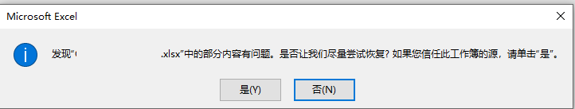
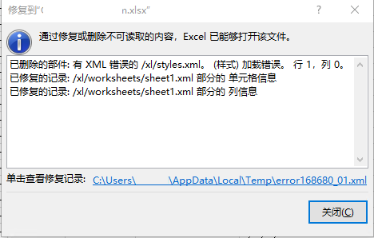

**NPIO问题汇总**

# 生成的Excel（.xlsx）打开报错部分内容有问题，要修复

  

点击“是”，修复即可

  

> 2.5.2、2.5.6、2.4.1 都有这个问题
> 
> 并且，2.4.1 版本的 NPOI 会在 IWorkbook.Close() 时修改 Workbook 打开的原始文件。

> 一般降级就能解决，比如2.5.2、2.4.1，但是测试这两个版本仍然由此问题。有的介绍需要升级或降级对应的依赖，比如 SharpZipLib 为 v1.3.1。实际测试仍没有解决。
>
> [Npoi导出，提示“部分内容有问题”，解决方案](https://www.codenong.com/cs106832809/)
> 
> [NPOI 操作 Excel 后，提示：发现.xlsx中的部分内容有问题](http://www.cftea.com/c/2020/12/13072.asp)

> **生成 Excel 2003（.xls）格式应该是没有这个问题的。**

