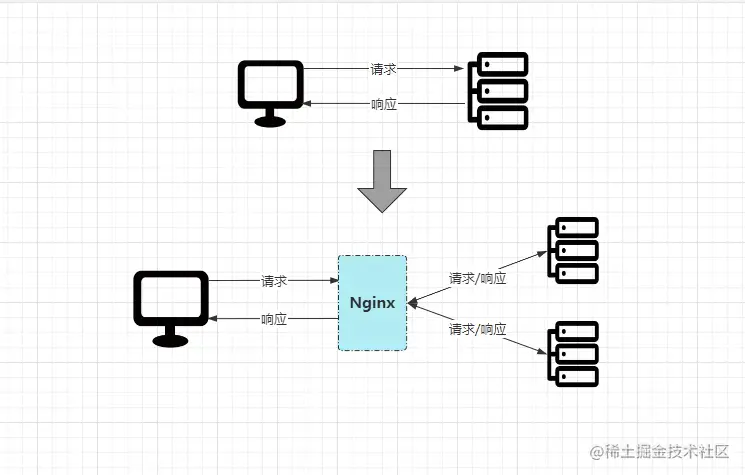
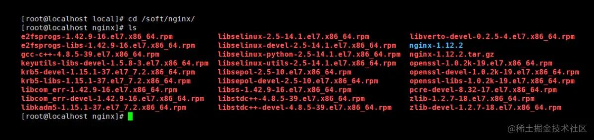
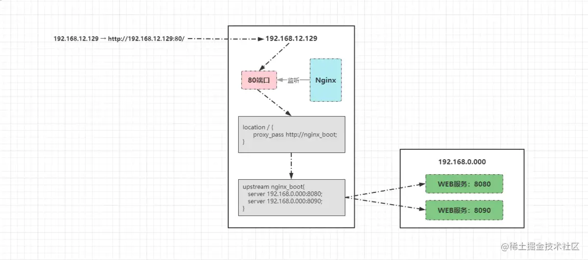
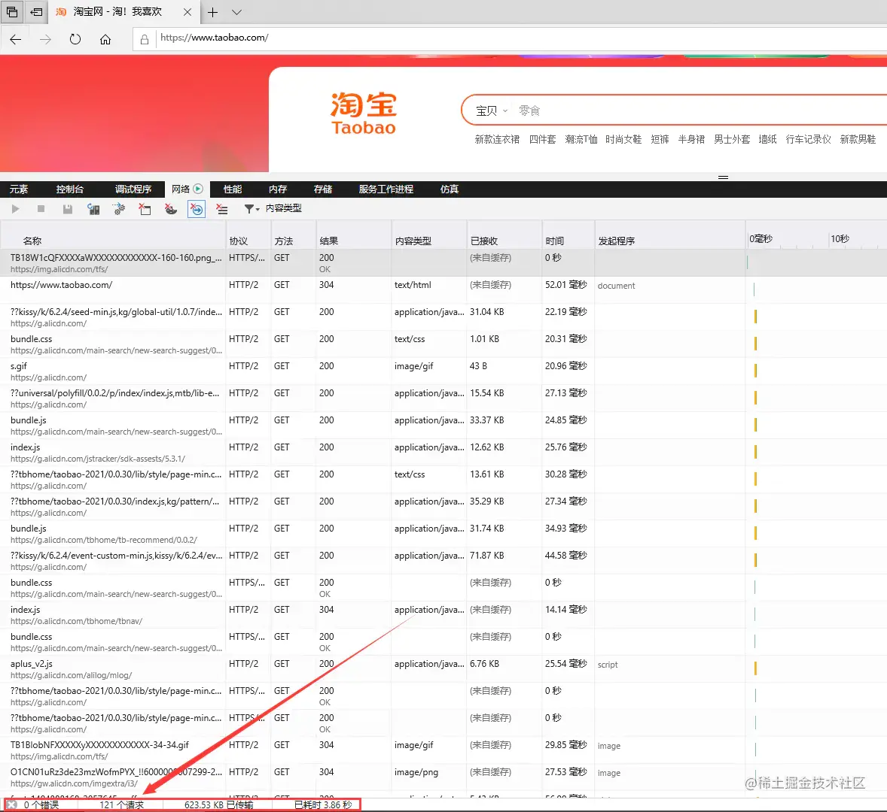
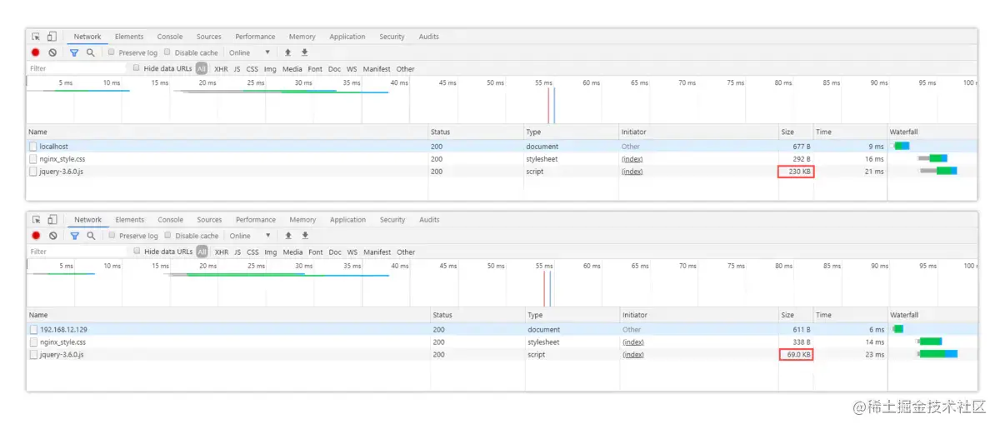
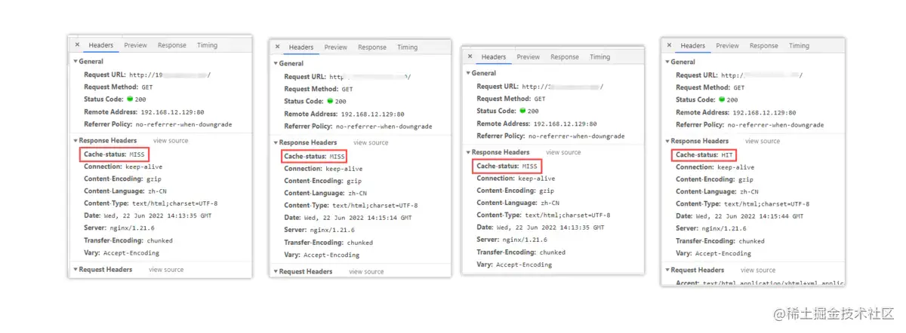

**Nginx一网打尽：动静分离、压缩、缓存、黑白名单、跨域、高可用、性能优化...想要的这都有！【转】**

[toc]

# 引言

在上文[《HTTP/HTTPS》](https://juejin.cn/post/7109497228103778311 "https://juejin.cn/post/7109497228103778311")中曾谈到了代理服务器的概念，其主要作用之一就是用于负载均衡与请求分发，那么先来看看为何需要做请求负载。

早期的业务都是基于单体节点部署，由于前期访问流量不大，因此单体结构也可满足需求，但随着业务增长，流量也越来越大，那么最终单台服务器受到的访问压力也会逐步增高。时间一长，单台服务器性能无法跟上业务增长，就会造成线上频繁宕机的现象发生，最终导致系统瘫痪无法继续处理用户的请求。

> 从上面的描述中，主要存在两个问题：  
> ① 单体结构的部署方式无法承载日益增长的业务流量。  
> ② 当后端节点宕机后，整个系统会陷入瘫痪，导致整个项目不可用。

因此在这种背景下，引入负载均衡技术可带来的收益：

- 系统的高可用：当某个节点宕机后可以迅速将流量转移至其他节点。
- 系统的高性能：多台服务器共同对外提供服务，为整个系统提供了更高规模的吞吐。
- 系统的拓展性：当业务再次出现增长或萎靡时，可再加入/减少节点，灵活伸缩。

OK~，既然引入负载均衡技术可给我们带来如此巨大的好处，那么又有那些方案可供选择呢？主要有两种负载方案，**硬件层面与软件层面**，比较常用的硬件负载器有`A10、F5`等，但这些机器动辄大几万乃至几十万的成本，因此一般大型企业会采用该方案，如银行、国企、央企等。  

而成本有限，但依旧想做负载均衡的项目，那么可在软件层面实现，如典型的`Nginx`等，软件层的负载也是本文的重点，毕竟`Boss`们的准则之一就是：**能靠技术实现的就尽量不花钱。**

# 一、性能怪兽-Nginx概念深入浅出

`Nginx`是目前负载均衡技术中的主流方案，几乎绝大部分项目都会使用它。

`Nginx`是一个轻量级的高性能`HTTP`反向代理服务器，同时它也是一个通用类型的代理服务器，支持绝大部分协议，如`TCP、UDP、SMTP、HTTPS`等。

  

`Nginx`与之前谈及的[《Redis》](https://juejin.cn/post/7097521572885299214 "https://juejin.cn/post/7097521572885299214")相同，都是基于多路复用模型构建出的产物，因此它与`Redis`同样具备**资源占用少、并发支持高**的特点，在理论上单节点的`Nginx`同时支持`5W`并发连接，而实际生产环境中，硬件基础到位再结合简单调优后确实能达到该数值。

先来看看`Nginx`引入前后，客户端请求处理流程的对比：

  

原本客户端是直接请求目标服务器，由目标服务器直接完成请求处理工作，但加入`Nginx`后，所有的请求会先经过`Nginx`，再由其进行分发到具体的服务器处理，处理完成后再返回`Nginx`，最后由`Nginx`将最终的响应结果返回给客户端。

了解了`Nginx`的基本概念后，再来快速搭建一下环境，以及了解一些`Nginx`的高级特性，如动静分离、资源压缩、缓存配置、`IP`黑名单、高可用保障等。

# 二、Nginx环境搭建

❶ 首先创建`Nginx`的目录并进入：

```shell
[root@localhost]# mkdir /soft && mkdir /soft/nginx/
[root@localhost]# cd /soft/nginx/
```

❷ 下载`Nginx`的安装包，可以通过`FTP`工具上传离线环境包，也可通过`wget`命令在线获取安装包：

```shell
[root@localhost]# wget https://nginx.org/download/nginx-1.21.6.tar.gz
```

没有`wget`命令的可通过`yum`命令安装：

```shell
[root@localhost]# yum -y install wget
```

❸ 解压`Nginx`的压缩包：

```shell
[root@localhost]# tar -xvzf nginx-1.21.6.tar.gz
```

❹ 下载并安装`Nginx`编译安装时所需的依赖库和包：

```shell
[root@localhost]# yum install --downloadonly --downloaddir=/soft/nginx/ gcc-c++
[root@localhost]# yum install --downloadonly --downloaddir=/soft/nginx/ pcre pcre-devel4
[root@localhost]# yum install --downloadonly --downloaddir=/soft/nginx/ zlib zlib-devel
[root@localhost]# yum install --downloadonly --downloaddir=/soft/nginx/ openssl openssl-devel
```

也可以通过`yum`命令一键安装：

```shell
[root@localhost]# yum -y install gcc zlib zlib-devel pcre-devel openssl openssl-devel
```

执行完成后，然后`ls`查看目录文件，会看一大堆依赖：  

  

紧接着通过`rpm`命令依次将依赖包一个个构建，或者通过如下指令一键安装所有依赖包（**如果`yum`一键安装则不需要此操作**）：

```shell
[root@localhost]# rpm -ivh --nodeps *.rpm
```

❺ 进入解压后的`nginx`目录，然后执行`Nginx`的配置脚本，为后续的安装提前配置好环境，默认位于`/usr/local/nginx/`目录下（可自定义目录）：

```shell
[root@localhost]# cd nginx-1.21.6
[root@localhost]# ./configure --prefix=/soft/nginx/
```

❻ 编译并安装`Nginx`：

```shell
[root@localhost]# make && make install
```

❼ 最后回到前面的`/soft/nginx/`目录，输入`ls`即可看见安装`nginx`完成后生成的文件。

❽ 修改安装后生成的`conf`目录下的`nginx.conf`配置文件：

```shell
[root@localhost]# vi conf/nginx.conf
    修改端口号：listen    80;
	修改IP地址：server_name  你当前机器的本地IP(线上配置域名);
```

❾ 制定配置文件并启动`Nginx`：

```shell
[root@localhost]# sbin/nginx -c conf/nginx.conf
[root@localhost]# ps aux | grep nginx
```

`Nginx`其他操作命令：

```shell
sbin/nginx -t -c conf/nginx.conf # 检测配置文件是否正常
sbin/nginx -s reload -c conf/nginx.conf # 修改配置后平滑重启
sbin/nginx -s quit # 优雅关闭Nginx，会在执行完当前的任务后再退出
sbin/nginx -s stop # 强制终止Nginx，不管当前是否有任务在执行
```

❿ 开放`80`端口，并更新防火墙：

```shell
[root@localhost]# firewall-cmd --zone=public --add-port=80/tcp --permanent
[root@localhost]# firewall-cmd --reload
[root@localhost]# firewall-cmd --zone=public --list-ports
```

⓫ 在`Windows/Mac`的浏览器中，直接输入刚刚配置的`IP`地址访问`Nginx`：  

  

最终看到如上的`Nginx`欢迎界面，代表`Nginx`安装完成。

# 三、Nginx反向代理-负载均衡

## 配置请求分发

首先通过`SpringBoot+Freemarker`快速搭建一个`WEB`项目：[springboot-web-nginx](https://link.juejin.cn/?target=https%3A%2F%2Fpan.baidu.com%2Fs%2F1xc7uR7x8z7OKM3CZL75DCA%3Fpwd%3Dpr2w "https://pan.baidu.com/s/1xc7uR7x8z7OKM3CZL75DCA?pwd=pr2w")，然后在该项目中，创建一个`IndexNginxController.java`文件，逻辑如下：

```java
@Controller
public class IndexNginxController {
    @Value("${server.port}")
    private String port;

    @RequestMapping("/")
    public ModelAndView index(){
        ModelAndView model = new ModelAndView();
        model.addObject("port", port);
        model.setViewName("index");
        return model;
    }
}
```

在该`Controller`类中，存在一个成员变量：`port`，它的值即是从`application.properties`配置文件中获取`server.port`值。当出现访问`/`资源的请求时，跳转前端`index`页面，并将该值携带返回。

前端的`index.ftl`文件代码如下：

```html
<html>
    <head>
        <title>Nginx演示页面</title>
        <link href="nginx_style.css" rel="stylesheet" type="text/css"/>
    </head>
    <body>
        <div style="border: 2px solid red;margin: auto;width: 800px;text-align: center">
            <div  id="nginx_title">
                <h1>欢迎来到熊猫高级会所，我是竹子${port}号！</h1>
            </div>
        </div>
    </body>
</html>
```

从上可以看出其逻辑并不复杂，仅是从响应中获取了`port`输出。

OK~，前提工作准备就绪后，再简单修改一下`nginx.conf`的配置即可：

```shell
upstream nginx_boot{
   # 30s内检查心跳发送两次包，未回复就代表该机器宕机，请求分发权重比为1:2
   server 192.168.0.000:8080 weight=100 max_fails=2 fail_timeout=30s; 
   server 192.168.0.000:8090 weight=200 max_fails=2 fail_timeout=30s;
   # 这里的IP请配置成你WEB服务所在的机器IP
}

server {
    location / {
        root   html;
        # 配置一下index的地址，最后加上index.ftl。
        index  index.html index.htm index.jsp index.ftl;
        proxy_set_header Host $host;
        proxy_set_header X-Real-IP $remote_addr;
        proxy_set_header X-Forwarded-For $proxy_add_x_forwarded_for;
        # 请求交给名为nginx_boot的upstream上
        proxy_pass http://nginx_boot;
    }
}
```

> 至此，所有的前提工作准备就绪，紧接着再启动`Nginx`，然后再启动两个`web`服务，第一个`WEB`服务启动时，在`application.properties`配置文件中，将端口号改为`8080`，第二个`WEB`服务启动时，将其端口号改为`8090`。

最终来看看效果：  

  

因为配置了请求分发的权重，`8080、8090`的权重比为`2:1`，因此请求会根据权重比均摊到每台机器，也就是`8080`一次、`8090`两次、`8080`一次......

## Nginx请求分发的过程

客户端发出的请求`192.168.12.129`最终会转变为：`http://192.168.12.129:80/`，然后再向目标`IP`发起请求，流程如下：  

  

- 由于`Nginx`监听了`192.168.12.129`的`80`端口，所以最终该请求会找到`Nginx`进程；

- `Nginx`首先会根据配置的`location`规则进行匹配，根据客户端的请求路径`/`，会定位到`location /{}`规则；

- 然后根据该`location`中配置的`proxy_pass`会再找到名为`nginx_boot`的`upstream`；

- 最后根据`upstream`中的配置信息，将请求转发到运行`WEB`服务的机器处理，由于配置了多个`WEB`服务，且配置了权重值，因此`Nginx`会依次根据权重比分发请求。

# 四、Nginx动静分离

------

动静分离应该是听的次数较多的性能优化方案，那先思考一个问题：**为什么需要做动静分离呢？它带来的好处是什么？** 

其实这个问题也并不难回答，当你搞懂了网站的本质后，自然就理解了动静分离的重要性。

先来以淘宝为例分析看看：  

   

当浏览器输入`www.taobao.com`访问淘宝首页时，打开开发者调试工具可以很明显的看到，首页加载会出现`100+`的请求数，而正常项目开发时，静态资源一般会放入到`resources/static/`目录下：  

   


在项目上线部署时，这些静态资源会一起打成包，那此时思考一个问题：**假设淘宝也是这样干的，那么首页加载时的请求最终会去到哪儿被处理？** 答案毋庸置疑，首页`100+`的所有请求都会来到部署`WEB`服务的机器处理，那则代表着一个客户端请求淘宝首页，就会对后端服务器造成`100+`的并发请求。毫无疑问，这对于后端服务器的压力是尤为巨大的。

> 但此时不妨分析看看，首页`100+`的请求中，是不是至少有`60+`是属于`*.js、*.css、*.html、*.jpg.....`这类静态资源的请求呢？
> 
> 答案是`Yes`。

既然有这么多请求属于静态的，这些资源大概率情况下，长时间也不会出现变动，那为何还要让这些请求到后端再处理呢？能不能在此之前就提前处理掉？当然`OK`，因此经过分析之后能够明确一点：

**做了动静分离之后，至少能够让后端服务减少一半以上的并发量。** 

到此时大家应该明白了动静分离能够带来的性能收益究竟有多大。

----

OK~，搞清楚动静分离的必要性之后，如何实现动静分离呢？其实非常简单，实战看看。

① 先在部署`Nginx`的机器，`Nginx`目录下创建一个目录`static_resources`：

> `mkdir static_resources`

② 将项目中所有的静态资源全部拷贝到该目录下，而后将项目中的静态资源移除重新打包。

③ 稍微修改一下`nginx.conf`的配置，增加一条`location`匹配规则：

```shell
location ~ .*\.(html|htm|gif|jpg|jpeg|bmp|png|ico|txt|js|css){
    root   /soft/nginx/static_resources;
    expires 7d;
}
```

然后照常启动`nginx`和移除了静态资源的`WEB`服务，你会发现原本的样式、`js`效果、图片等依旧有效，如下：  

  
 
其中`static`目录下的`nginx_style.css`文件已被移除，但效果依旧存在（绿色字体+蓝色大边框）：  

  

> 解读一下那条`location`规则：  
> 
> `location ~ .*\.(html|htm|gif|jpg|jpeg|bmp|png|ico|txt|js|css)`  
> 
> `~` 代表正则匹配，区分大小写  
> `.*` 代表任意字符都可以出现零次或多次，即资源名不限制  
> `\.` 代表匹配后缀分隔符`.`  
> `(html|...|css)` 代表匹配括号里所有静态资源类型  
> 
> 综上所述，简单一句话概述：**该配置表示匹配以`.html~.css`为后缀的所有资源请求。**

_最后提一嘴，也可以将静态资源上传到文件服务器中，然后`location`中配置一个新的`upstream`指向。_

# 五、Nginx资源压缩

建立在动静分离的基础之上，如果一个静态资源的`Size`越小，那么自然传输速度会更快，同时也会更节省带宽，因此我们在部署项目时，**可以通过`Nginx`对于静态资源实现压缩传输，一方面可以节省带宽资源，第二方面也可以加快响应速度并提升系统整体吞吐**。

在`Nginx`也提供了三个支持资源压缩的模块`ngx_http_gzip_module、ngx_http_gzip_static_module、ngx_http_gunzip_module`，其中`ngx_http_gzip_module`属于内置模块，代表着可以直接使用该模块下的一些压缩指令，后续的资源压缩操作都基于该模块，先来看看压缩配置的一些`参数/指令`：

| 参数项 | 释义 | 参数值 |
| :-: | :-: | :-: |
| `gzip` | 开启或关闭压缩机制 | `on/off;` |
| `gzip_types` | 根据文件类型选择性开启压缩机制 | `image/png、text/css...` |
| `gzip_comp_level` | 用于设置压缩级别，级别越高越耗时 | `1~9`（越高压缩效果越好） |
| `gzip_vary` | 设置是否携带`Vary:Accept-Encoding`头域的响应头部 | `on/off;` |
| `gzip_buffers` | 设置处理压缩请求的缓冲区数量和大小 | 数量 大小，如`16 8k;` |
| `gzip_disable` | 针对不同客户端的请求来设置是否开启压缩 | 如 `.*Chrome.*;` |
| `gzip_http_version` | 指定压缩响应所需要的最低`HTTP`请求版本 | 如`1.1;` |
| `gzip_min_length` | 设置触发压缩的文件最低大小 | 如`512k;` |
| `gzip_proxied` | 对于后端服务器的响应结果是否开启压缩 | `off、expired、no-cache...` |

了解了`Nginx`中的基本压缩配置后，接下来可以在`Nginx`中简单配置一下：

```shell
http{
    # 开启压缩机制
    gzip on;
    # 指定会被压缩的文件类型(也可自己配置其他类型)
    gzip_types text/plain application/javascript text/css application/xml text/javascript image/jpeg image/gif image/png;
    # 设置压缩级别，越高资源消耗越大，但压缩效果越好
    gzip_comp_level 5;
    # 在头部中添加Vary: Accept-Encoding（建议开启）
    gzip_vary on;
    # 处理压缩请求的缓冲区数量和大小
    gzip_buffers 16 8k;
    # 对于不支持压缩功能的客户端请求不开启压缩机制
    gzip_disable "MSIE [1-6]\."; # 低版本的IE浏览器不支持压缩
    # 设置压缩响应所支持的HTTP最低版本
    gzip_http_version 1.1;
    # 设置触发压缩的最小阈值
    gzip_min_length 2k;
    # 关闭对后端服务器的响应结果进行压缩
    gzip_proxied off;
}
```

在上述的压缩配置中，最后一个`gzip_proxied`选项，可以根据系统的实际情况决定，总共存在多种选项：

- `off`：关闭`Nginx`对后台服务器的响应结果进行压缩。
- `expired`：如果响应头中包含`Expires`信息，则开启压缩。
- `no-cache`：如果响应头中包含`Cache-Control:no-cache`信息，则开启压缩。
- `no-store`：如果响应头中包含`Cache-Control:no-store`信息，则开启压缩。
- `private`：如果响应头中包含`Cache-Control:private`信息，则开启压缩。
- `no_last_modified`：如果响应头中不包含`Last-Modified`信息，则开启压缩。
- `no_etag`：如果响应头中不包含`ETag`信息，则开启压缩。
- `auth`：如果响应头中包含`Authorization`信息，则开启压缩。
- `any`：无条件对后端的响应结果开启压缩机制。

OK~，简单修改好了`Nginx`的压缩配置后，可以在原本的`index`页面中引入一个`jquery-3.6.0.js`文件：

```html
<script type="text/javascript" src="jquery-3.6.0.js"></script>
```

分别来对比下压缩前后的区别：  

  

从图中可以很明显看出，未开启压缩机制前访问时，`js`文件的原始大小为`230K`，当配置好压缩后再重启`Nginx`，会发现文件大小从`230KB→69KB`，效果立竿见影！

> 注意点：  
> 
> ① 对于图片、视频类型的数据，会默认开启压缩机制，因此一般无需再次开启压缩。  
> 
> ② 对于`.js`文件而言，需要指定压缩类型为`application/javascript`，而并非`text/javascript、application/x-javascript`。


# 六、Nginx缓冲区

先思考一个问题，接入`Nginx`的项目一般请求流程为：“客户端→`Nginx`→服务端”，在这个过程中存在两个连接：“客户端→`Nginx`、`Nginx`→服务端”，那么两个不同的连接速度不一致，就会影响用户的体验（比如浏览器的加载速度跟不上服务端的响应速度）。  

其实也就类似电脑的内存跟不上`CPU`速度，所以对于用户造成的体验感极差，因此在`CPU`设计时都会加入三级高速缓冲区，用于缓解`CPU`和内存速率不一致的矛盾。

在`Nginx`中也同样存在缓冲区的机制，主要目的就在于：**用来解决两个连接之间速度不匹配造成的问题**，有了缓冲后，`Nginx`代理可暂存后端的响应，然后按需供给数据给客户端。

先来看看一些关于缓冲区的配置项：

- `proxy_buffering`：是否启用缓冲机制，默认为`on`关闭状态。

- `client_body_buffer_size`：设置缓冲客户端请求数据的内存大小。

- `proxy_buffers`：为每个请求/连接设置缓冲区的数量和大小，默认`4 4k/8k`。

- `proxy_buffer_size`：设置用于存储响应头的缓冲区大小。

- `proxy_busy_buffers_size`：在后端数据没有完全接收完成时，`Nginx`可以将`busy`状态的缓冲返回给客户端，该参数用来设置`busy`状态的`buffer`具体有多大，默认为`proxy_buffer_size*2`。

- `proxy_temp_path`：当内存缓冲区存满时，可以将数据临时存放到磁盘，该参数是设置存储缓冲数据的目录。
    - 语法：`proxy_temp_path path;` 【`path`是临时目录的路径。】

- `proxy_temp_file_write_size`：设置每次写数据到临时文件的大小限制。

- `proxy_max_temp_file_size`：设置临时的缓冲目录中允许存储的最大容量。

- 非缓冲参数项：
    - `proxy_connect_timeout`：设置与后端服务器建立连接时的超时时间。
    - `proxy_read_timeout`：设置从后端服务器读取响应数据的超时时间。
    - `proxy_send_timeout`：设置向后端服务器传输请求数据的超时时间。

具体的`nginx.conf`配置如下：

```shell
http{
    proxy_connect_timeout 10;
    proxy_read_timeout 120;
    proxy_send_timeout 10;
    proxy_buffering on;
    client_body_buffer_size 512k;
    proxy_buffers 4 64k;
    proxy_buffer_size 16k;
    proxy_busy_buffers_size 128k;
    proxy_temp_file_write_size 128k;
    proxy_temp_path /soft/nginx/temp_buffer;
}
```

上述的缓冲区参数，是基于每个请求分配的空间，而并不是所有请求的共享空间。当然，具体的参数值还需要根据业务去决定，要综合考虑机器的内存以及每个请求的平均数据大小。

> 最后提一嘴：使用缓冲也可以减少即时传输带来的带宽消耗。

# 七、Nginx缓存机制

对于性能优化而言，缓存是一种能够大幅度提升性能的方案，因此几乎可以在各处都能看见缓存，如客户端缓存、代理缓存、服务器缓存等等。

`Nginx`的缓存则属于代理缓存的一种。对于整个系统而言，加入缓存带来的优势额外明显：

- 减少了再次向后端或文件服务器请求资源的带宽消耗。
- 降低了下游服务器的访问压力，提升系统整体吞吐。
- 缩短了响应时间，提升了加载速度，打开页面的速度更快。

## Nginx代理缓存的配置项

那么在`Nginx`中，又该如何配置代理缓存呢？先来看看缓存相关的配置项：

- `proxy_cache_path`：代理缓存的路径。

语法：`proxy_cache_path path [levels=levels] [use_temp_path=on|off] keys_zone=name:size [inactive=time] [max_size=size] [manager_files=number] [manager_sleep=time] [manager_threshold=time] [loader_files=number] [loader_sleep=time] [loader_threshold=time] [purger=on|off] [purger_files=number] [purger_sleep=time] [purger_threshold=time];`

是的，你没有看错，就是这么长....，解释一下每个参数项的含义：

-  
    - `path`：缓存的路径地址。
    - `levels`：缓存存储的层次结构，最多允许三层目录。
    - `use_temp_path`：是否使用临时目录。
    - `keys_zone`：指定一个共享内存空间来存储热点`Key`(`1M`可存储`8000`个`Key`)。
    - `inactive`：设置缓存多长时间未被访问后删除（默认是十分钟）。
    - `max_size`：允许缓存的最大存储空间，超出后会基于`LRU`算法移除缓存，`Nginx`会创建一个`Cache manager`的进程移除数据，也可以通过`purge`方式。
    - `manager_files`：`manager`进程每次移除缓存文件数量的上限。
    - `manager_sleep`：`manager`进程每次移除缓存文件的时间上限。
    - `manager_threshold`：`manager`进程每次移除缓存后的间隔时间。
    - `loader_files`：重启`Nginx`载入缓存时，每次加载的个数，默认`100`。
    - `loader_sleep`：每次载入时，允许的最大时间上限，默认`200ms`。
    - `loader_threshold`：一次载入后，停顿的时间间隔，默认`50ms`。
    - `purger`：是否开启`purge`方式移除数据。
    - `purger_files`：每次移除缓存文件时的数量。
    - `purger_sleep`：每次移除时，允许消耗的最大时间。
    - `purger_threshold`：每次移除完成后，停顿的间隔时间。

<br> 

- `proxy_cache`：开启或关闭代理缓存，开启时需要指定一个共享内存区域。

语法：`proxy_cache zone | off;`

-
  - `zone`为内存区域的名称，即上面中`keys_zone`设置的名称。

<br> 

- `proxy_cache_key`：定义如何生成缓存的键。

语法：`proxy_cache_key string;`

-
   - `string`为生成`Key`的规则，如`$scheme$proxy_host$request_uri`。

<br> 

- `proxy_cache_valid`：缓存生效的状态码与过期时间。

语法：`proxy_cache_valid [code ...] time;`

-
     - `code`为状态码，`time`为有效时间，可以根据状态码设置不同的缓存时间。例如：`proxy_cache_valid 200 302 30m;`

<br> 

- `proxy_cache_min_uses`：设置资源被请求多少次后被缓存。

语法：`proxy_cache_min_uses number;`

-
    - `number`为次数，默认为`1`。

<br> 

- `proxy_cache_use_stale`：当后端出现异常时，是否允许`Nginx`返回缓存作为响应。

语法：`proxy_cache_use_stale error;`

-
     - `error`为错误类型，可配置`timeout|invalid_header|updating|http_500...`。

<br> 

- `proxy_cache_lock`：对于相同的请求，是否开启锁机制，只允许一个请求发往后端。

语法：`proxy_cache_lock on | off;`

<br> 

- `proxy_cache_lock_timeout`：配置锁超时机制，超出规定时间后会释放请求。

语法：`proxy_cache_lock_timeout time;`

<br> 

- `proxy_cache_methods`：设置对于哪些`HTTP`方法开启缓存。

语法：`proxy_cache_methods method;`

-
    - `method`为请求方法类型，如`GET、HEAD`等。

<br> 

- `proxy_no_cache`：定义不存储缓存的条件，符合时不会保存。

语法：`proxy_no_cache string...;`

-
    - `string`为条件，例如`$cookie_nocache $arg_nocache $arg_comment;`

<br> 

- `proxy_cache_bypass`：定义不读取缓存的条件，符合时不会从缓存中读取。

语法：`proxy_cache_bypass string...;`
    
-
    - 和上面`proxy_no_cache`的配置方法类似。

<br> 

- `add_header`：往响应头中添加字段信息。
语法：`add_header fieldName fieldValue`;

<br> 

- `$upstream_cache_status`：记录了缓存是否命中的信息，存在多种情况：
    - `MISS`：请求未命中缓存。
    - `HIT`：请求命中缓存。
    - `EXPIRED`：请求命中缓存但缓存已过期。
    - `STALE`：请求命中了陈旧缓存。
    - `REVALIDDATED`：`Nginx`验证陈旧缓存依然有效。
    - `UPDATING`：命中的缓存内容陈旧，但正在更新缓存。
    - `BYPASS`：响应结果是从原始服务器获取的。
    - PS：这个和之前的不同，之前的都是参数项，这个是一个`Nginx`内置变量。

OK~，对于`Nginx`中的缓存配置项大概了解后，接着来配置一下`Nginx`代理缓存：

```shell
http{
    # 设置缓存的目录，并且内存中缓存区名为hot_cache，大小为128m，
    # 三天未被访问过的缓存自动清楚，磁盘中缓存的最大容量为2GB。
    proxy_cache_path /soft/nginx/cache levels=1:2 keys_zone=hot_cache:128m inactive=3d max_size=2g;
    
    server{
        location / {
            # 使用名为nginx_cache的缓存空间
            proxy_cache hot_cache;
            # 对于200、206、304、301、302状态码的数据缓存1天
            proxy_cache_valid 200 206 304 301 302 1d;
            # 对于其他状态的数据缓存30分钟
            proxy_cache_valid any 30m;
            # 定义生成缓存键的规则（请求的url+参数作为key）
            proxy_cache_key $host$uri$is_args$args;
            # 资源至少被重复访问三次后再加入缓存
            proxy_cache_min_uses 3;
            # 出现重复请求时，只让一个去后端读数据，其他的从缓存中读取
            proxy_cache_lock on;
            # 上面的锁超时时间为3s，超过3s未获取数据，其他请求直接去后端
            proxy_cache_lock_timeout 3s;
            # 对于请求参数或cookie中声明了不缓存的数据，不再加入缓存
            proxy_no_cache $cookie_nocache $arg_nocache $arg_comment;
            # 在响应头中添加一个缓存是否命中的状态（便于调试）
            add_header Cache-status $upstream_cache_status;
        }
    }
}
```

接着来看一下效果，如下：  

  

第一次访问时，因为还没有请求过资源，所以缓存中没有数据，因此没有命中缓存。第二、三次，依旧没有命中缓存，直至第四次时才显示命中，这是为什么呢？因为在前面的缓存配置中，我们配置了加入缓存的最低条件为：**资源至少要被请求三次以上才会加入缓存。** 这样可以避免很多无效缓存占用空间。

## 缓存清理

当缓存过多时，如果不及时清理会导致磁盘空间被“吃光”，因此我们需要一套完善的缓存清理机制去删除缓存。

在之前的`proxy_cache_path`参数中有`purger`相关的选项，开启后可以帮我们自动清理缓存，但遗憾的是：**`purger`系列参数只有商业版的`NginxPlus`才能使用，因此需要付费才可使用。**

不过天无绝人之路，我们可以通过强大的第三方模块`ngx_cache_purge`来替代，先来安装一下该插件：  

① 首先去到`Nginx`的安装目录下，创建一个`cache_purge`目录：

```shell
[root@localhost]# mkdir cache_purge && cd cache_purge
```

② 通过`wget`指令从`github`上拉取安装包的压缩文件并解压：

```shell
[root@localhost]# wget https://github.com/FRiCKLE/ngx_cache_purge/archive/2.3.tar.gz
[root@localhost]# tar -xvzf 2.3.tar.gz
```

③ 再次去到之前`Nginx`的解压目录下：

```shell
[root@localhost]# cd /soft/nginx/nginx1.21.6
```

④ 重新构建一次`Nginx`，通过`--add-module`的指令添加刚刚的第三方模块：

```shell
[root@localhost]# ./configure --prefix=/soft/nginx/ --add-module=/soft/nginx/cache_purge/ngx_cache_purge-2.3/
```

⑤ 重新根据刚刚构建的`Nginx`，再次编译一下，**但切记不要`make install`**：

```shell
[root@localhost]# make
```

⑥ 删除之前`Nginx`的启动文件，不放心的也可以移动到其他位置：

```shell
[root@localhost]# rm -rf /soft/nginx/sbin/nginx
```

⑦ 从生成的`objs`目录中，重新复制一个`Nginx`的启动文件到原来的位置：

```shell
[root@localhost]# cp objs/nginx /soft/nginx/sbin/nginx
```

至此，第三方缓存清除模块`ngx_cache_purge`就安装完成了。

接下来稍微修改一下`nginx.conf`配置，再添加一条`location`规则：

```shell
location ~ /purge(/.*) {
  # 配置可以执行清除操作的IP（线上可以配置成内网机器）
  # allow 127.0.0.1; # 代表本机
  allow all; # 代表允许任意IP清除缓存
  proxy_cache_purge $host$1$is_args$args;
}
```

然后再重启`Nginx`，接下来即可通过`http://xxx/purge/xx`的方式清除缓存。

# 八、Nginx实现IP黑白名单

有时候往往有些需求，可能某些接口只能开放给对应的合作商，或者购买/接入`API`的合作伙伴，那么此时就需要实现类似于`IP`白名单的功能。

而有时候有些恶意攻击者或爬虫程序，被识别后需要禁止其再次访问网站，因此也需要实现`IP`黑名单。

那么这些功能无需交由后端实现，可直接在`Nginx`中处理。

`Nginx`做黑白名单机制，主要是通过`allow、deny`配置项来实现：

```bash
allow xxx.xxx.xxx.xxx; # 允许指定的IP访问，可以用于实现白名单。
deny xxx.xxx.xxx.xxx; # 禁止指定的IP访问，可以用于实现黑名单。
```

要同时屏蔽/开放多个`IP`访问时，如果所有`IP`全部写在`nginx.conf`文件中定然是不现实的，这种方式比较冗余，那么可以新建两个文件`BlocksIP.conf、WhiteIP.conf`：

```shell
# --------黑名单：BlocksIP.conf---------
deny 192.177.12.222; # 屏蔽192.177.12.222访问
deny 192.177.44.201; # 屏蔽192.177.44.201访问
deny 127.0.0.0/8; # 屏蔽127.0.0.1到127.255.255.254网段中的所有IP访问

# --------白名单：WhiteIP.conf---------
allow 192.177.12.222; # 允许192.177.12.222访问
allow 192.177.44.201; # 允许192.177.44.201访问
allow 127.45.0.0/16; # 允许127.45.0.1到127.45.255.254网段中的所有IP访问
deny all; # 除开上述IP外，其他IP全部禁止访问
```

分别将要禁止/开放的`IP`添加到对应的文件后，可以再将这两个文件在`nginx.conf`中导入：

```shell
http{
    # 屏蔽该文件中的所有IP
    include /soft/nginx/IP/BlocksIP.conf; 
 server{
    location xxx {
        # 某一系列接口只开放给白名单中的IP
        include /soft/nginx/IP/blockip.conf; 
    }
 }
}
```

对于文件具体在哪儿导入，这个也并非随意的，如果要整站屏蔽/开放就在`http`中导入，如果只需要一个域名下屏蔽/开放就在`sever`中导入，如果只需要针对于某一系列接口屏蔽/开放`IP`，那么就在`location`中导入。

> 当然，上述只是最简单的`IP`黑/白名单实现方式。
> 
> 同时也可以通过`ngx_http_geo_module`第三方库去实现（这种方式可以按地区、国家进行屏蔽，并且提供了`IP`库）。


