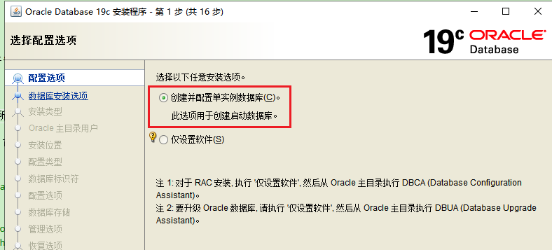

**Oracle的一些相关操作记录**

[toc]

# 基础概念

一般Oracle数据库（Oracle Database）可以分为两部分，即实例（Instance）和数据库（Database）。

实例：是一个非固定的、基于内存的基本进程与内存结构。当服务器关闭后，实例也就不存在了。

数据库（Database）指的是固定的、基于磁盘的数据文件、控制文件、日志文件、参数文件和归档日志文件等。

一般情况下，Oracle数据库都是一个数据库对应一个实例。


# 理解Oracle中user、scheme、表空间、数据库、实例之间的关系

## 数据库和实例

完整的Oracle数据库通常由两部分组成：Oracle数据库和数据库实例。

1) 数据库是一系列物理文件的集合（数据文件，控制文件，联机日志，参数文件等）； 
2) Oracle数据库实例则是一组Oracle后台进程/线程以及在服务器分配的共享内存区。

在启动Oracle数据库服务器时，实际上是在服务器的内存中创建一个Oracle实例（即在服务器内存中分配共享内存并创建相关的后台内存），然后由这个Oracle数据库实例来访问和控制磁盘中的数据文件。Oracle有一个很大的内存块，成为全局区（SGA）。

> 实例是访问Oracle数据库所需的一部分计算机内存和辅助处理后台进程，是由进程和这些进程所使用的内存(SGA)所构成一个集合。
> 
> 实例关联了数据库文件才可以访问，如果没有，就会得到实例不可用的错误。

服务器、数据库、实例的对应关系可以为：

- 服务器：数据库——1：n

- 数据库：实例——1：n

- 实例：用户——1：n

多个实例可以对应一个数据库，他们共同操作同一数据文件，一个数据库可被许多实例同时装载和打开(即RAC)，RAC环境中实例的作用能够得到充分的体现！

在任何时刻，一个实例只能有一组相关的文件（与一个数据库关联）。大多数情况下，反过来也成立：一个数据库上只有一个实例对其进行操作。不过，Oracle的真正应用集群（Real Application Clusters，RAC）是一个例外，这是Oracle提供的一个选项，允许在集群环境中的多台计算机上操作，这样就可以有多台实例同时装载并打开一个数据库（位于一组共享物理磁盘上）。由此，可以同时从多台不同的计算机访问这个数据库。Oracle RAC能支持高度可用的系统，可用于构建可扩缩性极好的解决方案。

**实例名指的是用于响应某个数据库操作的数据库管理系统的名称。同时也叫SID。实例名是由参数instance_name决定的。**

## 表空间

表空间(tablespace)是数据库的逻辑划分，每个数据库至少有一个表空间（称作SYSTEM表空间）。为了便于管理和提高运行效率，可以使用一些附加表空间来划分用户和应用程序。例如：USER表空间供一般用户使用，RBS表空间供回滚段使用。**一个表空间只能属于一个数据库**。

Oracle数据库通过表空间来管理（使用和存储）物理表，一个数据库实例可以有N个表空间，一个表空间下可以有N张表。

表空间只和数据文件（ORA或者DBF文件）发生关系，数据文件是物理的，一个表空间可以包含多个数据文件，而一个数据文件只能隶属一个表空间。

### 表空间类型

> 好文：[ORACLE表空间详解](https://www.cnblogs.com/chenzhaoren/p/9969712.html)

永久性表空间：一般保存表、视图、过程和索引等的数据。

临时性表空间：只用于保存系统中短期活动的数据。

撤销表空间：用来帮助回退未提交的事务数据。

### 表空间作用

表空间的作用能帮助DBA用户完成以下工作：

　　1. 决定数据库实体的空间分配

　　2. 设置数据库用户的空间份额

　　3. 控制数据库部分数据的可用性

　　4. 分布数据于不同的设备之间以改善性能

　　5. 备份和恢复数据。

用户创建其数据库实体时，必须给予表空间中具有相应的权力，所以对一个用户来说,其要操纵一个ORACLE数据库中的数据，应该：

　　1. 被授予关于一个或多个表空间中的RESOURCE特权

　　2. 被指定缺省表空间

　　3. 被分配指定表空间的存储空间使用份额

　　4. 被指定缺省临时段表空间,建立不同的表空间，设置最大的存储容量。

## 数据文件（dbf、ora）：

数据文件是数据库的物理存储单位。

数据库的数据存储在表空间中，真正是在某一个或者多个数据文件中。而一个表空间可以由一个或多个数据文件组成，一个数据文件只能属于一个表空间。

一旦数据文件被加入到某个表空间后，就不能删除这个文件，如果要删除某个数据文件，只能删除其所属于的表空间才行。

## 用户

> 什么是用户？用户本质只是一个抽象的概念，它表示的是在一个中拥有的资源，不同的用户有着不同的资源（或数据、信息）【**用户所持有的是系统的资源及权限**】。

Oracle数据库建好后，要想在数据库里建表，必须先为数据库建立用户，并为用户指定表空间。

一个用户至少要有一个默认表空间，此外，还可以管理其他表空间。

用户需要有表空间足够的权限，才能操作表空间

**用户是在实例下建立的。不同实例可以建相同名字的用户。**

> 表的数据，是由用户放入某一个表空间的，而这个表空间会随机把这些表数据放到一个或者多个数据文件中。
> 
> oracle的数据库不是普通的概念，oracle是由用户和表空间对数据进行管理和存放的。但是表不是由表空间去查询的，而是由用户去查的。因为不同用户可以在同一个表空间建立同一个名字的表！这里区分就是用户了！

## scheme

> 节选转自[理解 oracle 中 user和 schema 的关系](https://blog.csdn.net/qq_24434251/article/details/110285740)

**oracle 中的 schema 就是指一个用户下所有数据库对象（如 tables，views，stored procedures等）的逻辑集合。**

schema 本身不能理解成一个对象，oracle 中并没有提供创建 schema 的语法，schema 也并不是在创建 user 的时候就创建，而是在该用户下创建第一个对象之后 schema 也随之产生。只要 user 下存在对象，schema 就一定存在，user 下如果不存在对象，schema 也不存在。

对于一个大型的企业应用，最好针对不同的目的，使用不同的 schema。
比如，可以把会员相关的表放在会员 schema 中，账务相关的表放在账务 schema 中。

在数据库中，一个对象的完整名称为 schema.object，而不是 user.object。在创建对象时，如果我们不指定该对象的 schema，则该对象的 schema 为用户缺省的 schema。

下面这个比喻，很形象生动的说明了 user 和 schema 的关系。

好比一个房子，里面放满了家具，对这些家具有支配权的是房子的主人(user)，而不是房子(schema)。你可以也是一个房子的主人(user)，拥有自己的房子(schema)，也可以进入别人的房子（通过 `alter session set current_schema = <>` 的方式）。

如果你没有特别指定的话，你所做的操作都是针对你当前所在房子中的东西。

至于你是否有权限使用 (select)、搬动 (update) 或者拿走 (delete) 这些家具就看这个房子的主人有没有给你这样的权限了，或者你是整个大厦 (DB) 的老大(DBA)，则随意。

## scheme方案和用户、实例的关系

oracle的单实例系统中，一个数据库对应一个实例，连上数据库之后，一个用户又对应一个Schema。

一个用户可以访问自己的scheme下的数据库对象，也可以授权访问其他scheme（用户）下的数据库对象。

通常，一个方案对应一个项目。一个方案对应一个用户；每个用户可以管理多个表空间，每个表空间由一个或多个物理文件(.dbf)组成，一个用户可以分配多个表空间，但只能有一个默认表空间，每张表可以存在于一个或多个表空间中。

多个用户可以共享或使用一个表空间。

表、视图等数据库对象都是建立在Schema中的，也可以理解为每个**用户拥有不同的表等对象**。一个用户想访问另外一个用户，也就是另外一个schema的表，可以用 `username.tablename` 的形式来访问。

不同的schema之间没有直接的关系，不同的shcema之间的表可以同名，也可以互相引用（但必须有权限），在没有操作别的schema的操作根权下，每个用户只能操作它自己的schema下的所有的表。

> 对于应用程序来说：
> 
> 在一个数据库中可以有多个应用的数据表，这些不同应用的表可以放在不同的schema之中，同时，每一个schema对应一个用户，不同的应用可以以不同的用户连接数据库，这样，一个大数据库就可以根据应用把其表分开来管理。

> Oracle的企业管理器Enterprise Manager里面的用户就叫schema。

## 容器数据库与可插拔数据库

> [ORACLE容器数据库与可插拔数据库](https://blog.csdn.net/weixin_42774383/article/details/82116377)
> 
> [Oracle：容器数据库简介](https://blog.csdn.net/wubaohu1314/article/details/120099158)
> 
> [实例解析Oracle容器数据库的安装和使用](https://www.php.cn/oracle/493700.html)

Oracle 12C 引入了 CDB 与 PDB 的新特性，在 ORACLE 12C 数据库引入的多租用户环境（Multitenant Environment）中，允许一个数据库容器（CDB）承载多个可插拔数据库（PDB）。CDB 全称为 Container Database，中文翻译为数据库容器，PDB 全称为 Pluggable Database，即可插拔数据库。

在 ORACLE 12C 之前，实例与数据库是一对一或多对一关系（RAC）：即一个实例只能与一个数据库相关联，数据库可以被多个实例所加载。而实例与数据库不可能是一对多的关系。

当进入 ORACLE 12C 后，借助CDB，实例与数据库可以是一对多的关系。

### ORACLE MULTITEMENT CONTAINER DATABASE(CDB)，即多容器数据库

是ORACLE12c新引入的特性，这个特性允许CDB容器数据库中创建并且维护多个数据库，在CDB中创建的数据库被称为PDB，每个PDB在CDB中是独立的，在单独使用PDB时与普通数据库无差别。CDB根容器数据库的主要作用就是容纳所有相关的PDB元数据，以及在CDB中对虽有PDB进行管理。

### 多租户环境组成

（1）ROOT：ROOT容器数据库，是CDB环境中的根数据库，在跟数据库中含有主数据字典视图，其中包含了与ROOT容器有关的元数据和CDB中包含的所有PDB信息，在CDB环境中被标识为CDB$ROOT，每个CDB环境中只能有一个ROOT容器数据库。

（2）PDB SEED：PDB SEED为PDB的种子，其中提供了数据文件，在PDB环境中被标识为PDB$SEED，是创建PDB的模板，可以连接PDB$SEED但是不能执行任何事务，因为PDB$SEED是只读的，不可修改。

（3）PDBS：PDBS数据库，在CDB环境中每个PDB都是独立存在的，与传统ORACLE数据库无差别，每个PDB拥有自己的数据文件和OBJECTS，唯一的区别就是PDB可以插入到PDB中，以及从CDB中拔出。当用户连接到PDB时不会感觉到根容器和其他PDB的存在。


# Oracle中的监听器

> 节选转自 https://www.cnblogs.com/remote-antiquity/p/7874743.html

Oracle 监听器 Listener 是一个重要的数据库服务器组件，在整个 Oracle 体系结构中，扮演着重要的作用。它负责管理 Oracle 数据库和客户端之间的通讯，它在一个特定的网卡端口（默认是TCP 1521端口）上监听连接请求，并将连接转发给数据库。

  

## 1. 监听器的功能

从当前的 Oracle 版本看，Listener 主要负责下面的几方面功能：

1. 监听客户端请求。

监听器运行在数据库服务器之上，与 Oracle 实例（可为多个）相关关联，是一个专门的进程 process。在 Windows 的服务项目或者 Linux 的运行进程列表中，都会看到对应的运行进程。Windows 上名为 TNSLSNR，Linux/Unix 平台上是 lsnrctl。监听器守候在服务器制定端口（默认为：1521），监听客户端的请求。

2. 为客户端请求分配 Server Process。

监听器只负责接听请求，之后将请求转接给 Oracle Server Process。在 Oracle 的服务模式下，客户端进程是不允许直接操作数据库实例和数据，而是通过一个服务进程 Server Process（也称为影子进程）作为代理。监听器接受到请求之后，就向操作系统（或者 Dispatcher 组件）要求 fork（或分配）一个 Server Process 与客户端相连。

3. 注册实例服务。

本质上讲，Listener 是建立实例和客户端进程之间联系的桥梁。Listener 与实例之间的联系，就是通过注册的过程来实现的。注册的过程就是实例告诉监听器，它的数据库数据库实例名称 instance_name 和服务名 service_names。监听器注册上这样的信息，对客户端请求根据监听注册信息，找到正确的服务实例名称。目前 Oracle 版本中，提供动态注册和静态注册两种方式。

4. 错误转移 failover。

failover 是 RAC 容错的一个重要方面功能，其功能是在数据库实例崩溃的时候，可以自动将请求转移到其他可用实例上的一种功能。可以提供很大程度上的可用性（Availability）功能。这个过程中，发现实例已经崩溃，并且将请求转移到其他实例上，就属于是 Listener 的功能。

5. 负载均衡衡量。

在 RAC 架构中，Oracle 实现了负载均衡。当一个客户请求到来时，Oracle 会根据当前 RAC 集群环境中所有实例的负载情况，避开负载较高的实例，将请求转移到负载较低的实例进行处理。在早期 RAC 版本中，负载轻重的衡量是根据监听器当前维护连接数目来确定的，而不是实时查看多实例的负载。RAC 环境中的监听器之间进行沟通通信。

## 2. 监听器的工作过程

一般，监听器作为一个独立 process 在操作系统中运行，守候在特定网络端口（默认为：1521），等待客户端请求的到来。注意：我们在客户端配置命名服务的时候，输入的1521也就是为了与监听器程序建立连接。

当一个请求“如期而至”，监听器对照已经注册的服务列表，查找对应的数据库实例信息，获取到指定实例的 ORACLE_HOME 路径。相当于表明可以进行连接。

客户端与实例的交互不是直接的，是通过 Server Process 作为代理中介来实现的。所有指令 SQL 都是客户端通过 Server Process 发送到实例中，这种体系结构是 Oracle 对于实例和数据库文件一种保护机制。

当监听器获得请求之后，要从 Oracle 实例中分配一个 Server Process 与之对应。这里不同的 Oracle 连接方式存在一些差别。

如果是专用连接模式，也就是一个客户端连接对应一个 Server Process。监听器就会向 OS 请求 fork（创造）出一个 Server Process，与监听器尝试交互。

如果是共享连接模式，也就是多个客户端共享一个 Server Process（注意：这里还不是连接池）。监听器就会向 Dispatcher 进程（管理共享模式连接的进程）请求一个 Server Process 与之交互。

Server Process 与监听器的连接，实际上就是相互信息的交换。Server Process 将自身在 OS 中的进程编号、连接地址信息发给监听器。监听器将客户端信息传递给 Server Process。

监听器获取到 Server Process 的信息之后，将其返回给客户端连接程序。客户端获取到信息之后，进行重连接，根据返回的信息与 Server Process 在制定的服务器端口进行联系。

直到这个时候，客户端程序才将连接用户名、密码等信息发给 Server Process，进行登录验证等操作。监听器的工作也就到此结束。

这里面有一个技术细节，就是 Server Process 与客户端连接的时候，是允许不使用1521端口的。具体连接的端口，是带有随机因素的。在9i版本 Windows 平台下，如果安装了防火墙，只允许1521端口通信，是会带来一些连接问题。好在在其他平台上和之后的版本中，实现了一种端口共享技术，连接可以和监听器一起使用1521端口。


# system、sys用户

> 一个数据库实例对应不同的(独立的)system、sys用户。因此，在创建数据库实例时，每次都需要指定system、sys的口令。

system是数据库内置的一个普通管理员，你手工创建的任何用户在被授予dba角色后都跟这个用户差不多。

sys用数据库的超级用户，数据库内很多重要的东西（数据字典表、内置包、静态数据字典视图等）都属于这个用户，sys用户必须以sysdba身份登录。

> 所有oracle的数据字典的基表和视图都存放在sys用户中，这些基表和视图对于oracle的运行是至关重要的，由数据库自己维护，任何用户都不能手动更改。
> 
> sys用户拥有dba，sysdba，sysoper等角色或权限，是oracle权限最高的用户。

> system用户用于存放次一级的内部数据，如oracle的一些特性或工具的管理信息。system用户拥有普通dba角色权限。

system用户以sysdba身份登录时就是sys，准确地说，任何用户以sysdba身份登录时都是sys（可以登陆后执行show user验证。）

`as sysdba` 就是以`sysdba`登录。

oracle登录身份有三种：

- normal 普通身份
- sysdba 系统管理员身份
- sysoper 系统操作员身份

每种身份对应不同的权限：

sysdba权限：

● 启动和关闭操作
● 更改数据库状态为打开/装载/备份，更改字符集
● 创建数据库
● 创建服务器参数文件spfile
● 日志归档和恢复
● 包含了“会话权限”权限

sysoper权限：

● 启动和关闭操作
● 更改数据库状态为打开/装载/备份
● 创建服务器参数文件spfile
● 日志归档和恢复
● 包含了“会话权限”权限
 
# 用户管理

> 推荐 [Oracle 创建用户详解（create user）](https://blog.csdn.net/qq_34745941/article/details/109717799)

## 创建用户

```sql
create user user_name identified by password;
```

## 修改用户密码

```sql
alter user user_name identified by password;
```

## 删除用户

```sql
drop user user_name;
```

若用户拥有对象，则不能直接删除，否则将返回一个错误值。指定关键字`cascade`,可删除用户所有的对象，然后再删除用户。

```sql
drop user user_name cascade;
```

## 查看用户是否被锁定

```sql
select username, account_status, lock_date from dba_users;
```

## 锁定和解锁用户

```sql
alter user user_name account lock;


alter user user_name account unlock;
```

> `system`用户就有可能经常是被锁定的

# 角色及授权

oracle为兼容以前版本，提供三种标准角色（role）：connect、resource和dba.

## connect role(连接角色)

临时用户，特指不需要建表的用户，通常只赋予他们connect role。

connect使用oracle简单权限，这种权限只对其他用户的表有访问权限，包括select/insert/update和delete等。

拥有 connect role 的用户还能够创建表、视图、序列（sequence）、簇（cluster）、同义词(synonym)、回话（session）和其他数据的链接（link）

## resource role(资源角色)

更可靠和正式的数据库用户可以授予resource role。

resource提供给用户另外的权限以创建他们自己的表、序列、过程(procedure)、触发器(trigger)、索引(index)和簇(cluster)。

##  dba role(数据库管理员角色)

dba role拥有所有的系统权限。包括无限制的空间限额和给其他用户授予各种权限的能力。

## 授权和撤销权限

```cs
grant connect, resource to user_name;
```

```sql
revoke connect, resource from user_name;
```

## 自定义角色

除了三种系统角色----connect、resource和dba，用户还可以在oracle创建自己的role。

用户创建的role可以由表或系统权限或两者的组合构成。为了创建role，用户必须具有create role系统权限。

1. 创建角色

语法： create role 角色名;

例子： create role testRole;

2. 授权角色

语法： grant select on class to 角色名;

列子： grant select on class to testRole;

注：现在，拥有testRole角色的所有用户都具有对class表的select查询权限

3. 删除角色

语法： drop role 角色名;

例子： drop role testRole;

注：与testRole角色相关的权限将从数据库全部删除

## 查看当前用户的角色

select * from user_role_privs;

## 查看当前用户的系统权限和表级权限

select * from user_sys_privs;

select * from user_tab_privs;

## 查看用户下所有的表

select * from user_tables; 

# SQL Plus登陆连接数据库

## SQL Plus登陆Oracle的完整语法

```sh
sqlplus user/pwd@[//]Host[:Port]/<service_name> [as {SYSDBA | SYSOPER | SYSASM}]
```

`[]`中为可以省略的选项。

```sh
sqlplus user/pwd@Host[:Port]/<service_name>;

# 或

sqlplus user/pwd@<net_service_name>;
```

`service_name`服务名或`net_service_name`网络服务名。

登陆本地的Oracle，则可以直接`@service_name`，不用指定ip和端口。

Oracle的默认端口为`1521`。

## SQL Plus登陆本地Oracle

登陆本地的Oracle，默认不需要安装Client，只有在客户端（其他电脑）连接Oracle数据库服务器时，才需要安装Oracle。

SQL Plus登陆Oracle，即使不连接任何数据库，至少也应保证Oracle上创建有一个数据库实例（未严格测试，但是如果登陆不上，可以使用`DBCA`随便创建个数据库再登陆测试）

### 以DBA权限登陆（不连接数据库）

#### 方式一

```sh
sqlplus /nolog
```

```sh
conn sys/admin as sysdba
```

> `conn user_name/password` 不指定角色连接。

#### 方式二

```sh
sqlplus sys/admin as sysdba
```

#### 方式三

`sqlplus / as sysdba` 或 `sqlplus /nolog`--`conn / as sysdba` 不指定用户名密码作为`sysdba`登陆的方式，使用的是windows系统认证。因此，要保证开启系统认证登陆。

> `sqlplus "/as sysdba"` 的形式也可以登陆。

#### sqlplus后输入用户名密码登陆

- `sqlplus`或`sqlplus @ip:port/service_name`，然后输入用户名密码登陆

```sh
> sqlplus @localhsot/orcl

SQL*Plus: Release 19.0.0.0.0 - Production on 星期二 10月 18 09:44:03 2022
Version 19.3.0.0.0

Copyright (c) 1982, 2019, Oracle.  All rights reserved.

SP2-0310: 无法打开文件 "localhsot/orcl.sql"
请输入用户名:
```

- `sqlplus`和`请输入用户名:  sys as sysdba`

以`sysdba`角色登陆

```sh
> sqlplus

SQL*Plus: Release 19.0.0.0.0 - Production on 星期二 10月 18 09:40:02 2022
Version 19.3.0.0.0

Copyright (c) 1982, 2019, Oracle.  All rights reserved.

请输入用户名:  sys as sysdba
输入口令:

连接到:
Oracle Database 19c Standard Edition 2 Release 19.0.0.0.0 - Production
Version 19.3.0.0.0

SQL>
```

#### 使用数据库实例连接

前面的登陆连接未指定数据库（实例），连接的是默认新建的第一个数据库。

查看当前连接的数据库：

```sql
SQL> select name from v$database;

NAME
------------------
ORCL
```

连接到ORCL实例：

```sh
> sqlplus / as sysdba@orcl

SQL*Plus: Release 19.0.0.0.0 - Production on 星期二 10月 18 09:32:45 2022
Version 19.3.0.0.0

Copyright (c) 1982, 2019, Oracle.  All rights reserved.


连接到:
Oracle Database 19c Standard Edition 2 Release 19.0.0.0.0 - Production
Version 19.3.0.0.0

SQL>
```

> 或`sqlplus /@orcl as sysdba`。

## SQL Plus登陆远程Oracle

远程登陆，需要安装Oracle客户端，配置好网络连接。

> 主要在client的安装目录下，找到`network/admin/tnsnames.ora`文件，如果没有则新建。
> 
> `tnsnames.ora`的网络连接配置如下（可从Oracle数据库安装包或所在安装目录下找到示例文件）：
> 
> ```sh
> ORCL =
> (DESCRIPTION =
>   (ADDRESS = (PROTOCOL = TCP)(HOST = localhost)(PORT = 1521))
>   (CONNECT_DATA =
>     (SERVER = DEDICATED)
>     (SERVICE_NAME = orcl)
>   )
> )
> ```
> 
> TNS通用配置示例：
> 
> ```sh
> IPTrans =
> (DESCRIPTION =
>   (ADDRESS_LIST =
>     (ADDRESS = (PROTOCOL = TCP)(HOST = xx.xx.xx.xx)(PORT = 1521))
>   )
>   (CONNECT_DATA =
>     (SERVICE_NAME = xxx)
>   )
> )
> ```
> 
> - IPTrans：连接的网络服务器名，自己自定义名字
> - SERVICE_NAME ：要连接的实例名（或服务名）   

或者，安装配置`Oracle Data Access Components (ODAC)`，使用其他工具连接。

```sh
sqlplus tiger/scott@localhost/orcl
sqlplus tiger/scott@172.16.10.1:1521/orcl
```

> 如果在Oracle服务器的本地也安装了客户端，有时可能会出现`ORA-12560: TNS: 协议适配器错误`，可以查看`Path`环境变量中 Oracle_db 和 Oracle_client 的顺序（服务器端通常不需要安装客户端），`dbhome`在前面，`client`在后面。
> 
> 具体可参见 [sqlplus 登录Oracle，出现：ORA-12560: TNS: 协议适配器错误](https://blog.csdn.net/aganliang/article/details/85227283)

# Windows下sqlplus / as sysdba登录出现ora-01017用户名/口令无效的问题

在Windows系统下的命令行工具中，使用 `sqlplus / as sysdba`（或`sqlplus /nolog`--`connect / as sysdba`） 登陆Oracle时报错“ORA-01017: 用户名/口令无效; 登录被拒绝”

```sh
> sqlplus /nolog

SQL*Plus: Release 19.0.0.0.0 - Production on 星期一 10月 17 15:32:12 2022
Version 19.3.0.0.0

Copyright (c) 1982, 2019, Oracle.  All rights reserved.

SQL> connect / as sysdba
ERROR:
ORA-01017: 用户名/口令无效; 登录被拒绝
```

```sh
> sqlplus / as sysdba

SQL*Plus: Release 19.0.0.0.0 - Production on 星期一 10月 17 15:37:28 2022
Version 19.3.0.0.0

Copyright (c) 1982, 2019, Oracle.  All rights reserved.

ERROR:
ORA-01017: 用户名/口令无效; 登录被拒绝
```

如果操作系统用户是`administrator`，已经是管理员权限，则，不存在权限不够的问题，应该就是操作系统认证的环节出现了问题，查看`sqlnet.ora`文件（Oracle软件根目录`product\11.2.0\dbhome_1\network\admin\`或安装包目录下`network\admin\`）。

但是，由于安装Oracle时，选择的是“仅设置软件”（“仅安装软件”）：

  

> “仅配置软件”表示仅仅将配置当前的安装软件，将当前安装包所在的Oracle软件配置，并不是完整意义上的Oracle数据库（即使后面创建了数据库实例）
> 
> 创建和配置单实例数据库的作用在于“创建启动数据库”【启动数据库即默认的全局数据库】：
> 
>   
>
> 而且，对于软件来说，似乎解压后的安装包，在安装后，是作为Oracle软件存在的（具体不太清楚）
> 
>   

> 启动数据库：也叫全局数据库，是数据库系统的入口，它会内置一些高级权限的用户如SYS，SYSTEM等

在Oracle安装包中`network\admin\`下的`sqlnet.ora`文件中，可以看到其内容：

```ini
# sqlnet.ora Network Configuration File: D:\download\Oracle\WINDOWS.X64_193000_db_home\NETWORK\ADMIN\sqlnet.ora
# Generated by Oracle configuration tools.

# This file is actually generated by netca. But if customers choose to 
# install "Software Only", this file wont exist and without the native 
# authentication, they will not be able to connect to the database on NT.

SQLNET.AUTHENTICATION_SERVICES= (NTS)

NAMES.DIRECTORY_PATH= (TNSNAMES, ONAMES, HOSTNAME)
```

SQLNET.AUTHENTICATION_SERVICES有3个参数：

- SQLNET.AUTHENTICATION_SERVICES = (NONE) 关闭操作系统认证
- SQLNET.AUTHENTICATION_SERVICES = (ALL) 开启LINUX和AIX操作系统认证
- SQLNET.AUTHENTICATION_SERVICES = (NTS) 开启windows操作系统认证

> 似乎"Software Only时，无法使用本地系统认证登陆（即使后面创建了数据库）。

后面只能暂时卸载Oracle，重新安装时选择“创建并配置单实例数据库”。等待安装完成，直接使用`sqlplus / as sysdba`登陆成功。

```sh
> sqlplus / as sysdba

SQL*Plus: Release 19.0.0.0.0 - Production on 星期一 10月 17 17:56:57 2022
Version 19.3.0.0.0

Copyright (c) 1982, 2019, Oracle.  All rights reserved.


连接到:
Oracle Database 19c Standard Edition 2 Release 19.0.0.0.0 - Production
Version 19.3.0.0.0

SQL> exit
从 Oracle Database 19c Standard Edition 2 Release 19.0.0.0.0 - Production
Version 19.3.0.0.0 断开
```

> Oracle 19c相关配置文件比如`sqlnet.ora`、监听文件`listener.ora`、实例数据库配置文件`tnsnames.ora`等，在安装完成后，都位于原安装包所在路径下的`network\admin\`中。
> 
> 也就是，安装包原文件已经作为Oracle软件被配置和使用，和之前的版本有所不同。

# 关于电脑名导致的Oracle安装内存不可用问题

电脑名字太长、有连字符、有中文、有空格，或者安装路径（包括安装包所在路径）有这些符号（连字符、中文、空格），都有可能导致安装失败，或者安装过程中突然秒退，或者一直提示内存不可用，则必须修改电脑名字、所在路径名称等。

# oracle 查看用户名

## 查看当前用户名

```sql
show user;
select user from dual;
```

## oracle 查看所有用户名

```sql
select * from all_users;

select USERNAME from all_users;
```

```sql
select * from dba_users;

select USERNAME from dba_users;
```

## 查看用户拥有的角色或权限

```sql
select * from dba_role_privs where grantee='用户名'；
```

## 查看某个角色包括哪些系统权限

```sql
select * from dba_sys_privs where grantee='DBA';
```

## 查看oracle中所有的角色

```sql
select * from dba_roles;
```

## 其他一些查看

快速创建表空间：(备注：ADC_BACK_1 为表空间名称，datafile指定了表空间物理路径，如下创建2个表空间)
create tablespace ADC_BACK_1 datafile 'D:\OracleBack\ADC1.dnf' size 500M;
create tablespace ADC_BACK_2 datafile 'D:\OracleBack\ADC2.dnf' size 500M;

查看单张表在不同表空间的详细信息(包括表空间、表名称、表使用的空间大小)：
SELECT tablespace_name, segment_name, segment_type, blocks FROM dba_segments WHERE segment_name = 'JMS_NEWS'


# Oracle查看所有表

```sql
select table_name from all_tables;

select count(table_name) from all_tables;
```

# Oracle查看当前的实例及切换实例

## 查看当前实例

### show parameter name

查看当前登录数据库的配置参数，里面可以看到实例`instance_name`（此外还有`service_names`等）：

```sql
SQL> set linesize 800
SQL> show parameter name

NAME                                 TYPE                   VALUE
------------------------------------ ---------------------- ------------------------------
cdb_cluster_name                     string
cell_offloadgroup_name               string
db_file_name_convert                 string
db_name                              string                 orcl
db_unique_name                       string                 orcl
global_names                         boolean                FALSE
instance_name                        string                 orcl
lock_name_space                      string
log_file_name_convert                string
pdb_file_name_convert                string
processor_group_name                 string

NAME                                 TYPE                   VALUE
------------------------------------ ---------------------- ------------------------------
service_names                        string                 orcl
```

### select name from v$database;

```sql
SQL> select name from v$database;

NAME
------------------
ORCL
```

### show parameter instance_name;

只查看实例参数（实例名）

## 指定连接的实例

```sh
sqlplus /@ORACLE_SID as sysdba;
# 或
sqlplus user/pwd@ORACLE_SID as sysdba;
```

## 查看所有实例

```sql
select instance_name from v$instance;
```

```sql
select name from v$database ;
```

## 查看所有的表空间（查看表空间）

```sql
select tablespace_name from dba_tablespaces;
```

## 查看用户及其表空间

```sql
select default_tablespace, temporary_tablespace, d.username  
from dba_users d;
```

## 修改用户可以管理其他表空间（使用多个表空间、其他表空间）

将tablespace_name这个表空间分配给username用户来管理。

```sql
ALTER USER username QUOTA UNLIMITED ON tablespace_name;
```

## 修改用户的默认表空间

```sql
ALTER USER csdn DEFAULT TABLESPACE SPACE2；
```

## 删除用户

```sql
DROP USER csdn CASCADE;
```

## 删除表空间，及对应的表空间文件也删除掉

```sql
DROP TABLESPACE SPACE1 INCLUDING CONTENTS AND DATAFILES CASCADE CONSTRAINT;
```

# 查看数据库版本

```sql
select version from v$instance; 
```

也可以参考`sqlplus -v`或`sqlplus`登陆时的版本信息。

# 检查数据库的字符集

```sql
select userenv('language') from dual;
```

# 参考

- [Oracle内置账户sys/system详解，角色normal/sysdba/sysoper详解及创建用户、角色、授权](https://blog.csdn.net/wqh0830/article/details/87874380)
- [windows平台 sqlplus / as sysdba登录出现ora-01017错误](https://blog.csdn.net/m0_37625564/article/details/112920445)
- [Oracle Sqlplus命令登录的几种方式](https://blog.csdn.net/wwlhz/article/details/73296430)
- [Oracle创建多表空间和用户，同一用户管理多个表空间](https://blog.csdn.net/qq_41807801/article/details/108070980)

- [Oracle 数据库服务器，数据库，实例，用户之间的关系](https://blog.csdn.net/u011519658/article/details/9986813)
- [Oracle数据库、实例、用户、表空间、表之间的关系](https://blog.csdn.net/MINGDE_SKILL/article/details/102365698)
- [Oracle 数据库、实例、用户、表空间、表之间的关系讲解](https://blog.csdn.net/dhfzhishi/article/details/81160306)
- [探秘Oracle表空间、用户、表之间的关系](https://blog.csdn.net/huyuyang6688/article/details/49282199)
- [Oracle里schema理解](https://www.cnblogs.com/panxuejun/p/6755532.html)

# Oracle安装配置好文推荐

- [Oracle---windows下安装oracle19c](https://www.cnblogs.com/zdyang/p/12580263.html)
- [Oracle19c的安装、卸载配置教程](https://blog.csdn.net/Evening_breeze_/article/details/113988231)，尤其注意卸载Oracle后删除注册表中的内容

# 其他好文

- [关系型数据库Oracle之架构详解](https://blog.csdn.net/qq_41036232/article/details/84500594)
- [Oracle架构、原理、进程](https://cloud.tencent.com/developer/article/1531025)
- [Oracle--查询表空间、schema、表等存储情况操作](https://www.cnblogs.com/wei523/p/8525743.html)
- [Oracle中查询所有数据库名、表名、表中的所有字段名和类型](https://www.cnblogs.com/readyueson/articles/13322684.html)
- [Oracle19C客户端部署及远程访问](https://blog.csdn.net/weixin_41645135/article/details/123470171)

# 官网+网盘下载

Oracle19C_database_官网下载地址 https://download.oracle.com/otn/nt/oracle19c/193000/WINDOWS.X64_193000_db_home.zip?AuthParam=1589441595_d3fbf2ad06c24ea04e50898e8da4eedb
Oracle19C_client_官网下载地址
https://download.oracle.com/otn/nt/oracle19c/193000/WINDOWS.X64_193000_client_home.zip?AuthParam=1589462569_2b721849632ff8067029498504b5e97b
Oracle19C_database_百度网盘获取
链接：https://pan.baidu.com/s/1Qin14Jv9TDuLH6c_SXfjhg
提取码：u9x4
Oracle19C_client_百度网盘获取
链接：https://pan.baidu.com/s/1RjdkEENsudaxryn8UbKvdQ
提取码：tp7p